# GoGoTime API Specification

> [!SUMMARY] **RESTful API Design**
> GoGoTime API provides secure, type-safe endpoints for user management and authentication. Built with Express.js, TypeScript, and comprehensive validation.

## 📋 Table of Contents

- [[#🌐 API Overview|API Overview]]
- [[#🔐 Authentication|Authentication]]
- [[#👥 User Management|User Management]]
- [[#📋 Response Formats|Response Formats]]
- [[#❌ Error Handling|Error Handling]]
- [[#🧪 Testing Guide|Testing Guide]]

---

## 🌐 API Overview

### 📡 Base Configuration

```yaml
Base URL: http://localhost:4000/api
Content-Type: application/json
Authentication: Bearer Token (JWT)
Charset: UTF-8
```

### 🎯 Design Principles

1. **🔄 RESTful Design**: Follows REST conventions with proper HTTP methods
2. **📊 Consistent Responses**: Standardized JSON response format
3. **✅ Input Validation**: Joi schema validation on all endpoints
4. **🔒 Security First**: JWT authentication and input sanitization
5. **📝 Type Safety**: Full TypeScript integration with runtime validation

### 🏗️ API Architecture

```mermaid
graph TB
    subgraph "API Layer"
        subgraph "Routes"
            UR[👥 /users/*]
        end
        
        subgraph "Middleware"
            CORS[🌐 CORS]
            COMP[📦 Compression]
            VAL[✅ Validation]
            AUTH[🔐 JWT Auth]
        end
        
        subgraph "Controllers"
            UC[👤 User Controller]
            AC[🔐 Auth Controller]
        end
        
        subgraph "Data Layer"
            ORM[🗃️ TypeORM]
            DB[🐘 PostgreSQL]
        end
    end
    
    UR --> VAL
    VAL --> AUTH
    AUTH --> UC
    AUTH --> AC
    UC --> ORM
    AC --> ORM
    ORM --> DB
```



---

## 🔐 Authentication

### 🔑 JWT Token System

> [!NOTE] **Stateless + Tracked Authentication**
> GoGoTime uses JWT tokens for stateless authentication combined with database session tracking for security.


### 🔒 Token Format

```http
Authorization: Bearer <JWT_TOKEN>
```

**JWT Payload Structure:**
```json
{
  "id": "user-uuid",
  "username": "johndoe",
  "email": "john@example.com",
  "iat": 1640000000,
  "exp": 1640086400
}
```

---

## 👥 User Management

### 🧩 User Registration

**Endpoint:** `POST /users/register`  
**Authentication:** None required  
**Purpose:** Create a new user account

#### 📥 Request

```json
{
  "username": "johndoe",
  "email": "john@example.com",
  "password": "securepassword123"
}
```

#### ✅ Validation Rules

```typescript
const userSchema = Joi.object({
  email: Joi.string().email().required(),
  username: Joi.string().alphanum().min(4).max(15).optional(),
  password: Joi.string().required(),
})
```

| Field | Type | Required | Rules |
|-------|------|----------|-------|
| `username` | string | Optional | 4-15 alphanumeric characters |
| `email` | string | Required | Valid email format, unique |
| `password` | string | Required | Minimum 1 character (will be hashed) |

#### 📤 Success Response (200)

```json
{
  "success": true,
  "userID": "550e8400-e29b-41d4-a716-446655440000",
  "msg": "The user was successfully registered"
}
```

#### ❌ Error Responses

**Validation Error (422)**
```json
{
  "success": false,
  "msg": "Validation error: \"email\" is required"
}
```

**Email Exists (200)**
```json
{
  "success": false,
  "msg": "Email already exists"
}
```

#### 🧪 cURL Example

```bash
curl -X POST http://localhost:4000/api/users/register \
  -H "Content-Type: application/json" \
  -d '{
    "username": "johndoe",
    "email": "john@example.com",
    "password": "securepassword123"
  }'
```

---

### 🚪 User Login

**Endpoint:** `POST /users/login`  
**Authentication:** None required  
**Purpose:** Authenticate user and return JWT token

#### 📥 Request

```json
{
  "email": "john@example.com",
  "password": "securepassword123"
}
```

#### 📤 Success Response (200)

```json
{
  "success": true,
  "token": "eyJhbGciOiJIUzI1NiIsInR5cCI6IkpXVCJ9...",
  "user": {
    "id": "550e8400-e29b-41d4-a716-446655440000",
    "username": "johndoe",
    "email": "john@example.com",
    "createdAt": "2024-01-15T10:30:00.000Z",
    "updatedAt": "2024-01-15T10:30:00.000Z"
  }
}
```

#### ❌ Error Responses

**Invalid Credentials (200)**
```json
{
  "success": false,
  "msg": "Wrong credentials"
}
```

#### 🧪 cURL Example

```bash
curl -X POST http://localhost:4000/api/users/login \
  -H "Content-Type: application/json" \
  -d '{
    "email": "john@example.com",
    "password": "securepassword123"
  }'
```

---

### 🚨 User Logout

**Endpoint:** `POST /users/logout`  
**Authentication:** Required (JWT Bearer token)  
**Purpose:** Invalidate user session and revoke token

#### 📥 Request

```json
{
  "token": "eyJhbGciOiJIUzI1NiIsInR5cCI6IkpXVCJ9..."
}
```

#### 📤 Success Response (200)

```json
{
  "success": true
}
```

#### ❌ Error Response

**Token Revocation Failed (200)**
```json
{
  "success": false,
  "msg": "Token revocation failed"
}
```

#### 🧪 cURL Example

```bash
curl -X POST http://localhost:4000/api/users/logout \
  -H "Content-Type: application/json" \
  -H "Authorization: Bearer YOUR_JWT_TOKEN" \
  -d '{
    "token": "YOUR_JWT_TOKEN"
  }'
```

---

### 🔍 Session Validation

**Endpoint:** `POST /users/checkSession`  
**Authentication:** Required (JWT Bearer token)  
**Purpose:** Validate current JWT token and session

#### 📥 Request

No request body required.

#### 📤 Success Response (200)

```json
{
  "success": true
}
```

#### 🧪 cURL Example

```bash
curl -X POST http://localhost:4000/api/users/checkSession \
  -H "Authorization: Bearer YOUR_JWT_TOKEN"
```

---

### 📋 List All Users

**Endpoint:** `POST /users/all`  
**Authentication:** Required (JWT Bearer token)  
**Purpose:** Retrieve all users (admin functionality)

#### 📥 Request

No request body required.

#### 📤 Success Response (200)

```json
{
  "success": true,
  "users": [
    {
      "id": "550e8400-e29b-41d4-a716-446655440000",
      "username": "johndoe",
      "email": "john@example.com",
      "createdAt": "2024-01-15T10:30:00.000Z",
      "updatedAt": "2024-01-15T10:30:00.000Z"
    },
    {
      "id": "660f9500-f39c-42e5-b817-557766550001",
      "username": "janedoe",
      "email": "jane@example.com",
      "createdAt": "2024-01-16T09:20:00.000Z",
      "updatedAt": "2024-01-16T09:20:00.000Z"
    }
  ]
}
```

> [!WARNING] **Security Note**
> Password fields are automatically excluded from response for security.

#### 🧪 cURL Example

```bash
curl -X POST http://localhost:4000/api/users/all \
  -H "Authorization: Bearer YOUR_JWT_TOKEN"
```

---

### ✏️ Edit User Profile

**Endpoint:** `POST /users/edit`  
**Authentication:** Required (JWT Bearer token)  
**Purpose:** Update user profile information

#### 📥 Request

```json
{
  "userID": "550e8400-e29b-41d4-a716-446655440000",
  "username": "johnsmith",
  "email": "johnsmith@example.com"
}
```

#### 📤 Success Response (200)

```json
{
  "success": true
}
```

#### ❌ Error Responses

**User Not Found (200)**
```json
{
  "success": false,
  "msg": "User not found"
}
```

**Update Error (200)**
```json
{
  "success": false,
  "msg": "There was an error updating user"
}
```

#### 🧪 cURL Example

```bash
curl -X POST http://localhost:4000/api/users/edit \
  -H "Content-Type: application/json" \
  -H "Authorization: Bearer YOUR_JWT_TOKEN" \
  -d '{
    "userID": "550e8400-e29b-41d4-a716-446655440000",
    "username": "johnsmith",
    "email": "johnsmith@example.com"
  }'
```

---

### 🧪 Health Check

**Endpoint:** `GET /users/testme`  
**Authentication:** None required  
**Purpose:** API health check and connectivity test

#### 📤 Success Response (200)

```json
{
  "success": true,
  "msg": "all good"
}
```

#### 🧪 cURL Example

```bash
curl -X GET http://localhost:4000/api/users/testme
```

---

## 📋 Response Formats

### ✅ Standard Success Response

```json
{
  "success": true,
  "data": { /* response data */ },
  "msg": "Operation completed successfully"
}
```

### ❌ Standard Error Response

```json
{
  "success": false,
  "msg": "Error description",
  "details": { /* additional error context */ }
}
```

### 🏷️ Response Field Types

| Field | Type | Description |
|-------|------|-------------|
| `success` | boolean | Operation success status |
| `data` | object/array | Response payload (success only) |
| `msg` | string | Human-readable message |
| `details` | object | Additional error context (errors only) |

---

## ❌ Error Handling

### 🚨 HTTP Status Codes

| Status Code | Meaning | Usage |
|-------------|---------|-------|
| `200` | OK | Successful operation (including application errors) |
| `422` | Unprocessable Entity | Validation errors |
| `500` | Internal Server Error | Unexpected server errors |

> [!NOTE] **Error Response Pattern**
> Most application errors return HTTP 200 with `success: false` for consistent client handling.

### 🔍 Common Error Types

#### Validation Errors (422)

```json
{
  "success": false,
  "msg": "Validation error: \"email\" must be a valid email"
}
```

**Causes:**
- Invalid email format
- Missing required fields  
- Username length violations
- Invalid data types

#### Authentication Errors

```json
{
  "success": false,
  "msg": "Wrong credentials"
}
```

**Causes:**
- Invalid email/password combination
- Expired or invalid JWT token
- Missing authorization header

#### Server Errors (500)

```json
{
  "success": false,
  "msg": "Internal server error"
}
```

**Causes:**
- Database connection issues
- Unexpected application errors
- Missing environment variables

---

## 🧪 Testing Guide

### 🔧 Testing Environment Setup

```bash
# Start the development environment
cd App.Infra
docker compose up

# API will be available at http://localhost:4000
# Health check: curl http://localhost:4000/api/users/testme
```

### 🎯 Test Scenarios

#### 1. User Registration Flow

```bash
# 1. Register new user
curl -X POST http://localhost:4000/api/users/register \
  -H "Content-Type: application/json" \
  -d '{
    "username": "testuser",
    "email": "test@example.com",
    "password": "testpass123"
  }'

# Expected: {"success": true, "userID": "...", "msg": "..."}
```

#### 2. Authentication Flow

```bash
# 1. Login
LOGIN_RESPONSE=$(curl -s -X POST http://localhost:4000/api/users/login \
  -H "Content-Type: application/json" \
  -d '{
    "email": "test@example.com",
    "password": "testpass123"
  }')

# 2. Extract token
TOKEN=$(echo $LOGIN_RESPONSE | jq -r '.token')

# 3. Test authenticated endpoint
curl -X POST http://localhost:4000/api/users/checkSession \
  -H "Authorization: Bearer $TOKEN"

# Expected: {"success": true}
```

#### 3. Complete CRUD Flow

```bash
# Using the token from authentication flow above

# 1. List all users
curl -X POST http://localhost:4000/api/users/all \
  -H "Authorization: Bearer $TOKEN"

# 2. Edit user profile  
curl -X POST http://localhost:4000/api/users/edit \
  -H "Content-Type: application/json" \
  -H "Authorization: Bearer $TOKEN" \
  -d '{
    "userID": "USER_ID_FROM_LOGIN",
    "username": "updateduser",
    "email": "updated@example.com"
  }'

# 3. Logout
curl -X POST http://localhost:4000/api/users/logout \
  -H "Content-Type: application/json" \
  -H "Authorization: Bearer $TOKEN" \
  -d '{
    "token": "'$TOKEN'"
  }'
```

### 📊 Postman Collection

> [!TIP] **API Testing**
> Import this Postman collection for easy API testing:

```json
{
  "info": {
    "name": "GoGoTime API",
    "description": "Complete API collection for GoGoTime"
  },
  "variable": [
    {
      "key": "baseUrl",
      "value": "http://localhost:4000/api"
    },
    {
      "key": "token",
      "value": ""
    }
  ],
  "item": [
    {
      "name": "Health Check",
      "request": {
        "method": "GET",
        "header": [],
        "url": {
          "raw": "{{baseUrl}}/users/testme",
          "host": ["{{baseUrl}}"],
          "path": ["users", "testme"]
        }
      }
    },
    {
      "name": "Register User",
      "request": {
        "method": "POST",
        "header": [
          {
            "key": "Content-Type",
            "value": "application/json"
          }
        ],
        "body": {
          "mode": "raw",
          "raw": "{\n  \"username\": \"testuser\",\n  \"email\": \"test@example.com\",\n  \"password\": \"testpass123\"\n}"
        },
        "url": {
          "raw": "{{baseUrl}}/users/register",
          "host": ["{{baseUrl}}"],
          "path": ["users", "register"]
        }
      }
    }
  ]
}
```

---

## 🔮 Future API Enhancements

> [!NOTE] **Planned Features**
> Upcoming API endpoints and improvements based on application roadmap.

### 🎯 Planned Endpoints

```mermaid
graph TB
    subgraph "Current API"
        U[👥 User Management]
        A[🔐 Authentication]
    end
    
    subgraph "Phase 1: Time Tracking"
        P[📋 Projects]
        T[⏱️ Time Entries]
        C[📊 Categories]
    end
    
    subgraph "Phase 2: Collaboration"
        O[🏢 Organizations]
        TM[👥 Teams]
        R[🎭 Roles]
    end
    
    subgraph "Phase 3: Advanced"
        REP[📈 Reports]
        INT[🔌 Integrations]
        WH[📡 Webhooks]
    end
    
    U --> P
    A --> T
    P --> O
    T --> TM
    O --> REP
    TM --> INT
    R --> WH
```



### 📋 Upcoming Features

1. **📊 Time Tracking API**
   - `POST /projects` - Create and manage projects
   - `POST /time-entries` - Log time entries
   - `GET /time-entries/report` - Generate time reports

2. **🏢 Organization Management**
   - `POST /organizations` - Create organizations
   - `POST /organizations/{id}/members` - Manage team members
   - `GET /organizations/{id}/activity` - Activity feeds

3. **📈 Reporting & Analytics**
   - `GET /reports/time-summary` - Time tracking summaries
   - `GET /reports/productivity` - Productivity metrics
   - `POST /reports/export` - Export data

---

## 🏷️ Tags

#api #rest #nodejs #express #typescript #jwt #authentication #documentation

**Related Documentation:**
- [[ARCHITECTURE]] - System architecture overview
- [[DATABASE_DESIGN]] - Database schema and entities
- [[SECURITY_MEASURES]] - Security implementation details
- [[TESTING_STRATEGY]] - Comprehensive testing approach

---

> [!NOTE] **Document Maintenance**
> **Last Updated:** {date}  
> **Version:** 1.0.0  
> **Maintainers:** API Team (Lazaro, Alexy, Massi, Lounis)

> [!TIP] **Contributing**
> When adding new endpoints:
> 1. Follow existing naming conventions
> 2. Add proper validation schemas
> 3. Update this documentation
> 4. Include cURL examples and test cases
