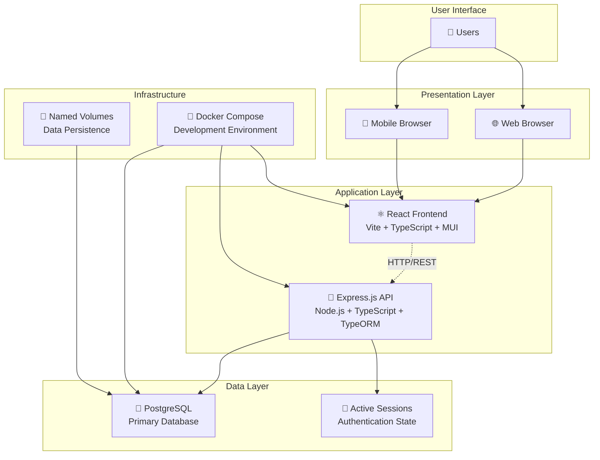
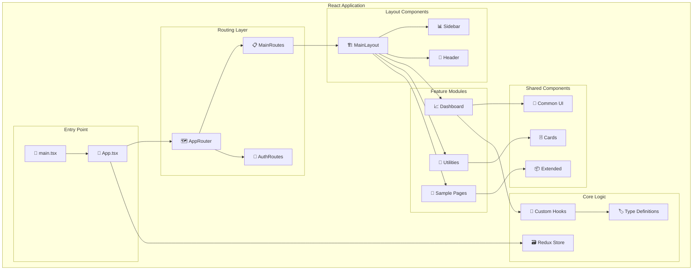
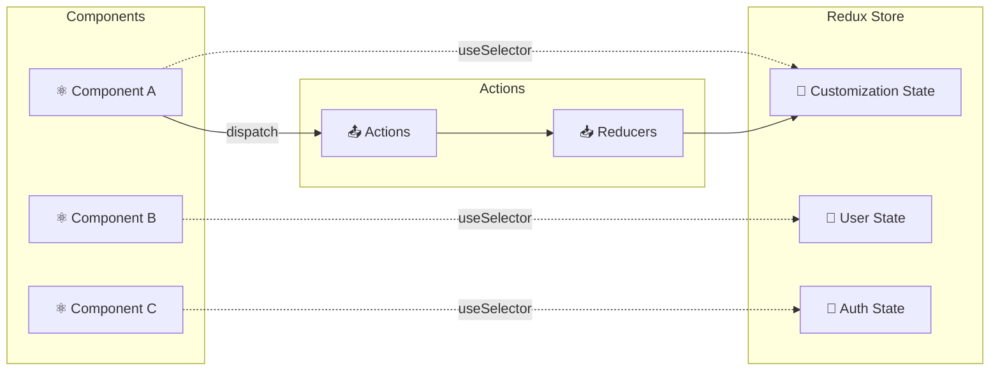
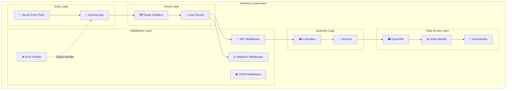
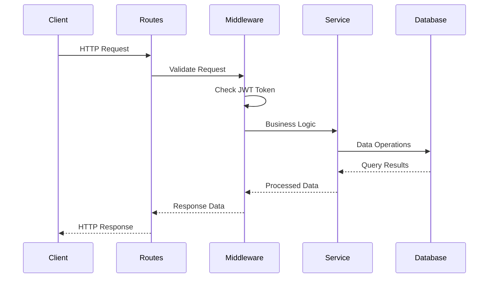
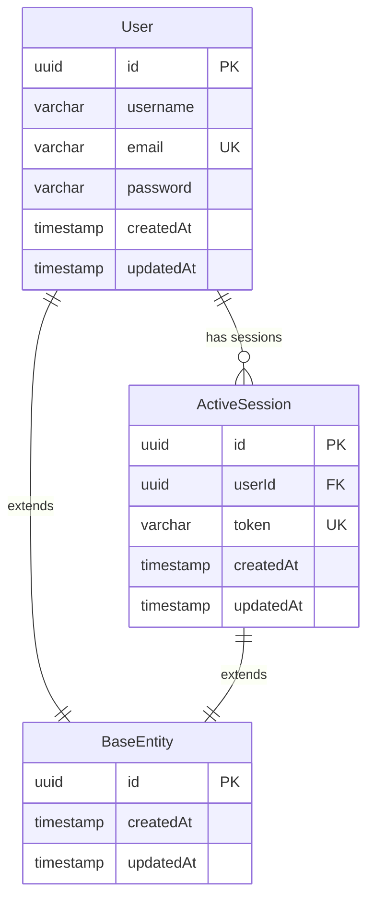
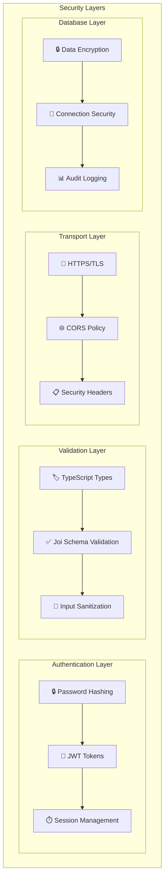
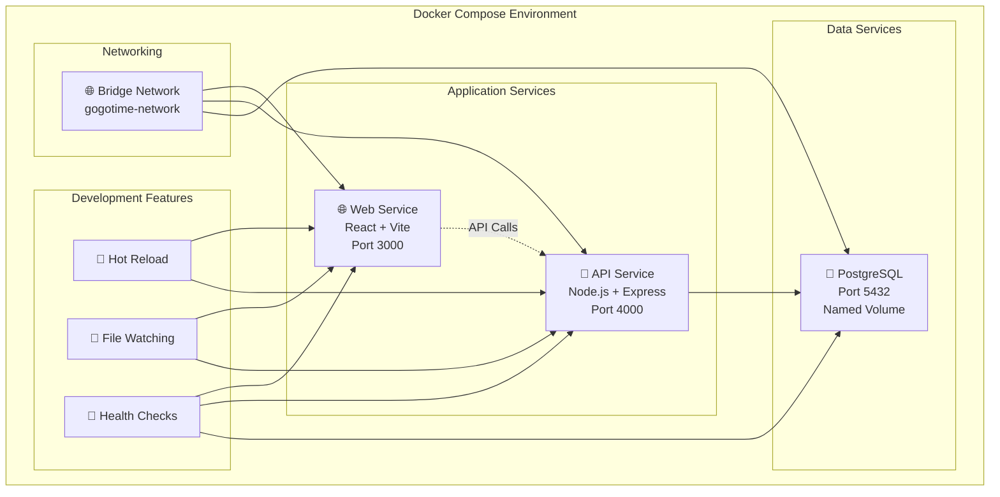
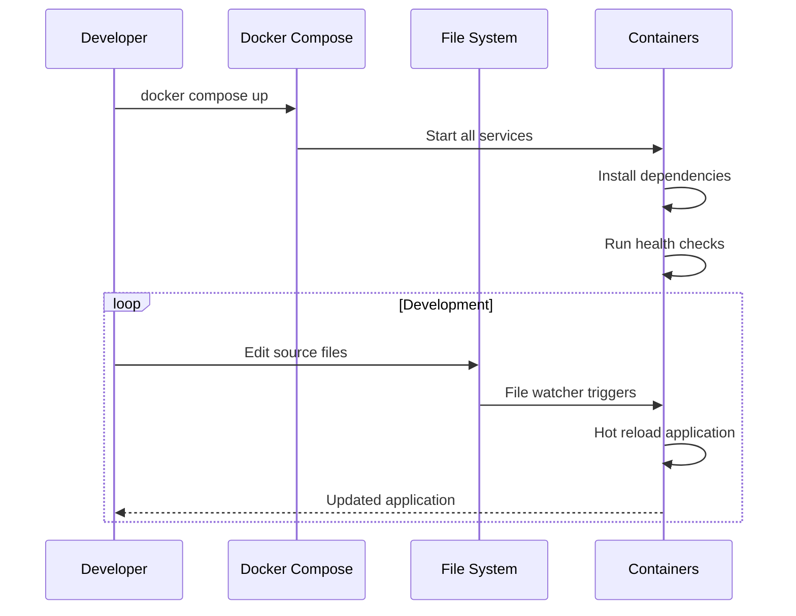
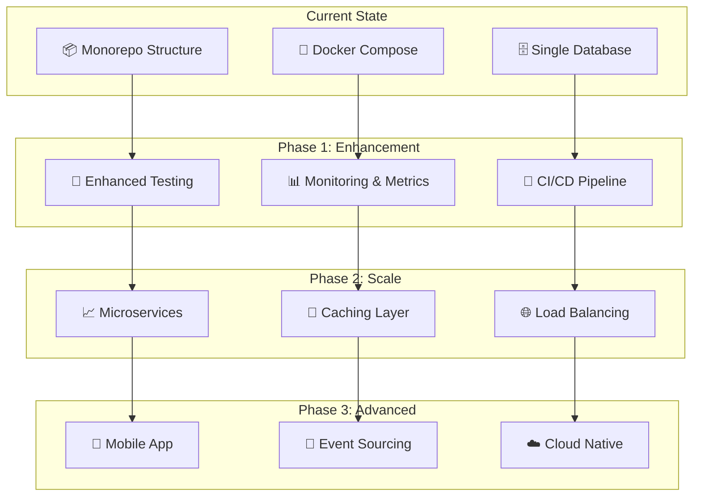

# GoGoTime System Architecture

> [!SUMMARY] **Architecture Overview**
> GoGoTime follows a modern, layered architecture with React frontend, Node.js backend, and PostgreSQL database. The system emphasizes type safety, developer experience, and maintainable code organization.

## 📋 Table of Contents

- [[#🏗️ High-Level Architecture|High-Level Architecture]]
- [[#⚛️ Frontend Architecture|Frontend Architecture]]  
- [[#🔧 Backend Architecture|Backend Architecture]]
- [[#🗄️ Database Architecture|Database Architecture]]
- [[#🔐 Security Architecture|Security Architecture]]
- [[#🐳 Infrastructure Architecture|Infrastructure Architecture]]
- [[#🎯 Design Decisions|Design Decisions]]

---

## 🏗️ High-Level Architecture

> [!NOTE] **System Overview**
> GoGoTime uses a three-tier architecture with clear separation between presentation, application, and data layers.



### 🎯 Architecture Principles

1. **📦 Separation of Concerns**: Clear boundaries between layers
2. **🔄 Stateless API**: RESTful design with JWT authentication
3. **🏷️ Type Safety**: End-to-end TypeScript coverage
4. **🧪 Testability**: Modular design for easy unit testing
5. **🔄 Scalability**: Containerized for horizontal scaling

---

## ⚛️ Frontend Architecture

> [!NOTE] **React Application Structure**
> The frontend follows a feature-based organization pattern with shared components and centralized state management.



### 🗂️ Frontend Directory Structure

```typescript
App.Web/
├── src/
│   ├── components/          // 🧩 Reusable UI Components
│   │   ├── layout/         // 🏗️ Layout-specific components
│   │   │   ├── MainLayout.tsx
│   │   │   ├── Sidebar.tsx
│   │   │   └── Header.tsx
│   │   ├── common/         // 🔄 Shared components
│   │   │   ├── Loader.tsx
│   │   │   └── Loadable.tsx
│   │   ├── guards/         // 🛡️ Route protection
│   │   │   ├── AuthGuard.tsx
│   │   │   └── GuestGuard.tsx
│   │   └── cards/          // 🃏 Card components
│   │
│   ├── features/           // 📦 Feature-based modules
│   │   ├── dashboard/      // 📈 Dashboard functionality
│   │   ├── auth/           // 🔐 Authentication pages
│   │   ├── utilities/      // 🔧 Utility pages
│   │   └── sample-page/    // 📄 Example page
│   │
│   ├── lib/                // 🛠️ Core application logic
│   │   ├── store/          // 🗃️ Redux store configuration
│   │   ├── routes/         // 🗺️ React Router setup
│   │   └── menu-items/     // 📋 Navigation configuration
│   │
│   ├── hooks/              // 🎣 Custom React hooks
│   ├── themes/             // 🎨 Material-UI themes
│   ├── types/              // 🏷️ TypeScript definitions
│   └── styles/             // 💄 Global styles
```

### 🔄 State Management



---

## 🔧 Backend Architecture

> [!NOTE] **Express.js API Design**
> The backend follows a layered architecture with clear separation between routes, business logic, and data access.



### 🗂️ Backend Directory Structure

```typescript
App.API/
├── src/
│   ├── routes/             // 🗺️ API Route Definitions
│   │   └── users.ts        // 👥 User management endpoints
│   │
│   ├── models/             // 📊 TypeORM Entity Models
│   │   ├── BaseEntity.ts   // 🏗️ Common entity fields
│   │   ├── user.ts         // 👤 User entity
│   │   └── activeSession.ts // 🔐 Session management
│   │
│   ├── config/             // ⚙️ Configuration Files
│   │   └── safeRoutes.ts   // 🛡️ JWT middleware
│   │
│   ├── server/             // 🚀 Server Setup
│   │   └── database.ts     // 🗄️ Database connection
│   │
│   └── migrations/         // 📈 Database Migrations
│
├── tests/                  // 🧪 API Tests
└── ecosystem.config.cjs    // 🔄 PM2 Configuration
```

### 🔗 API Flow



---

## 🗄️ Database Architecture

> [!NOTE] **PostgreSQL Schema Design**
> The database uses a normalized design with proper relationships and constraints for data integrity.



### 📊 Entity Relationships

| Entity | Purpose | Key Fields |
|--------|---------|------------|
| **BaseEntity** | 🏗️ Common fields for all entities | `id`, `createdAt`, `updatedAt` |
| **User** | 👤 User account management | `username`, `email`, `password` |
| **ActiveSession** | 🔐 JWT token tracking | `userId`, `token` |

### 🔧 TypeORM Configuration

```typescript
// Database connection configuration
export const AppDataSource = new DataSource({
  type: "postgres",
  host: process.env.DB_HOST || "localhost",
  port: parseInt(process.env.DB_PORT || "5432"),
  username: process.env.DB_USER || "postgres",
  password: process.env.DB_PASS || "password",
  database: process.env.DB_NAME || "gogotime",
  synchronize: process.env.NODE_ENV === "development",
  logging: process.env.NODE_ENV === "development",
  entities: [User, ActiveSession],
  migrations: ["src/migrations/*.ts"],
})
```

---

## 🔐 Security Architecture

> [!WARNING] **Security Implementation**
> GoGoTime implements multiple layers of security to protect user data and prevent unauthorized access.



### 🛡️ Security Measures

1. **🔑 Authentication**
   - JWT token-based stateless authentication
   - bcrypt password hashing with salt rounds
   - Active session tracking in database

2. **✅ Input Validation**
   - Joi schema validation for all endpoints
   - TypeScript compile-time type checking
   - SQL injection prevention via TypeORM

3. **🌐 Transport Security**
   - HTTPS enforcement in production
   - CORS configuration for API access
   - Security headers (CSP, HSTS, etc.)

4. **📊 Monitoring**
   - Failed login attempt tracking
   - Session activity logging
   - API access monitoring

---

## 🐳 Infrastructure Architecture

> [!NOTE] **Containerized Development**
> Docker Compose provides a consistent development environment with hot reload and proper service isolation.



### 📦 Container Configuration

| Service | Image | Purpose | Ports | Volumes |
|---------|-------|---------|--------|---------|
| **web** | 🌐 Node.js + Vite | Frontend development server | `3000:3000` | Hot reload source |
| **api** | 🔧 Node.js + TypeScript | Backend API server | `4000:4000` | Hot reload source |
| **db** | 🐘 PostgreSQL 18 Alpine | Primary database | `5432:5432` | Persistent data |

### 🔄 Development Workflow



---

## 🎯 Design Decisions

> [!NOTE] **Architectural Choices**
> Key decisions that shaped the GoGoTime architecture and their reasoning.

### 🧠 Technology Selection

#### Frontend Decisions

| Technology | Why Chosen | Alternatives Considered |
|------------|------------|------------------------|
| **React 19** | ⚛️ Latest features, concurrent rendering | Vue.js, Angular, Svelte |
| **Vite** | ⚡ Fast builds, HMR, ES modules | Webpack, Parcel, Rollup |
| **Material-UI v7** | 🎨 Comprehensive components, accessibility | Ant Design, Chakra UI |
| **Redux Toolkit** | 📊 Predictable state, DevTools | Zustand, Jotai, Context API |
| **TypeScript** | 🏷️ Type safety, better DX | JavaScript, Flow |

#### Backend Decisions

| Technology | Why Chosen | Alternatives Considered |
|------------|------------|------------------------|
| **Express.js** | 🚀 Mature, flexible, ecosystem | Fastify, Koa.js, NestJS |
| **TypeORM** | 🏗️ Decorator syntax, migrations | Prisma, Sequelize, Knex.js |
| **PostgreSQL** | 🐘 ACID compliance, JSON support | MySQL, MongoDB, SQLite |
| **JWT** | 🔑 Stateless, scalable | Sessions, OAuth, Passport |

### 🏗️ Architectural Patterns

1. **🔄 Layered Architecture**
   - **Why**: Clear separation of concerns, testability
   - **Implementation**: Routes → Services → Data Access

2. **📦 Feature-Based Organization**
   - **Why**: Scalability, maintainability, team collaboration
   - **Implementation**: Features as self-contained modules

3. **🏷️ TypeScript-First Development**
   - **Why**: Catch errors early, better refactoring, documentation
   - **Implementation**: Strict TypeScript across frontend and backend

4. **🐳 Container-First Infrastructure**
   - **Why**: Consistency, reproducibility, easy deployment
   - **Implementation**: Docker Compose for development, production-ready images

### 🔮 Future Considerations

> [!TIP] **Scalability Roadmap**
> Planned improvements for handling growth and new requirements.



---

## 🏷️ Tags

#architecture #gogotime #react #nodejs #postgresql #typescript #docker #security #design-patterns

**Related Documentation:**
- [[DATABASE_DESIGN]] - Detailed database schema
- [[API_SPECIFICATION]] - API endpoints and contracts
- [[SECURITY_MEASURES]] - Security implementation details
- [[DEPLOYMENT_GUIDE]] - Infrastructure setup

---

> [!NOTE] **Document Maintenance**
> **Last Updated:** {date}  
> **Version:** 1.0.0  
> **Maintainers:** Architecture Team (Lazaro, Alexy, Massi, Lounis)