# GoGoTime Authentication Flow

> [!SUMMARY] **JWT-Based Authentication System**
> Comprehensive guide to GoGoTime's authentication system using JWT tokens, session management, and secure password handling with bcrypt encryption.

## 📋 Table of Contents

- [[#🔐 Authentication Overview|Authentication Overview]]
- [[#🔑 JWT Token System|JWT Token System]]
- [[#🚪 Login Flow|Login Flow]]
- [[#📝 Registration Process|Registration Process]]
- [[#🔄 Session Management|Session Management]]
- [[#🛡️ Security Implementation|Security Implementation]]

---

## 🔐 Authentication Overview

### 🎯 Authentication Strategy

GoGoTime uses a **hybrid authentication approach** combining:

```mermaid
graph TB
    subgraph "Authentication Components"
        subgraph "Token Layer"
            JWT[🔑 JWT Tokens<br/>Stateless validation<br/>Payload encryption]
            REFRESH[🔄 Refresh Tokens<br/>Long-lived tokens<br/>Revocation support]
        end
        
        subgraph "Session Layer"
            DB[🗄️ Database Sessions<br/>Active session tracking<br/>Multi-device support]
            REDIS[⚡ Redis Cache<br/>Session performance<br/>Rate limiting]
        end
        
        subgraph "Security Layer"
            BCRYPT[🔒 Password Hashing<br/>bcrypt + salt<br/>Configurable rounds]
            VALIDATION[✅ Input Validation<br/>Joi schemas<br/>Sanitization]
        end
    end
    
    JWT --> DB
    REFRESH --> REDIS
    DB --> BCRYPT
    REDIS --> VALIDATION
```



### 🔄 Authentication Flow Types

| Flow Type | Use Case | Duration | Revocable |
|-----------|----------|----------|-----------|
| **Login Session** | Web application | 24 hours | ✅ Yes |
| **API Access** | Mobile/SPA | 1 hour | ✅ Yes |
| **Remember Me** | Long-term access | 30 days | ✅ Yes |
| **Service Account** | Internal services | No expiry | ✅ Yes |

---

## 🔑 JWT Token System

### 🏗️ Token Structure

**JWT Payload Structure:**
```typescript
interface JWTPayload {
  // Standard claims
  iss: 'gogotime-api'           // Issuer
  sub: string                   // Subject (User ID)
  aud: 'gogotime-client'        // Audience
  exp: number                   // Expiration timestamp
  iat: number                   // Issued at timestamp
  jti: string                   // JWT ID (unique)
  
  // Custom claims
  id: string                    // User UUID
  username: string              // Username
  email: string                 // User email
  role?: string                 // User role (future)
  permissions?: string[]        // User permissions (future)
  sessionId: string            // Database session ID
}
```

**Token Generation:**
```typescript
// App.API/src/auth/jwt.ts
import jwt from 'jsonwebtoken'
import crypto from 'crypto'

interface TokenOptions {
  expiresIn?: string | number
  audience?: string
  issuer?: string
}

class JWTService {
  private readonly secret: string
  private readonly defaultOptions: TokenOptions

  constructor() {
    this.secret = process.env.SECRET!
    if (this.secret.length < 32) {
      throw new Error('JWT secret must be at least 32 characters long')
    }
    
    this.defaultOptions = {
      expiresIn: '24h',
      audience: 'gogotime-client',
      issuer: 'gogotime-api'
    }
  }

  generateAccessToken(user: User, sessionId: string): string {
    const payload: JWTPayload = {
      iss: this.defaultOptions.issuer!,
      sub: user.id,
      aud: this.defaultOptions.audience!,
      exp: Math.floor(Date.now() / 1000) + (24 * 60 * 60), // 24 hours
      iat: Math.floor(Date.now() / 1000),
      jti: crypto.randomUUID(),
      
      // Custom claims
      id: user.id,
      username: user.username,
      email: user.email,
      sessionId
    }

    return jwt.sign(payload, this.secret, {
      algorithm: 'HS256'
    })
  }

  generateRefreshToken(): string {
    return crypto.randomBytes(32).toString('hex')
  }

  verifyToken(token: string): JWTPayload {
    try {
      return jwt.verify(token, this.secret, {
        audience: this.defaultOptions.audience,
        issuer: this.defaultOptions.issuer,
        algorithms: ['HS256']
      }) as JWTPayload
    } catch (error) {
      if (error instanceof jwt.TokenExpiredError) {
        throw new AuthError('Token expired', 'TOKEN_EXPIRED')
      }
      if (error instanceof jwt.JsonWebTokenError) {
        throw new AuthError('Invalid token', 'INVALID_TOKEN')
      }
      throw new AuthError('Token verification failed', 'VERIFICATION_FAILED')
    }
  }

  extractTokenFromHeader(authHeader?: string): string | null {
    if (!authHeader || !authHeader.startsWith('Bearer ')) {
      return null
    }
    return authHeader.substring(7)
  }
}

export const jwtService = new JWTService()
```

---

## 🚪 Login Flow

### 🔄 Complete Login Sequence


### 💻 Login Implementation

**Backend Login Handler:**
```typescript
// App.API/src/routes/auth.ts
import { Request, Response } from 'express'
import * as bcrypt from '@node-rs/bcrypt'
import { jwtService } from '../auth/jwt'
import { sessionService } from '../auth/session'
import { loggers } from '../monitoring/logger'

interface LoginRequest extends Request {
  body: {
    email: string
    password: string
    rememberMe?: boolean
    deviceInfo?: {
      userAgent: string
      ip: string
      deviceType: 'desktop' | 'mobile' | 'tablet'
    }
  }
}

export const loginHandler = async (req: LoginRequest, res: Response) => {
  const startTime = Date.now()
  
  try {
    // Input validation
    const { error, value } = loginSchema.validate(req.body)
    if (error) {
      return res.status(422).json({
        success: false,
        message: 'Invalid input',
        errors: error.details.map(d => d.message)
      })
    }

    const { email, password, rememberMe = false, deviceInfo } = value

    // Find user
    const userRepository = AppDataSource.getRepository(User)
    const user = await userRepository.findOne({ 
      where: { email: email.toLowerCase() },
      select: ['id', 'username', 'email', 'password', 'createdAt', 'updatedAt']
    })

    if (!user) {
      // Log failed attempt (don't reveal user doesn't exist)
      loggers.auth.loginFailure(email, req.ip, 'Invalid credentials')
      return res.status(401).json({
        success: false,
        message: 'Invalid credentials'
      })
    }

    // Verify password
    const isValidPassword = await bcrypt.compare(password, user.password)
    if (!isValidPassword) {
      loggers.auth.loginFailure(email, req.ip, 'Invalid password')
      return res.status(401).json({
        success: false,
        message: 'Invalid credentials'
      })
    }

    // Check for account lockout (future feature)
    // await checkAccountLockout(user.id)

    // Create session
    const sessionData = {
      userId: user.id,
      ipAddress: req.ip,
      userAgent: req.get('User-Agent') || '',
      expiresAt: new Date(Date.now() + (rememberMe ? 30 * 24 * 60 * 60 * 1000 : 24 * 60 * 60 * 1000)),
      deviceInfo
    }

    const session = await sessionService.createSession(sessionData)
    
    // Generate JWT token
    const accessToken = jwtService.generateAccessToken(user, session.id)
    const refreshToken = jwtService.generateRefreshToken()
    
    // Store refresh token
    await sessionService.updateSession(session.id, { refreshToken })

    // Remove password from response
    const userResponse = {
      id: user.id,
      username: user.username,
      email: user.email,
      createdAt: user.createdAt,
      updatedAt: user.updatedAt
    }

    // Log successful login
    loggers.auth.loginSuccess(user.id, req.ip)

    // Track metrics
    authMetrics.loginSuccess.inc()
    authMetrics.loginDuration.observe(Date.now() - startTime)

    res.json({
      success: true,
      message: 'Login successful',
      data: {
        user: userResponse,
        tokens: {
          accessToken,
          refreshToken,
          expiresIn: session.expiresAt
        },
        session: {
          id: session.id,
          expiresAt: session.expiresAt
        }
      }
    })

  } catch (error) {
    console.error('Login error:', error)
    loggers.auth.loginFailure(req.body.email, req.ip, error.message)
    
    authMetrics.loginError.inc()
    
    res.status(500).json({
      success: false,
      message: 'Internal server error'
    })
  }
}
```

**Frontend Login Hook:**
```typescript
// App.Web/src/hooks/useAuth.ts
import { useState } from 'react'
import { useNavigate } from 'react-router-dom'
import { useAppDispatch } from '@/lib/store'
import { setUser, clearUser } from '@/lib/store/authSlice'
import { logger } from '@/monitoring/logger'

interface LoginCredentials {
  email: string
  password: string
  rememberMe?: boolean
}

interface AuthResponse {
  success: boolean
  message: string
  data?: {
    user: User
    tokens: {
      accessToken: string
      refreshToken: string
      expiresIn: string
    }
    session: {
      id: string
      expiresAt: string
    }
  }
}

export const useAuth = () => {
  const [loading, setLoading] = useState(false)
  const [error, setError] = useState<string | null>(null)
  const navigate = useNavigate()
  const dispatch = useAppDispatch()

  const login = async (credentials: LoginCredentials) => {
    setLoading(true)
    setError(null)

    try {
      const deviceInfo = {
        userAgent: navigator.userAgent,
        deviceType: getDeviceType(),
        timestamp: new Date().toISOString()
      }

      const response = await fetch('/api/auth/login', {
        method: 'POST',
        headers: {
          'Content-Type': 'application/json'
        },
        body: JSON.stringify({
          ...credentials,
          deviceInfo
        })
      })

      const data: AuthResponse = await response.json()

      if (!data.success) {
        setError(data.message)
        logger.warn('Login failed', { reason: data.message, email: credentials.email })
        return false
      }

      // Store tokens
      localStorage.setItem('accessToken', data.data!.tokens.accessToken)
      localStorage.setItem('refreshToken', data.data!.tokens.refreshToken)
      localStorage.setItem('sessionId', data.data!.session.id)

      // Update Redux state
      dispatch(setUser(data.data!.user))

      // Log successful login
      logger.info('User login successful', { userId: data.data!.user.id })

      // Navigate to dashboard
      navigate('/dashboard')
      return true

    } catch (error) {
      const errorMessage = error instanceof Error ? error.message : 'Login failed'
      setError(errorMessage)
      logger.error('Login error', { error: errorMessage })
      return false
    } finally {
      setLoading(false)
    }
  }

  const logout = async () => {
    try {
      const token = localStorage.getItem('accessToken')
      
      if (token) {
        // Notify server to invalidate session
        await fetch('/api/auth/logout', {
          method: 'POST',
          headers: {
            'Authorization': `Bearer ${token}`,
            'Content-Type': 'application/json'
          }
        })
      }
    } catch (error) {
      logger.error('Logout error', { error })
    } finally {
      // Clear local storage
      localStorage.removeItem('accessToken')
      localStorage.removeItem('refreshToken')
      localStorage.removeItem('sessionId')
      
      // Clear Redux state
      dispatch(clearUser())
      
      // Navigate to login
      navigate('/login')
    }
  }

  const getDeviceType = (): 'desktop' | 'mobile' | 'tablet' => {
    const userAgent = navigator.userAgent
    if (/tablet|ipad|playbook|silk/i.test(userAgent)) return 'tablet'
    if (/mobile|iphone|ipod|android|blackberry|opera|mini|windows\sce|palm|smartphone|iemobile/i.test(userAgent)) return 'mobile'
    return 'desktop'
  }

  return {
    login,
    logout,
    loading,
    error
  }
}
```

---

## 📝 Registration Process

### 🆕 User Registration Flow


**Registration Implementation:**
```typescript
// App.API/src/routes/auth.ts
export const registerHandler = async (req: Request, res: Response) => {
  try {
    // Input validation
    const { error, value } = registerSchema.validate(req.body)
    if (error) {
      return res.status(422).json({
        success: false,
        message: 'Validation error',
        errors: error.details.map(d => ({
          field: d.path.join('.'),
          message: d.message
        }))
      })
    }

    const { username, email, password } = value
    const userRepository = AppDataSource.getRepository(User)

    // Check if email already exists
    const existingUser = await userRepository.findOne({ 
      where: { email: email.toLowerCase() } 
    })

    if (existingUser) {
      return res.status(409).json({
        success: false,
        message: 'Email already registered'
      })
    }

    // Hash password
    const saltRounds = parseInt(process.env.BCRYPT_ROUNDS || '12')
    const hashedPassword = await bcrypt.hash(password, saltRounds)

    // Create user
    const newUser = userRepository.create({
      username,
      email: email.toLowerCase(),
      password: hashedPassword,
      // Add other default fields
      emailVerified: false,
      status: 'active',
      createdAt: new Date(),
      updatedAt: new Date()
    })

    const savedUser = await userRepository.save(newUser)

    // Log business event
    loggers.business.userRegistered(savedUser.id, savedUser.email)

    // Track metrics
    businessMetrics.usersRegistered.inc()

    // Remove password from response
    const userResponse = {
      id: savedUser.id,
      username: savedUser.username,
      email: savedUser.email,
      createdAt: savedUser.createdAt
    }

    res.status(201).json({
      success: true,
      message: 'Registration successful',
      data: {
        user: userResponse
      }
    })

  } catch (error) {
    console.error('Registration error:', error)
    res.status(500).json({
      success: false,
      message: 'Internal server error'
    })
  }
}
```

---

## 🔄 Session Management

### 💾 Session Storage Strategy

**Session Entity:**
```typescript
// App.API/src/models/Session.ts
import { Entity, Column, ManyToOne, JoinColumn } from 'typeorm'
import { BaseEntity } from './BaseEntity'
import { User } from './User'

@Entity('sessions')
export class Session extends BaseEntity {
  @Column('uuid')
  userId!: string

  @Column('text')
  token!: string

  @Column('text', { nullable: true })
  refreshToken?: string

  @Column('inet')
  ipAddress!: string

  @Column('text')
  userAgent!: string

  @Column('timestamp')
  expiresAt!: Date

  @Column('timestamp', { nullable: true })
  lastActivityAt?: Date

  @Column('jsonb', { nullable: true })
  deviceInfo?: {
    deviceType: 'desktop' | 'mobile' | 'tablet'
    browser?: string
    os?: string
    location?: string
  }

  @Column('boolean', { default: true })
  isActive!: boolean

  // Relationships
  @ManyToOne(() => User)
  @JoinColumn({ name: 'userId' })
  user!: User
}
```

**Session Service:**
```typescript
// App.API/src/auth/session.ts
import { AppDataSource } from '../server/database'
import { Session } from '../models/Session'
import { User } from '../models/User'

interface CreateSessionData {
  userId: string
  ipAddress: string
  userAgent: string
  expiresAt: Date
  deviceInfo?: any
}

class SessionService {
  private sessionRepository = AppDataSource.getRepository(Session)

  async createSession(data: CreateSessionData): Promise<Session> {
    const session = this.sessionRepository.create({
      ...data,
      token: '', // Will be set after JWT generation
      isActive: true,
      lastActivityAt: new Date()
    })

    return await this.sessionRepository.save(session)
  }

  async updateSession(sessionId: string, updates: Partial<Session>): Promise<void> {
    await this.sessionRepository.update(sessionId, {
      ...updates,
      lastActivityAt: new Date()
    })
  }

  async findSessionByToken(token: string): Promise<Session | null> {
    return await this.sessionRepository.findOne({
      where: { token, isActive: true },
      relations: ['user']
    })
  }

  async invalidateSession(sessionId: string): Promise<void> {
    await this.sessionRepository.update(sessionId, {
      isActive: false,
      lastActivityAt: new Date()
    })
  }

  async invalidateUserSessions(userId: string): Promise<void> {
    await this.sessionRepository.update(
      { userId, isActive: true },
      { isActive: false, lastActivityAt: new Date() }
    )
  }

  async cleanupExpiredSessions(): Promise<number> {
    const result = await this.sessionRepository.delete({
      expiresAt: LessThan(new Date())
    })
    return result.affected || 0
  }

  async getUserActiveSessions(userId: string): Promise<Session[]> {
    return await this.sessionRepository.find({
      where: { userId, isActive: true },
      order: { lastActivityAt: 'DESC' }
    })
  }
}

export const sessionService = new SessionService()
```

---

## 🛡️ Security Implementation

### 🔒 Password Security

**Password Requirements:**
```typescript
// Validation schema
const passwordSchema = Joi.string()
  .min(8)
  .max(128)
  .pattern(/^(?=.*[a-z])(?=.*[A-Z])(?=.*\d)(?=.*[@$!%*?&])[A-Za-z\d@$!%*?&]/)
  .messages({
    'string.min': 'Password must be at least 8 characters',
    'string.max': 'Password cannot exceed 128 characters',
    'string.pattern.base': 'Password must contain uppercase, lowercase, number, and special character'
  })
```

**bcrypt Configuration:**
```typescript
// Production-ready password hashing
const BCRYPT_ROUNDS = parseInt(process.env.BCRYPT_ROUNDS || '12')

// Hash password
export const hashPassword = async (password: string): Promise<string> => {
  if (BCRYPT_ROUNDS < 10) {
    throw new Error('bcrypt rounds must be at least 10 for security')
  }
  return await bcrypt.hash(password, BCRYPT_ROUNDS)
}

// Verify password
export const verifyPassword = async (password: string, hash: string): Promise<boolean> => {
  return await bcrypt.compare(password, hash)
}
```

### 🚨 Rate Limiting

```typescript
// Authentication rate limiting
const authLimiter = rateLimit({
  windowMs: 15 * 60 * 1000, // 15 minutes
  max: 5, // Limit each IP to 5 requests per windowMs
  skipSuccessfulRequests: true, // Only count failed attempts
  message: {
    success: false,
    message: 'Too many authentication attempts, please try again later.'
  },
  standardHeaders: true,
  legacyHeaders: false
})

// Apply to auth endpoints
app.use('/api/auth/login', authLimiter)
app.use('/api/auth/register', authLimiter)
```

---

## 🏷️ Tags

#authentication #jwt #bcrypt #session-management #security #login #registration #tokens

**Related Documentation:**
- [[SECURITY_MEASURES]] - Complete security implementation
- [[API_SPECIFICATION]] - Authentication API endpoints
- [[RBAC_SYSTEM]] - Role-based access control
- [[FRONTEND_ARCHITECTURE]] - Client-side auth implementation

---

> [!NOTE] **Document Maintenance**
> **Last Updated:** {date}  
> **Version:** 1.0.0  
> **Maintainers:** Security Team (Lazaro, Alexy, Massi, Lounis)

> [!WARNING] **Security Considerations**
> - Never log passwords or tokens in plain text
> - Always use HTTPS in production
> - Implement proper session timeout
> - Monitor for suspicious login patterns
> - Regularly rotate JWT secrets
