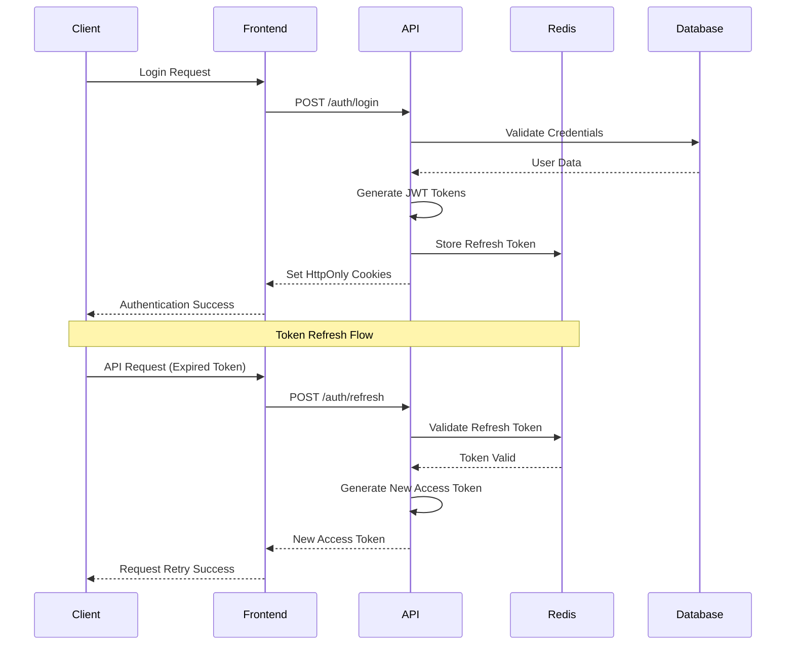

# Authentication & Security

## Overview

This document outlines the comprehensive security strategy for the NCY_8 platform, covering authentication, authorization, input validation, secrets management, and security monitoring.

## Authentication Architecture

### JWT-Based Authentication

**Technology Stack**:
- **Access Tokens**: JWT with 15-minute expiration
- **Refresh Tokens**: Long-lived tokens stored in Redis
- **Token Storage**: HttpOnly cookies for web, Bearer tokens for API
- **Session Management**: Redis-based session storage

### Authentication Flow



### JWT Implementation

```typescript
// JWT Configuration
import jwt from 'jsonwebtoken';
import { Redis } from 'ioredis';

const JWT_SECRET = process.env.JWT_SECRET!;
const JWT_REFRESH_SECRET = process.env.JWT_REFRESH_SECRET!;
const ACCESS_TOKEN_EXPIRY = '15m';
const REFRESH_TOKEN_EXPIRY = '7d';

export class AuthService {
  private redis = new Redis(process.env.REDIS_URL!);

  async generateTokens(user: User) {
    const payload = {
      userId: user.id,
      email: user.email,
      role: user.role,
      organizationId: user.organizationId,
    };

    const accessToken = jwt.sign(payload, JWT_SECRET, {
      expiresIn: ACCESS_TOKEN_EXPIRY,
      issuer: 'ncy-8',
      audience: 'ncy-8-api',
    });

    const refreshToken = jwt.sign(
      { userId: user.id, type: 'refresh' },
      JWT_REFRESH_SECRET,
      { expiresIn: REFRESH_TOKEN_EXPIRY }
    );

    // Store refresh token in Redis
    await this.redis.setex(
      `refresh_token:${user.id}`,
      7 * 24 * 60 * 60, // 7 days
      refreshToken
    );

    return { accessToken, refreshToken };
  }

  async validateAccessToken(token: string): Promise<JWTPayload | null> {
    try {
      return jwt.verify(token, JWT_SECRET) as JWTPayload;
    } catch (error) {
      return null;
    }
  }

  async refreshAccessToken(refreshToken: string): Promise<string | null> {
    try {
      const payload = jwt.verify(refreshToken, JWT_REFRESH_SECRET) as any;
      const storedToken = await this.redis.get(`refresh_token:${payload.userId}`);
      
      if (storedToken !== refreshToken) {
        return null; // Token mismatch
      }

      const user = await this.getUserById(payload.userId);
      if (!user) return null;

      const { accessToken } = await this.generateTokens(user);
      return accessToken;
    } catch (error) {
      return null;
    }
  }
}
```

### NextAuth.js Integration

```typescript
// pages/api/auth/[...nextauth].ts
import NextAuth from 'next-auth';
import CredentialsProvider from 'next-auth/providers/credentials';
import { AuthService } from '@/lib/auth';

export default NextAuth({
  providers: [
    CredentialsProvider({
      name: 'credentials',
      credentials: {
        email: { label: 'Email', type: 'email' },
        password: { label: 'Password', type: 'password' },
      },
      async authorize(credentials) {
        if (!credentials?.email || !credentials?.password) {
          return null;
        }

        const authService = new AuthService();
        const user = await authService.validateCredentials(
          credentials.email,
          credentials.password
        );

        return user ? {
          id: user.id,
          email: user.email,
          role: user.role,
          organizationId: user.organizationId,
        } : null;
      },
    }),
  ],
  session: {
    strategy: 'jwt',
    maxAge: 15 * 60, // 15 minutes
  },
  jwt: {
    maxAge: 15 * 60, // 15 minutes
  },
  callbacks: {
    async jwt({ token, user }) {
      if (user) {
        token.role = user.role;
        token.organizationId = user.organizationId;
      }
      return token;
    },
    async session({ session, token }) {
      session.user.id = token.sub!;
      session.user.role = token.role as string;
      session.user.organizationId = token.organizationId as string;
      return session;
    },
  },
});
```

## Authorization System

### Role-Based Access Control (RBAC)

```typescript
// RBAC Implementation
export enum Permission {
  // User permissions
  USER_READ = 'user:read',
  USER_WRITE = 'user:write',
  USER_DELETE = 'user:delete',
  
  // Organization permissions
  ORG_READ = 'org:read',
  ORG_WRITE = 'org:write',
  ORG_DELETE = 'org:delete',
  ORG_MANAGE = 'org:manage',
  
  // Project permissions
  PROJECT_READ = 'project:read',
  PROJECT_WRITE = 'project:write',
  PROJECT_DELETE = 'project:delete',
  
  // System permissions
  SYSTEM_ADMIN = 'system:admin',
  SYSTEM_MONITOR = 'system:monitor',
}

export enum Role {
  ADMIN = 'ADMIN',
  MANAGER = 'MANAGER',
  EMPLOYEE = 'EMPLOYEE',
  SYSTEM = 'SYSTEM',
}

// Role-Permission mapping
const ROLE_PERMISSIONS: Record<Role, Permission[]> = {
  [Role.ADMIN]: [
    Permission.USER_READ,
    Permission.USER_WRITE,
    Permission.USER_DELETE,
    Permission.ORG_READ,
    Permission.ORG_WRITE,
    Permission.ORG_DELETE,
    Permission.ORG_MANAGE,
    Permission.PROJECT_READ,
    Permission.PROJECT_WRITE,
    Permission.PROJECT_DELETE,
    Permission.SYSTEM_ADMIN,
  ],
  [Role.MANAGER]: [
    Permission.USER_READ,
    Permission.ORG_READ,
    Permission.ORG_WRITE,
    Permission.PROJECT_READ,
    Permission.PROJECT_WRITE,
    Permission.SYSTEM_MONITOR,
  ],
  [Role.EMPLOYEE]: [
    Permission.USER_READ,
    Permission.ORG_READ,
    Permission.PROJECT_READ,
  ],
  [Role.SYSTEM]: [
    Permission.SYSTEM_MONITOR,
  ],
};

export class AuthorizationService {
  hasPermission(userRole: Role, permission: Permission): boolean {
    return ROLE_PERMISSIONS[userRole]?.includes(permission) || false;
  }

  hasAnyPermission(userRole: Role, permissions: Permission[]): boolean {
    return permissions.some(permission => this.hasPermission(userRole, permission));
  }

  canAccessResource(user: User, resource: Resource): boolean {
    // Organization-based access control
    if (resource.organizationId && user.organizationId !== resource.organizationId) {
      return false;
    }

    // Role-based access control
    return this.hasPermission(user.role, resource.requiredPermission);
  }
}
```

### Middleware Implementation

```typescript
// Middleware for route protection
import { Request, Response, NextFunction } from 'express';
import { AuthService } from '@/services/auth';
import { AuthorizationService } from '@/services/authorization';

export interface AuthenticatedRequest extends Request {
  user?: User;
}

export const authenticateToken = async (
  req: AuthenticatedRequest,
  res: Response,
  next: NextFunction
) => {
  const authHeader = req.headers.authorization;
  const token = authHeader && authHeader.split(' ')[1];

  if (!token) {
    return res.status(401).json({ error: 'Access token required' });
  }

  const authService = new AuthService();
  const payload = await authService.validateAccessToken(token);

  if (!payload) {
    return res.status(401).json({ error: 'Invalid or expired token' });
  }

  req.user = await authService.getUserById(payload.userId);
  next();
};

export const requirePermission = (permission: Permission) => {
  return (req: AuthenticatedRequest, res: Response, next: NextFunction) => {
    if (!req.user) {
      return res.status(401).json({ error: 'Authentication required' });
    }

    const authService = new AuthorizationService();
    if (!authService.hasPermission(req.user.role, permission)) {
      return res.status(403).json({ error: 'Insufficient permissions' });
    }

    next();
  };
};

export const requireRole = (roles: Role[]) => {
  return (req: AuthenticatedRequest, res: Response, next: NextFunction) => {
    if (!req.user) {
      return res.status(401).json({ error: 'Authentication required' });
    }

    if (!roles.includes(req.user.role)) {
      return res.status(403).json({ error: 'Insufficient role' });
    }

    next();
  };
};
```

### Route Protection Examples

```typescript
// Protected routes
import { authenticateToken, requirePermission, requireRole } from '@/middleware/auth';
import { Permission, Role } from '@/types/auth';

// User management (Admin only)
router.get('/users', 
  authenticateToken, 
  requireRole([Role.ADMIN]), 
  userController.getUsers
);

// Organization management (Manager+)
router.post('/organizations',
  authenticateToken,
  requirePermission(Permission.ORG_WRITE),
  organizationController.createOrganization
);

// Project access (Organization members)
router.get('/projects/:id',
  authenticateToken,
  requirePermission(Permission.PROJECT_READ),
  projectController.getProject
);
```

## Input Validation & Sanitization

### Zod Schema Validation

```typescript
// Validation schemas
import { z } from 'zod';

export const UserCreateSchema = z.object({
  email: z.string().email('Invalid email format'),
  password: z.string()
    .min(8, 'Password must be at least 8 characters')
    .regex(/^(?=.*[a-z])(?=.*[A-Z])(?=.*\d)(?=.*[@$!%*?&])[A-Za-z\d@$!%*?&]/, 
      'Password must contain uppercase, lowercase, number, and special character'),
  name: z.string().min(1).max(100),
  role: z.enum(['ADMIN', 'MANAGER', 'EMPLOYEE']),
  organizationId: z.string().uuid(),
});

export const OrganizationCreateSchema = z.object({
  name: z.string().min(1).max(255),
  slug: z.string()
    .min(3).max(100)
    .regex(/^[a-z0-9-]+$/, 'Slug must contain only lowercase letters, numbers, and hyphens'),
  settings: z.record(z.any()).optional(),
});

export const ProjectUpdateSchema = z.object({
  name: z.string().min(1).max(255).optional(),
  description: z.string().max(1000).optional(),
  status: z.enum(['ACTIVE', 'INACTIVE', 'ARCHIVED']).optional(),
  settings: z.record(z.any()).optional(),
});
```

### Validation Middleware

```typescript
// Validation middleware
import { Request, Response, NextFunction } from 'express';
import { ZodSchema, ZodError } from 'zod';

export const validateBody = (schema: ZodSchema) => {
  return (req: Request, res: Response, next: NextFunction) => {
    try {
      req.body = schema.parse(req.body);
      next();
    } catch (error) {
      if (error instanceof ZodError) {
        return res.status(400).json({
          error: 'Validation failed',
          details: error.errors.map(err => ({
            field: err.path.join('.'),
            message: err.message,
          })),
        });
      }
      next(error);
    }
  };
};

export const validateQuery = (schema: ZodSchema) => {
  return (req: Request, res: Response, next: NextFunction) => {
    try {
      req.query = schema.parse(req.query);
      next();
    } catch (error) {
      if (error instanceof ZodError) {
        return res.status(400).json({
          error: 'Query validation failed',
          details: error.errors,
        });
      }
      next(error);
    }
  };
};

export const validateParams = (schema: ZodSchema) => {
  return (req: Request, res: Response, next: NextFunction) => {
    try {
      req.params = schema.parse(req.params);
      next();
    } catch (error) {
      if (error instanceof ZodError) {
        return res.status(400).json({
          error: 'Parameter validation failed',
          details: error.errors,
        });
      }
      next(error);
    }
  };
};
```

### HTML Sanitization

```typescript
// HTML sanitization
import DOMPurify from 'dompurify';
import { JSDOM } from 'jsdom';

const window = new JSDOM('').window;
const purify = DOMPurify(window);

export class SanitizationService {
  static sanitizeHtml(html: string): string {
    return purify.sanitize(html, {
      ALLOWED_TAGS: ['p', 'br', 'strong', 'em', 'u', 'ol', 'ul', 'li'],
      ALLOWED_ATTR: [],
    });
  }

  static sanitizeText(text: string): string {
    return text
      .replace(/[<>]/g, '') // Remove HTML tags
      .replace(/javascript:/gi, '') // Remove javascript: URLs
      .replace(/on\w+=/gi, ''); // Remove event handlers
  }

  static sanitizeUrl(url: string): string {
    try {
      const parsed = new URL(url);
      // Only allow HTTP/HTTPS protocols
      if (!['http:', 'https:'].includes(parsed.protocol)) {
        throw new Error('Invalid protocol');
      }
      return parsed.toString();
    } catch {
      return '';
    }
  }
}
```

## Security Headers & Middleware

### Helmet Configuration

```typescript
// Security headers
import helmet from 'helmet';
import { Request, Response, NextFunction } from 'express';

export const securityMiddleware = helmet({
  contentSecurityPolicy: {
    directives: {
      defaultSrc: ["'self'"],
      styleSrc: ["'self'", "'unsafe-inline'", "https://fonts.googleapis.com"],
      fontSrc: ["'self'", "https://fonts.gstatic.com"],
      imgSrc: ["'self'", "data:", "https:"],
      scriptSrc: ["'self'"],
      connectSrc: ["'self'", "https://api.ncy-8.com"],
      frameSrc: ["'none'"],
      objectSrc: ["'none'"],
      upgradeInsecureRequests: [],
    },
  },
  hsts: {
    maxAge: 31536000,
    includeSubDomains: true,
    preload: true,
  },
  noSniff: true,
  xssFilter: true,
  referrerPolicy: { policy: 'strict-origin-when-cross-origin' },
});
```

### CORS Configuration

```typescript
// CORS configuration
import cors from 'cors';

const corsOptions = {
  origin: (origin: string | undefined, callback: Function) => {
    const allowedOrigins = [
      'https://app.ncy-8.com',
      'https://admin.ncy-8.com',
      ...(process.env.NODE_ENV === 'development' 
        ? ['http://localhost:3000', 'http://localhost:3001'] 
        : [])
    ];

    if (!origin || allowedOrigins.includes(origin)) {
      callback(null, true);
    } else {
      callback(new Error('Not allowed by CORS'));
    }
  },
  credentials: true,
  methods: ['GET', 'POST', 'PUT', 'DELETE', 'PATCH', 'OPTIONS'],
  allowedHeaders: ['Content-Type', 'Authorization', 'X-Requested-With'],
  exposedHeaders: ['X-Total-Count', 'X-Page-Count'],
};
```

### Rate Limiting

```typescript
// Rate limiting
import rateLimit from 'express-rate-limit';
import { Redis } from 'ioredis';

const redis = new Redis(process.env.REDIS_URL!);

// General API rate limiting
export const apiRateLimit = rateLimit({
  windowMs: 15 * 60 * 1000, // 15 minutes
  max: 100, // Limit each IP to 100 requests per windowMs
  message: 'Too many requests from this IP, please try again later.',
  standardHeaders: true,
  legacyHeaders: false,
  store: new RedisStore({
    client: redis,
    prefix: 'rl:api:',
  }),
});

// Authentication rate limiting
export const authRateLimit = rateLimit({
  windowMs: 15 * 60 * 1000, // 15 minutes
  max: 5, // Limit each IP to 5 login attempts per windowMs
  message: 'Too many login attempts, please try again later.',
  skipSuccessfulRequests: true,
  store: new RedisStore({
    client: redis,
    prefix: 'rl:auth:',
  }),
});

// User-specific rate limiting
export const userRateLimit = (maxRequests: number = 1000) => {
  return rateLimit({
    windowMs: 15 * 60 * 1000, // 15 minutes
    max: maxRequests,
    keyGenerator: (req: AuthenticatedRequest) => {
      return req.user?.id || req.ip;
    },
    store: new RedisStore({
      client: redis,
      prefix: 'rl:user:',
    }),
  });
};
```

## Secrets Management

### Environment Variable Validation

```typescript
// Environment validation
import { z } from 'zod';

const envSchema = z.object({
  NODE_ENV: z.enum(['development', 'staging', 'production']),
  PORT: z.string().transform(Number),
  DATABASE_URL: z.string().url(),
  REDIS_URL: z.string().url(),
  JWT_SECRET: z.string().min(32),
  JWT_REFRESH_SECRET: z.string().min(32),
  ENCRYPTION_KEY: z.string().length(32),
  API_KEY: z.string().min(32),
  SMTP_HOST: z.string().optional(),
  SMTP_PORT: z.string().transform(Number).optional(),
  SMTP_USER: z.string().optional(),
  SMTP_PASS: z.string().optional(),
});

export const env = envSchema.parse(process.env);
```

### Encryption Service

```typescript
// Encryption service
import crypto from 'crypto';

export class EncryptionService {
  private static readonly ALGORITHM = 'aes-256-gcm';
  private static readonly KEY_LENGTH = 32;
  private static readonly IV_LENGTH = 16;
  private static readonly TAG_LENGTH = 16;

  static encrypt(text: string, key: string): string {
    const iv = crypto.randomBytes(this.IV_LENGTH);
    const cipher = crypto.createCipher(this.ALGORITHM, key);
    cipher.setAAD(Buffer.from('ncy-8', 'utf8'));

    let encrypted = cipher.update(text, 'utf8', 'hex');
    encrypted += cipher.final('hex');

    const tag = cipher.getAuthTag();

    return iv.toString('hex') + ':' + tag.toString('hex') + ':' + encrypted;
  }

  static decrypt(encryptedData: string, key: string): string {
    const parts = encryptedData.split(':');
    const iv = Buffer.from(parts[0], 'hex');
    const tag = Buffer.from(parts[1], 'hex');
    const encrypted = parts[2];

    const decipher = crypto.createDecipher(this.ALGORITHM, key);
    decipher.setAAD(Buffer.from('ncy-8', 'utf8'));
    decipher.setAuthTag(tag);

    let decrypted = decipher.update(encrypted, 'hex', 'utf8');
    decrypted += decipher.final('utf8');

    return decrypted;
  }

  static hashPassword(password: string): Promise<string> {
    return bcrypt.hash(password, 12);
  }

  static verifyPassword(password: string, hash: string): Promise<boolean> {
    return bcrypt.compare(password, hash);
  }
}
```

### Secrets Rotation

```typescript
// Secrets rotation
export class SecretsRotationService {
  private redis = new Redis(process.env.REDIS_URL!);

  async rotateJWTSecret(): Promise<void> {
    const newSecret = crypto.randomBytes(64).toString('hex');
    const oldSecret = process.env.JWT_SECRET;

    // Store new secret with timestamp
    await this.redis.setex(
      'jwt_secret_new',
      24 * 60 * 60, // 24 hours
      JSON.stringify({
        secret: newSecret,
        createdAt: new Date().toISOString(),
      })
    );

    // Update environment variable
    process.env.JWT_SECRET = newSecret;

    // After 24 hours, remove old secret
    setTimeout(async () => {
      await this.redis.del('jwt_secret_old');
    }, 24 * 60 * 60 * 1000);
  }

  async getCurrentJWTSecret(): Promise<string> {
    const newSecretData = await this.redis.get('jwt_secret_new');
    if (newSecretData) {
      const { secret } = JSON.parse(newSecretData);
      return secret;
    }
    return process.env.JWT_SECRET!;
  }
}
```

## Security Monitoring

### Security Event Logging

```typescript
// Security event logging
export class SecurityLogger {
  private logger = new Logger('Security');

  async logSecurityEvent(event: SecurityEvent): Promise<void> {
    await this.logger.info('Security event', {
      event: event.type,
      userId: event.userId,
      ipAddress: event.ipAddress,
      userAgent: event.userAgent,
      details: event.details,
      severity: event.severity,
      timestamp: new Date().toISOString(),
    });

    // Store in database for audit
    await prisma.securityLog.create({
      data: {
        userId: event.userId,
        eventType: event.type,
        ipAddress: event.ipAddress,
        userAgent: event.userAgent,
        details: event.details,
        severity: event.severity,
      },
    });
  }

  async logFailedLogin(email: string, ipAddress: string, userAgent: string): Promise<void> {
    await this.logSecurityEvent({
      type: 'FAILED_LOGIN',
      userId: null,
      ipAddress,
      userAgent,
      details: { email },
      severity: 'MEDIUM',
    });
  }

  async logSuspiciousActivity(userId: string, activity: string, details: any): Promise<void> {
    await this.logSecurityEvent({
      type: 'SUSPICIOUS_ACTIVITY',
      userId,
      ipAddress: null,
      userAgent: null,
      details: { activity, ...details },
      severity: 'HIGH',
    });
  }
}
```

### Intrusion Detection

```typescript
// Intrusion detection
export class IntrusionDetectionService {
  private redis = new Redis(process.env.REDIS_URL!);
  private securityLogger = new SecurityLogger();

  async detectBruteForce(ipAddress: string): Promise<boolean> {
    const key = `failed_logins:${ipAddress}`;
    const attempts = await this.redis.incr(key);
    
    if (attempts === 1) {
      await this.redis.expire(key, 15 * 60); // 15 minutes
    }

    if (attempts >= 5) {
      await this.securityLogger.logSecurityEvent({
        type: 'BRUTE_FORCE_DETECTED',
        userId: null,
        ipAddress,
        userAgent: null,
        details: { attempts },
        severity: 'HIGH',
      });
      return true;
    }

    return false;
  }

  async detectSuspiciousPatterns(userId: string, request: any): Promise<void> {
    // Detect unusual access patterns
    const userKey = `user_activity:${userId}`;
    const activities = await this.redis.lrange(userKey, 0, -1);
    
    // Check for rapid successive requests
    const recentActivities = activities.filter(activity => {
      const timestamp = JSON.parse(activity).timestamp;
      return Date.now() - timestamp < 60000; // Last minute
    });

    if (recentActivities.length > 100) {
      await this.securityLogger.logSuspiciousActivity(
        userId,
        'RAPID_REQUESTS',
        { count: recentActivities.length }
      );
    }

    // Store current activity
    await this.redis.lpush(userKey, JSON.stringify({
      endpoint: request.path,
      method: request.method,
      timestamp: Date.now(),
    }));
    await this.redis.ltrim(userKey, 0, 999); // Keep last 1000 activities
  }
}
```

## Security Testing

### Security Test Suite

```typescript
// Security tests
import request from 'supertest';
import { app } from '@/app';

describe('Security Tests', () => {
  describe('Authentication', () => {
    test('should reject requests without token', async () => {
      const response = await request(app)
        .get('/api/v1/users')
        .expect(401);
      
      expect(response.body.error).toBe('Access token required');
    });

    test('should reject invalid tokens', async () => {
      const response = await request(app)
        .get('/api/v1/users')
        .set('Authorization', 'Bearer invalid-token')
        .expect(401);
      
      expect(response.body.error).toBe('Invalid or expired token');
    });
  });

  describe('Authorization', () => {
    test('should reject unauthorized access', async () => {
      const employeeToken = await generateTestToken('EMPLOYEE');
      
      const response = await request(app)
        .delete('/api/v1/users/user-123')
        .set('Authorization', `Bearer ${employeeToken}`)
        .expect(403);
      
      expect(response.body.error).toBe('Insufficient permissions');
    });
  });

  describe('Input Validation', () => {
    test('should reject SQL injection attempts', async () => {
      const adminToken = await generateTestToken('ADMIN');
      
      const response = await request(app)
        .get('/api/v1/users')
        .set('Authorization', `Bearer ${adminToken}`)
        .query({ search: "'; DROP TABLE users; --" })
        .expect(400);
      
      expect(response.body.error).toBe('Query validation failed');
    });

    test('should reject XSS attempts', async () => {
      const response = await request(app)
        .post('/api/v1/users')
        .send({
          name: '<script>alert("xss")</script>',
          email: 'test@example.com',
          password: 'SecurePass123!',
        })
        .expect(400);
      
      expect(response.body.error).toBe('Validation failed');
    });
  });

  describe('Rate Limiting', () => {
    test('should enforce rate limits', async () => {
      const requests = Array(101).fill(null).map(() =>
        request(app).get('/api/v1/health')
      );
      
      const responses = await Promise.all(requests);
      const rateLimitedResponse = responses.find(res => res.status === 429);
      
      expect(rateLimitedResponse).toBeDefined();
      expect(rateLimitedResponse?.body.message).toContain('Too many requests');
    });
  });
});
```

---

*This security strategy provides comprehensive protection against common threats while maintaining usability and performance.*
