# GoGoTime CI/CD Pipeline

> [!SUMMARY] **Automated Build & Deployment**
> Complete CI/CD pipeline configuration for GoGoTime using GitHub Actions, automated testing, security scanning, and deployment automation across development, staging, and production environments.

## 📋 Table of Contents

- [[#🏗️ Pipeline Overview|Pipeline Overview]]
- [[#🔄 GitHub Actions Workflows|GitHub Actions Workflows]]
- [[#🧪 Testing Pipeline|Testing Pipeline]]
- [[#🔒 Security & Quality Gates|Security & Quality Gates]]
- [[#🚀 Deployment Strategies|Deployment Strategies]]
- [[#📊 Monitoring & Notifications|Monitoring & Notifications]]

---

## 🏗️ Pipeline Overview

### 🎯 CI/CD Architecture

```mermaid
graph TB
    subgraph "Source Control"
        GH[📱 GitHub Repository]
        PR[🔄 Pull Requests]
        MAIN[🌿 Main Branch]
    end
    
    subgraph "CI Pipeline"
        subgraph "Quality Gates"
            LINT[📏 Linting & Formatting]
            TEST[🧪 Unit Tests]
            TYPE[🏷️ Type Checking]
            SEC[🔒 Security Scan]
        end
        
        subgraph "Build & Package"
            BUILD[🏗️ Build Applications]
            DOCKER[🐳 Docker Images]
            SCAN[🔍 Image Scanning]
        end
    end
    
    subgraph "CD Pipeline"
        subgraph "Environments"
            DEV[🛠️ Development]
            STAGING[🎭 Staging]
            PROD[🚀 Production]
        end
        
        subgraph "Deployment"
            DEPLOY[📦 Container Deployment]
            HEALTH[🏥 Health Checks]
            ROLLBACK[⏪ Rollback Support]
        end
    end
    
    GH --> LINT
    PR --> TEST
    MAIN --> TYPE
    LINT --> SEC
    TEST --> BUILD
    TYPE --> DOCKER
    SEC --> SCAN
    
    BUILD --> DEV
    DOCKER --> STAGING
    SCAN --> PROD
    
    DEV --> DEPLOY
    STAGING --> HEALTH
    PROD --> ROLLBACK
```



### 📊 Pipeline Stages

| Stage | Trigger | Duration | Purpose |
|-------|---------|----------|---------|
| **Validation** | Every push/PR | 2-5 min | Code quality & security |
| **Testing** | Every push/PR | 5-10 min | Automated test suite |
| **Build** | Main branch | 3-8 min | Compile & package |
| **Deploy Dev** | Main branch | 2-5 min | Development environment |
| **Deploy Staging** | Tagged release | 5-10 min | Staging validation |
| **Deploy Production** | Manual approval | 10-15 min | Production release |

---

## 🔄 GitHub Actions Workflows

### 🧪 Main CI Workflow

**`.github/workflows/ci.yml`**
```yaml
name: CI Pipeline

on:
  push:
    branches: [main, develop]
  pull_request:
    branches: [main, develop]
  workflow_dispatch:

env:
  NODE_VERSION: '24'
  REGISTRY: ghcr.io
  IMAGE_NAME: ${{ github.repository }}

jobs:
  # Code Quality & Linting
  quality:
    name: Code Quality
    runs-on: ubuntu-latest
    steps:
      - name: Checkout code
        uses: actions/checkout@v4

      - name: Setup Node.js
        uses: actions/setup-node@v4
        with:
          node-version: ${{ env.NODE_VERSION }}
          cache: 'yarn'

      - name: Install dependencies
        run: |
          cd App.Web && yarn install --frozen-lockfile
          cd ../App.API && yarn install --frozen-lockfile

      - name: Lint Frontend
        run: |
          cd App.Web
          yarn lint
          yarn format:check

      - name: Lint Backend
        run: |
          cd App.API
          yarn lint

      - name: Type Check Frontend
        run: |
          cd App.Web
          yarn typecheck

      - name: Type Check Backend
        run: |
          cd App.API
          yarn build --noEmit

  # Security Scanning
  security:
    name: Security Scan
    runs-on: ubuntu-latest
    needs: quality
    steps:
      - name: Checkout code
        uses: actions/checkout@v4

      - name: Run Trivy vulnerability scanner
        uses: aquasecurity/trivy-action@master
        with:
          scan-type: 'fs'
          scan-ref: '.'
          format: 'sarif'
          output: 'trivy-results.sarif'

      - name: Upload Trivy scan results
        uses: github/codeql-action/upload-sarif@v3
        with:
          sarif_file: 'trivy-results.sarif'

      - name: Audit npm packages
        run: |
          cd App.Web && yarn audit --level moderate
          cd ../App.API && yarn audit --level moderate

      - name: Check for secrets
        uses: gitleaks/gitleaks-action@v2
        env:
          GITHUB_TOKEN: ${{ secrets.GITHUB_TOKEN }}

  # Testing
  test-frontend:
    name: Frontend Tests
    runs-on: ubuntu-latest
    needs: quality
    steps:
      - name: Checkout code
        uses: actions/checkout@v4

      - name: Setup Node.js
        uses: actions/setup-node@v4
        with:
          node-version: ${{ env.NODE_VERSION }}
          cache: 'yarn'

      - name: Install dependencies
        run: |
          cd App.Web
          yarn install --frozen-lockfile

      - name: Run tests
        run: |
          cd App.Web
          yarn test --coverage --watchAll=false

      - name: Upload coverage to Codecov
        uses: codecov/codecov-action@v4
        with:
          file: ./App.Web/coverage/lcov.info
          flags: frontend
          name: frontend-coverage

  test-backend:
    name: Backend Tests
    runs-on: ubuntu-latest
    needs: quality
    services:
      postgres:
        image: postgres:18-alpine
        env:
          POSTGRES_USER: postgres
          POSTGRES_PASSWORD: postgres
          POSTGRES_DB: gogotime_test
        options: >-
          --health-cmd pg_isready
          --health-interval 10s
          --health-timeout 5s
          --health-retries 5
        ports:
          - 5432:5432

    steps:
      - name: Checkout code
        uses: actions/checkout@v4

      - name: Setup Node.js
        uses: actions/setup-node@v4
        with:
          node-version: ${{ env.NODE_VERSION }}
          cache: 'yarn'

      - name: Install dependencies
        run: |
          cd App.API
          yarn install --frozen-lockfile

      - name: Run tests
        env:
          NODE_ENV: test
          DB_HOST: localhost
          DB_PORT: 5432
          DB_USER: postgres
          DB_PASS: postgres
          DB_NAME: gogotime_test
          SECRET: test_jwt_secret_for_github_actions_pipeline_testing
        run: |
          cd App.API
          yarn test --coverage --watchAll=false

      - name: Upload coverage to Codecov
        uses: codecov/codecov-action@v4
        with:
          file: ./App.API/coverage/lcov.info
          flags: backend
          name: backend-coverage

  # Build Docker Images
  build:
    name: Build Docker Images
    runs-on: ubuntu-latest
    needs: [security, test-frontend, test-backend]
    if: github.ref == 'refs/heads/main'
    
    strategy:
      matrix:
        service: [api, web]
    
    steps:
      - name: Checkout code
        uses: actions/checkout@v4

      - name: Set up Docker Buildx
        uses: docker/setup-buildx-action@v3

      - name: Log in to Container Registry
        uses: docker/login-action@v3
        with:
          registry: ${{ env.REGISTRY }}
          username: ${{ github.actor }}
          password: ${{ secrets.GITHUB_TOKEN }}

      - name: Extract metadata
        id: meta
        uses: docker/metadata-action@v5
        with:
          images: ${{ env.REGISTRY }}/${{ env.IMAGE_NAME }}-${{ matrix.service }}
          tags: |
            type=ref,event=branch
            type=ref,event=pr
            type=sha,prefix={{branch}}-
            type=raw,value=latest,enable={{is_default_branch}}

      - name: Build and push Docker image
        uses: docker/build-push-action@v5
        with:
          context: ./App.$(echo ${{ matrix.service }} | tr '[:lower:]' '[:upper:]')
          file: ./App.$(echo ${{ matrix.service }} | tr '[:lower:]' '[:upper:]')/Dockerfile
          push: true
          tags: ${{ steps.meta.outputs.tags }}
          labels: ${{ steps.meta.outputs.labels }}
          cache-from: type=gha
          cache-to: type=gha,mode=max

      - name: Run Trivy vulnerability scanner on image
        uses: aquasecurity/trivy-action@master
        with:
          image-ref: ${{ env.REGISTRY }}/${{ env.IMAGE_NAME }}-${{ matrix.service }}:latest
          format: 'sarif'
          output: 'trivy-image-results.sarif'

      - name: Upload image scan results
        uses: github/codeql-action/upload-sarif@v3
        with:
          sarif_file: 'trivy-image-results.sarif'
```

### 🚀 Deployment Workflow

**`.github/workflows/deploy.yml`**
```yaml
name: Deploy to Environments

on:
  workflow_run:
    workflows: ["CI Pipeline"]
    types:
      - completed
  workflow_dispatch:
    inputs:
      environment:
        description: 'Environment to deploy to'
        required: true
        default: 'development'
        type: choice
        options:
          - development
          - staging
          - production

jobs:
  deploy-development:
    name: Deploy to Development
    runs-on: ubuntu-latest
    if: github.ref == 'refs/heads/main' && github.event.workflow_run.conclusion == 'success'
    environment: development
    
    steps:
      - name: Deploy to development server
        uses: appleboy/ssh-action@v1.0.0
        with:
          host: ${{ secrets.DEV_HOST }}
          username: ${{ secrets.DEV_USER }}
          key: ${{ secrets.DEV_SSH_KEY }}
          script: |
            cd /opt/gogotime
            git pull origin main
            docker compose -f docker-compose.dev.yml pull
            docker compose -f docker-compose.dev.yml up -d
            
            # Health check
            sleep 30
            curl -f http://localhost:4000/api/users/testme || exit 1

  deploy-staging:
    name: Deploy to Staging
    runs-on: ubuntu-latest
    if: startsWith(github.ref, 'refs/tags/v')
    environment: staging
    
    steps:
      - name: Deploy to staging server
        uses: appleboy/ssh-action@v1.0.0
        with:
          host: ${{ secrets.STAGING_HOST }}
          username: ${{ secrets.STAGING_USER }}
          key: ${{ secrets.STAGING_SSH_KEY }}
          script: |
            cd /opt/gogotime
            git fetch --tags
            git checkout ${{ github.ref_name }}
            docker compose -f docker-compose.staging.yml pull
            docker compose -f docker-compose.staging.yml up -d --remove-orphans
            
            # Run database migrations
            docker compose -f docker-compose.staging.yml exec -T api yarn migration:run
            
            # Health check
            sleep 60
            curl -f https://staging.yourdomain.com/api/users/testme || exit 1

      - name: Run E2E tests on staging
        uses: cypress-io/github-action@v6
        with:
          config: baseUrl=https://staging.yourdomain.com
          spec: cypress/e2e/**/*.cy.ts
        env:
          CYPRESS_RECORD_KEY: ${{ secrets.CYPRESS_RECORD_KEY }}

  deploy-production:
    name: Deploy to Production
    runs-on: ubuntu-latest
    needs: deploy-staging
    if: startsWith(github.ref, 'refs/tags/v')
    environment: production
    
    steps:
      - name: Create deployment
        uses: actions/github-script@v7
        with:
          script: |
            github.rest.repos.createDeployment({
              owner: context.repo.owner,
              repo: context.repo.repo,
              ref: context.ref,
              environment: 'production',
              required_contexts: []
            })

      - name: Deploy to production server
        uses: appleboy/ssh-action@v1.0.0
        with:
          host: ${{ secrets.PROD_HOST }}
          username: ${{ secrets.PROD_USER }}
          key: ${{ secrets.PROD_SSH_KEY }}
          script: |
            cd /opt/gogotime
            
            # Backup database
            docker compose exec -T db pg_dump -U postgres gogotime > backup-$(date +%Y%m%d_%H%M%S).sql
            
            # Deploy new version
            git fetch --tags
            git checkout ${{ github.ref_name }}
            docker compose -f docker-compose.prod.yml pull
            
            # Rolling update
            docker compose -f docker-compose.prod.yml up -d --no-deps api
            sleep 30
            docker compose -f docker-compose.prod.yml up -d --no-deps web
            
            # Health check
            sleep 60
            curl -f https://yourdomain.com/api/users/testme || exit 1

      - name: Update deployment status
        uses: actions/github-script@v7
        if: always()
        with:
          script: |
            github.rest.repos.createDeploymentStatus({
              owner: context.repo.owner,
              repo: context.repo.repo,
              deployment_id: deployment.data.id,
              state: '${{ job.status }}' === 'success' ? 'success' : 'failure',
              environment_url: 'https://yourdomain.com'
            })
```

---

## 🧪 Testing Pipeline

### 🔧 Test Configuration

**Jest Configuration for Backend:**
```javascript
// App.API/jest.config.ci.js
module.exports = {
  preset: 'ts-jest',
  testEnvironment: 'node',
  roots: ['<rootDir>/src', '<rootDir>/tests'],
  testMatch: ['**/__tests__/**/*.ts', '**/?(*.)+(spec|test).ts'],
  collectCoverageFrom: [
    'src/**/*.ts',
    '!src/**/*.d.ts',
    '!src/index.ts',
    '!src/migrations/*.ts'
  ],
  coverageDirectory: 'coverage',
  coverageReporters: ['text', 'lcov', 'json', 'html'],
  coverageThresholds: {
    global: {
      branches: 80,
      functions: 85,
      lines: 85,
      statements: 85
    },
    './src/auth/**': {
      branches: 95,
      functions: 95,
      lines: 95,
      statements: 95
    }
  },
  setupFilesAfterEnv: ['<rootDir>/tests/setup.ci.ts'],
  testTimeout: 30000,
  maxWorkers: 2, // Limit for CI environment
  verbose: true
}
```

**Vitest Configuration for Frontend:**
```typescript
// App.Web/vitest.config.ci.ts
import { defineConfig } from 'vitest/config'
import react from '@vitejs/plugin-react'
import path from 'path'

export default defineConfig({
  plugins: [react()],
  test: {
    environment: 'jsdom',
    setupFiles: ['./src/test/setup.ts'],
    css: true,
    globals: true,
    coverage: {
      provider: 'v8',
      reporter: ['text', 'lcov', 'json', 'html'],
      exclude: [
        'node_modules/',
        'src/test/',
        '**/*.d.ts',
        '**/*.config.*',
        'dist/',
        'coverage/'
      ],
      thresholds: {
        global: {
          branches: 80,
          functions: 85,
          lines: 85,
          statements: 85
        }
      }
    },
    pool: 'threads',
    poolOptions: {
      threads: {
        maxThreads: 2,
        minThreads: 1
      }
    }
  },
  resolve: {
    alias: {
      '@': path.resolve(__dirname, './src')
    }
  }
})
```

### 🎭 E2E Testing with Playwright

**E2E Test Configuration:**
```typescript
// e2e/playwright.config.ts
import { defineConfig, devices } from '@playwright/test'

export default defineConfig({
  testDir: './tests',
  fullyParallel: true,
  forbidOnly: !!process.env.CI,
  retries: process.env.CI ? 2 : 0,
  workers: process.env.CI ? 1 : undefined,
  reporter: process.env.CI ? 'html' : 'list',
  
  use: {
    baseURL: process.env.BASE_URL || 'http://localhost:3000',
    trace: 'on-first-retry',
    screenshot: 'only-on-failure'
  },

  projects: [
    {
      name: 'chromium',
      use: { ...devices['Desktop Chrome'] },
    },
    {
      name: 'firefox',
      use: { ...devices['Desktop Firefox'] },
    },
    {
      name: 'webkit',
      use: { ...devices['Desktop Safari'] },
    },
    {
      name: 'Mobile Chrome',
      use: { ...devices['Pixel 5'] },
    }
  ],

  webServer: process.env.CI ? undefined : {
    command: 'npm run dev',
    port: 3000
  }
})
```

**Sample E2E Test:**
```typescript
// e2e/tests/auth.spec.ts
import { test, expect } from '@playwright/test'

test.describe('Authentication Flow', () => {
  test('user can register and login', async ({ page }) => {
    // Registration
    await page.goto('/register')
    await page.fill('[name="username"]', 'testuser')
    await page.fill('[name="email"]', 'test@example.com')
    await page.fill('[name="password"]', 'TestPassword123!')
    await page.click('button[type="submit"]')
    
    await expect(page).toHaveURL(/.*login/)
    
    // Login
    await page.fill('[name="email"]', 'test@example.com')
    await page.fill('[name="password"]', 'TestPassword123!')
    await page.click('button[type="submit"]')
    
    await expect(page).toHaveURL(/.*dashboard/)
    await expect(page.locator('h1')).toContainText('Dashboard')
  })

  test('displays error for invalid credentials', async ({ page }) => {
    await page.goto('/login')
    await page.fill('[name="email"]', 'invalid@example.com')
    await page.fill('[name="password"]', 'wrongpassword')
    await page.click('button[type="submit"]')
    
    await expect(page.locator('[role="alert"]')).toContainText('Invalid credentials')
  })
})
```

---

## 🔒 Security & Quality Gates

### 🛡️ Security Scanning Pipeline

**SAST (Static Application Security Testing):**
```yaml
# .github/workflows/security.yml
name: Security Scan

on:
  push:
    branches: [main]
  pull_request:
    branches: [main]
  schedule:
    - cron: '0 2 * * 1' # Weekly scan

jobs:
  sast:
    name: Static Security Analysis
    runs-on: ubuntu-latest
    steps:
      - uses: actions/checkout@v4

      - name: Run Semgrep
        uses: semgrep/semgrep-action@v1
        with:
          config: >-
            p/security-audit
            p/secrets
            p/owasp-top-ten
            p/react
            p/typescript
        env:
          SEMGREP_APP_TOKEN: ${{ secrets.SEMGREP_APP_TOKEN }}

      - name: Run CodeQL Analysis
        uses: github/codeql-action/init@v3
        with:
          languages: javascript, typescript

      - name: Autobuild
        uses: github/codeql-action/autobuild@v3

      - name: Perform CodeQL Analysis
        uses: github/codeql-action/analyze@v3

  dependency-scan:
    name: Dependency Vulnerability Scan
    runs-on: ubuntu-latest
    steps:
      - uses: actions/checkout@v4

      - name: Run Snyk to check for vulnerabilities
        uses: snyk/actions/node@master
        env:
          SNYK_TOKEN: ${{ secrets.SNYK_TOKEN }}
        with:
          args: --severity-threshold=medium

      - name: Upload result to GitHub Code Scanning
        uses: github/codeql-action/upload-sarif@v3
        if: always()
        with:
          sarif_file: snyk.sarif
```

### ⚡ Performance Testing

**Load Testing with k6:**
```yaml
# .github/workflows/performance.yml
name: Performance Tests

on:
  workflow_dispatch:
  schedule:
    - cron: '0 4 * * *' # Daily at 4 AM

jobs:
  load-test:
    name: Load Test
    runs-on: ubuntu-latest
    steps:
      - uses: actions/checkout@v4

      - name: Run k6 load test
        uses: grafana/k6-action@v0.2.0
        with:
          filename: tests/performance/load-test.js
        env:
          K6_CLOUD_TOKEN: ${{ secrets.K6_CLOUD_TOKEN }}

      - name: Upload performance results
        uses: actions/upload-artifact@v4
        with:
          name: performance-results
          path: results/
```

---

## 🚀 Deployment Strategies

### 🔄 Deployment Patterns

**Blue-Green Deployment:**
```bash
#!/bin/bash
# scripts/deploy-blue-green.sh

set -e

ENVIRONMENT=${1:-production}
NEW_COLOR=${2:-blue}
OLD_COLOR=${3:-green}

echo "🚀 Starting Blue-Green deployment to $ENVIRONMENT"
echo "📊 New version: $NEW_COLOR, Current: $OLD_COLOR"

# Deploy new version (blue)
docker compose -f docker-compose.$ENVIRONMENT.yml up -d --scale web-$NEW_COLOR=2 --scale api-$NEW_COLOR=2 --no-deps web-$NEW_COLOR api-$NEW_COLOR

# Health check new version
sleep 60
for i in {1..5}; do
  if curl -f http://web-$NEW_COLOR:3000/health && curl -f http://api-$NEW_COLOR:4000/api/users/testme; then
    echo "✅ Health check passed for $NEW_COLOR"
    break
  fi
  if [ $i -eq 5 ]; then
    echo "❌ Health check failed for $NEW_COLOR"
    exit 1
  fi
  sleep 10
done

# Switch traffic to new version
echo "🔄 Switching traffic to $NEW_COLOR"
docker compose -f docker-compose.$ENVIRONMENT.yml exec nginx nginx -s reload

# Verify traffic switch
sleep 30
if curl -f http://localhost/health; then
  echo "✅ Traffic successfully switched to $NEW_COLOR"
  
  # Scale down old version
  echo "📉 Scaling down $OLD_COLOR"
  docker compose -f docker-compose.$ENVIRONMENT.yml stop web-$OLD_COLOR api-$OLD_COLOR
  
  echo "🎉 Blue-Green deployment completed successfully"
else
  echo "❌ Traffic switch failed, rolling back"
  # Rollback logic here
  exit 1
fi
```

**Rolling Update:**
```bash
#!/bin/bash
# scripts/deploy-rolling.sh

set -e

ENVIRONMENT=${1:-production}
REPLICAS=${2:-3}

echo "🔄 Starting rolling update deployment"

# Update API instances one by one
for i in $(seq 1 $REPLICAS); do
  echo "🔄 Updating API instance $i"
  docker compose -f docker-compose.$ENVIRONMENT.yml up -d --scale api=$REPLICAS --no-deps api
  
  # Wait for health check
  sleep 30
  if ! curl -f http://localhost:4000/api/users/testme; then
    echo "❌ Health check failed for API instance $i"
    exit 1
  fi
done

# Update Web instances
for i in $(seq 1 $REPLICAS); do
  echo "🔄 Updating Web instance $i"
  docker compose -f docker-compose.$ENVIRONMENT.yml up -d --scale web=$REPLICAS --no-deps web
  
  # Wait for health check
  sleep 30
  if ! curl -f http://localhost:3000/health; then
    echo "❌ Health check failed for Web instance $i"
    exit 1
  fi
done

echo "✅ Rolling update completed successfully"
```

---

## 📊 Monitoring & Notifications

### 📱 Slack Notifications

**Custom GitHub Action for Slack:**
```yaml
# .github/workflows/notify.yml
name: Deployment Notifications

on:
  workflow_run:
    workflows: ["Deploy to Environments"]
    types: [completed]

jobs:
  notify:
    runs-on: ubuntu-latest
    steps:
      - name: Notify Slack on Success
        if: ${{ github.event.workflow_run.conclusion == 'success' }}
        uses: 8398a7/action-slack@v3
        with:
          status: success
          text: |
            🚀 Deployment Successful!
            
            *Repository:* ${{ github.repository }}
            *Branch:* ${{ github.ref }}
            *Environment:* ${{ github.event.workflow_run.name }}
            *Commit:* ${{ github.sha }}
            
            <https://github.com/${{ github.repository }}/actions/runs/${{ github.run_id }}|View Details>
        env:
          SLACK_WEBHOOK_URL: ${{ secrets.SLACK_WEBHOOK_URL }}

      - name: Notify Slack on Failure
        if: ${{ github.event.workflow_run.conclusion == 'failure' }}
        uses: 8398a7/action-slack@v3
        with:
          status: failure
          text: |
            ❌ Deployment Failed!
            
            *Repository:* ${{ github.repository }}
            *Branch:* ${{ github.ref }}
            *Environment:* ${{ github.event.workflow_run.name }}
            *Commit:* ${{ github.sha }}
            
            <https://github.com/${{ github.repository }}/actions/runs/${{ github.run_id }}|View Logs>
            
            @channel Please investigate immediately!
        env:
          SLACK_WEBHOOK_URL: ${{ secrets.SLACK_WEBHOOK_URL }}
```

### 📈 Deployment Metrics

**Prometheus Metrics for Deployments:**
```typescript
// src/monitoring/deployment-metrics.ts
import promClient from 'prom-client'

const deploymentMetrics = {
  deploymentsTotal: new promClient.Counter({
    name: 'gogotime_deployments_total',
    help: 'Total number of deployments',
    labelNames: ['environment', 'status', 'version']
  }),

  deploymentDuration: new promClient.Histogram({
    name: 'gogotime_deployment_duration_seconds',
    help: 'Deployment duration in seconds',
    labelNames: ['environment'],
    buckets: [30, 60, 120, 300, 600, 1200]
  }),

  rollbacksTotal: new promClient.Counter({
    name: 'gogotime_rollbacks_total',
    help: 'Total number of rollbacks',
    labelNames: ['environment', 'reason']
  })
}

export { deploymentMetrics }
```

---

## 🏷️ Tags

#cicd #github-actions #docker #deployment #testing #security #automation #devops

**Related Documentation:**
- [[DEPLOYMENT_GUIDE]] - Manual deployment procedures
- [[TESTING_STRATEGY]] - Testing methodologies
- [[SECURITY_MEASURES]] - Security scanning and validation
- [[OBSERVABILITY]] - Monitoring and alerting

---

> [!NOTE] **Document Maintenance**
> **Last Updated:** {date}  
> **Version:** 1.0.0  
> **Maintainers:** DevOps Team (Lazaro, Alexy, Massi, Lounis)

> [!TIP] **Pipeline Best Practices**
> - Keep pipelines fast and reliable
> - Fail fast on critical errors
> - Use caching to speed up builds
> - Implement proper rollback mechanisms
> - Monitor pipeline performance and success rates
> - Regular security scanning and dependency updates
