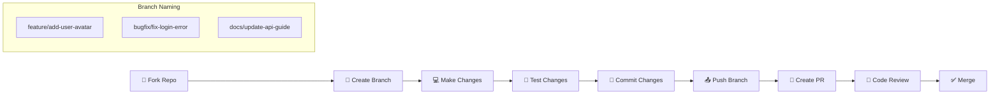

# Contributing to GoGoTime

> [!SUMMARY] **Welcome Contributors! 🎉**
> Thank you for your interest in contributing to GoGoTime! This guide provides everything you need to know to contribute effectively to our project.

## 📋 Table of Contents

- [[#🚀 Getting Started|Getting Started]]
- [[#🏗️ Development Workflow|Development Workflow]]
- [[#📝 Code Guidelines|Code Guidelines]]
- [[#🧪 Testing Requirements|Testing Requirements]]
- [[#📤 Submitting Changes|Submitting Changes]]
- [[#👥 Community Guidelines|Community Guidelines]]

---

## 🚀 Getting Started

### 🎯 Ways to Contribute

We welcome all types of contributions:

| Contribution Type | Description | Getting Started |
|-------------------|-------------|----------------|
| 🐛 **Bug Reports** | Report issues and bugs | [[#🐛 Reporting Bugs]] |
| ✨ **Feature Requests** | Suggest new features | [[#💡 Feature Requests]] |
| 💻 **Code Contributions** | Fix bugs, add features | [[#💻 Code Contributions]] |
| 📚 **Documentation** | Improve docs | [[#📚 Documentation]] |
| 🎨 **Design** | UI/UX improvements | [[#🎨 Design Contributions]] |
| 🧪 **Testing** | Add or improve tests | [[#🧪 Testing Contributions]] |

### 📋 Prerequisites

Before contributing, ensure you have:

1. **📖 Read Documentation**: Familiarize yourself with the project
2. **🛠️ Development Environment**: Set up local development
3. **📜 Code of Conduct**: Understand our community standards
4. **🔍 Issue Check**: Search existing issues before creating new ones

**Essential Setup:**
```bash
# 1. Fork and clone the repository
git clone <your-fork-url>
cd T-DEV-700-project-NCY_8

# 2. Set up development environment
cd App.Infra
docker compose up --build

# 3. Verify setup
curl http://localhost:4000/api/users/testme
curl http://localhost:3000
```

---

## 🏗️ Development Workflow

### 🌿 Git Workflow

We follow a **feature branch workflow** with **conventional commits**:



### 🔄 Step-by-Step Process

#### 1️⃣ Create Feature Branch

```bash
# Always start from main
git checkout main
git pull origin main

# Create feature branch
git checkout -b feature/your-feature-name

# Examples:
# git checkout -b feature/add-time-tracking
# git checkout -b bugfix/fix-auth-redirect
# git checkout -b docs/improve-setup-guide
```

#### 2️⃣ Make Your Changes

```bash
# Make your code changes
# Follow our coding standards (see below)
# Add tests for new functionality
# Update documentation if needed
```

#### 3️⃣ Test Your Changes

```bash
# Run all tests
cd App.Web && yarn test
cd App.API && yarn test

# Run linting
cd App.Web && yarn lint
cd App.API && yarn lint

# Type checking
cd App.Web && yarn typecheck

# Manual testing
# Test your changes thoroughly in the browser
```

#### 4️⃣ Commit Your Changes

We use **Conventional Commits** for clear, searchable history:

```bash
# Commit format: <type>(<scope>): <description>

git add .
git commit -m "feat(auth): add password reset functionality"

# Common types:
# feat: new feature
# fix: bug fix
# docs: documentation changes
# style: code style changes (formatting)
# refactor: code refactoring
# test: adding tests
# chore: maintenance tasks
```

**Commit Examples:**
```bash
# Features
git commit -m "feat(dashboard): add time tracking widgets"
git commit -m "feat(api): implement user role management"

# Bug fixes
git commit -m "fix(auth): resolve login redirect issue"
git commit -m "fix(ui): correct button alignment on mobile"

# Documentation
git commit -m "docs(setup): update Docker installation guide"
git commit -m "docs(api): add authentication examples"

# Breaking changes
git commit -m "feat(api)!: change user endpoint response format"
```

#### 5️⃣ Push and Create PR

```bash
# Push your branch
git push origin feature/your-feature-name

# Create Pull Request on GitHub
# Use our PR template
# Link related issues
# Add screenshots for UI changes
```

---

## 📝 Code Guidelines

### 🏗️ Architecture Principles

1. **🧩 Component Composition**: Build reusable, composable components
2. **📊 State Management**: Use Redux for global state, local state for component-specific data
3. **🏷️ Type Safety**: Maintain strict TypeScript usage
4. **🧪 Test Coverage**: Write tests for all new functionality
5. **♿ Accessibility**: Follow WCAG guidelines for inclusive design

### ⚛️ Frontend Standards

**Component Structure:**
```typescript
// Good: Functional component with TypeScript
import { useState, useEffect } from 'react'
import { Button, Box } from '@mui/material'
import type { User } from '@/types'

interface UserProfileProps {
  user: User
  onUpdate: (user: User) => void
}

export default function UserProfile({ user, onUpdate }: UserProfileProps) {
  const [isEditing, setIsEditing] = useState(false)

  // Component logic here

  return (
    <Box data-testid="user-profile">
      {/* Component JSX */}
    </Box>
  )
}
```

**Hooks Usage:**
```typescript
// Custom hook example
export function useAuth() {
  const [user, setUser] = useState<User | null>(null)
  const [loading, setLoading] = useState(true)

  useEffect(() => {
    // Authentication logic
  }, [])

  return { user, loading, login, logout }
}
```

**State Management:**
```typescript
// Redux slice example
import { createSlice, PayloadAction } from '@reduxjs/toolkit'

interface AuthState {
  user: User | null
  isAuthenticated: boolean
}

const authSlice = createSlice({
  name: 'auth',
  initialState,
  reducers: {
    setUser: (state, action: PayloadAction<User>) => {
      state.user = action.payload
      state.isAuthenticated = true
    },
    clearUser: (state) => {
      state.user = null
      state.isAuthenticated = false
    }
  }
})
```

### 🔧 Backend Standards

**Controller Pattern:**
```typescript
// Good: Async/await with proper error handling
export const createUser = async (req: Request, res: Response) => {
  try {
    // Validate input
    const { error, value } = userSchema.validate(req.body)
    if (error) {
      return res.status(422).json({
        success: false,
        msg: 'Validation error',
        errors: error.details
      })
    }

    // Business logic
    const user = await userService.createUser(value)

    res.json({
      success: true,
      data: user,
      msg: 'User created successfully'
    })
  } catch (error) {
    console.error('Create user error:', error)
    res.status(500).json({
      success: false,
      msg: 'Internal server error'
    })
  }
}
```

**Database Operations:**
```typescript
// Good: Using TypeORM with proper error handling
export class UserService {
  async createUser(userData: CreateUserDto): Promise<User> {
    const userRepository = AppDataSource.getRepository(User)
    
    // Check if user exists
    const existingUser = await userRepository.findOne({ 
      where: { email: userData.email } 
    })
    
    if (existingUser) {
      throw new Error('Email already exists')
    }

    // Hash password
    const hashedPassword = await bcrypt.hash(userData.password, 12)

    // Create user
    const user = userRepository.create({
      ...userData,
      password: hashedPassword
    })

    return await userRepository.save(user)
  }
}
```

### 🎨 Styling Guidelines

**Material-UI Theming:**
```typescript
// Good: Using theme values and responsive design
const useStyles = () => ({
  container: {
    padding: theme.spacing(2),
    backgroundColor: theme.palette.background.paper,
    borderRadius: theme.shape.borderRadius,
    [theme.breakpoints.up('md')]: {
      padding: theme.spacing(3)
    }
  },
  button: {
    margin: theme.spacing(1),
    '&:hover': {
      backgroundColor: theme.palette.primary.dark
    }
  }
})
```

---

## 🧪 Testing Requirements

### ✅ Testing Standards

**All contributions must include:**

1. **🧪 Unit Tests**: For new functions and components
2. **🔗 Integration Tests**: For API endpoints
3. **♿ Accessibility Tests**: For UI components
4. **📊 Coverage**: Maintain >85% coverage for new code

**Frontend Testing:**
```typescript
// Component test example
import { render, screen, fireEvent } from '@testing-library/react'
import { Provider } from 'react-redux'
import { store } from '@/lib/store'
import UserProfile from '../UserProfile'

describe('UserProfile', () => {
  const mockUser = {
    id: '1',
    name: 'John Doe',
    email: 'john@example.com'
  }

  it('renders user information', () => {
    render(
      <Provider store={store}>
        <UserProfile user={mockUser} onUpdate={vi.fn()} />
      </Provider>
    )

    expect(screen.getByText('John Doe')).toBeInTheDocument()
    expect(screen.getByText('john@example.com')).toBeInTheDocument()
  })

  it('handles edit mode toggle', () => {
    const onUpdate = vi.fn()
    render(
      <Provider store={store}>
        <UserProfile user={mockUser} onUpdate={onUpdate} />
      </Provider>
    )

    fireEvent.click(screen.getByText('Edit'))
    expect(screen.getByRole('textbox')).toBeInTheDocument()
  })
})
```

**Backend Testing:**
```typescript
// API test example
describe('POST /api/users', () => {
  it('creates user successfully', async () => {
    const userData = {
      username: 'testuser',
      email: 'test@example.com',
      password: 'Test123!@#'
    }

    const response = await request(app)
      .post('/api/users/register')
      .send(userData)
      .expect(200)

    expect(response.body.success).toBe(true)
    expect(response.body.userID).toBeDefined()
  })
})
```

### 🏃 Running Tests

```bash
# Frontend tests
cd App.Web
yarn test              # Run all tests
yarn test:watch        # Watch mode
yarn test:coverage     # Coverage report

# Backend tests
cd App.API
yarn test              # Run all tests
yarn test:watch        # Watch mode
yarn test:coverage     # Coverage report

# E2E tests (if applicable)
yarn test:e2e
```

---

## 📤 Submitting Changes

### 📋 Pull Request Guidelines

**PR Checklist:**
- [ ] **🌿 Branch**: Created from latest main
- [ ] **📝 Title**: Clear, descriptive title
- [ ] **📄 Description**: Detailed description of changes
- [ ] **🧪 Tests**: All tests pass, new tests added
- [ ] **📚 Documentation**: Updated if needed
- [ ] **🔗 Links**: References relevant issues
- [ ] **📸 Screenshots**: For UI changes
- [ ] **🏷️ Labels**: Appropriate labels applied

**PR Template:**
```markdown
## 📝 Description
Brief description of changes and motivation.

## 🔗 Related Issues
Fixes #123
Relates to #456

## 🧪 Testing
- [ ] Unit tests pass
- [ ] Integration tests pass
- [ ] Manual testing completed

## 📸 Screenshots (if applicable)
Before/after screenshots for UI changes

## 📋 Checklist
- [ ] Code follows project conventions
- [ ] Tests have been added/updated
- [ ] Documentation has been updated
- [ ] No breaking changes (or documented)
```

### 👀 Code Review Process

**Review Criteria:**
1. **🏗️ Architecture**: Follows project patterns
2. **🧪 Quality**: Well-tested and maintainable
3. **📊 Performance**: No negative performance impact
4. **♿ Accessibility**: Meets accessibility standards
5. **🔒 Security**: No security vulnerabilities

**Review Timeline:**
- **🟢 Small PRs** (< 100 lines): 24-48 hours
- **🟡 Medium PRs** (100-500 lines): 2-3 days
- **🔴 Large PRs** (> 500 lines): 3-5 days

---

## 👥 Community Guidelines

### 🤝 Code of Conduct

We are committed to providing a welcoming and inclusive environment:

1. **🫱 Respect**: Treat everyone with respect and kindness
2. **🌍 Inclusivity**: Welcome people of all backgrounds
3. **🗣️ Communication**: Communicate clearly and constructively
4. **🎯 Focus**: Keep discussions relevant and productive
5. **📚 Learning**: Help others learn and grow

### 🐛 Reporting Bugs

**Before Reporting:**
1. Check existing issues
2. Try latest version
3. Verify it's not user error

**Bug Report Template:**
```markdown
## 🐛 Bug Description
Clear description of the bug

## 🔄 Steps to Reproduce
1. Go to '...'
2. Click on '...'
3. Scroll down to '...'
4. See error

## ✅ Expected Behavior
What should happen

## 📸 Screenshots
If applicable

## 🖥️ Environment
- OS: [e.g. Windows 10]
- Browser: [e.g. Chrome 95]
- Node.js: [e.g. 18.15.0]
- Version: [e.g. 1.2.3]
```

### 💡 Feature Requests

**Feature Request Template:**
```markdown
## 🎯 Feature Description
Clear description of the proposed feature

## 💭 Motivation
Why is this feature needed?

## 📋 Acceptance Criteria
- [ ] Criterion 1
- [ ] Criterion 2
- [ ] Criterion 3

## 🎨 Design Ideas
Mockups, wireframes, or design ideas

## 🔗 Related Issues
Links to related issues or discussions
```

### ❓ Getting Help

**Where to Get Help:**

| Question Type | Where to Ask |
|---------------|--------------|
| 🐛 **Bug Reports** | [GitHub Issues](https://github.com/your-org/gogotime/issues) |
| 💡 **Feature Ideas** | [GitHub Discussions](https://github.com/your-org/gogotime/discussions) |
| ❓ **Usage Questions** | [GitHub Discussions](https://github.com/your-org/gogotime/discussions) |
| 🔒 **Security Issues** | security@yourdomain.com |
| 💬 **Chat** | [Discord Server](https://discord.gg/your-server) |

---

## 🎉 Recognition

### 🏆 Contributors

We recognize all types of contributions in our README and release notes:

- **🥇 Core Contributors**: Regular contributors to codebase
- **🥈 Community Contributors**: Bug reports, feature requests, discussions  
- **🥉 Documentation Contributors**: Improve docs and guides
- **🎨 Design Contributors**: UI/UX improvements
- **🧪 Quality Contributors**: Testing and quality improvements

### 📈 Contribution Metrics

Track your impact:
- **📊 Code**: Lines contributed, PRs merged
- **🐛 Issues**: Bugs reported and fixed  
- **👥 Community**: Discussions participated, help provided
- **📚 Documentation**: Docs improved and added

---

## 📚 Resources

### 📖 Essential Reading

- [[ARCHITECTURE]] - System design and patterns
- [[DEVELOPMENT_SETUP]] - Local development setup
- [[TESTING_STRATEGY]] - Testing guidelines and tools
- [[SECURITY_MEASURES]] - Security best practices
- [[API_SPECIFICATION]] - API documentation

### 🛠️ Development Tools

| Tool | Purpose | Documentation |
|------|---------|---------------|
| **TypeScript** | Type safety | [typescriptlang.org](https://typescriptlang.org) |
| **React** | Frontend framework | [react.dev](https://react.dev) |
| **Material-UI** | UI components | [mui.com](https://mui.com) |
| **Express.js** | Backend framework | [expressjs.com](https://expressjs.com) |
| **TypeORM** | Database ORM | [typeorm.io](https://typeorm.io) |

---

## 🏷️ Tags

#contributing #development #workflow #guidelines #community #open-source

**Related Documentation:**
- [[DEVELOPMENT_SETUP]] - Local development environment
- [[CODE_QUALITY]] - Quality standards and tools  
- [[TESTING_STRATEGY]] - Testing requirements
- [[SECURITY_MEASURES]] - Security guidelines

---

> [!SUCCESS] **Thank You! 🙏**
> Your contributions make GoGoTime better for everyone. We appreciate your time, effort, and expertise in helping us build something amazing together!

> [!NOTE] **Document Maintenance**
> **Last Updated:** {date}  
> **Version:** 1.0.0  
> **Maintainers:** Community Team (Lazaro, Alexy, Massi, Lounis)

**Questions?** Reach out to us at contribute@yourdomain.com
