# GoGoTime Dashboard Features

> [!SUMMARY] **Interactive Dashboard System**
> Comprehensive dashboard interface providing real-time analytics, customizable widgets, project overviews, and productivity insights for effective time management and project tracking.

## 📋 Table of Contents

- [[#📊 Dashboard Overview|Dashboard Overview]]
- [[#🎛️ Widget System|Widget System]]
- [[#📈 Analytics & Reporting|Analytics & Reporting]]
- [[#⚙️ Customization Options|Customization Options]]
- [[#📱 Responsive Design|Responsive Design]]
- [[#🔄 Real-time Updates|Real-time Updates]]

---

## 📊 Dashboard Overview

### 🎯 Dashboard Architecture

```mermaid
graph TB
    subgraph "Dashboard Layout"
        subgraph "Header"
            NAV[🧭 Navigation<br/>Menu & breadcrumbs<br/>User profile]
            SEARCH[🔍 Global Search<br/>Quick actions<br/>Notifications]
        end
        
        subgraph "Main Content"
            WIDGETS[📊 Widget Grid<br/>Customizable layout<br/>Drag & drop]
            SIDEBAR[📋 Sidebar<br/>Quick actions<br/>Mini widgets]
        end
        
        subgraph "Footer"
            STATUS[⚡ Status Bar<br/>System health<br/>Connection status]
        end
    end
    
    NAV --> WIDGETS
    SEARCH --> WIDGETS
    WIDGETS --> SIDEBAR
    WIDGETS --> STATUS
```



### 🏗️ Core Dashboard Components

**Main Dashboard Layout:**
```typescript
// App.Web/src/features/dashboard/DashboardDefault.tsx
import React, { useState, useEffect } from 'react'
import { Grid, Box, Typography, Fab } from '@mui/material'
import { Add as AddIcon, Settings as SettingsIcon } from '@mui/icons-material'
import { DragDropContext, Droppable, Draggable } from 'react-beautiful-dnd'

import { WidgetGrid } from './components/WidgetGrid'
import { DashboardHeader } from './components/DashboardHeader'
import { QuickActions } from './components/QuickActions'
import { useDashboard } from './hooks/useDashboard'

interface DashboardLayout {
  id: string
  type: string
  position: { x: number; y: number }
  size: { width: number; height: number }
  config: Record<string, any>
}

export function DashboardDefault() {
  const {
    widgets,
    layout,
    isLoading,
    updateLayout,
    addWidget,
    removeWidget,
    updateWidgetConfig
  } = useDashboard()

  const [isCustomizing, setIsCustomizing] = useState(false)

  const handleDragEnd = (result: any) => {
    if (!result.destination) return

    const newLayout = Array.from(layout)
    const [reorderedItem] = newLayout.splice(result.source.index, 1)
    newLayout.splice(result.destination.index, 0, reorderedItem)

    updateLayout(newLayout)
  }

  if (isLoading) {
    return <DashboardSkeleton />
  }

  return (
    <Box sx={{ flexGrow: 1, p: 3 }}>
      <DashboardHeader 
        onCustomizeToggle={() => setIsCustomizing(!isCustomizing)}
        isCustomizing={isCustomizing}
      />

      <DragDropContext onDragEnd={handleDragEnd}>
        <Droppable droppableId="dashboard-widgets">
          {(provided) => (
            <Grid 
              container 
              spacing={3}
              {...provided.droppableProps}
              ref={provided.innerRef}
            >
              {layout.map((widget, index) => (
                <Draggable 
                  key={widget.id} 
                  draggableId={widget.id} 
                  index={index}
                  isDragDisabled={!isCustomizing}
                >
                  {(provided, snapshot) => (
                    <Grid
                      item
                      xs={widget.size.width}
                      md={widget.size.width}
                      ref={provided.innerRef}
                      {...provided.draggableProps}
                      {...provided.dragHandleProps}
                      sx={{
                        opacity: snapshot.isDragging ? 0.8 : 1,
                        transform: snapshot.isDragging ? 'rotate(5deg)' : 'none'
                      }}
                    >
                      <WidgetRenderer
                        widget={widget}
                        isCustomizing={isCustomizing}
                        onRemove={() => removeWidget(widget.id)}
                        onConfigChange={(config) => updateWidgetConfig(widget.id, config)}
                      />
                    </Grid>
                  )}
                </Draggable>
              ))}
              {provided.placeholder}
            </Grid>
          )}
        </Droppable>
      </DragDropContext>

      <QuickActions />

      {isCustomizing && (
        <Fab
          color="primary"
          sx={{ position: 'fixed', bottom: 16, right: 16 }}
          onClick={() => setIsCustomizing(false)}
        >
          <SettingsIcon />
        </Fab>
      )}
    </Box>
  )
}
```

---

## 🎛️ Widget System

### 📊 Available Widgets

```typescript
// App.Web/src/features/dashboard/widgets/types.ts
export interface Widget {
  id: string
  type: WidgetType
  title: string
  size: { width: number; height: number }
  config: WidgetConfig
  refreshInterval?: number
}

export type WidgetType = 
  | 'time-tracker'
  | 'project-summary'
  | 'productivity-chart'
  | 'recent-activities'
  | 'team-status'
  | 'goal-progress'
  | 'calendar-events'
  | 'system-metrics'

export interface WidgetConfig {
  title?: string
  showHeader?: boolean
  autoRefresh?: boolean
  chartType?: 'line' | 'bar' | 'pie' | 'doughnut'
  timeRange?: '7d' | '30d' | '90d' | '1y'
  filters?: Record<string, any>
}
```

**Widget Registry:**
```typescript
// App.Web/src/features/dashboard/widgets/registry.ts
import { TimeTrackerWidget } from './TimeTrackerWidget'
import { ProjectSummaryWidget } from './ProjectSummaryWidget'
import { ProductivityChartWidget } from './ProductivityChartWidget'
import { RecentActivitiesWidget } from './RecentActivitiesWidget'
import { TeamStatusWidget } from './TeamStatusWidget'
import { GoalProgressWidget } from './GoalProgressWidget'
import { CalendarEventsWidget } from './CalendarEventsWidget'
import { SystemMetricsWidget } from './SystemMetricsWidget'

export const WIDGET_REGISTRY = {
  'time-tracker': {
    component: TimeTrackerWidget,
    name: 'Time Tracker',
    description: 'Start, stop, and track time for projects',
    category: 'productivity',
    defaultSize: { width: 6, height: 4 },
    icon: 'timer',
    configurable: true
  },
  
  'project-summary': {
    component: ProjectSummaryWidget,
    name: 'Project Summary',
    description: 'Overview of active projects and progress',
    category: 'projects',
    defaultSize: { width: 6, height: 6 },
    icon: 'folder',
    configurable: true
  },
  
  'productivity-chart': {
    component: ProductivityChartWidget,
    name: 'Productivity Chart',
    description: 'Visual representation of productivity metrics',
    category: 'analytics',
    defaultSize: { width: 12, height: 6 },
    icon: 'bar_chart',
    configurable: true
  },
  
  'recent-activities': {
    component: RecentActivitiesWidget,
    name: 'Recent Activities',
    description: 'Latest time entries and project updates',
    category: 'activity',
    defaultSize: { width: 4, height: 8 },
    icon: 'history',
    configurable: false
  },
  
  'team-status': {
    component: TeamStatusWidget,
    name: 'Team Status',
    description: 'Current status of team members',
    category: 'team',
    defaultSize: { width: 4, height: 6 },
    icon: 'group',
    configurable: true
  },
  
  'goal-progress': {
    component: GoalProgressWidget,
    name: 'Goal Progress',
    description: 'Progress towards personal and team goals',
    category: 'goals',
    defaultSize: { width: 6, height: 4 },
    icon: 'flag',
    configurable: true
  },
  
  'calendar-events': {
    component: CalendarEventsWidget,
    name: 'Calendar Events',
    description: 'Upcoming meetings and deadlines',
    category: 'calendar',
    defaultSize: { width: 6, height: 6 },
    icon: 'event',
    configurable: true
  },
  
  'system-metrics': {
    component: SystemMetricsWidget,
    name: 'System Metrics',
    description: 'Application performance and usage stats',
    category: 'system',
    defaultSize: { width: 8, height: 4 },
    icon: 'speed',
    configurable: true
  }
}

export const getWidgetDefinition = (type: string) => {
  return WIDGET_REGISTRY[type]
}

export const getWidgetsByCategory = (category: string) => {
  return Object.entries(WIDGET_REGISTRY)
    .filter(([_, def]) => def.category === category)
    .map(([type, def]) => ({ type, ...def }))
}
```

### ⏱️ Time Tracker Widget

```typescript
// App.Web/src/features/dashboard/widgets/TimeTrackerWidget.tsx
import React, { useState, useEffect } from 'react'
import {
  Card,
  CardHeader,
  CardContent,
  Button,
  Typography,
  Select,
  MenuItem,
  FormControl,
  InputLabel,
  Chip,
  Box,
  IconButton
} from '@mui/material'
import {
  PlayArrow,
  Stop,
  Pause,
  Edit as EditIcon
} from '@mui/icons-material'

import { useTimeTracker } from '../hooks/useTimeTracker'
import { formatDuration } from '../utils/timeUtils'

export function TimeTrackerWidget({ config, onConfigChange }) {
  const {
    currentSession,
    projects,
    isTracking,
    startTracking,
    stopTracking,
    pauseTracking
  } = useTimeTracker()

  const [selectedProject, setSelectedProject] = useState('')
  const [description, setDescription] = useState('')

  const handleStart = () => {
    if (selectedProject) {
      startTracking({
        projectId: selectedProject,
        description: description || 'Working on project'
      })
    }
  }

  const handleStop = () => {
    stopTracking()
    setDescription('')
  }

  return (
    <Card sx={{ height: '100%' }}>
      <CardHeader
        title="Time Tracker"
        action={
          <IconButton onClick={() => onConfigChange?.({ ...config, showSettings: true })}>
            <EditIcon />
          </IconButton>
        }
      />
      
      <CardContent>
        {!isTracking ? (
          <Box sx={{ display: 'flex', flexDirection: 'column', gap: 2 }}>
            <FormControl fullWidth>
              <InputLabel>Select Project</InputLabel>
              <Select
                value={selectedProject}
                onChange={(e) => setSelectedProject(e.target.value)}
                label="Select Project"
              >
                {projects.map((project) => (
                  <MenuItem key={project.id} value={project.id}>
                    {project.name}
                  </MenuItem>
                ))}
              </Select>
            </FormControl>

            <TextField
              fullWidth
              label="Description (optional)"
              value={description}
              onChange={(e) => setDescription(e.target.value)}
              placeholder="What are you working on?"
            />

            <Button
              fullWidth
              variant="contained"
              color="primary"
              size="large"
              startIcon={<PlayArrow />}
              onClick={handleStart}
              disabled={!selectedProject}
            >
              Start Tracking
            </Button>
          </Box>
        ) : (
          <Box sx={{ display: 'flex', flexDirection: 'column', gap: 2, alignItems: 'center' }}>
            <Chip
              label={currentSession?.project?.name}
              color="primary"
              variant="outlined"
            />
            
            <Typography variant="h3" component="div" align="center">
              {formatDuration(currentSession?.duration || 0)}
            </Typography>
            
            <Typography variant="body2" color="text.secondary" align="center">
              {currentSession?.description}
            </Typography>

            <Box sx={{ display: 'flex', gap: 1 }}>
              <Button
                variant="outlined"
                startIcon={<Pause />}
                onClick={pauseTracking}
              >
                Pause
              </Button>
              
              <Button
                variant="contained"
                color="error"
                startIcon={<Stop />}
                onClick={handleStop}
              >
                Stop
              </Button>
            </Box>
          </Box>
        )}
      </CardContent>
    </Card>
  )
}
```

---

## 📈 Analytics & Reporting

### 📊 Productivity Chart Widget

```typescript
// App.Web/src/features/dashboard/widgets/ProductivityChartWidget.tsx
import React, { useState, useEffect } from 'react'
import {
  Card,
  CardHeader,
  CardContent,
  FormControl,
  Select,
  MenuItem,
  Box,
  Typography,
  Skeleton
} from '@mui/material'
import {
  LineChart,
  Line,
  BarChart,
  Bar,
  XAxis,
  YAxis,
  CartesianGrid,
  Tooltip,
  Legend,
  ResponsiveContainer
} from 'recharts'

import { useProductivityData } from '../hooks/useProductivityData'

export function ProductivityChartWidget({ config, onConfigChange }) {
  const [timeRange, setTimeRange] = useState(config?.timeRange || '30d')
  const [chartType, setChartType] = useState(config?.chartType || 'line')
  
  const { data, isLoading, error } = useProductivityData(timeRange)

  useEffect(() => {
    if (onConfigChange) {
      onConfigChange({ ...config, timeRange, chartType })
    }
  }, [timeRange, chartType])

  const renderChart = () => {
    if (isLoading) {
      return <Skeleton variant="rectangular" height={300} />
    }

    if (error || !data) {
      return (
        <Box sx={{ height: 300, display: 'flex', alignItems: 'center', justifyContent: 'center' }}>
          <Typography color="error">Failed to load productivity data</Typography>
        </Box>
      )
    }

    const ChartComponent = chartType === 'bar' ? BarChart : LineChart
    const DataComponent = chartType === 'bar' ? Bar : Line

    return (
      <ResponsiveContainer width="100%" height={300}>
        <ChartComponent data={data}>
          <CartesianGrid strokeDasharray="3 3" />
          <XAxis dataKey="date" />
          <YAxis />
          <Tooltip 
            formatter={(value, name) => [`${value}h`, name]}
            labelFormatter={(label) => `Date: ${label}`}
          />
          <Legend />
          <DataComponent
            type="monotone"
            dataKey="hoursWorked"
            stroke="#8884d8"
            fill="#8884d8"
            name="Hours Worked"
            strokeWidth={2}
          />
          <DataComponent
            type="monotone"
            dataKey="productivity"
            stroke="#82ca9d"
            fill="#82ca9d"
            name="Productivity Score"
            strokeWidth={2}
          />
        </ChartComponent>
      </ResponsiveContainer>
    )
  }

  return (
    <Card sx={{ height: '100%' }}>
      <CardHeader
        title="Productivity Overview"
        action={
          <Box sx={{ display: 'flex', gap: 1 }}>
            <FormControl size="small" sx={{ minWidth: 80 }}>
              <Select
                value={timeRange}
                onChange={(e) => setTimeRange(e.target.value)}
              >
                <MenuItem value="7d">7 Days</MenuItem>
                <MenuItem value="30d">30 Days</MenuItem>
                <MenuItem value="90d">90 Days</MenuItem>
                <MenuItem value="1y">1 Year</MenuItem>
              </Select>
            </FormControl>
            
            <FormControl size="small" sx={{ minWidth: 80 }}>
              <Select
                value={chartType}
                onChange={(e) => setChartType(e.target.value)}
              >
                <MenuItem value="line">Line</MenuItem>
                <MenuItem value="bar">Bar</MenuItem>
              </Select>
            </FormControl>
          </Box>
        }
      />
      
      <CardContent>
        {renderChart()}
        
        {data && (
          <Box sx={{ mt: 2, display: 'flex', justifyContent: 'space-around' }}>
            <Box sx={{ textAlign: 'center' }}>
              <Typography variant="h6">
                {data.reduce((sum, day) => sum + day.hoursWorked, 0).toFixed(1)}h
              </Typography>
              <Typography variant="caption" color="text.secondary">
                Total Hours
              </Typography>
            </Box>
            
            <Box sx={{ textAlign: 'center' }}>
              <Typography variant="h6">
                {(data.reduce((sum, day) => sum + day.productivity, 0) / data.length).toFixed(1)}
              </Typography>
              <Typography variant="caption" color="text.secondary">
                Avg Productivity
              </Typography>
            </Box>
            
            <Box sx={{ textAlign: 'center' }}>
              <Typography variant="h6">
                {data.length}
              </Typography>
              <Typography variant="caption" color="text.secondary">
                Active Days
              </Typography>
            </Box>
          </Box>
        )}
      </CardContent>
    </Card>
  )
}
```

---

## ⚙️ Customization Options

### 🎨 Dashboard Customization

```typescript
// App.Web/src/features/dashboard/components/DashboardCustomizer.tsx
import React, { useState } from 'react'
import {
  Dialog,
  DialogTitle,
  DialogContent,
  DialogActions,
  Button,
  Grid,
  Card,
  CardContent,
  Typography,
  IconButton,
  Box,
  Tabs,
  Tab,
  Switch,
  FormControlLabel
} from '@mui/material'
import { Add as AddIcon, Close as CloseIcon } from '@mui/icons-material'

import { WIDGET_REGISTRY } from '../widgets/registry'
import { WidgetPreview } from './WidgetPreview'

interface DashboardCustomizerProps {
  open: boolean
  onClose: () => void
  onAddWidget: (widgetType: string, config: any) => void
  currentWidgets: string[]
}

export function DashboardCustomizer({ 
  open, 
  onClose, 
  onAddWidget, 
  currentWidgets 
}: DashboardCustomizerProps) {
  const [selectedTab, setSelectedTab] = useState(0)
  const [showPreview, setShowPreview] = useState(false)

  const categories = ['all', 'productivity', 'projects', 'analytics', 'team', 'system']
  
  const getFilteredWidgets = (category: string) => {
    return Object.entries(WIDGET_REGISTRY).filter(([type, def]) => 
      category === 'all' || def.category === category
    )
  }

  const handleAddWidget = (widgetType: string) => {
    const widgetDef = WIDGET_REGISTRY[widgetType]
    onAddWidget(widgetType, {
      title: widgetDef.name,
      size: widgetDef.defaultSize,
      autoRefresh: true
    })
  }

  return (
    <Dialog
      open={open}
      onClose={onClose}
      maxWidth="lg"
      fullWidth
      PaperProps={{ sx: { height: '80vh' } }}
    >
      <DialogTitle>
        <Box sx={{ display: 'flex', justifyContent: 'space-between', alignItems: 'center' }}>
          <Typography variant="h6">Customize Dashboard</Typography>
          <Box sx={{ display: 'flex', alignItems: 'center', gap: 2 }}>
            <FormControlLabel
              control={
                <Switch
                  checked={showPreview}
                  onChange={(e) => setShowPreview(e.target.checked)}
                />
              }
              label="Show Preview"
            />
            <IconButton onClick={onClose}>
              <CloseIcon />
            </IconButton>
          </Box>
        </Box>
      </DialogTitle>

      <DialogContent>
        <Tabs
          value={selectedTab}
          onChange={(_, newValue) => setSelectedTab(newValue)}
          sx={{ borderBottom: 1, borderColor: 'divider', mb: 2 }}
        >
          {categories.map((category, index) => (
            <Tab 
              key={category} 
              label={category.charAt(0).toUpperCase() + category.slice(1)} 
            />
          ))}
        </Tabs>

        <Grid container spacing={2}>
          {getFilteredWidgets(categories[selectedTab]).map(([type, def]) => {
            const isAdded = currentWidgets.includes(type)
            
            return (
              <Grid item xs={12} sm={6} md={4} key={type}>
                <Card 
                  sx={{ 
                    height: '100%',
                    opacity: isAdded ? 0.6 : 1,
                    border: isAdded ? '2px solid green' : 'none'
                  }}
                >
                  <CardContent>
                    <Box sx={{ display: 'flex', justifyContent: 'space-between', mb: 1 }}>
                      <Typography variant="h6" component="div">
                        {def.name}
                      </Typography>
                      <IconButton
                        size="small"
                        onClick={() => handleAddWidget(type)}
                        disabled={isAdded}
                        color="primary"
                      >
                        <AddIcon />
                      </IconButton>
                    </Box>
                    
                    <Typography variant="body2" color="text.secondary" sx={{ mb: 2 }}>
                      {def.description}
                    </Typography>

                    {showPreview && (
                      <Box sx={{ height: 120, border: '1px dashed #ccc', borderRadius: 1 }}>
                        <WidgetPreview type={type} />
                      </Box>
                    )}

                    <Box sx={{ mt: 1, display: 'flex', justifyContent: 'space-between' }}>
                      <Typography variant="caption" color="text.secondary">
                        Size: {def.defaultSize.width}x{def.defaultSize.height}
                      </Typography>
                      <Typography variant="caption" color="text.secondary">
                        {def.category}
                      </Typography>
                    </Box>
                  </CardContent>
                </Card>
              </Grid>
            )
          })}
        </Grid>
      </DialogContent>

      <DialogActions>
        <Button onClick={onClose}>Close</Button>
      </DialogActions>
    </Dialog>
  )
}
```

---

## 📱 Responsive Design

### 📐 Mobile Dashboard Layout

```typescript
// App.Web/src/features/dashboard/hooks/useResponsiveDashboard.ts
import { useState, useEffect } from 'react'
import { useTheme } from '@mui/material/styles'
import { useMediaQuery } from '@mui/material'

interface ResponsiveLayout {
  cols: number
  rowHeight: number
  margin: [number, number]
  containerPadding: [number, number]
}

export function useResponsiveDashboard() {
  const theme = useTheme()
  const isMobile = useMediaQuery(theme.breakpoints.down('md'))
  const isTablet = useMediaQuery(theme.breakpoints.between('md', 'lg'))
  
  const [layout, setLayout] = useState<ResponsiveLayout>({
    cols: 12,
    rowHeight: 120,
    margin: [16, 16],
    containerPadding: [16, 16]
  })

  useEffect(() => {
    if (isMobile) {
      setLayout({
        cols: 2,
        rowHeight: 100,
        margin: [8, 8],
        containerPadding: [8, 8]
      })
    } else if (isTablet) {
      setLayout({
        cols: 6,
        rowHeight: 110,
        margin: [12, 12],
        containerPadding: [12, 12]
      })
    } else {
      setLayout({
        cols: 12,
        rowHeight: 120,
        margin: [16, 16],
        containerPadding: [16, 16]
      })
    }
  }, [isMobile, isTablet])

  const adaptWidgetSize = (originalSize: { width: number; height: number }) => {
    if (isMobile) {
      return {
        width: Math.min(originalSize.width, 2),
        height: Math.max(originalSize.height - 1, 2)
      }
    }
    
    if (isTablet) {
      return {
        width: Math.min(originalSize.width, 6),
        height: originalSize.height
      }
    }
    
    return originalSize
  }

  return {
    layout,
    isMobile,
    isTablet,
    adaptWidgetSize
  }
}
```

---

## 🔄 Real-time Updates

### ⚡ WebSocket Integration

```typescript
// App.Web/src/features/dashboard/hooks/useRealtimeUpdates.ts
import { useEffect, useRef } from 'react'
import { useDispatch } from 'react-redux'
import { updateWidgetData } from '../store/dashboardSlice'

interface RealtimeMessage {
  type: 'widget_update' | 'user_activity' | 'system_status'
  payload: any
  timestamp: number
}

export function useRealtimeUpdates() {
  const dispatch = useDispatch()
  const wsRef = useRef<WebSocket | null>(null)
  const reconnectTimeoutRef = useRef<NodeJS.Timeout>()

  const connect = () => {
    const wsUrl = `${process.env.REACT_APP_WS_URL || 'ws://localhost:4000'}/dashboard`
    const token = localStorage.getItem('accessToken')
    
    wsRef.current = new WebSocket(`${wsUrl}?token=${token}`)

    wsRef.current.onopen = () => {
      console.log('Dashboard WebSocket connected')
      // Clear any existing reconnect timeout
      if (reconnectTimeoutRef.current) {
        clearTimeout(reconnectTimeoutRef.current)
      }
    }

    wsRef.current.onmessage = (event) => {
      try {
        const message: RealtimeMessage = JSON.parse(event.data)
        handleRealtimeMessage(message)
      } catch (error) {
        console.error('Failed to parse WebSocket message:', error)
      }
    }

    wsRef.current.onclose = () => {
      console.log('Dashboard WebSocket disconnected')
      // Attempt to reconnect after 5 seconds
      reconnectTimeoutRef.current = setTimeout(connect, 5000)
    }

    wsRef.current.onerror = (error) => {
      console.error('Dashboard WebSocket error:', error)
    }
  }

  const handleRealtimeMessage = (message: RealtimeMessage) => {
    switch (message.type) {
      case 'widget_update':
        dispatch(updateWidgetData({
          widgetId: message.payload.widgetId,
          data: message.payload.data
        }))
        break
        
      case 'user_activity':
        // Handle user activity updates
        break
        
      case 'system_status':
        // Handle system status updates
        break
        
      default:
        console.warn('Unknown realtime message type:', message.type)
    }
  }

  useEffect(() => {
    connect()

    return () => {
      if (wsRef.current) {
        wsRef.current.close()
      }
      if (reconnectTimeoutRef.current) {
        clearTimeout(reconnectTimeoutRef.current)
      }
    }
  }, [])

  const sendMessage = (message: any) => {
    if (wsRef.current && wsRef.current.readyState === WebSocket.OPEN) {
      wsRef.current.send(JSON.stringify(message))
    }
  }

  return { sendMessage }
}
```

---

## 🏷️ Tags

#dashboard #widgets #analytics #customization #responsive #realtime #productivity

**Related Documentation:**
- [[TIME_TRACKING]] - Time tracking features and workflows
- [[USER_MANAGEMENT]] - User profile and preferences
- [[FRONTEND_ARCHITECTURE]] - React component architecture
- [[PERFORMANCE_OPTIMIZATION]] - Dashboard performance optimization

---

> [!NOTE] **Document Maintenance**
> **Last Updated:** {date}  
> **Version:** 1.0.0  
> **Maintainers:** Frontend Team (Lazaro, Alexy, Massi, Lounis)

> [!TIP] **Dashboard Best Practices**
> - Keep widgets focused on single tasks
> - Provide meaningful customization options
> - Optimize for mobile and tablet experiences
> - Use real-time updates judiciously to avoid overwhelming users
> - Implement proper loading states and error handling
> - Allow users to save and share dashboard configurations
