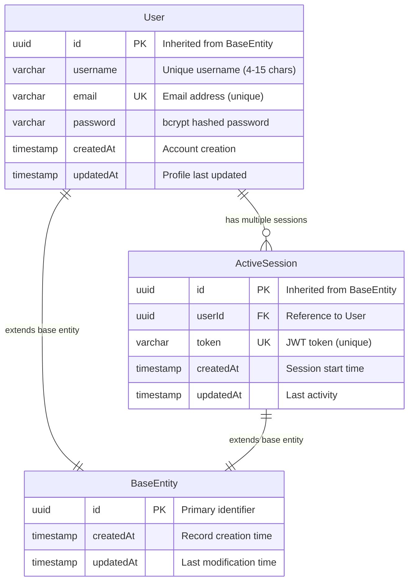
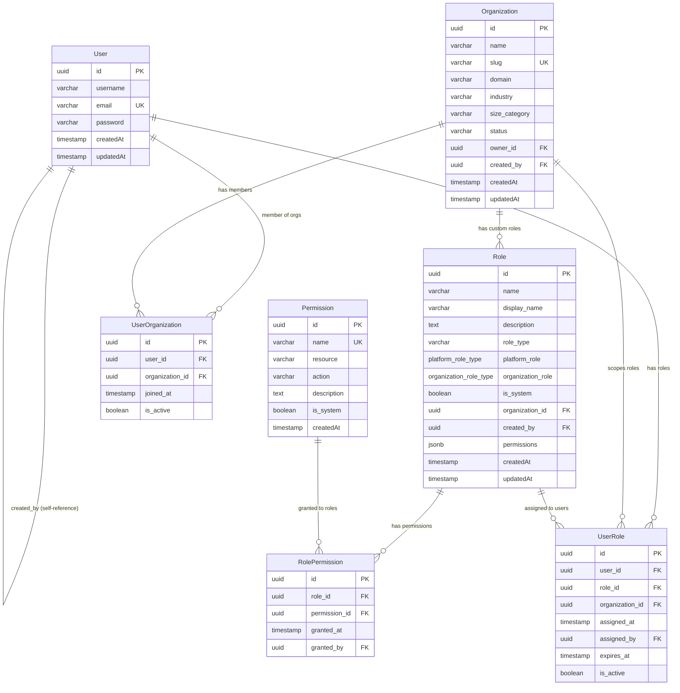
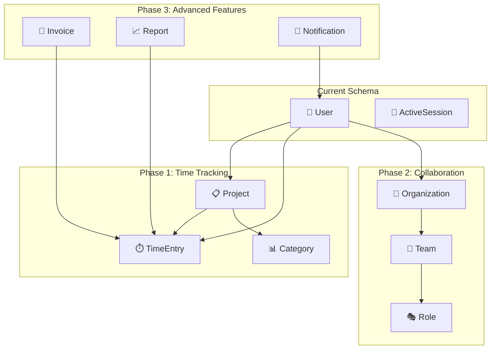

# GoGoTime Database Design

> [!SUMMARY] **Database Architecture**
> GoGoTime uses PostgreSQL with TypeORM for type-safe database operations. The schema follows normalized design principles with proper relationships, constraints, and audit capabilities.

## 📋 Table of Contents

- [[#🏗️ Schema Overview|Schema Overview]]
- [[#📊 Entity Relationships|Entity Relationships]]
- [[#🗄️ Table Specifications|Table Specifications]]
- [[#🔧 TypeORM Configuration|TypeORM Configuration]]
- [[#📈 Migrations|Migrations]]
- [[#🎯 Design Decisions|Design Decisions]]

---

## 🏗️ Schema Overview

> [!NOTE] **Database Structure**
> The current schema supports user management and authentication with a foundation for future feature expansion.



### 🎯 Core Design Principles

1. **🆔 UUID Primary Keys**: All entities use UUID for better distribution and security
2. **⏰ Automatic Timestamps**: `createdAt` and `updatedAt` managed by BaseEntity
3. **🔗 Foreign Key Constraints**: Referential integrity enforced at database level
4. **🏷️ Type Safety**: TypeORM decorators provide compile-time validation
5. **📈 Extensibility**: BaseEntity pattern allows easy schema evolution

---

## 📊 Entity Relationships

### 🏗️ BaseEntity (Abstract)

> [!NOTE] **Foundation Class**
> Abstract base class providing common fields for all entities.

```typescript
@Entity()
export abstract class BaseEntity {
  @PrimaryGeneratedColumn('uuid')
  id!: string

  @CreateDateColumn({ type: 'timestamp' })
  createdAt!: Date

  @UpdateDateColumn({ type: 'timestamp' })
  updatedAt!: Date
}
```

**Fields:**
- `id`: UUID primary key (auto-generated)
- `createdAt`: Automatic timestamp on record creation
- `updatedAt`: Automatic timestamp on record modification

### 👤 User Entity

> [!NOTE] **User Management**
> Core user entity for authentication and profile management.

```typescript
@Entity()
export class User extends BaseEntity {
  @Column({ type: 'varchar', length: 50, nullable: false })
  username!: string

  @Column({ type: 'varchar', length: 255, nullable: false, unique: true })
  email!: string

  @Column({ type: 'varchar', length: 255, nullable: false })
  password!: string
}
```

**Fields:**
- `username`: 4-50 character username (validated by Joi)
- `email`: Unique email address (validated by Joi)
- `password`: bcrypt hashed password (never returned in API responses)

**Constraints:**
- Email must be unique across all users
- Username length: 4-50 characters
- Password is hashed using bcrypt with salt rounds

### 🔐 ActiveSession Entity

> [!NOTE] **Session Tracking**
> Manages JWT token sessions for secure authentication.

```typescript
@Entity()
export class ActiveSession extends BaseEntity {
  @Column({ type: 'uuid' })
  userId!: string

  @Column({ type: 'varchar', unique: true })
  token!: string
}
```

**Fields:**
- `userId`: Foreign key reference to User.id
- `token`: JWT token string (unique constraint)

**Relationships:**
- Many-to-One with User (one user can have multiple active sessions)

---

## 🗄️ Table Specifications

### 📋 Detailed Schema

| Table | Purpose | Key Fields | Constraints |
|-------|---------|------------|-------------|
| **users** | 👤 User accounts | `id`, `username`, `email`, `password` | Email unique, Username 4-50 chars |
| **active_sessions** | 🔐 JWT sessions | `userId`, `token` | Token unique, FK to users |

### 🔍 Index Strategy

```sql
-- Automatically created by TypeORM
CREATE INDEX idx_users_email ON users(email);           -- Email lookup
CREATE INDEX idx_users_username ON users(username);     -- Username lookup
CREATE INDEX idx_sessions_user ON active_sessions(userId); -- User sessions
CREATE INDEX idx_sessions_token ON active_sessions(token); -- Token validation
```

### 📊 Sample Data Structure

```json
{
  "users": [
    {
      "id": "550e8400-e29b-41d4-a716-446655440000",
      "username": "johndoe",
      "email": "john@example.com",
      "password": "$2b$10$N9qo8uLOickgx2ZMRZoMye...",
      "createdAt": "2024-01-15T10:30:00Z",
      "updatedAt": "2024-01-15T10:30:00Z"
    }
  ],
  "active_sessions": [
    {
      "id": "660f9500-f39c-42e5-b817-557766550001",
      "userId": "550e8400-e29b-41d4-a716-446655440000",
      "token": "eyJhbGciOiJIUzI1NiIsInR5cCI6IkpXVCJ9...",
      "createdAt": "2024-01-15T10:35:00Z",
      "updatedAt": "2024-01-15T10:35:00Z"
    }
  ]
}
```

---

## 🔧 TypeORM Configuration

### 🗄️ Database Connection

```typescript
// App.API/src/server/database.ts
import { DataSource } from 'typeorm'
import User from '../models/user'
import ActiveSession from '../models/activeSession'

export const AppDataSource = new DataSource({
  type: 'postgres',
  host: process.env.DB_HOST || 'localhost',
  port: parseInt(process.env.DB_PORT || '5432'),
  username: process.env.DB_USER || 'postgres',
  password: process.env.DB_PASS || 'password',
  database: process.env.DB_NAME || 'gogotime',
  
  // Development settings
  synchronize: process.env.NODE_ENV === 'development',
  logging: process.env.NODE_ENV === 'development',
  
  // Entity configuration
  entities: [User, ActiveSession],
  migrations: ['src/migrations/*.ts'],
  
  // Connection pool settings
  extra: {
    max: 20,              // Maximum connections
    min: 5,               // Minimum connections
    idleTimeoutMillis: 30000,  // Close idle connections after 30s
  }
})
```

### ⚙️ Environment Configuration

```bash
# Database connection settings
DB_HOST=localhost
DB_PORT=5432
DB_USER=postgres
DB_PASS=password
DB_NAME=gogotime

# Security settings
SECRET=your-jwt-secret-key
BCRYPT_ROUNDS=10
JWT_EXPIRES_IN=86400  # 24 hours
```

---

## 📈 Migrations

### 🛠️ Migration Strategy

> [!NOTE] **Version Control for Database**
> TypeORM migrations ensure consistent schema changes across environments.

```typescript
// Example migration file structure
import { MigrationInterface, QueryRunner } from 'typeorm'

export class CreateUserTable1640000000000 implements MigrationInterface {
  public async up(queryRunner: QueryRunner): Promise<void> {
    await queryRunner.query(`
      CREATE EXTENSION IF NOT EXISTS "uuid-ossp";
      
      CREATE TABLE "users" (
        "id" uuid PRIMARY KEY DEFAULT uuid_generate_v4(),
        "username" varchar(50) NOT NULL,
        "email" varchar(255) NOT NULL UNIQUE,
        "password" varchar(255) NOT NULL,
        "createdAt" timestamp DEFAULT CURRENT_TIMESTAMP,
        "updatedAt" timestamp DEFAULT CURRENT_TIMESTAMP
      );
      
      CREATE INDEX "idx_users_email" ON "users" ("email");
      CREATE INDEX "idx_users_username" ON "users" ("username");
    `)
  }

  public async down(queryRunner: QueryRunner): Promise<void> {
    await queryRunner.query(`DROP TABLE "users"`)
  }
}
```

### 📋 Migration Commands

```bash
# Generate migration
npx typeorm migration:generate src/migrations/MigrationName -d src/server/database.ts

# Run migrations
npx typeorm migration:run -d src/server/database.ts

# Revert migration
npx typeorm migration:revert -d src/server/database.ts

# Show migration status
npx typeorm migration:show -d src/server/database.ts
```

---

## 🎭 Role-Based Access Control (RBAC)

### 🏗️ RBAC Schema Design

> [!NOTE] **Role System Architecture**
> GoGoTime implements a sophisticated RBAC system with platform-level and organization-level roles, supporting custom role creation by admins and CEOs.



### 🗄️ RBAC Database Schema

```sql
-- Role type enums for type safety
CREATE TYPE platform_role_type AS ENUM ('website_owner', 'website_admin');
CREATE TYPE organization_role_type AS ENUM ('ceo', 'manager', 'employee');

-- Organizations table (multi-tenancy)
CREATE TABLE organizations (
    id UUID PRIMARY KEY DEFAULT gen_random_uuid(),
    name VARCHAR(100) NOT NULL,
    slug VARCHAR(50) NOT NULL UNIQUE,
    domain VARCHAR(100), -- Optional custom domain
    
    -- Organization metadata
    industry VARCHAR(50),
    size_category VARCHAR(20) CHECK (size_category IN ('startup', 'small', 'medium', 'large', 'enterprise')),
    country VARCHAR(3), -- ISO country code
    timezone VARCHAR(50) DEFAULT 'UTC',
    locale VARCHAR(10) DEFAULT 'en',
    
    -- Billing and subscription
    subscription_plan VARCHAR(50) DEFAULT 'basic',
    billing_email VARCHAR(255),
    max_users INTEGER DEFAULT 10,
    
    -- Status and ownership
    status VARCHAR(20) DEFAULT 'active' CHECK (status IN ('active', 'suspended', 'archived')),
    owner_id UUID NOT NULL, -- References users(id) - CEO
    created_by UUID NOT NULL, -- References users(id) - Website Admin who created it
    
    -- Settings
    settings JSONB DEFAULT '{}',
    metadata JSONB DEFAULT '{}',
    
    created_at TIMESTAMP DEFAULT CURRENT_TIMESTAMP,
    updated_at TIMESTAMP DEFAULT CURRENT_TIMESTAMP,
    
    -- Indexes
    CONSTRAINT idx_organizations_slug UNIQUE (slug),
    INDEX idx_organizations_owner (owner_id),
    INDEX idx_organizations_status (status),
    INDEX idx_organizations_created_by (created_by)
);

-- Roles table with enum-based classification
CREATE TABLE roles (
    id UUID PRIMARY KEY DEFAULT gen_random_uuid(),
    name VARCHAR(50) NOT NULL,
    display_name VARCHAR(100) NOT NULL,
    description TEXT,
    
    -- Role type classification
    role_type VARCHAR(20) NOT NULL CHECK (role_type IN ('platform', 'organization', 'custom')),
    platform_role platform_role_type, -- For platform-level roles
    organization_role organization_role_type, -- For org-level system roles
    
    -- Scope and ownership
    is_system BOOLEAN DEFAULT FALSE, -- System vs custom roles
    organization_id UUID, -- NULL for platform roles, specific org for custom roles
    created_by UUID, -- References users(id) - Who created this custom role
    
    -- Permissions (stored as JSONB for flexibility)
    permissions JSONB NOT NULL DEFAULT '{}',
    
    created_at TIMESTAMP DEFAULT CURRENT_TIMESTAMP,
    updated_at TIMESTAMP DEFAULT CURRENT_TIMESTAMP,
    
    -- Constraints
    UNIQUE(name, organization_id),
    
    -- Role type consistency validation
    CONSTRAINT role_type_consistency CHECK (
        (role_type = 'platform' AND platform_role IS NOT NULL AND organization_id IS NULL) OR
        (role_type = 'organization' AND organization_role IS NOT NULL) OR
        (role_type = 'custom' AND created_by IS NOT NULL)
    )
);

-- User roles assignment (many-to-many with scope)
CREATE TABLE user_roles (
    id UUID PRIMARY KEY DEFAULT gen_random_uuid(),
    user_id UUID NOT NULL,
    role_id UUID NOT NULL,
    organization_id UUID, -- Scope the role assignment to specific org
    
    -- Assignment metadata
    assigned_at TIMESTAMP DEFAULT CURRENT_TIMESTAMP,
    assigned_by UUID, -- References users(id)
    expires_at TIMESTAMP, -- Optional expiration
    is_active BOOLEAN DEFAULT TRUE,
    
    -- Assignment context
    assignment_reason TEXT,
    metadata JSONB DEFAULT '{}',
    
    -- Constraints
    UNIQUE(user_id, role_id, organization_id),
    
    -- Foreign keys (added as separate ALTER statements for clarity)
    CONSTRAINT fk_user_roles_user FOREIGN KEY (user_id) REFERENCES users(id) ON DELETE CASCADE,
    CONSTRAINT fk_user_roles_role FOREIGN KEY (role_id) REFERENCES roles(id) ON DELETE CASCADE,
    CONSTRAINT fk_user_roles_org FOREIGN KEY (organization_id) REFERENCES organizations(id) ON DELETE CASCADE,
    CONSTRAINT fk_user_roles_assigned_by FOREIGN KEY (assigned_by) REFERENCES users(id),
    
    -- Indexes
    INDEX idx_user_roles_user_active (user_id, is_active),
    INDEX idx_user_roles_org_active (organization_id, is_active),
    INDEX idx_user_roles_expires (expires_at) WHERE expires_at IS NOT NULL
);

-- User-Organization memberships (for multi-org users)
CREATE TABLE user_organizations (
    id UUID PRIMARY KEY DEFAULT gen_random_uuid(),
    user_id UUID NOT NULL,
    organization_id UUID NOT NULL,
    
    -- Membership details
    joined_at TIMESTAMP DEFAULT CURRENT_TIMESTAMP,
    invited_by UUID, -- References users(id)
    is_active BOOLEAN DEFAULT TRUE,
    
    -- Membership metadata
    title VARCHAR(100), -- Job title within org
    department VARCHAR(100),
    metadata JSONB DEFAULT '{}',
    
    -- Constraints
    UNIQUE(user_id, organization_id),
    
    -- Foreign keys
    CONSTRAINT fk_user_orgs_user FOREIGN KEY (user_id) REFERENCES users(id) ON DELETE CASCADE,
    CONSTRAINT fk_user_orgs_org FOREIGN KEY (organization_id) REFERENCES organizations(id) ON DELETE CASCADE,
    CONSTRAINT fk_user_orgs_invited_by FOREIGN KEY (invited_by) REFERENCES users(id),
    
    -- Indexes
    INDEX idx_user_orgs_user (user_id),
    INDEX idx_user_orgs_org (organization_id),
    INDEX idx_user_orgs_active (is_active)
);

-- Permissions table (for fine-grained access control)
CREATE TABLE permissions (
    id UUID PRIMARY KEY DEFAULT gen_random_uuid(),
    name VARCHAR(100) NOT NULL UNIQUE, -- e.g., "users:create:org"
    resource VARCHAR(50) NOT NULL,     -- e.g., "users"
    action VARCHAR(50) NOT NULL,       -- e.g., "create"
    scope VARCHAR(50),                 -- e.g., "org", "team", "own"
    description TEXT,
    is_system BOOLEAN DEFAULT FALSE,
    category VARCHAR(50), -- Grouping permissions
    
    created_at TIMESTAMP DEFAULT CURRENT_TIMESTAMP,
    
    -- Indexes
    INDEX idx_permissions_resource_action (resource, action),
    INDEX idx_permissions_category (category)
);

-- Role-Permission assignments (many-to-many)
CREATE TABLE role_permissions (
    id UUID PRIMARY KEY DEFAULT gen_random_uuid(),
    role_id UUID NOT NULL,
    permission_id UUID NOT NULL,
    
    -- Grant metadata
    granted_at TIMESTAMP DEFAULT CURRENT_TIMESTAMP,
    granted_by UUID, -- References users(id)
    
    -- Constraints
    UNIQUE(role_id, permission_id),
    
    -- Foreign keys
    CONSTRAINT fk_role_perms_role FOREIGN KEY (role_id) REFERENCES roles(id) ON DELETE CASCADE,
    CONSTRAINT fk_role_perms_permission FOREIGN KEY (permission_id) REFERENCES permissions(id) ON DELETE CASCADE,
    CONSTRAINT fk_role_perms_granted_by FOREIGN KEY (granted_by) REFERENCES users(id),
    
    -- Indexes
    INDEX idx_role_permissions_role (role_id),
    INDEX idx_role_permissions_permission (permission_id)
);
```

### 🎯 RBAC Design Principles

1. **🏢 Multi-Tenancy**: Organizations provide isolated environments
2. **📊 Enum-Based Roles**: Standard roles use PostgreSQL enums for type safety
3. **🔧 Custom Role Support**: Admins and CEOs can create organization-specific roles
4. **⏰ Temporal Access**: Role assignments can have expiration dates
5. **🔍 Audit Trail**: All role assignments track who assigned them and when
6. **📈 Scalable Permissions**: Fine-grained permission system for complex scenarios

---

## 🎯 Design Decisions

### 🧠 Architecture Choices

#### 🆔 UUID vs Auto-Increment IDs

| Aspect           | UUID                      | Auto-Increment           |
| ---------------- | ------------------------- | ------------------------ |
| **Security**     | ✅ No predictable patterns | ❌ Easily guessable       |
| **Distribution** | ✅ Works across systems    | ❌ Single point conflicts |
| **Performance**  | ⚠️ Larger index size      | ✅ Smaller, faster        |
| **Replication**  | ✅ No ID conflicts         | ❌ Merge conflicts        |

**Decision**: UUID chosen for security and future scalability

#### 🏗️ BaseEntity Pattern

```typescript
// Pros of BaseEntity inheritance
abstract class BaseEntity {
  @PrimaryGeneratedColumn('uuid')
  id!: string

  @CreateDateColumn()
  createdAt!: Date

  @UpdateDateColumn()
  updatedAt!: Date
}

// Benefits:
// ✅ DRY principle - common fields defined once
// ✅ Consistent timestamps across all entities
// ✅ Easy to extend with additional common fields
// ✅ Automatic audit trail for all records
```

#### 🔐 Session Management Strategy

| Approach | Pros | Cons | Our Choice |
|----------|------|------|------------|
| **Stateless JWT** | Scalable, no DB lookups | Cannot revoke tokens | ❌ |
| **Database Sessions** | Full control, revokable | DB overhead, scaling issues | ❌ |
| **Hybrid Approach** | Best of both, revokable | Some DB overhead | ✅ |

**Our Implementation**: JWT tokens with database session tracking
- JWTs for stateless validation
- Database records for session management
- Ability to revoke sessions by deleting records

### 📊 Future Schema Evolution

> [!TIP] **Planned Expansions**
> The current schema provides a foundation for future features.



### 🔒 Security Considerations

1. **🔑 Password Security**
   ```typescript
   // bcrypt implementation
   const saltRounds = 10
   const hashedPassword = await bcrypt.hash(password, saltRounds)
   ```

2. **🛡️ Input Validation**
   ```typescript
   // Joi schema validation
   const userSchema = Joi.object({
     email: Joi.string().email().required(),
     username: Joi.string().alphanum().min(4).max(15).required(),
     password: Joi.string().min(8).required(),
   })
   ```

3. **🔗 Relationship Integrity**
   - Foreign key constraints prevent orphaned records
   - Cascade options handle related record cleanup
   - Unique constraints prevent data duplication

### 📈 Performance Optimization

1. **📊 Index Strategy**
   - Email and username fields indexed for fast lookups
   - Composite indexes for common query patterns
   - Regular index usage analysis and optimization

2. **🔄 Connection Pooling**
   - Configured pool size based on application load
   - Idle connection timeout to free resources
   - Connection health monitoring

3. **📦 Query Optimization**
   - TypeORM query builder for complex queries
   - Eager/lazy loading configuration per use case
   - Query performance monitoring and logging

---

## 🛠️ Development Tools

### 📊 Database Administration

```bash
# Connect to database
psql -h localhost -p 5432 -U postgres -d gogotime

# View table structure
\d users
\d active_sessions

# Check indexes
\di

# Query examples
SELECT * FROM users WHERE email = 'user@example.com';
SELECT COUNT(*) FROM active_sessions WHERE "userId" = 'uuid-here';
```

### 🧪 Testing Data

```sql
-- Insert test user
INSERT INTO users (id, username, email, password) VALUES 
(
  'aaaaaaaa-aaaa-aaaa-aaaa-aaaaaaaaaaaa',
  'testuser',
  'test@example.com',
  '$2b$10$sample.hash.here'
);

-- Insert test session
INSERT INTO active_sessions (id, "userId", token) VALUES
(
  'bbbbbbbb-bbbb-bbbb-bbbb-bbbbbbbbbbbb',
  'aaaaaaaa-aaaa-aaaa-aaaa-aaaaaaaaaaaa',
  'sample.jwt.token.here'
);
```

---

## 🏷️ Tags

#database #postgresql #typeorm #schema #design #gogotime #security #migrations

**Related Documentation:**
- [[ARCHITECTURE]] - System architecture overview
- [[API_SPECIFICATION]] - API endpoints using these entities
- [[SECURITY_MEASURES]] - Database security implementation
- [[MIGRATIONS]] - Database version control

---

> [!NOTE] **Document Maintenance**
> **Last Updated:** {date}  
> **Version:** 1.0.0  
> **Maintainers:** Database Team (Lazaro, Alexy, Massi, Lounis)

> [!WARNING] **Production Considerations**
> - Always use migrations in production
> - Never expose password hashes in API responses
> - Monitor database performance and connection usage
> - Implement proper backup and recovery procedures
