# GoGoTime Deployment Guide

> [!SUMMARY] **Production Deployment**
> Complete guide for deploying GoGoTime to production environments with Docker, security best practices, and monitoring setup.

## 📋 Table of Contents

- [[#🏗️ Deployment Options|Deployment Options]]
- [[#🐳 Docker Production|Docker Production]]
- [[#☁️ Cloud Deployment|Cloud Deployment]]
- [[#🔒 Security Configuration|Security Configuration]]
- [[#📊 Monitoring & Logging|Monitoring & Logging]]
- [[#🚀 CI/CD Pipeline|CI/CD Pipeline]]

---

## 🏗️ Deployment Options

### 🎯 Deployment Strategies

```mermaid
graph TB
    subgraph "Deployment Options"
        subgraph "Simple Deployment"
            VPS[🖥️ VPS/Dedicated Server<br/>Docker Compose]
        end
        
        subgraph "Cloud Platforms"
            AWS[☁️ AWS ECS/EC2]
            GCP[☁️ Google Cloud Run]
            AZURE[☁️ Azure Container Instances]
            DO[🌊 DigitalOcean Droplets]
        end
        
        subgraph "Container Orchestration"
            K8S[⚓ Kubernetes]
            SWARM[🐋 Docker Swarm]
            NOMAD[📦 HashiCorp Nomad]
        end
        
        subgraph "Platform-as-a-Service"
            HEROKU[💜 Heroku]
            RENDER[🎨 Render]
            RAILWAY[🚂 Railway]
        end
    end
    
    VPS --> |Recommended| PROD[🚀 Production Ready]
    AWS --> |Scalable| PROD
    K8S --> |Enterprise| PROD
```



### 📊 Deployment Comparison

| Option | Complexity | Cost | Scalability | Recommended For |
|--------|------------|------|-------------|-----------------|
| **VPS + Docker Compose** | ⭐⭐ | 💰 | ⭐⭐ | Small to medium projects |
| **AWS ECS** | ⭐⭐⭐ | 💰💰 | ⭐⭐⭐⭐ | Growing applications |
| **Kubernetes** | ⭐⭐⭐⭐⭐ | 💰💰💰 | ⭐⭐⭐⭐⭐ | Enterprise applications |
| **Heroku/Render** | ⭐ | 💰💰💰 | ⭐⭐⭐ | Rapid prototyping |

---

## 🐳 Docker Production

### 🏗️ Production Docker Compose

**`docker-compose.prod.yml`**
```yaml
services:
  # 🌐 Nginx Reverse Proxy
  nginx:
    image: nginx:alpine
    container_name: gogotime-nginx
    restart: unless-stopped
    ports:
      - "80:80"
      - "443:443"
    volumes:
      - ./nginx/nginx.conf:/etc/nginx/nginx.conf:ro
      - ./nginx/ssl:/etc/nginx/ssl:ro
      - web_static:/var/www/static:ro
    depends_on:
      - web
      - api
    networks:
      - gogotime-network

  # 📱 Frontend (Production Build)
  web:
    container_name: gogotime-web-prod
    build:
      context: ../App.Web
      dockerfile: Dockerfile.prod
      target: production
    restart: unless-stopped
    environment:
      - NODE_ENV=production
    volumes:
      - web_static:/app/dist
    networks:
      - gogotime-network
    healthcheck:
      test: ["CMD", "wget", "--quiet", "--tries=1", "--spider", "http://localhost:3000/health"]
      interval: 30s
      timeout: 10s
      retries: 3

  # 🔧 Backend API (Production)
  api:
    container_name: gogotime-api-prod
    build:
      context: ../App.API  
      dockerfile: Dockerfile.prod
      target: production
    restart: unless-stopped
    environment:
      - NODE_ENV=production
      - DB_HOST=db
      - DB_PORT=5432
      - PORT=4000
    env_file:
      - .env.production
    depends_on:
      db:
        condition: service_healthy
    networks:
      - gogotime-network
    healthcheck:
      test: ["CMD", "curl", "-f", "http://localhost:4000/api/users/testme"]
      interval: 30s
      timeout: 10s
      retries: 3

  # 🐘 PostgreSQL Production
  db:
    image: postgres:18-alpine
    container_name: gogotime-db-prod
    restart: unless-stopped
    environment:
      POSTGRES_USER: ${DB_USER}
      POSTGRES_PASSWORD: ${DB_PASS}
      POSTGRES_DB: ${DB_NAME}
    volumes:
      - postgres_data:/var/lib/postgresql/data
      - ./backups:/backups
    ports:
      - "127.0.0.1:5432:5432"  # Only localhost access
    networks:
      - gogotime-network
    healthcheck:
      test: ["CMD-SHELL", "pg_isready -U ${DB_USER} -d ${DB_NAME}"]
      interval: 10s
      timeout: 5s
      retries: 5

volumes:
  postgres_data:
    driver: local
  web_static:
    driver: local

networks:
  gogotime-network:
    driver: bridge
```

### 🔧 Production Dockerfiles

**Frontend Production Dockerfile (App.Web/Dockerfile.prod):**
```dockerfile
# Multi-stage build for optimization
FROM node:24-alpine AS base
WORKDIR /app
COPY package.json yarn.lock ./
RUN yarn install --frozen-lockfile

# Build stage
FROM base AS builder
COPY . .
RUN yarn build

# Production stage
FROM nginx:alpine AS production
COPY --from=builder /app/dist /usr/share/nginx/html
COPY nginx.conf /etc/nginx/conf.d/default.conf

# Add health check
RUN apk add --no-cache curl
HEALTHCHECK --interval=30s --timeout=3s --start-period=5s --retries=3 \
  CMD curl -f http://localhost/health || exit 1

EXPOSE 80
CMD ["nginx", "-g", "daemon off;"]
```

**Backend Production Dockerfile (App.API/Dockerfile.prod):**
```dockerfile
# Multi-stage build
FROM node:24-alpine AS base
WORKDIR /app
COPY package.json yarn.lock ./
RUN yarn install --frozen-lockfile --production=false

# Build stage
FROM base AS builder
COPY . .
RUN yarn build

# Production stage
FROM node:24-alpine AS production
WORKDIR /app

# Install production dependencies
COPY package.json yarn.lock ./
RUN yarn install --frozen-lockfile --production=true && yarn cache clean

# Copy built application
COPY --from=builder /app/build ./build
COPY --from=builder /app/src/migrations ./src/migrations

# Create non-root user
RUN addgroup -g 1001 -S nodejs && \
    adduser -S gogotime -u 1001
USER gogotime

# Health check
HEALTHCHECK --interval=30s --timeout=3s --start-period=10s --retries=3 \
  CMD curl -f http://localhost:4000/api/users/testme || exit 1

EXPOSE 4000
CMD ["node", "build/index.js"]
```

### 🌐 Nginx Configuration

**`nginx/nginx.conf`**
```nginx
events {
    worker_connections 1024;
}

http {
    upstream api {
        server api:4000;
    }

    upstream web {
        server web:3000;
    }

    # Rate limiting
    limit_req_zone $binary_remote_addr zone=api:10m rate=10r/s;
    limit_req_zone $binary_remote_addr zone=web:10m rate=30r/s;

    # Gzip compression
    gzip on;
    gzip_vary on;
    gzip_min_length 1024;
    gzip_types text/plain text/css text/xml text/javascript 
               application/javascript application/json;

    # Security headers
    add_header X-Frame-Options DENY;
    add_header X-Content-Type-Options nosniff;
    add_header X-XSS-Protection "1; mode=block";
    add_header Referrer-Policy "strict-origin-when-cross-origin";

    # API server
    server {
        listen 80;
        server_name api.yourdomain.com;

        location / {
            limit_req zone=api burst=20 nodelay;
            
            proxy_pass http://api;
            proxy_set_header Host $host;
            proxy_set_header X-Real-IP $remote_addr;
            proxy_set_header X-Forwarded-For $proxy_add_x_forwarded_for;
            proxy_set_header X-Forwarded-Proto $scheme;
            
            # Timeouts
            proxy_connect_timeout 60s;
            proxy_send_timeout 60s;
            proxy_read_timeout 60s;
        }
    }

    # Frontend server
    server {
        listen 80 default_server;
        server_name yourdomain.com www.yourdomain.com;
        root /var/www/static;
        index index.html;

        # Serve static files
        location /static/ {
            expires 1y;
            add_header Cache-Control "public, immutable";
        }

        # API proxy
        location /api/ {
            limit_req zone=api burst=20 nodelay;
            proxy_pass http://api;
            proxy_set_header Host $host;
            proxy_set_header X-Real-IP $remote_addr;
            proxy_set_header X-Forwarded-For $proxy_add_x_forwarded_for;
        }

        # SPA fallback
        location / {
            limit_req zone=web burst=50 nodelay;
            try_files $uri $uri/ /index.html;
        }

        # Health check
        location /health {
            access_log off;
            return 200 "healthy\n";
            add_header Content-Type text/plain;
        }
    }
}
```

---

## ☁️ Cloud Deployment

### 🚀 AWS ECS Deployment

**ECS Task Definition:**
```json
{
  "family": "gogotime",
  "networkMode": "awsvpc",
  "requiresCompatibilities": ["FARGATE"],
  "cpu": "512",
  "memory": "1024",
  "executionRoleArn": "arn:aws:iam::ACCOUNT:role/ecsTaskExecutionRole",
  "containerDefinitions": [
    {
      "name": "gogotime-api",
      "image": "your-repo/gogotime-api:latest",
      "portMappings": [
        {
          "containerPort": 4000,
          "protocol": "tcp"
        }
      ],
      "environment": [
        {
          "name": "NODE_ENV",
          "value": "production"
        }
      ],
      "secrets": [
        {
          "name": "DB_PASS",
          "valueFrom": "arn:aws:secretsmanager:region:account:secret:gogotime-db"
        }
      ],
      "healthCheck": {
        "command": ["CMD-SHELL", "curl -f http://localhost:4000/api/users/testme || exit 1"],
        "interval": 30,
        "timeout": 5,
        "retries": 3
      },
      "logConfiguration": {
        "logDriver": "awslogs",
        "options": {
          "awslogs-group": "/ecs/gogotime",
          "awslogs-region": "us-west-2",
          "awslogs-stream-prefix": "ecs"
        }
      }
    }
  ]
}
```

### 🌊 DigitalOcean Deployment

**Droplet Setup Script:**
```bash
#!/bin/bash
# deploy-digitalocean.sh

# Update system
apt update && apt upgrade -y

# Install Docker
curl -fsSL https://get.docker.com -o get-docker.sh
sh get-docker.sh
systemctl enable docker
systemctl start docker

# Install Docker Compose
curl -L "https://github.com/docker/compose/releases/latest/download/docker-compose-$(uname -s)-$(uname -m)" -o /usr/local/bin/docker-compose
chmod +x /usr/local/bin/docker-compose

# Create application user
useradd -m -s /bin/bash gogotime
usermod -aG docker gogotime

# Setup application directory
mkdir -p /opt/gogotime
chown gogotime:gogotime /opt/gogotime

# Clone and deploy (run as gogotime user)
su - gogotime -c "
cd /opt/gogotime
git clone <your-repo> .
cp .env.example .env.production
# Edit .env.production with production values
docker-compose -f docker-compose.prod.yml up -d
"

# Setup firewall
ufw allow ssh
ufw allow http  
ufw allow https
ufw --force enable

echo "✅ GoGoTime deployed successfully!"
echo "🌐 Access your application at: http://$(curl -s ifconfig.me)"
```

---

## 🔒 Security Configuration

### 🛡️ Environment Variables

**`.env.production`**
```bash
# Database (Use strong passwords!)
DB_HOST=db
DB_PORT=5432
DB_USER=gogotime_prod
DB_PASS=your_super_secure_password_here
DB_NAME=gogotime_production

# API Security
SECRET=your_64_character_jwt_secret_key_here_must_be_very_secure_random
NODE_ENV=production
PORT=4000

# Security Settings
BCRYPT_ROUNDS=12
JWT_EXPIRES_IN=3600  # 1 hour
SESSION_TIMEOUT=86400  # 24 hours

# CORS Settings
CORS_ORIGIN=https://yourdomain.com,https://www.yourdomain.com
CORS_CREDENTIALS=true

# Rate Limiting
RATE_LIMIT_WINDOW=900000  # 15 minutes
RATE_LIMIT_MAX=100        # Max requests per window

# Logging
LOG_LEVEL=error
LOG_FILE=/var/log/gogotime/app.log
```

### 🔑 SSL/TLS Setup

**Let's Encrypt with Certbot:**
```bash
# Install certbot
apt install certbot python3-certbot-nginx

# Get SSL certificate
certbot --nginx -d yourdomain.com -d www.yourdomain.com

# Auto-renewal setup
echo "0 12 * * * /usr/bin/certbot renew --quiet" | crontab -

# Test renewal
certbot renew --dry-run
```

**SSL Nginx Configuration:**
```nginx
server {
    listen 443 ssl http2;
    server_name yourdomain.com www.yourdomain.com;

    # SSL Configuration
    ssl_certificate /etc/letsencrypt/live/yourdomain.com/fullchain.pem;
    ssl_certificate_key /etc/letsencrypt/live/yourdomain.com/privkey.pem;
    
    # SSL Security
    ssl_protocols TLSv1.2 TLSv1.3;
    ssl_ciphers ECDHE-RSA-AES256-GCM-SHA512:DHE-RSA-AES256-GCM-SHA512:ECDHE-RSA-AES256-GCM-SHA384;
    ssl_prefer_server_ciphers off;
    
    # HSTS
    add_header Strict-Transport-Security "max-age=63072000" always;
    
    # Security headers
    add_header X-Frame-Options DENY always;
    add_header X-Content-Type-Options nosniff always;
    add_header X-XSS-Protection "1; mode=block" always;
    
    # Application proxy
    location / {
        proxy_pass http://web;
        # ... proxy headers
    }
}

# HTTP to HTTPS redirect
server {
    listen 80;
    server_name yourdomain.com www.yourdomain.com;
    return 301 https://$server_name$request_uri;
}
```

---

## 📊 Monitoring & Logging

### 📈 Application Monitoring

**Docker Compose Monitoring Stack:**
```yaml
  # Prometheus monitoring
  prometheus:
    image: prom/prometheus:latest
    container_name: gogotime-prometheus
    ports:
      - "9090:9090"
    volumes:
      - ./monitoring/prometheus.yml:/etc/prometheus/prometheus.yml
    command:
      - '--config.file=/etc/prometheus/prometheus.yml'
      - '--storage.tsdb.path=/prometheus'

  # Grafana dashboards
  grafana:
    image: grafana/grafana:latest
    container_name: gogotime-grafana
    ports:
      - "3001:3000"
    environment:
      - GF_SECURITY_ADMIN_PASSWORD=admin
    volumes:
      - grafana_data:/var/lib/grafana

  # Node exporter for system metrics
  node-exporter:
    image: prom/node-exporter:latest
    container_name: gogotime-node-exporter
    ports:
      - "9100:9100"
```

### 📝 Logging Configuration

**Application Logging:**
```typescript
// Production logging setup
import winston from 'winston'

const logger = winston.createLogger({
  level: process.env.LOG_LEVEL || 'info',
  format: winston.format.combine(
    winston.format.timestamp(),
    winston.format.errors({ stack: true }),
    winston.format.json()
  ),
  defaultMeta: { service: 'gogotime-api' },
  transports: [
    new winston.transports.File({ 
      filename: '/var/log/gogotime/error.log', 
      level: 'error' 
    }),
    new winston.transports.File({ 
      filename: '/var/log/gogotime/combined.log' 
    })
  ]
})

// Console logging in development
if (process.env.NODE_ENV !== 'production') {
  logger.add(new winston.transports.Console({
    format: winston.format.simple()
  }))
}
```

---

## 🚀 CI/CD Pipeline

### 🔧 GitHub Actions Workflow

**`.github/workflows/deploy.yml`**
```yaml
name: Deploy to Production

on:
  push:
    branches: [main]
  workflow_dispatch:

env:
  REGISTRY: ghcr.io
  IMAGE_NAME: ${{ github.repository }}

jobs:
  test:
    runs-on: ubuntu-latest
    steps:
      - uses: actions/checkout@v4
      
      - name: Setup Node.js
        uses: actions/setup-node@v4
        with:
          node-version: '24'
          cache: 'yarn'
      
      - name: Install dependencies
        run: |
          cd App.API && yarn install --frozen-lockfile
          cd ../App.Web && yarn install --frozen-lockfile
      
      - name: Run tests
        run: |
          cd App.API && yarn test
          cd ../App.Web && yarn test
      
      - name: Lint code
        run: |
          cd App.API && yarn lint
          cd ../App.Web && yarn lint

  build:
    needs: test
    runs-on: ubuntu-latest
    permissions:
      contents: read
      packages: write
    
    strategy:
      matrix:
        service: [api, web]
    
    steps:
      - uses: actions/checkout@v4
      
      - name: Log in to Container Registry
        uses: docker/login-action@v3
        with:
          registry: ${{ env.REGISTRY }}
          username: ${{ github.actor }}
          password: ${{ secrets.GITHUB_TOKEN }}
      
      - name: Build and push Docker image
        uses: docker/build-push-action@v5
        with:
          context: ./App.$(echo ${{ matrix.service }} | tr '[:lower:]' '[:upper:]')
          file: ./App.$(echo ${{ matrix.service }} | tr '[:lower:]' '[:upper:]')/Dockerfile.prod
          push: true
          tags: |
            ${{ env.REGISTRY }}/${{ env.IMAGE_NAME }}-${{ matrix.service }}:latest
            ${{ env.REGISTRY }}/${{ env.IMAGE_NAME }}-${{ matrix.service }}:${{ github.sha }}

  deploy:
    needs: build
    runs-on: ubuntu-latest
    if: github.ref == 'refs/heads/main'
    
    steps:
      - name: Deploy to production server
        uses: appleboy/ssh-action@v1.0.0
        with:
          host: ${{ secrets.PROD_HOST }}
          username: ${{ secrets.PROD_USER }}
          key: ${{ secrets.PROD_SSH_KEY }}
          script: |
            cd /opt/gogotime
            git pull origin main
            docker-compose -f docker-compose.prod.yml pull
            docker-compose -f docker-compose.prod.yml up -d --remove-orphans
            
            # Health check
            sleep 30
            curl -f http://localhost/api/users/testme || exit 1
            
            echo "✅ Deployment successful!"
```

### 🔄 Deployment Script

**`scripts/deploy.sh`**
```bash
#!/bin/bash
set -e

echo "🚀 Starting GoGoTime deployment..."

# Variables
ENVIRONMENT=${1:-production}
BACKUP_DIR="/opt/gogotime/backups"
APP_DIR="/opt/gogotime"

# Create backup
echo "📦 Creating backup..."
mkdir -p $BACKUP_DIR
docker-compose exec -T db pg_dump -U postgres gogotime_production > "$BACKUP_DIR/backup-$(date +%Y%m%d_%H%M%S).sql"

# Pull latest changes
echo "📥 Pulling latest changes..."
cd $APP_DIR
git pull origin main

# Update images
echo "🐳 Updating Docker images..."
docker-compose -f docker-compose.prod.yml pull

# Stop services gracefully
echo "⏹️ Stopping services..."
docker-compose -f docker-compose.prod.yml stop

# Start services
echo "▶️ Starting services..."
docker-compose -f docker-compose.prod.yml up -d

# Wait for services to be ready
echo "⏳ Waiting for services..."
sleep 30

# Health checks
echo "🏥 Running health checks..."
if curl -f http://localhost/api/users/testme; then
    echo "✅ API is healthy"
else
    echo "❌ API health check failed"
    exit 1
fi

if curl -f http://localhost/health; then
    echo "✅ Frontend is healthy"
else
    echo "❌ Frontend health check failed"
    exit 1
fi

echo "🎉 Deployment completed successfully!"
```

---

## 🏷️ Tags

#deployment #docker #production #security #monitoring #cicd #devops

**Related Documentation:**
- [[QUICK_START]] - Development setup
- [[DEVELOPMENT_SETUP]] - Local development  
- [[SECURITY_MEASURES]] - Security implementation
- [[OBSERVABILITY]] - Monitoring and logging

---

> [!NOTE] **Document Maintenance**
> **Last Updated:** {date}  
> **Version:** 1.0.0  
> **Maintainers:** DevOps Team (Lazaro, Alexy, Massi, Lounis)

> [!WARNING] **Security Checklist**
> - [ ] Strong passwords and secrets
> - [ ] SSL/TLS certificates configured
> - [ ] Firewall rules applied
> - [ ] Regular security updates
> - [ ] Backup procedures tested
> - [ ] Monitoring alerts configured
