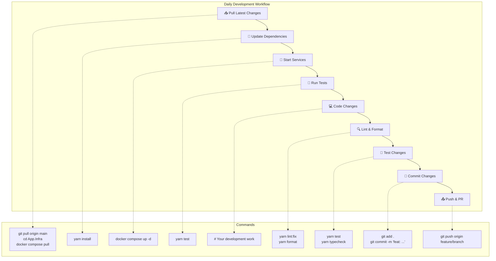

# GoGoTime Development Environment Setup

> [!SUMMARY] **Complete Development Guide**
> Comprehensive guide for setting up a full GoGoTime development environment with hot reload, testing, debugging, and productivity tools.

## 📋 Table of Contents

- [[#🛠️ Prerequisites|Prerequisites]]
- [[#🏗️ Environment Setup|Environment Setup]]
- [[#🔧 Development Tools|Development Tools]]  
- [[#🧪 Testing Setup|Testing Setup]]
- [[#🐛 Debugging|Debugging]]
- [[#📊 Monitoring|Monitoring]]

---

## 🛠️ Prerequisites

### 📦 Required Software

| Tool | Version | Purpose | Installation |
|------|---------|---------|--------------|
| **Node.js** | 24.9.0+ | JavaScript runtime | [nodejs.org](https://nodejs.org/) |
| **Yarn** | 4.10.3+ | Package manager | `npm install -g yarn` |
| **Docker** | 20.10+ | Containerization | [docker.com](https://docker.com/) |
| **Docker Compose** | V2 | Multi-container management | Included with Docker Desktop |
| **Git** | 2.0+ | Version control | [git-scm.com](https://git-scm.com/) |
| **PostgreSQL** | 18+ | Database (optional) | [postgresql.org](https://postgresql.org/) |

### 🖥️ Recommended IDE Setup

**Primary: Visual Studio Code**
```bash
# Install VS Code extensions
code --install-extension bradlc.vscode-tailwindcss
code --install-extension esbenp.prettier-vscode  
code --install-extension ms-vscode.vscode-typescript-next
code --install-extension ms-vscode.vscode-eslint
code --install-extension formulahendry.auto-rename-tag
code --install-extension christian-kohler.path-intellisense
```

**Alternative: WebStorm/IntelliJ IDEA**
- Built-in TypeScript support
- Integrated debugging
- Database tools
- Git integration

---

## 🏗️ Environment Setup

### 1️⃣ Project Setup

```bash
# Clone repository
git clone <your-repository-url>
cd T-DEV-700-project-NCY_8

# Verify Node.js and Yarn versions
node --version    # Should be 24.9.0+
yarn --version    # Should be 4.10.3+

# Check project structure
tree -d -L 2
```

### 2️⃣ Environment Configuration

```bash
# Create environment file
cp .env.example .env

# Edit configuration
nano .env
```

**Environment Variables:**

```bash
# Database Configuration
DB_HOST=localhost
DB_PORT=5432
DB_USER=postgres
DB_PASS=your_secure_password
DB_NAME=gogotime_dev

# API Configuration  
API_PORT=4000
SECRET=your_jwt_secret_key_here_min_32_chars
NODE_ENV=development

# Frontend Configuration
WEB_PORT=3000
VITE_API_URL=http://localhost:4000/api

# Development Settings
DEBUG=gogotime:*
LOG_LEVEL=debug
CHOKIDAR_USEPOLLING=true
WATCHPACK_POLLING=true
```

### 3️⃣ Development Approaches

#### Option A: Full Docker Development (Recommended)

```bash
# Start everything with Docker
cd App.Infra
docker compose up --build

# Benefits:
# ✅ Consistent environment across team
# ✅ Automatic dependency management
# ✅ Database included and configured
# ✅ Hot reload enabled
# ✅ No local Node.js conflicts
```

#### Option B: Hybrid Development

```bash
# Start database with Docker
cd App.Infra
docker compose up db -d

# Run API locally
cd ../App.API
yarn install
yarn dev

# Run frontend locally (new terminal)
cd ../App.Web  
yarn install
yarn dev

# Benefits:
# ✅ Direct access to Node.js debugging
# ✅ Faster module resolution
# ✅ IDE integration works better
# ✅ Custom Node.js versions
```

#### Option C: Full Local Development

```bash
# Install PostgreSQL locally
# Configure database connection
# Install all dependencies locally
# Run all services locally

# Benefits:
# ✅ Maximum performance
# ✅ No Docker overhead
# ✅ Full system integration
# ❌ Requires more setup
```

---

## 🔧 Development Tools

### 🖥️ VS Code Configuration

**`.vscode/settings.json`**
```json
{
  "typescript.preferences.quoteStyle": "single",
  "editor.formatOnSave": true,
  "editor.defaultFormatter": "esbenp.prettier-vscode",
  "editor.codeActionsOnSave": {
    "source.fixAll.eslint": true,
    "source.organizeImports": true
  },
  "typescript.updateImportsOnFileMove.enabled": "always",
  "emmet.includeLanguages": {
    "typescript": "html",
    "javascript": "html"
  }
}
```

**`.vscode/launch.json`** (Debugging)
```json
{
  "version": "0.2.0",
  "configurations": [
    {
      "name": "Debug API",
      "type": "node",
      "request": "launch",
      "program": "${workspaceFolder}/App.API/src/index.ts",
      "outFiles": ["${workspaceFolder}/App.API/build/**/*.js"],
      "runtimeArgs": ["-r", "ts-node/register"],
      "env": {
        "NODE_ENV": "development"
      },
      "console": "integratedTerminal"
    },
    {
      "name": "Debug Frontend",
      "type": "node",
      "request": "launch",
      "program": "${workspaceFolder}/App.Web/node_modules/.bin/vite",
      "args": ["dev"],
      "console": "integratedTerminal",
      "cwd": "${workspaceFolder}/App.Web"
    }
  ]
}
```

### 🔧 Package Scripts

**Backend Development (App.API/package.json):**
```json
{
  "scripts": {
    "dev": "ts-node-dev --respawn --transpile-only src/index.ts",
    "build": "tsc -p tsconfig.build.json", 
    "start": "pm2 start ecosystem.config.cjs --only GoGoTime-API",
    "start:dev": "pm2 start ecosystem.config.cjs --only GoGoTime-API-dev",
    "lint": "eslint src --ext .ts",
    "lint:fix": "eslint src --ext .ts --fix",
    "test": "jest",
    "test:watch": "jest --watch",
    "test:coverage": "jest --coverage",
    "typeorm": "node --require ts-node/register ./node_modules/typeorm/cli.js",
    "migration:generate": "npm run typeorm -- migration:generate",
    "migration:run": "npm run typeorm -- migration:run",
    "migration:revert": "npm run typeorm -- migration:revert"
  }
}
```

**Frontend Development (App.Web/package.json):**
```json
{
  "scripts": {
    "dev": "vite",
    "build": "vite build",
    "preview": "vite preview",
    "typecheck": "tsc --noEmit --skipLibCheck",
    "lint": "eslint . --ext ts,tsx --report-unused-disable-directives --max-warnings 50",
    "lint:fix": "eslint . --ext ts,tsx --fix",
    "format": "prettier --write \"src/**/*.{ts,tsx,json,css,scss,md}\"",
    "format:check": "prettier --check \"src/**/*.{ts,tsx,json,css,scss,md}\"",
    "test": "vitest run",
    "test:watch": "vitest",
    "test:ui": "vitest --ui",
    "test:coverage": "vitest run --coverage",
    "prepare": "husky"
  }
}
```

---

## 🧪 Testing Setup

### 🔍 Backend Testing

**Jest Configuration (App.API/jest.config.js):**
```javascript
module.exports = {
  preset: 'ts-jest',
  testEnvironment: 'node',
  roots: ['<rootDir>/src', '<rootDir>/tests'],
  testMatch: ['**/__tests__/**/*.ts', '**/?(*.)+(spec|test).ts'],
  transform: {
    '^.+\.ts$': 'ts-jest'
  },
  collectCoverageFrom: [
    'src/**/*.ts',
    '!src/**/*.d.ts',
    '!src/index.ts'
  ],
  coverageDirectory: 'coverage',
  coverageReporters: ['text', 'lcov', 'html']
}
```

**Test Examples:**
```bash
# Run all tests
cd App.API
yarn test

# Watch mode
yarn test:watch

# Coverage report  
yarn test:coverage

# Specific test file
yarn test user.test.ts
```

### ⚛️ Frontend Testing

**Vitest Configuration (App.Web/vitest.config.ts):**
```typescript
import { defineConfig } from 'vitest/config'
import react from '@vitejs/plugin-react'
import path from 'path'

export default defineConfig({
  plugins: [react()],
  test: {
    environment: 'jsdom',
    setupFiles: ['./src/test/setup.ts'],
    css: true,
    globals: true
  },
  resolve: {
    alias: {
      '@': path.resolve(__dirname, './src')
    }
  }
})
```

**Test Setup (App.Web/src/test/setup.ts):**
```typescript
import '@testing-library/jest-dom'
import { expect, afterEach } from 'vitest'
import { cleanup } from '@testing-library/react'
import * as matchers from '@testing-library/jest-dom/matchers'

expect.extend(matchers)

afterEach(() => {
  cleanup()
})
```

**Component Test Example:**
```typescript
import { render, screen } from '@testing-library/react'
import { Provider } from 'react-redux'
import { store } from '@/lib/store'
import DashboardDefault from '../DashboardDefault'

describe('DashboardDefault', () => {
  it('renders dashboard content', () => {
    render(
      <Provider store={store}>
        <DashboardDefault />
      </Provider>
    )
    
    expect(screen.getByText('Dashboard')).toBeInTheDocument()
  })
})
```

---

## 🐛 Debugging

### 🖥️ VS Code Debugging

**Backend Debugging:**
1. Set breakpoints in TypeScript files
2. Press F5 or use "Debug API" configuration
3. VS Code will attach to Node.js process
4. Use Debug Console for evaluation

**Frontend Debugging:**
1. Use browser DevTools for React components
2. Redux DevTools for state debugging
3. React Developer Tools extension
4. Network tab for API calls

### 📊 Logging Setup

**Backend Logging:**
```typescript
// Use console with emojis for development
console.log('🚀 Server starting...')
console.error('❌ Database connection failed:', error)
console.info('ℹ️ User registered:', userId)

// For production, use structured logging
import winston from 'winston'

const logger = winston.createLogger({
  level: 'info',
  format: winston.format.json(),
  transports: [
    new winston.transports.File({ filename: 'error.log', level: 'error' }),
    new winston.transports.File({ filename: 'combined.log' })
  ]
})
```

**Frontend Debugging:**
```typescript
// React DevTools
// Redux DevTools
// Console logging with context
console.group('🔐 Authentication')
console.log('Token:', token)
console.log('User:', user)
console.groupEnd()

// Network debugging
fetch('/api/users/login')
  .then(response => {
    console.log('📡 API Response:', response)
    return response.json()
  })
```

---

## 📊 Monitoring

### 🔍 Development Monitoring

**Health Check Script:**
```bash
#!/bin/bash
# health-check.sh

echo "🏥 GoGoTime Health Check"
echo "========================"

# Check services
echo "🐳 Docker Services:"
docker compose ps

echo ""
echo "📡 API Health:"
curl -s http://localhost:4000/api/users/testme | jq

echo ""  
echo "🌐 Frontend:"
curl -s -I http://localhost:3000 | head -1

echo ""
echo "🐘 Database:"
docker compose exec -T db pg_isready -U postgres
```

**Performance Monitoring:**
```typescript
// API response time logging
app.use((req, res, next) => {
  const start = Date.now()
  
  res.on('finish', () => {
    const duration = Date.now() - start
    console.log(`${req.method} ${req.path} - ${duration}ms`)
  })
  
  next()
})

// Frontend performance
import { getCLS, getFID, getFCP, getLCP, getTTFB } from 'web-vitals'

getCLS(console.log)
getFID(console.log)
getFCP(console.log)
getLCP(console.log)
getTTFB(console.log)
```

### 🔧 Development Workflow



---

## 🏷️ Tags

#development #setup #docker #nodejs #typescript #react #debugging #testing

**Related Documentation:**
- [[QUICK_START]] - Get running quickly
- [[ARCHITECTURE]] - Understand the system
- [[TESTING_STRATEGY]] - Comprehensive testing
- [[CODE_QUALITY]] - Quality standards and tools

---

> [!NOTE] **Document Maintenance**
> **Last Updated:** {date}  
> **Version:** 1.0.0  
> **Maintainers:** Development Team (Lazaro, Alexy, Massi, Lounis)
