# GoGoTime Frontend Architecture

> [!SUMMARY] **React Application Design**
> GoGoTime frontend is built with React 19, Vite, TypeScript, and Material-UI. It follows modern React patterns with feature-based organization, Redux state management, and comprehensive type safety.

## 📋 Table of Contents

- [[#⚛️ React Application Overview|React Application Overview]]
- [[#🏗️ Project Structure|Project Structure]]
- [[#🗺️ Routing Architecture|Routing Architecture]]
- [[#🎨 UI Component System|UI Component System]]
- [[#📊 State Management|State Management]]
- [[#🎭 Theme & Styling|Theme & Styling]]
- [[#🛡️ Security & Guards|Security & Guards]]

---

## ⚛️ React Application Overview

> [!NOTE] **Modern React Stack**
> The frontend leverages the latest React features with a focus on performance, developer experience, and maintainability.

```mermaid
graph TB
    subgraph "Development Stack"
        subgraph "Core Framework"
            R[⚛️ React 19]
            V[⚡ Vite]
            TS[🏷️ TypeScript 5]
        end
        
        subgraph "UI Framework"
            MUI[🎨 Material-UI v7]
            E[💫 Emotion]
            T[🎭 Theming]
        end
        
        subgraph "State Management"
            RT[📊 Redux Toolkit]
            RR[⚛️ React-Redux]
            RP[💾 Redux Persist]
        end
        
        subgraph "Development Tools"
            VT[🧪 Vitest]
            RTL[🔍 Testing Library]
            ESL[📏 ESLint]
        end
    end
    
    R --> MUI
    V --> R
    TS --> R
    MUI --> E
    E --> T
    RT --> RR
    RR --> RP
    VT --> RTL
    RTL --> ESL
```



### 🎯 Architecture Principles

1. **🏗️ Feature-Based Organization**: Components organized by business features
2. **🧩 Component Reusability**: Shared components with consistent props API
3. **📊 Centralized State**: Redux for global state, local state for component-specific data
4. **🏷️ Type Safety**: Full TypeScript coverage with strict configuration
5. **♿ Accessibility**: WCAG compliant components with Material-UI
6. **📱 Responsive Design**: Mobile-first approach with flexible layouts

---

## 🏗️ Project Structure

### 📁 Directory Organization

```typescript
App.Web/
├── src/
│   ├── components/              // 🧩 Reusable UI Components
│   │   ├── layout/             // 🏗️ Layout Components
│   │   │   ├── MainLayout.tsx  // Main application layout
│   │   │   ├── Sidebar.tsx     // Navigation sidebar
│   │   │   └── Header.tsx      // Application header
│   │   ├── common/             // 🔄 Shared Components
│   │   │   ├── Loader.tsx      // Loading spinner
│   │   │   └── Loadable.tsx    // Code splitting wrapper
│   │   ├── guards/             // 🛡️ Route Protection
│   │   │   ├── AuthGuard.tsx   // Authentication guard
│   │   │   └── GuestGuard.tsx  // Guest-only guard
│   │   ├── cards/              // 🃏 Card Components
│   │   └── extended/           // 📦 Extended Components
│   │
│   ├── features/               // 📦 Feature Modules
│   │   ├── auth/               // 🔐 Authentication
│   │   │   ├── Login.tsx       // Login page component
│   │   │   └── Register.tsx    // Registration page
│   │   ├── dashboard/          // 📈 Dashboard
│   │   │   ├── DashboardDefault.tsx
│   │   │   └── widgets/        // Dashboard widgets
│   │   ├── utilities/          // 🔧 Utility Pages
│   │   │   ├── Typography.tsx  // Typography showcase
│   │   │   ├── Color.tsx       // Color palette
│   │   │   └── Shadow.tsx      // Shadow examples
│   │   └── sample-page/        // 📄 Sample Implementation
│   │
│   ├── lib/                    // 🛠️ Core Logic
│   │   ├── store/              // 📊 Redux Configuration
│   │   │   ├── index.ts        // Store setup
│   │   │   ├── customizationReducer.ts
│   │   │   └── types.ts        // Store type definitions
│   │   ├── routes/             // 🗺️ Routing Setup
│   │   │   ├── MainRoutes.tsx  // Authenticated routes
│   │   │   └── AuthenticationRoutes.tsx
│   │   └── menu-items/         // 📋 Navigation Config
│   │       ├── index.ts        // Menu configuration
│   │       ├── dashboard.ts    // Dashboard menu
│   │       ├── utilities.ts    // Utilities menu
│   │       └── other.ts        // Other menu items
│   │
│   ├── hooks/                  // 🎣 Custom Hooks
│   │   └── [custom hooks]      // Business logic hooks
│   │
│   ├── themes/                 // 🎨 Theme Configuration
│   │   ├── index.ts            // Main theme
│   │   ├── palette.ts          // Color definitions
│   │   └── typography.ts       // Typography settings
│   │
│   ├── types/                  // 🏷️ Type Definitions
│   │   └── index.ts            // Shared types
│   │
│   └── styles/                 // 💄 Global Styles
│       └── globals.css         // Global CSS
│
├── public/                     // 📁 Static Assets
├── package.json                // 📦 Dependencies
└── vite.config.ts             // ⚙️ Build Configuration
```

### 🎯 Organizational Strategy

> [!NOTE] **Feature-First Approach**
> Components are organized by features rather than technical concerns, promoting better maintainability and team collaboration.

```mermaid
graph TB
    subgraph "Component Organization"
        subgraph "By Feature (✅ Our Approach)"
            F1[📈 /features/dashboard/]
            F2[🔐 /features/auth/]
            F3[🔧 /features/utilities/]
        end
        
        subgraph "By Type (❌ Not Used)"
            T1[📁 /pages/]
            T2[📁 /components/]
            T3[📁 /containers/]
        end
    end
    
    subgraph "Benefits"
        B1[🔍 Easy to locate features]
        B2[👥 Team can own features]
        B3[📦 Self-contained modules]
        B4[🔄 Easier refactoring]
    end
    
    F1 --> B1
    F2 --> B2
    F3 --> B3
```



---

## 🗺️ Routing Architecture

> [!NOTE] **React Router v6**
> Modern routing with nested routes, lazy loading, and route protection.

### 🛠️ Router Configuration

```mermaid
graph TB
    subgraph "Router Hierarchy"
        AR[🗺️ AppRouter<br/>Main router entry]
        
        subgraph "Route Groups"
            MR[📋 MainRoutes<br/>Authenticated routes]
            AUTH[🔐 AuthRoutes<br/>Guest routes]
        end
        
        subgraph "Layout Wrappers"
            ML[🏗️ MainLayout<br/>App shell]
            AL[📄 AuthLayout<br/>Auth pages]
        end
        
        subgraph "Route Guards"
            AG[🛡️ AuthGuard<br/>Requires login]
            GG[🚪 GuestGuard<br/>Guest only]
        end
    end
    
    AR --> MR
    AR --> AUTH
    MR --> ML
    AUTH --> AL
    ML --> AG
    AL --> GG
```



### 📍 Route Structure

```typescript
// App.Web/src/lib/router.tsx
export function AppRouter() {
  return (
    <Suspense fallback={<Loader />}>
      <Routes>
        {/* Root redirect */}
        <Route path="/" element={<Navigate to="/dashboard" replace />} />
        
        {/* Main app routes (authenticated) */}
        <Route path="/*" element={<MainRoutes />} />
        
        {/* Auth routes (guest only) */}
        <Route path="/pages/*" element={<AuthenticationRoutes />} />
      </Routes>
    </Suspense>
  )
}
```

### 🔐 Protected Routes

```typescript
// App.Web/src/lib/routes/MainRoutes.tsx
function MainRoutes() {
  return (
    <Routes>
      <Route path="/" element={<MainLayout />}>
        {/* Dashboard */}
        <Route path="dashboard" element={<DashboardDefault />} />
        
        {/* Utilities */}
        <Route path="utils">
          <Route path="typography" element={<UtilsTypography />} />
          <Route path="color" element={<UtilsColor />} />
          <Route path="shadow" element={<UtilsShadow />} />
        </Route>
        
        {/* Icons */}
        <Route path="icons">
          <Route path="tabler-icons" element={<UtilsTablerIcons />} />
          <Route path="material-icons" element={<UtilsMaterialIcons />} />
        </Route>
        
        {/* Sample page */}
        <Route path="sample-page" element={<SamplePage />} />
      </Route>
    </Routes>
  )
}
```

### ⚡ Code Splitting

```typescript
// Lazy loading for performance
const DashboardDefault = Loadable(
  lazy(() => import('@/features/dashboard/DashboardDefault'))
)

// Loadable wrapper with error boundary
function Loadable<T extends ComponentType<any>>(Component: LazyExoticComponent<T>) {
  return function LoadableComponent(props: ComponentProps<T>) {
    return (
      <Suspense fallback={<Loader />}>
        <Component {...props} />
      </Suspense>
    )
  }
}
```

---

## 🎨 UI Component System

> [!NOTE] **Material-UI Foundation**
> Built on Material-UI v7 with custom theming and consistent design patterns.

### 🧩 Component Hierarchy

```mermaid
graph TB
    subgraph "Component Types"
        subgraph "Layout Components"
            ML[🏗️ MainLayout]
            SB[📊 Sidebar]
            HDR[📢 Header]
        end
        
        subgraph "Feature Components"
            DASH[📈 Dashboard]
            AUTH[🔐 Auth Pages]
            UTILS[🔧 Utilities]
        end
        
        subgraph "Common Components"
            BTN[🔲 Buttons]
            CARDS[🃏 Cards]
            FORMS[📝 Forms]
            NAV[🧭 Navigation]
        end
        
        subgraph "Guards & HOCs"
            AG[🛡️ AuthGuard]
            LOAD[⏳ Loadable]
        end
    end
    
    ML --> SB
    ML --> HDR
    ML --> DASH
    DASH --> CARDS
    AUTH --> FORMS
    UTILS --> BTN
```



### 🏗️ Layout System

```typescript
// App.Web/src/components/layout/MainLayout.tsx
interface MainLayoutProps {
  children?: ReactNode
}

function MainLayout({ children }: MainLayoutProps) {
  const theme = useTheme()
  const matchDownLG = useMediaQuery(theme.breakpoints.down('lg'))
  
  const leftDrawerOpened = useSelector((state: RootState) => state.customization.opened)
  const dispatch = useAppDispatch()

  const handleLeftDrawerToggle = () => {
    dispatch(setMenu(!leftDrawerOpened))
  }

  return (
    <Box sx={{ display: 'flex' }}>
      <CssBaseline />
      
      {/* Header */}
      <AppBar
        enableColorOnDark
        position="fixed"
        color="inherit"
        elevation={0}
        sx={{ bgcolor: theme.palette.background.default }}
      >
        <Toolbar>
          <Header handleLeftDrawerToggle={handleLeftDrawerToggle} />
        </Toolbar>
      </AppBar>

      {/* Sidebar */}
      <Sidebar
        drawerOpen={!matchDownLG ? leftDrawerOpened : !leftDrawerOpened}
        drawerToggle={handleLeftDrawerToggle}
        drawerWidth={drawerWidth}
        window={window}
      />

      {/* Main content area */}
      <Main theme={theme} open={leftDrawerOpened}>
        <Breadcrumbs separator={IconChevronRight} />
        <Outlet />
      </Main>
    </Box>
  )
}
```

### 🃏 Card Components

```typescript
// Reusable card component pattern
interface MainCardProps {
  border?: boolean
  boxShadow?: boolean
  children: ReactNode
  content?: boolean
  contentSX?: SxProps<Theme>
  darkTitle?: boolean
  elevation?: number
  secondary?: ReactNode
  shadow?: string
  sx?: SxProps<Theme>
  title?: ReactNode
}

function MainCard({
  border = true,
  boxShadow,
  children,
  content = true,
  contentSX = {},
  darkTitle,
  elevation,
  secondary,
  shadow,
  sx = {},
  title,
  ...others
}: MainCardProps) {
  const theme = useTheme()
  
  return (
    <Card
      elevation={elevation || 0}
      sx={{
        border: border ? '1px solid' : 'none',
        borderColor: theme.palette.grey[800],
        ':hover': {
          boxShadow: boxShadow ? shadow || theme.customShadows.z1 : 'inherit'
        },
        ...sx
      }}
      {...others}
    >
      {/* Card header */}
      {title && (
        <CardHeader
          sx={{ p: 2.5 }}
          title={darkTitle ? <Typography variant="h3">{title}</Typography> : title}
          action={secondary}
        />
      )}

      {/* Card content */}
      {content && <CardContent sx={{ p: 2.5, ...contentSX }}>{children}</CardContent>}
      {!content && children}
    </Card>
  )
}
```

---

## 📊 State Management

> [!NOTE] **Redux Toolkit Pattern**
> Centralized state management with Redux Toolkit for predictable state updates and excellent developer tools.

### 🗃️ Store Configuration

```mermaid
graph TB
    subgraph "Redux Store"
        subgraph "Slices"
            CS[🎨 Customization Slice]
            US[👤 User Slice]
            AS[🔐 Auth Slice]
        end
        
        subgraph "Middleware"
            RTK[📊 RTK Query]
            PERS[💾 Redux Persist]
            DEV[🛠️ DevTools]
        end
        
        subgraph "Components"
            COMP[⚛️ React Components]
            HOOKS[🎣 Selector Hooks]
        end
    end
    
    CS --> PERS
    US --> RTK
    AS --> DEV
    COMP --> HOOKS
    HOOKS --> CS
```



```typescript
// App.Web/src/lib/store/index.ts
import { configureStore } from '@reduxjs/toolkit'
import { persistStore, persistReducer } from 'redux-persist'
import storage from 'redux-persist/lib/storage'

import customizationReducer from './customizationReducer'

const persistConfig = {
  key: 'gogotime',
  storage,
  whitelist: ['customization'] // Only persist customization
}

const persistedReducer = persistReducer(persistConfig, customizationReducer)

export const store = configureStore({
  reducer: {
    customization: persistedReducer
  },
  middleware: (getDefaultMiddleware) =>
    getDefaultMiddleware({
      serializableCheck: {
        ignoredActions: ['persist/PERSIST', 'persist/REHYDRATE']
      }
    }),
  devTools: process.env.NODE_ENV !== 'production'
})

export const persistor = persistStore(store)
export type RootState = ReturnType<typeof store.getState>
export type AppDispatch = typeof store.dispatch
```

### 🎨 Customization State

```typescript
// App.Web/src/lib/store/customizationReducer.ts
interface CustomizationState {
  isOpen: string[]          // Open menu items
  defaultId: string         // Default selected menu
  fontFamily: string        // Font family
  borderRadius: number      // Border radius
  opened: boolean           // Drawer state
}

const initialState: CustomizationState = {
  isOpen: [],
  defaultId: 'dashboard',
  fontFamily: `'Roboto', sans-serif`,
  borderRadius: 12,
  opened: true
}

const customizationSlice = createSlice({
  name: 'customization',
  initialState,
  reducers: {
    setMenu: (state, action) => {
      state.opened = action.payload
    },
    setFontFamily: (state, action) => {
      state.fontFamily = action.payload
    },
    setBorderRadius: (state, action) => {
      state.borderRadius = action.payload
    }
  }
})
```

### 🎣 Custom Hooks

```typescript
// Typed hooks for Redux
export const useAppDispatch = () => useDispatch<AppDispatch>()
export const useAppSelector: TypedUseSelectorHook<RootState> = useSelector

// Component usage
function ExampleComponent() {
  const dispatch = useAppDispatch()
  const customization = useAppSelector((state) => state.customization)
  
  const handleMenuToggle = () => {
    dispatch(setMenu(!customization.opened))
  }
  
  return (
    <Button onClick={handleMenuToggle}>
      Toggle Menu
    </Button>
  )
}
```

---

## 🎭 Theme & Styling

> [!NOTE] **Material-UI Theming**
> Comprehensive theme system with dark/light mode support and customizable design tokens.

### 🎨 Theme Structure

```typescript
// App.Web/src/themes/index.ts
export const theme = (customization: CustomizationState) =>
  createTheme({
    palette: {
      mode: 'light',
      primary: {
        light: '#e3f2fd',
        main: '#2196f3',
        dark: '#0d47a1',
        200: '#90caf9',
        800: '#1565c0'
      },
      secondary: {
        light: '#ede7f6',
        main: '#673ab7',
        dark: '#320b86',
        200: '#b39ddb',
        800: '#4527a0'
      },
      error: {
        light: '#ef5350',
        main: '#f44336',
        dark: '#c62828'
      },
      orange: {
        light: '#fbe9e7',
        main: '#ffab91',
        dark: '#d84315'
      },
      warning: {
        light: '#fff3e0',
        main: '#ff9800',
        dark: '#ef6c00'
      },
      success: {
        light: '#e8f5e8',
        200: '#a5d6a7',
        main: '#4caf50',
        dark: '#1b5e20'
      },
      grey: {
        50: '#f8fafc',
        100: '#eef2f6',
        500: '#8b5cf6',
        600: '#475569',
        700: '#334155',
        900: '#0f172a'
      }
    },
    typography: {
      fontFamily: customization.fontFamily,
      h6: {
        fontWeight: 500,
        color: '#1e293b',
        fontSize: '0.75rem'
      },
      h5: {
        fontSize: '0.875rem',
        color: '#1e293b',
        fontWeight: 500
      },
      h4: {
        fontSize: '1rem',
        color: '#1e293b',
        fontWeight: 600
      },
      h3: {
        fontSize: '1.25rem',
        color: '#1e293b',
        fontWeight: 600
      },
      h2: {
        fontSize: '1.5rem',
        color: '#1e293b',
        fontWeight: 700
      },
      h1: {
        fontSize: '2.125rem',
        color: '#1e293b',
        fontWeight: 700
      }
    },
    shape: {
      borderRadius: customization.borderRadius
    }
  })
```

### 🌈 Color System

```typescript
// Extended color palette
declare module '@mui/material/styles' {
  interface Palette {
    orange: Palette['primary']
    dark: Palette['primary']
  }

  interface PaletteOptions {
    orange?: PaletteOptions['primary']
    dark?: PaletteOptions['primary']
  }

  interface PaletteColor {
    lighter?: string
    100?: string
    200?: string
    300?: string
    400?: string
    500?: string
    600?: string
    700?: string
    800?: string
    900?: string
    A50?: string
    A100?: string
    A200?: string
    A400?: string
    A700?: string
  }

  interface SimplePaletteColorOptions {
    lighter?: string
    100?: string
    200?: string
    300?: string
    400?: string
    500?: string
    600?: string
    700?: string
    800?: string
    900?: string
    A50?: string
    A100?: string
    A200?: string
    A400?: string
    A700?: string
  }
}
```

### 💫 Custom Shadows

```typescript
// Custom shadow system
export const customShadows = {
  z1: '0px 2px 8px rgba(0,0,0,0.15)',
  z8: '0px 8px 25px rgba(0,0,0,0.15)',
  z12: '0px 12px 35px rgba(0,0,0,0.15)',
  z16: '0px 16px 45px rgba(0,0,0,0.15)',
  z20: '0px 20px 55px rgba(0,0,0,0.15)',
  z24: '0px 24px 65px rgba(0,0,0,0.15)'
}
```

---

## 🛡️ Security & Guards

> [!WARNING] **Route Protection**
> Comprehensive security measures to protect authenticated routes and sensitive data.

### 🔐 Authentication Guard

```typescript
// App.Web/src/components/guards/AuthGuard.tsx
interface AuthGuardProps {
  children: ReactNode
}

function AuthGuard({ children }: AuthGuardProps) {
  const navigate = useNavigate()
  const location = useLocation()

  // Check authentication status
  const isAuthenticated = useAppSelector((state) => state.auth.isAuthenticated)
  const token = localStorage.getItem('token')

  useEffect(() => {
    if (!isAuthenticated && !token) {
      // Redirect to login with return URL
      navigate('/pages/login', {
        state: { from: location.pathname },
        replace: true
      })
    }
  }, [isAuthenticated, token, navigate, location])

  // Show loading while checking auth
  if (!isAuthenticated && !token) {
    return <Loader />
  }

  return <>{children}</>
}
```

### 🚪 Guest Guard

```typescript
// App.Web/src/components/guards/GuestGuard.tsx
interface GuestGuardProps {
  children: ReactNode
}

function GuestGuard({ children }: GuestGuardProps) {
  const navigate = useNavigate()
  const location = useLocation()

  const isAuthenticated = useAppSelector((state) => state.auth.isAuthenticated)
  const token = localStorage.getItem('token')

  useEffect(() => {
    if (isAuthenticated || token) {
      // Redirect authenticated users to dashboard
      const returnUrl = (location.state as any)?.from || '/dashboard'
      navigate(returnUrl, { replace: true })
    }
  }, [isAuthenticated, token, navigate, location])

  return <>{children}</>
}
```

### 🔒 Data Protection

```typescript
// Secure API token handling
class ApiClient {
  private baseURL = process.env.VITE_API_URL || 'http://localhost:4000/api'
  
  private getAuthHeaders() {
    const token = localStorage.getItem('token')
    return token ? { Authorization: `Bearer ${token}` } : {}
  }

  async request<T>(endpoint: string, options: RequestInit = {}): Promise<T> {
    const url = `${this.baseURL}${endpoint}`
    
    const response = await fetch(url, {
      ...options,
      headers: {
        'Content-Type': 'application/json',
        ...this.getAuthHeaders(),
        ...options.headers
      }
    })

    if (!response.ok) {
      if (response.status === 401) {
        // Handle token expiration
        localStorage.removeItem('token')
        window.location.href = '/pages/login'
      }
      throw new Error(`API Error: ${response.status}`)
    }

    return response.json()
  }
}
```

---

## 🧪 Testing Strategy

> [!NOTE] **Component Testing**
> Comprehensive testing with Vitest and React Testing Library for reliable component behavior.

### 🔍 Test Structure

```typescript
// Component test example
import { render, screen } from '@testing-library/react'
import { Provider } from 'react-redux'
import { BrowserRouter } from 'react-router-dom'
import { ThemeProvider } from '@mui/material/styles'

import { store } from '@/lib/store'
import { theme } from '@/styles/theme'
import MainLayout from '../MainLayout'

const renderWithProviders = (component: ReactElement) => {
  return render(
    <Provider store={store}>
      <BrowserRouter>
        <ThemeProvider theme={theme({ fontFamily: 'Roboto', borderRadius: 12 })}>
          {component}
        </ThemeProvider>
      </BrowserRouter>
    </Provider>
  )
}

describe('MainLayout', () => {
  it('renders main layout with sidebar and header', () => {
    renderWithProviders(<MainLayout />)
    
    expect(screen.getByRole('navigation')).toBeInTheDocument()
    expect(screen.getByRole('banner')).toBeInTheDocument()
    expect(screen.getByRole('main')).toBeInTheDocument()
  })
  
  it('toggles sidebar when menu button is clicked', async () => {
    const user = userEvent.setup()
    renderWithProviders(<MainLayout />)
    
    const menuButton = screen.getByRole('button', { name: /menu/i })
    await user.click(menuButton)
    
    // Verify sidebar state change
    expect(screen.getByTestId('sidebar')).toHaveClass('closed')
  })
})
```

---

## 🏷️ Tags

#frontend #react #typescript #material-ui #redux #vite #components #architecture

**Related Documentation:**
- [[ARCHITECTURE]] - Overall system architecture
- [[API_SPECIFICATION]] - Backend API integration
- [[COMPONENT_LIBRARY]] - Detailed component documentation
- [[TESTING_STRATEGY]] - Testing methodologies

---

> [!NOTE] **Document Maintenance**
> **Last Updated:** {date}  
> **Version:** 1.0.0  
> **Maintainers:** Frontend Team (Lazaro, Alexy, Massi, Lounis)
