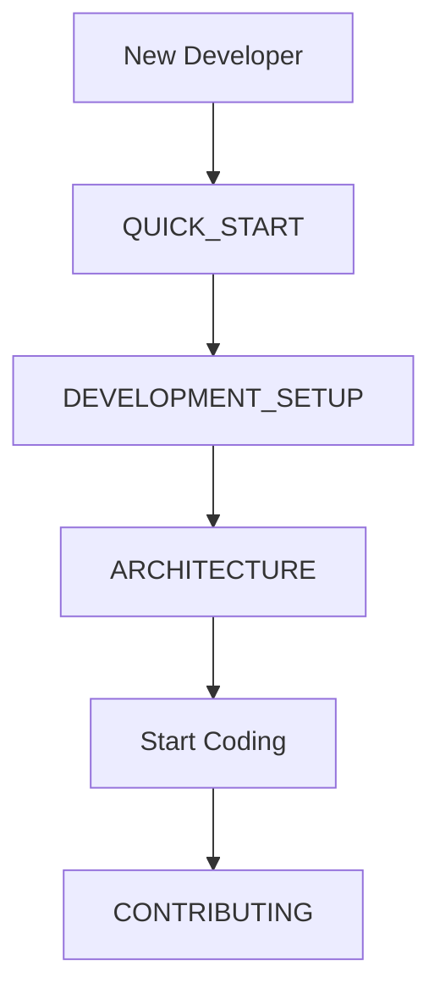
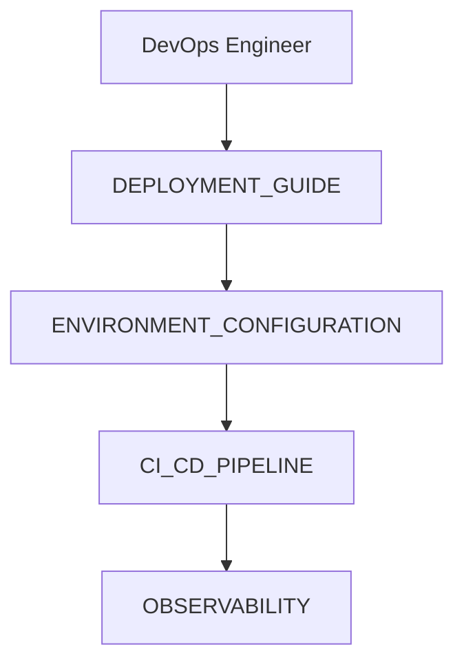
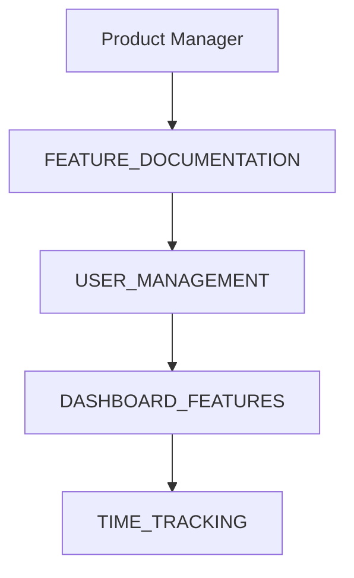

# GoGoTime Documentation Hub

> [!NOTE] **Welcome to GoGoTime**
> GoGoTime is a modern time tracking and project management platform built with React, Node.js, and PostgreSQL. This documentation provides comprehensive guides for developers, users, and administrators.

## 📋 Table of Contents

### 🏗️ Architecture & Design
- [[ARCHITECTURE]] - System architecture and technical decisions
- [[DATABASE_DESIGN]] - Data models and database schema
- [[API_SPECIFICATION]] - REST API endpoints and data contracts
- [[FRONTEND_ARCHITECTURE]] - React application structure and patterns

### 🚀 Getting Started
- [[QUICK_START]] - Get up and running in 5 minutes
- [[DEVELOPMENT_SETUP]] - Complete development environment setup
- [[DEPLOYMENT_GUIDE]] - Production deployment strategies
- [[ENVIRONMENT_CONFIGURATION]] - Environment variables and configuration

### 🔐 Security & Authentication
- [[AUTHENTICATION_FLOW]] - JWT-based authentication system
- [[SECURITY_MEASURES]] - Security implementations and best practices
- [[RBAC_SYSTEM]] - Role-based access control design

### 🧪 Testing & Quality
- [[TESTING_STRATEGY]] - Testing approaches and frameworks
- [[CODE_QUALITY]] - Linting, formatting, and quality standards
- [[CI_CD_PIPELINE]] - Automated build and deployment processes

### 📊 Operations & Monitoring
- [[OBSERVABILITY]] - Monitoring, logging, and alerting
- [[PERFORMANCE_OPTIMIZATION]] - Performance tuning and optimization
- [[TROUBLESHOOTING]] - Common issues and solutions

### 🎯 Feature Documentation
- [[USER_MANAGEMENT]] - User registration, authentication, and profiles
- [[DASHBOARD_FEATURES]] - Dashboard functionality and widgets
- [[TIME_TRACKING]] - Time tracking features and workflows

### 📚 Developer Resources
- [[CONTRIBUTING]] - How to contribute to the project
- [[CODING_STANDARDS]] - Code style and development guidelines
- [[API_REFERENCE]] - Complete API documentation
- [[COMPONENT_LIBRARY]] - React component documentation

---

## 🔍 Quick Navigation

### For Developers

### For DevOps

### For Product Team

## 🏷️ Tags & Categories

#gogotime #documentation #typescript #react #nodejs #postgresql #docker

---

> [!TIP] **Using This Documentation**
> This documentation is optimized for Obsidian. Use `[[double brackets]]` to navigate between documents. All documents include relevant tags, cross-references, and are structured for easy navigation.

**Last Updated:** {date}
**Version:** 1.0.0
**Maintainers:** Lazaro, Alexy, Massi, Lounis
