# GoGoTime Observability & Monitoring

> [!SUMMARY] **Complete Observability Stack**
> Comprehensive monitoring, logging, and alerting setup for GoGoTime with Prometheus, Grafana, structured logging, and performance tracking across the entire application stack.

## 📋 Table of Contents

- [[#📊 Observability Overview|Observability Overview]]
- [[#📈 Metrics Collection|Metrics Collection]]
- [[#📝 Logging Strategy|Logging Strategy]]
- [[#🚨 Alerting & Notifications|Alerting & Notifications]]
- [[#🔍 Tracing & Performance|Tracing & Performance]]
- [[#🎯 Monitoring Dashboards|Monitoring Dashboards]]

---

## 📊 Observability Overview

### 🎯 The Three Pillars

```mermaid
graph TB
    subgraph "Observability Stack"
        subgraph "Metrics"
            PROM[📈 Prometheus<br/>Time-series metrics<br/>Custom & system metrics]
            GRAF[📊 Grafana<br/>Visualization & dashboards<br/>Alerting rules]
        end
        
        subgraph "Logs"
            LOGS[📝 Structured Logs<br/>JSON format with context<br/>Centralized collection]
            ELK[🔍 ELK Stack<br/>Elasticsearch + Logstash + Kibana<br/>Log analysis & search]
        end
        
        subgraph "Traces"
            TRACE[🔗 Distributed Tracing<br/>Request flow tracking<br/>Performance profiling]
            JAEGER[🕵️ Jaeger<br/>Trace visualization<br/>Dependency mapping]
        end
    end
    
    PROM --> GRAF
    LOGS --> ELK
    TRACE --> JAEGER
    
    subgraph "Applications"
        WEB[🌐 React Frontend]
        API[🔧 Express API]
        DB[🗄️ PostgreSQL]
    end
    
    WEB --> PROM
    API --> PROM
    DB --> PROM
    
    WEB --> LOGS
    API --> LOGS
    
    API --> TRACE
```



### 🏗️ Monitoring Architecture

| Component | Purpose | Technology | Metrics |
|-----------|---------|------------|---------|
| **Application** | Business metrics | Custom counters | User actions, API calls |
| **System** | Infrastructure health | Node Exporter | CPU, Memory, Disk |
| **Database** | DB performance | Postgres Exporter | Queries, Connections |
| **Network** | Request flow | Nginx logs | Latency, Errors |
| **Container** | Docker metrics | cAdvisor | Resource usage |

---

## 📈 Metrics Collection

### 🔧 Prometheus Setup

**Docker Compose Configuration:**
```yaml
# App.Infra/docker-compose.monitoring.yml
services:
  prometheus:
    image: prom/prometheus:latest
    container_name: gogotime-prometheus
    ports:
      - "9090:9090"
    volumes:
      - ./monitoring/prometheus.yml:/etc/prometheus/prometheus.yml:ro
      - ./monitoring/rules:/etc/prometheus/rules:ro
      - prometheus_data:/prometheus
    command:
      - '--config.file=/etc/prometheus/prometheus.yml'
      - '--storage.tsdb.path=/prometheus'
      - '--web.console.libraries=/usr/share/prometheus/console_libraries'
      - '--web.console.templates=/usr/share/prometheus/consoles'
      - '--web.enable-lifecycle'
      - '--web.enable-admin-api'
    networks:
      - gogotime-network

  grafana:
    image: grafana/grafana:latest
    container_name: gogotime-grafana
    ports:
      - "3001:3000"
    environment:
      - GF_SECURITY_ADMIN_PASSWORD=admin123
      - GF_USERS_ALLOW_SIGN_UP=false
    volumes:
      - grafana_data:/var/lib/grafana
      - ./monitoring/grafana/dashboards:/var/lib/grafana/dashboards:ro
      - ./monitoring/grafana/provisioning:/etc/grafana/provisioning:ro
    networks:
      - gogotime-network

  node-exporter:
    image: prom/node-exporter:latest
    container_name: gogotime-node-exporter
    ports:
      - "9100:9100"
    volumes:
      - /proc:/host/proc:ro
      - /sys:/host/sys:ro
      - /:/rootfs:ro
    command:
      - '--path.procfs=/host/proc'
      - '--path.sysfs=/host/sys'
      - '--collector.filesystem.mount-points-exclude'
      - '^/(sys|proc|dev|host|etc|rootfs/var/lib/docker/containers|rootfs/var/lib/docker/overlay2|rootfs/run/docker/netns|rootfs/var/lib/docker/aufs)($$|/)'
    networks:
      - gogotime-network

volumes:
  prometheus_data:
  grafana_data:
```

**Prometheus Configuration:**
```yaml
# monitoring/prometheus.yml
global:
  scrape_interval: 15s
  evaluation_interval: 15s

rule_files:
  - "rules/*.yml"

scrape_configs:
  - job_name: 'gogotime-api'
    static_configs:
      - targets: ['api:4000']
    metrics_path: '/metrics'
    scrape_interval: 5s

  - job_name: 'gogotime-web'
    static_configs:
      - targets: ['web:9091']  # Metrics endpoint
    scrape_interval: 15s

  - job_name: 'postgres'
    static_configs:
      - targets: ['postgres-exporter:9187']

  - job_name: 'node'
    static_configs:
      - targets: ['node-exporter:9100']

  - job_name: 'prometheus'
    static_configs:
      - targets: ['localhost:9090']

alerting:
  alertmanagers:
    - static_configs:
        - targets:
          - alertmanager:9093
```

### 📊 Application Metrics

**Backend Metrics Implementation:**
```typescript
// App.API/src/monitoring/metrics.ts
import promClient from 'prom-client'
import { Request, Response, NextFunction } from 'express'

// Create registry
const register = new promClient.Registry()

// Add default Node.js metrics
promClient.collectDefaultMetrics({
  register,
  prefix: 'gogotime_nodejs_'
})

// Custom application metrics
const httpRequestDuration = new promClient.Histogram({
  name: 'gogotime_http_request_duration_seconds',
  help: 'Duration of HTTP requests in seconds',
  labelNames: ['method', 'route', 'status'],
  buckets: [0.001, 0.005, 0.01, 0.05, 0.1, 0.5, 1, 5, 10]
})

const httpRequestsTotal = new promClient.Counter({
  name: 'gogotime_http_requests_total',
  help: 'Total number of HTTP requests',
  labelNames: ['method', 'route', 'status']
})

const activeUsers = new promClient.Gauge({
  name: 'gogotime_active_users',
  help: 'Number of currently active users'
})

const databaseConnections = new promClient.Gauge({
  name: 'gogotime_database_connections_active',
  help: 'Number of active database connections'
})

const authenticationAttempts = new promClient.Counter({
  name: 'gogotime_auth_attempts_total',
  help: 'Total authentication attempts',
  labelNames: ['type', 'status']  // login/logout, success/failure
})

const businessMetrics = {
  usersRegistered: new promClient.Counter({
    name: 'gogotime_users_registered_total',
    help: 'Total number of users registered'
  }),
  
  sessionsCreated: new promClient.Counter({
    name: 'gogotime_sessions_created_total',
    help: 'Total number of sessions created'
  }),
  
  apiErrors: new promClient.Counter({
    name: 'gogotime_api_errors_total',
    help: 'Total API errors',
    labelNames: ['error_type', 'endpoint']
  })
}

// Register metrics
register.registerMetric(httpRequestDuration)
register.registerMetric(httpRequestsTotal)
register.registerMetric(activeUsers)
register.registerMetric(databaseConnections)
register.registerMetric(authenticationAttempts)
Object.values(businessMetrics).forEach(metric => register.registerMetric(metric))

// Metrics middleware
export const metricsMiddleware = (req: Request, res: Response, next: NextFunction) => {
  const start = Date.now()
  
  res.on('finish', () => {
    const duration = (Date.now() - start) / 1000
    const route = req.route?.path || req.path
    
    httpRequestDuration
      .labels(req.method, route, res.statusCode.toString())
      .observe(duration)
      
    httpRequestsTotal
      .labels(req.method, route, res.statusCode.toString())
      .inc()
  })
  
  next()
}

// Update active users (called periodically)
export const updateActiveUsers = async () => {
  try {
    // Get active sessions count from database
    const activeSessionsCount = await getActiveSessionsCount()
    activeUsers.set(activeSessionsCount)
  } catch (error) {
    console.error('Failed to update active users metric:', error)
  }
}

// Business metrics helpers
export const trackUserRegistration = () => {
  businessMetrics.usersRegistered.inc()
}

export const trackSessionCreation = () => {
  businessMetrics.sessionsCreated.inc()
}

export const trackAuthAttempt = (type: 'login' | 'logout', status: 'success' | 'failure') => {
  authenticationAttempts.labels(type, status).inc()
}

export const trackApiError = (errorType: string, endpoint: string) => {
  businessMetrics.apiErrors.labels(errorType, endpoint).inc()
}

// Export registry for /metrics endpoint
export { register }
```

**Frontend Performance Metrics:**
```typescript
// App.Web/src/monitoring/performance.ts
import { getCLS, getFID, getFCP, getLCP, getTTFB } from 'web-vitals'

interface PerformanceMetric {
  name: string
  value: number
  delta: number
  id: string
  entries: any[]
}

class PerformanceMonitor {
  private apiUrl: string
  private metrics: PerformanceMetric[] = []

  constructor(apiUrl: string) {
    this.apiUrl = apiUrl
    this.initializeWebVitals()
  }

  private initializeWebVitals() {
    getCLS(this.sendMetric.bind(this))
    getFID(this.sendMetric.bind(this))
    getFCP(this.sendMetric.bind(this))
    getLCP(this.sendMetric.bind(this))
    getTTFB(this.sendMetric.bind(this))
  }

  private async sendMetric(metric: PerformanceMetric) {
    this.metrics.push(metric)
    
    try {
      await fetch(`${this.apiUrl}/metrics/web-vitals`, {
        method: 'POST',
        headers: {
          'Content-Type': 'application/json'
        },
        body: JSON.stringify({
          name: metric.name,
          value: metric.value,
          id: metric.id,
          timestamp: Date.now(),
          url: window.location.href,
          userAgent: navigator.userAgent
        })
      })
    } catch (error) {
      console.error('Failed to send performance metric:', error)
    }
  }

  // Track custom events
  trackPageLoad(pageName: string) {
    const loadTime = performance.now()
    this.sendCustomMetric('page_load_time', loadTime, { page: pageName })
  }

  trackUserInteraction(action: string, element: string) {
    this.sendCustomMetric('user_interaction', 1, { action, element })
  }

  trackError(error: Error, context?: any) {
    this.sendCustomMetric('frontend_error', 1, {
      message: error.message,
      stack: error.stack,
      context
    })
  }

  private async sendCustomMetric(name: string, value: number, labels: any = {}) {
    try {
      await fetch(`${this.apiUrl}/metrics/custom`, {
        method: 'POST',
        headers: {
          'Content-Type': 'application/json'
        },
        body: JSON.stringify({
          name,
          value,
          labels,
          timestamp: Date.now()
        })
      })
    } catch (error) {
      console.error('Failed to send custom metric:', error)
    }
  }
}

export const performanceMonitor = new PerformanceMonitor(
  import.meta.env.VITE_API_URL || 'http://localhost:4000/api'
)
```

---

## 📝 Logging Strategy

### 🏗️ Structured Logging

**Backend Logging Setup:**
```typescript
// App.API/src/monitoring/logger.ts
import winston from 'winston'
import { Request } from 'express'

// Define log levels
const levels = {
  error: 0,
  warn: 1,
  info: 2,
  http: 3,
  debug: 4
}

const level = () => {
  const env = process.env.NODE_ENV || 'development'
  const isDevelopment = env === 'development'
  return isDevelopment ? 'debug' : 'warn'
}

// Define colors for console output
const colors = {
  error: 'red',
  warn: 'yellow',
  info: 'green',
  http: 'magenta',
  debug: 'white'
}

winston.addColors(colors)

// Custom format for development
const devFormat = winston.format.combine(
  winston.format.timestamp({ format: 'YYYY-MM-DD HH:mm:ss:ms' }),
  winston.format.colorize({ all: true }),
  winston.format.printf(
    (info) => `${info.timestamp} ${info.level}: ${info.message}`
  )
)

// Custom format for production (JSON)
const prodFormat = winston.format.combine(
  winston.format.timestamp(),
  winston.format.errors({ stack: true }),
  winston.format.json()
)

// Create logger instance
const logger = winston.createLogger({
  level: level(),
  levels,
  format: process.env.NODE_ENV === 'production' ? prodFormat : devFormat,
  defaultMeta: { 
    service: 'gogotime-api',
    version: process.env.npm_package_version || '1.0.0'
  },
  transports: [
    // Console output
    new winston.transports.Console(),
    
    // File output for production
    ...(process.env.NODE_ENV === 'production' ? [
      new winston.transports.File({
        filename: '/var/log/gogotime/error.log',
        level: 'error',
        maxsize: 10 * 1024 * 1024, // 10MB
        maxFiles: 5
      }),
      new winston.transports.File({
        filename: '/var/log/gogotime/combined.log',
        maxsize: 10 * 1024 * 1024, // 10MB
        maxFiles: 10
      })
    ] : [])
  ]
})

// Request logging middleware
export const requestLogger = (req: Request, res: any, next: any) => {
  const start = Date.now()
  
  res.on('finish', () => {
    const duration = Date.now() - start
    const logData = {
      method: req.method,
      url: req.originalUrl,
      status: res.statusCode,
      duration: `${duration}ms`,
      ip: req.ip,
      userAgent: req.get('User-Agent'),
      userId: (req as any).user?.id || null,
      requestId: req.headers['x-request-id'] || null
    }

    if (res.statusCode >= 400) {
      logger.error('HTTP Request Error', logData)
    } else {
      logger.http('HTTP Request', logData)
    }
  })
  
  next()
}

// Structured logging helpers
export const loggers = {
  // Authentication events
  auth: {
    loginSuccess: (userId: string, ip: string) => {
      logger.info('User login successful', {
        event: 'auth.login.success',
        userId,
        ip,
        timestamp: new Date().toISOString()
      })
    },
    
    loginFailure: (email: string, ip: string, reason: string) => {
      logger.warn('User login failed', {
        event: 'auth.login.failure',
        email,
        ip,
        reason,
        timestamp: new Date().toISOString()
      })
    },
    
    logout: (userId: string, ip: string) => {
      logger.info('User logout', {
        event: 'auth.logout',
        userId,
        ip,
        timestamp: new Date().toISOString()
      })
    }
  },

  // Database events
  database: {
    connectionError: (error: Error) => {
      logger.error('Database connection error', {
        event: 'database.connection.error',
        error: error.message,
        stack: error.stack,
        timestamp: new Date().toISOString()
      })
    },
    
    queryError: (query: string, error: Error) => {
      logger.error('Database query error', {
        event: 'database.query.error',
        query,
        error: error.message,
        timestamp: new Date().toISOString()
      })
    },
    
    slowQuery: (query: string, duration: number) => {
      logger.warn('Slow database query', {
        event: 'database.query.slow',
        query,
        duration: `${duration}ms`,
        timestamp: new Date().toISOString()
      })
    }
  },

  // Business events
  business: {
    userRegistered: (userId: string, email: string) => {
      logger.info('New user registered', {
        event: 'business.user.registered',
        userId,
        email,
        timestamp: new Date().toISOString()
      })
    },
    
    sessionExpired: (userId: string, sessionId: string) => {
      logger.info('User session expired', {
        event: 'business.session.expired',
        userId,
        sessionId,
        timestamp: new Date().toISOString()
      })
    }
  }
}

export default logger
```

**Frontend Logging:**
```typescript
// App.Web/src/monitoring/logger.ts
import { performanceMonitor } from './performance'

interface LogEntry {
  level: 'error' | 'warn' | 'info' | 'debug'
  message: string
  context?: any
  timestamp: number
  url: string
  userAgent: string
  userId?: string
}

class FrontendLogger {
  private logs: LogEntry[] = []
  private maxLogs = 1000
  private apiUrl: string

  constructor(apiUrl: string) {
    this.apiUrl = apiUrl
    this.setupErrorHandlers()
  }

  private setupErrorHandlers() {
    // Global error handler
    window.addEventListener('error', (event) => {
      this.error('Global error', {
        message: event.error?.message,
        filename: event.filename,
        lineno: event.lineno,
        colno: event.colno,
        stack: event.error?.stack
      })
    })

    // Unhandled promise rejections
    window.addEventListener('unhandledrejection', (event) => {
      this.error('Unhandled promise rejection', {
        reason: event.reason
      })
    })
  }

  private createLogEntry(level: LogEntry['level'], message: string, context?: any): LogEntry {
    return {
      level,
      message,
      context,
      timestamp: Date.now(),
      url: window.location.href,
      userAgent: navigator.userAgent,
      userId: this.getCurrentUserId()
    }
  }

  private getCurrentUserId(): string | undefined {
    // Get user ID from your auth system
    const token = localStorage.getItem('token')
    if (token) {
      try {
        const payload = JSON.parse(atob(token.split('.')[1]))
        return payload.id
      } catch {
        return undefined
      }
    }
    return undefined
  }

  error(message: string, context?: any) {
    const logEntry = this.createLogEntry('error', message, context)
    this.addLog(logEntry)
    console.error(`[${new Date(logEntry.timestamp).toISOString()}] ERROR:`, message, context)
    
    // Track error in performance monitoring
    if (context?.error) {
      performanceMonitor.trackError(context.error, context)
    }
  }

  warn(message: string, context?: any) {
    const logEntry = this.createLogEntry('warn', message, context)
    this.addLog(logEntry)
    console.warn(`[${new Date(logEntry.timestamp).toISOString()}] WARN:`, message, context)
  }

  info(message: string, context?: any) {
    const logEntry = this.createLogEntry('info', message, context)
    this.addLog(logEntry)
    console.info(`[${new Date(logEntry.timestamp).toISOString()}] INFO:`, message, context)
  }

  debug(message: string, context?: any) {
    const logEntry = this.createLogEntry('debug', message, context)
    this.addLog(logEntry)
    console.debug(`[${new Date(logEntry.timestamp).toISOString()}] DEBUG:`, message, context)
  }

  private addLog(logEntry: LogEntry) {
    this.logs.push(logEntry)
    
    // Keep only recent logs
    if (this.logs.length > this.maxLogs) {
      this.logs = this.logs.slice(-this.maxLogs)
    }
    
    // Send high-priority logs immediately
    if (logEntry.level === 'error') {
      this.sendLogs([logEntry])
    }
  }

  // Send logs to backend
  async sendLogs(logs: LogEntry[] = this.logs) {
    if (logs.length === 0) return

    try {
      await fetch(`${this.apiUrl}/logs`, {
        method: 'POST',
        headers: {
          'Content-Type': 'application/json',
          'Authorization': `Bearer ${localStorage.getItem('token')}`
        },
        body: JSON.stringify({ logs })
      })
    } catch (error) {
      console.error('Failed to send logs to backend:', error)
    }
  }

  // Periodically send logs
  startPeriodicSend(intervalMs = 30000) {
    setInterval(() => {
      if (this.logs.length > 0) {
        this.sendLogs()
        this.logs = [] // Clear sent logs
      }
    }, intervalMs)
  }
}

export const logger = new FrontendLogger(
  import.meta.env.VITE_API_URL || 'http://localhost:4000/api'
)

// Start periodic log sending
logger.startPeriodicSend()
```

---

## 🚨 Alerting & Notifications

### 📢 Alert Rules

**Prometheus Alert Rules:**
```yaml
# monitoring/rules/api-alerts.yml
groups:
  - name: gogotime-api-alerts
    rules:
      - alert: HighErrorRate
        expr: rate(gogotime_http_requests_total{status=~"5.."}[5m]) > 0.1
        for: 2m
        labels:
          severity: critical
          service: api
        annotations:
          summary: "High API error rate detected"
          description: "API error rate is {{ $value | humanizePercentage }} over the last 5 minutes"
          runbook_url: "https://docs.yourdomain.com/runbooks/high-error-rate"

      - alert: HighLatency
        expr: histogram_quantile(0.95, rate(gogotime_http_request_duration_seconds_bucket[5m])) > 2
        for: 5m
        labels:
          severity: warning
          service: api
        annotations:
          summary: "High API latency detected"
          description: "95th percentile latency is {{ $value }}s"

      - alert: DatabaseConnectionsHigh
        expr: gogotime_database_connections_active > 15
        for: 1m
        labels:
          severity: warning
          service: database
        annotations:
          summary: "High database connection count"
          description: "Database connections: {{ $value }}"

      - alert: MemoryUsageHigh
        expr: gogotime_nodejs_process_resident_memory_bytes / 1024 / 1024 > 512
        for: 5m
        labels:
          severity: warning
          service: api
        annotations:
          summary: "High memory usage"
          description: "Memory usage is {{ $value }}MB"

      - alert: ServiceDown
        expr: up{job="gogotime-api"} == 0
        for: 1m
        labels:
          severity: critical
          service: api
        annotations:
          summary: "GoGoTime API is down"
          description: "API service has been down for more than 1 minute"

  - name: gogotime-business-alerts
    rules:
      - alert: HighAuthFailureRate
        expr: rate(gogotime_auth_attempts_total{status="failure"}[5m]) > 0.1
        for: 2m
        labels:
          severity: warning
          service: security
        annotations:
          summary: "High authentication failure rate"
          description: "Authentication failure rate: {{ $value | humanizePercentage }}"

      - alert: NoUserRegistrations
        expr: increase(gogotime_users_registered_total[1h]) == 0
        for: 2h
        labels:
          severity: info
          service: business
        annotations:
          summary: "No user registrations in the last 2 hours"
          description: "Consider checking registration flow"
```

### 📱 Notification Channels

**Alertmanager Configuration:**
```yaml
# monitoring/alertmanager.yml
global:
  smtp_smarthost: 'localhost:587'
  smtp_from: 'alerts@yourdomain.com'

route:
  group_by: ['alertname', 'service']
  group_wait: 10s
  group_interval: 10s
  repeat_interval: 1h
  receiver: 'default'
  routes:
    - match:
        severity: critical
      receiver: 'critical-alerts'
    - match:
        service: security
      receiver: 'security-team'

receivers:
  - name: 'default'
    email_configs:
      - to: 'team@yourdomain.com'
        subject: 'GoGoTime Alert: {{ .GroupLabels.alertname }}'
        body: |
          {{ range .Alerts }}
          Alert: {{ .Annotations.summary }}
          Description: {{ .Annotations.description }}
          {{ end }}

  - name: 'critical-alerts'
    email_configs:
      - to: 'oncall@yourdomain.com'
        subject: '🚨 CRITICAL: {{ .GroupLabels.alertname }}'
        body: |
          CRITICAL ALERT - Immediate attention required!
          
          {{ range .Alerts }}
          Alert: {{ .Annotations.summary }}
          Description: {{ .Annotations.description }}
          Runbook: {{ .Annotations.runbook_url }}
          {{ end }}
    
    slack_configs:
      - api_url: 'YOUR_SLACK_WEBHOOK_URL'
        channel: '#alerts-critical'
        title: '🚨 GoGoTime Critical Alert'
        text: |
          {{ range .Alerts }}
          *{{ .Annotations.summary }}*
          {{ .Annotations.description }}
          {{ end }}

  - name: 'security-team'
    email_configs:
      - to: 'security@yourdomain.com'
        subject: '🔒 Security Alert: {{ .GroupLabels.alertname }}'
```

---

## 🎯 Monitoring Dashboards

### 📊 Grafana Dashboards

**Application Overview Dashboard:**
```json
{
  "dashboard": {
    "title": "GoGoTime Application Overview",
    "tags": ["gogotime", "overview"],
    "panels": [
      {
        "title": "Request Rate",
        "type": "stat",
        "targets": [
          {
            "expr": "sum(rate(gogotime_http_requests_total[5m]))",
            "legendFormat": "Requests/sec"
          }
        ]
      },
      {
        "title": "Error Rate",
        "type": "stat",
        "targets": [
          {
            "expr": "sum(rate(gogotime_http_requests_total{status=~\"5..\"}[5m])) / sum(rate(gogotime_http_requests_total[5m]))",
            "legendFormat": "Error Rate"
          }
        ]
      },
      {
        "title": "Response Time",
        "type": "graph",
        "targets": [
          {
            "expr": "histogram_quantile(0.95, sum(rate(gogotime_http_request_duration_seconds_bucket[5m])) by (le))",
            "legendFormat": "95th percentile"
          },
          {
            "expr": "histogram_quantile(0.50, sum(rate(gogotime_http_request_duration_seconds_bucket[5m])) by (le))",
            "legendFormat": "50th percentile"
          }
        ]
      },
      {
        "title": "Active Users",
        "type": "stat",
        "targets": [
          {
            "expr": "gogotime_active_users",
            "legendFormat": "Active Users"
          }
        ]
      }
    ]
  }
}
```

**Database Monitoring Dashboard:**
```json
{
  "dashboard": {
    "title": "GoGoTime Database Metrics",
    "panels": [
      {
        "title": "Database Connections",
        "type": "graph",
        "targets": [
          {
            "expr": "gogotime_database_connections_active",
            "legendFormat": "Active Connections"
          }
        ]
      },
      {
        "title": "Query Performance",
        "type": "graph",
        "targets": [
          {
            "expr": "pg_stat_database_tup_fetched",
            "legendFormat": "Tuples Fetched"
          },
          {
            "expr": "pg_stat_database_tup_inserted",
            "legendFormat": "Tuples Inserted"
          }
        ]
      }
    ]
  }
}
```

---

## 🏷️ Tags

#observability #monitoring #metrics #logging #alerting #prometheus #grafana #performance

**Related Documentation:**
- [[DEPLOYMENT_GUIDE]] - Production monitoring setup
- [[PERFORMANCE_OPTIMIZATION]] - Performance tuning
- [[TROUBLESHOOTING]] - Using monitoring for debugging
- [[SECURITY_MEASURES]] - Security monitoring

---

> [!NOTE] **Document Maintenance**
> **Last Updated:** {date}  
> **Version:** 1.0.0  
> **Maintainers:** DevOps Team (Lazaro, Alexy, Massi, Lounis)

> [!TIP] **Monitoring Best Practices**
> - Monitor business metrics, not just technical ones
> - Set up alerts that are actionable and not noisy
> - Use dashboards for different audiences (dev, ops, business)
> - Regular review and cleanup of metrics and alerts
> - Document runbooks for common alert scenarios