# GoGoTime Role-Based Access Control (RBAC)

> [!SUMMARY] **Flexible Access Control System**
> GoGoTime implements a comprehensive Role-Based Access Control (RBAC) system for managing user permissions, roles, and access to resources with fine-grained control and extensible architecture.

## 📋 Table of Contents

- [[#🎭 RBAC Overview|RBAC Overview]]
- [[#🏗️ Role System Architecture|Role System Architecture]]
- [[#🔐 Permission Framework|Permission Framework]]
- [[#👤 User Role Management|User Role Management]]
- [[#🛡️ Access Control Implementation|Access Control Implementation]]
- [[#🔄 Dynamic Role Assignment|Dynamic Role Assignment]]

---

## 🎭 RBAC Overview

### 🎯 RBAC Principles

```mermaid
graph TB
    subgraph "RBAC Model"
        subgraph "Entities"
            U[👤 Users<br/>Individual accounts<br/>Authentication subjects]
            R[🎭 Roles<br/>Named permission sets<br/>Job functions]
            P[🔐 Permissions<br/>Specific actions<br/>Resource access]
            RES[📦 Resources<br/>Protected objects<br/>API endpoints]
        end
        
        subgraph "Relationships"
            UR[👤↔🎭 User-Role<br/>Assignment<br/>Many-to-Many]
            RP[🎭↔🔐 Role-Permission<br/>Grant<br/>Many-to-Many]
            PR[🔐↔📦 Permission-Resource<br/>Access<br/>One-to-Many]
        end
        
        subgraph "Context"
            ORG[🏢 Organization<br/>Tenant isolation<br/>Scope boundary]
            TIME[⏰ Time-based<br/>Temporary access<br/>Expiration]
            COND[🔍 Conditions<br/>Dynamic rules<br/>Context-aware]
        end
    end
    
    U --> UR
    R --> UR
    R --> RP
    P --> RP
    P --> PR
    RES --> PR
    
    ORG --> U
    ORG --> R
    TIME --> UR
    COND --> RP
```



### 📊 RBAC Components

| Component | Purpose | Examples |
|-----------|---------|----------|
| **Users** | Individual accounts | john@company.com, jane.doe |
| **Roles** | Permission collections | Admin, Manager, Developer, Viewer |
| **Permissions** | Specific actions | users:read, projects:create, reports:delete |
| **Resources** | Protected entities | User profiles, Project data, System settings |
| **Context** | Access conditions | Organization scope, Time limits, IP restrictions |

---

## 🏗️ Role System Architecture

### 🎭 Role Hierarchy

```mermaid
graph TB
    subgraph "GoGoTime Role System"
        subgraph "Platform Level"
            OWNER[🔴 Website Owner<br/>Ultimate system control<br/>Can create Website Admins]
            ADMIN[🟠 Website Admin<br/>Platform management<br/>Creates orgs & CEOs]
        end
        
        subgraph "Organization Level"
            CEO[👑 CEO<br/>Organization owner<br/>Full org control]
            
            subgraph "Org Management"
                MANAGER[🟡 Manager<br/>Team leadership<br/>User creation & management]
            end
            
            subgraph "Org Operations"
                EMPLOYEE[🟢 Employee<br/>Standard user<br/>Basic functionality]
            end
        end
        
        subgraph "Custom Roles"
            CUSTOM_PLATFORM[⚙️ Custom Platform Roles<br/>Defined by Website Admins<br/>Platform-specific permissions]
            CUSTOM_ORG[🔧 Custom Org Roles<br/>Defined by CEOs<br/>Organization-specific permissions]
        end
    end
    
    OWNER --> ADMIN
    ADMIN --> CEO
    CEO --> MANAGER
    MANAGER --> EMPLOYEE
    
    ADMIN -.-> CUSTOM_PLATFORM
    CEO -.-> CUSTOM_ORG
```



### 🗄️ Database Schema

**Core RBAC Tables:**
```sql
-- Core User Entity
CREATE TABLE users (
    id UUID PRIMARY KEY DEFAULT gen_random_uuid(),
    username VARCHAR(50) NOT NULL,
    email VARCHAR(255) NOT NULL UNIQUE,
    password_hash VARCHAR(255) NOT NULL,
    status VARCHAR(20) DEFAULT 'active',
    created_at TIMESTAMP DEFAULT CURRENT_TIMESTAMP,
    updated_at TIMESTAMP DEFAULT CURRENT_TIMESTAMP
);

-- Role Types (Enums)
CREATE TYPE platform_role_type AS ENUM ('website_owner', 'website_admin');
CREATE TYPE organization_role_type AS ENUM ('ceo', 'manager', 'employee');

-- Roles Definition
CREATE TABLE roles (
    id UUID PRIMARY KEY DEFAULT gen_random_uuid(),
    name VARCHAR(50) NOT NULL,
    display_name VARCHAR(100) NOT NULL,
    description TEXT,
    
    -- Role type classification
    role_type VARCHAR(20) NOT NULL CHECK (role_type IN ('platform', 'organization', 'custom')),
    platform_role platform_role_type, -- For platform-level roles
    organization_role organization_role_type, -- For org-level roles
    
    -- Scope and ownership
    is_system BOOLEAN DEFAULT FALSE, -- System vs custom roles
    organization_id UUID, -- NULL for platform roles, specific org for custom org roles
    created_by UUID REFERENCES users(id), -- Who created this custom role
    
    created_at TIMESTAMP DEFAULT CURRENT_TIMESTAMP,
    updated_at TIMESTAMP DEFAULT CURRENT_TIMESTAMP,
    
    UNIQUE(name, organization_id),
    
    -- Constraints
    CONSTRAINT role_type_consistency CHECK (
        (role_type = 'platform' AND platform_role IS NOT NULL AND organization_id IS NULL) OR
        (role_type = 'organization' AND organization_role IS NOT NULL) OR
        (role_type = 'custom' AND created_by IS NOT NULL)
    )
);

-- Permissions Definition
CREATE TABLE permissions (
    id UUID PRIMARY KEY DEFAULT gen_random_uuid(),
    name VARCHAR(100) NOT NULL UNIQUE, -- e.g., "users:read"
    resource VARCHAR(50) NOT NULL,     -- e.g., "users"
    action VARCHAR(50) NOT NULL,       -- e.g., "read"
    description TEXT,
    is_system BOOLEAN DEFAULT FALSE,
    created_at TIMESTAMP DEFAULT CURRENT_TIMESTAMP
);

-- Role-Permission Assignments
CREATE TABLE role_permissions (
    id UUID PRIMARY KEY DEFAULT gen_random_uuid(),
    role_id UUID NOT NULL REFERENCES roles(id) ON DELETE CASCADE,
    permission_id UUID NOT NULL REFERENCES permissions(id) ON DELETE CASCADE,
    granted_at TIMESTAMP DEFAULT CURRENT_TIMESTAMP,
    granted_by UUID REFERENCES users(id),
    
    UNIQUE(role_id, permission_id)
);

-- User-Role Assignments
CREATE TABLE user_roles (
    id UUID PRIMARY KEY DEFAULT gen_random_uuid(),
    user_id UUID NOT NULL REFERENCES users(id) ON DELETE CASCADE,
    role_id UUID NOT NULL REFERENCES roles(id) ON DELETE CASCADE,
    organization_id UUID, -- Scope the role to organization
    assigned_at TIMESTAMP DEFAULT CURRENT_TIMESTAMP,
    assigned_by UUID REFERENCES users(id),
    expires_at TIMESTAMP, -- Optional expiration
    is_active BOOLEAN DEFAULT TRUE,
    
    UNIQUE(user_id, role_id, organization_id)
);

-- Organizations (Multi-tenancy)
CREATE TABLE organizations (
    id UUID PRIMARY KEY DEFAULT gen_random_uuid(),
    name VARCHAR(100) NOT NULL,
    slug VARCHAR(50) NOT NULL UNIQUE,
    owner_id UUID NOT NULL REFERENCES users(id),
    created_at TIMESTAMP DEFAULT CURRENT_TIMESTAMP,
    updated_at TIMESTAMP DEFAULT CURRENT_TIMESTAMP
);

-- Indexes for Performance
CREATE INDEX idx_user_roles_user_active ON user_roles(user_id, is_active);
CREATE INDEX idx_user_roles_org_active ON user_roles(organization_id, is_active);
CREATE INDEX idx_role_permissions_role ON role_permissions(role_id);
CREATE INDEX idx_permissions_resource_action ON permissions(resource, action);
```

---

## 🔐 Permission Framework

### 🛡️ Permission Structure

**Permission Naming Convention:**
```
{resource}:{action}[:{scope}]

Examples:
- users:read          # Read user information
- users:create        # Create new users
- users:update:own    # Update own profile
- users:delete:any    # Delete any user
- projects:manage:org # Manage organization projects
- reports:export:team # Export team reports
```

### 📋 Standard Permissions

**User Management Permissions:**
```typescript
// App.API/src/rbac/permissions/users.ts
export const USER_PERMISSIONS = {
  // Basic user operations
  READ_USERS: 'users:read',
  CREATE_USERS: 'users:create',
  UPDATE_USERS: 'users:update',
  DELETE_USERS: 'users:delete',
  
  // Self-service permissions
  UPDATE_OWN_PROFILE: 'users:update:own',
  DELETE_OWN_ACCOUNT: 'users:delete:own',
  VIEW_OWN_DATA: 'users:read:own',
  
  // Administrative permissions
  MANAGE_USER_ROLES: 'users:manage:roles',
  VIEW_USER_ACTIVITY: 'users:read:activity',
  IMPERSONATE_USERS: 'users:impersonate',
  
  // Bulk operations
  BULK_IMPORT_USERS: 'users:bulk:import',
  BULK_EXPORT_USERS: 'users:bulk:export'
} as const

export const PROJECT_PERMISSIONS = {
  // Project CRUD
  READ_PROJECTS: 'projects:read',
  CREATE_PROJECTS: 'projects:create',
  UPDATE_PROJECTS: 'projects:update',
  DELETE_PROJECTS: 'projects:delete',
  
  // Project management
  MANAGE_PROJECT_MEMBERS: 'projects:manage:members',
  MANAGE_PROJECT_SETTINGS: 'projects:manage:settings',
  ARCHIVE_PROJECTS: 'projects:archive',
  
  // Scoped permissions
  READ_OWN_PROJECTS: 'projects:read:own',
  READ_TEAM_PROJECTS: 'projects:read:team',
  READ_ORG_PROJECTS: 'projects:read:org'
} as const

export const SYSTEM_PERMISSIONS = {
  // System administration
  MANAGE_SYSTEM_SETTINGS: 'system:manage:settings',
  VIEW_SYSTEM_LOGS: 'system:read:logs',
  MANAGE_ORGANIZATIONS: 'system:manage:organizations',
  
  // Security permissions
  MANAGE_ROLES: 'roles:manage',
  MANAGE_PERMISSIONS: 'permissions:manage',
  VIEW_AUDIT_LOGS: 'audit:read',
  
  // Advanced operations
  SYSTEM_BACKUP: 'system:backup',
  SYSTEM_RESTORE: 'system:restore',
  SYSTEM_MAINTENANCE: 'system:maintenance'
} as const
```

### 🎭 Default Roles Configuration

```typescript
// App.API/src/rbac/roles/default-roles.ts
import { USER_PERMISSIONS, PROJECT_PERMISSIONS, SYSTEM_PERMISSIONS } from '../permissions'

export interface RoleDefinition {
  name: string
  displayName: string
  description: string
  permissions: string[]
  isSystem: boolean
}

export const DEFAULT_ROLES: RoleDefinition[] = [
  // Platform Level Roles
  {
    name: 'website_owner',
    displayName: 'Website Owner',
    description: 'Ultimate platform control - can manage everything',
    roleType: 'platform',
    platformRole: 'website_owner',
    isSystem: true,
    permissions: [
      ...Object.values(USER_PERMISSIONS),
      ...Object.values(PROJECT_PERMISSIONS),
      ...Object.values(SYSTEM_PERMISSIONS),
      'platform:manage:all',
      'admins:create',
      'admins:manage',
      'organizations:create',
      'organizations:delete'
    ]
  },

  {
    name: 'website_admin',
    displayName: 'Website Admin',
    description: 'Platform administration - manages organizations and creates CEOs',
    roleType: 'platform',
    platformRole: 'website_admin',
    isSystem: true,
    permissions: [
      'organizations:create',
      'organizations:read',
      'organizations:update',
      'organizations:manage',
      'users:create:ceo',
      'users:read:all',
      'users:manage:platform',
      'roles:create:platform',
      'roles:manage:platform',
      'system:monitor',
      'reports:read:platform'
    ]
  },

  // Organization Level Roles
  {
    name: 'ceo',
    displayName: 'CEO',
    description: 'Organization owner with full control over their organization',
    roleType: 'organization',
    organizationRole: 'ceo',
    isSystem: true,
    permissions: [
      'users:create:org',
      'users:read:org',
      'users:update:org',
      'users:delete:org',
      'users:manage:roles:org',
      
      'organization:manage:all',
      'organization:settings',
      'organization:billing',
      
      'roles:create:org',
      'roles:manage:org',
      
      ...Object.values(PROJECT_PERMISSIONS),
      
      'reports:read:org',
      'reports:create:org',
      'analytics:read:org'
    ]
  },

  {
    name: 'manager',
    displayName: 'Manager',
    description: 'Team leadership and user management within organization',
    roleType: 'organization',
    organizationRole: 'manager',
    isSystem: true,
    permissions: [
      'users:create:org',
      'users:read:org',
      'users:update:team',
      'users:manage:team',
      
      PROJECT_PERMISSIONS.READ_PROJECTS,
      PROJECT_PERMISSIONS.CREATE_PROJECTS,
      PROJECT_PERMISSIONS.UPDATE_PROJECTS,
      PROJECT_PERMISSIONS.MANAGE_PROJECT_MEMBERS,
      
      'time:read:team',
      'time:manage:team',
      'reports:read:team',
      'reports:create:team'
    ]
  },

  {
    name: 'employee',
    displayName: 'Employee',
    description: 'Standard user with basic functionality',
    roleType: 'organization',
    organizationRole: 'employee',
    isSystem: true,
    permissions: [
      USER_PERMISSIONS.READ_USERS,
      USER_PERMISSIONS.UPDATE_OWN_PROFILE,
      USER_PERMISSIONS.VIEW_OWN_DATA,
      
      PROJECT_PERMISSIONS.READ_PROJECTS,
      PROJECT_PERMISSIONS.READ_OWN_PROJECTS,
      
      'time:create:own',
      'time:read:own',
      'time:update:own',
      'reports:read:own'
    ]
  }
]
```

---

## 👤 User Role Management

### 🔧 Role Assignment Service

```typescript
// App.API/src/services/RoleService.ts
import { Repository } from 'typeorm'
import { AppDataSource } from '../server/database'
import { User, Role, UserRole, Permission } from '../models'

export class RoleService {
  private userRepository: Repository<User>
  private roleRepository: Repository<Role>
  private userRoleRepository: Repository<UserRole>
  private permissionRepository: Repository<Permission>

  constructor() {
    this.userRepository = AppDataSource.getRepository(User)
    this.roleRepository = AppDataSource.getRepository(Role)
    this.userRoleRepository = AppDataSource.getRepository(UserRole)
    this.permissionRepository = AppDataSource.getRepository(Permission)
  }

  // Assign role to user
  async assignRole(
    userId: string,
    roleId: string,
    organizationId?: string,
    assignedBy?: string,
    expiresAt?: Date
  ): Promise<UserRole> {
    // Validate user and role exist
    const user = await this.userRepository.findOne({ where: { id: userId } })
    if (!user) {
      throw new Error('User not found')
    }

    const role = await this.roleRepository.findOne({ where: { id: roleId } })
    if (!role) {
      throw new Error('Role not found')
    }

    // Check if assignment already exists
    const existingAssignment = await this.userRoleRepository.findOne({
      where: {
        userId,
        roleId,
        organizationId: organizationId || null,
        isActive: true
      }
    })

    if (existingAssignment) {
      throw new Error('Role already assigned to user')
    }

    // Create new role assignment
    const userRole = this.userRoleRepository.create({
      userId,
      roleId,
      organizationId,
      assignedBy,
      expiresAt,
      isActive: true
    })

    const savedUserRole = await this.userRoleRepository.save(userRole)
    
    // Log the assignment
    await this.logRoleChange('ASSIGN', userId, roleId, assignedBy, organizationId)
    
    return savedUserRole
  }

  // Remove role from user
  async revokeRole(
    userId: string,
    roleId: string,
    organizationId?: string,
    revokedBy?: string
  ): Promise<void> {
    const userRole = await this.userRoleRepository.findOne({
      where: {
        userId,
        roleId,
        organizationId: organizationId || null,
        isActive: true
      }
    })

    if (!userRole) {
      throw new Error('Role assignment not found')
    }

    // Deactivate the role assignment
    userRole.isActive = false
    await this.userRoleRepository.save(userRole)
    
    // Log the revocation
    await this.logRoleChange('REVOKE', userId, roleId, revokedBy, organizationId)
  }

  // Get user's effective permissions
  async getUserPermissions(
    userId: string,
    organizationId?: string
  ): Promise<Permission[]> {
    const query = this.userRoleRepository
      .createQueryBuilder('ur')
      .innerJoin('ur.role', 'role')
      .innerJoin('role.permissions', 'rp')
      .innerJoin('rp.permission', 'permission')
      .where('ur.userId = :userId', { userId })
      .andWhere('ur.isActive = :isActive', { isActive: true })
      .andWhere('(ur.expiresAt IS NULL OR ur.expiresAt > :now)', { now: new Date() })

    if (organizationId) {
      query.andWhere('(ur.organizationId = :organizationId OR ur.organizationId IS NULL)', 
        { organizationId })
    }

    const userRoles = await query.getMany()
    const roleIds = userRoles.map(ur => ur.roleId)

    if (roleIds.length === 0) {
      return []
    }

    // Get all permissions for the user's roles
    const permissions = await this.permissionRepository
      .createQueryBuilder('permission')
      .innerJoin('permission.rolePermissions', 'rp')
      .where('rp.roleId IN (:...roleIds)', { roleIds })
      .getMany()

    // Remove duplicates
    const uniquePermissions = permissions.filter((permission, index, self) =>
      index === self.findIndex(p => p.id === permission.id)
    )

    return uniquePermissions
  }

  // Check if user has specific permission
  async hasPermission(
    userId: string,
    permissionName: string,
    organizationId?: string
  ): Promise<boolean> {
    const permissions = await this.getUserPermissions(userId, organizationId)
    return permissions.some(p => p.name === permissionName)
  }

  // Get user's roles
  async getUserRoles(userId: string, organizationId?: string): Promise<Role[]> {
    const query = this.userRoleRepository
      .createQueryBuilder('ur')
      .innerJoin('ur.role', 'role')
      .where('ur.userId = :userId', { userId })
      .andWhere('ur.isActive = :isActive', { isActive: true })
      .andWhere('(ur.expiresAt IS NULL OR ur.expiresAt > :now)', { now: new Date() })

    if (organizationId) {
      query.andWhere('(ur.organizationId = :organizationId OR ur.organizationId IS NULL)', 
        { organizationId })
    }

    const userRoles = await query.getMany()
    return userRoles.map(ur => ur.role)
  }

  // Bulk role assignment
  async bulkAssignRoles(
    assignments: Array<{
      userId: string
      roleId: string
      organizationId?: string
      expiresAt?: Date
    }>,
    assignedBy?: string
  ): Promise<void> {
    const userRoles = assignments.map(assignment =>
      this.userRoleRepository.create({
        ...assignment,
        assignedBy,
        isActive: true
      })
    )

    await this.userRoleRepository.save(userRoles, { chunk: 100 })
    
    // Log bulk assignment
    for (const assignment of assignments) {
      await this.logRoleChange('ASSIGN', assignment.userId, assignment.roleId, assignedBy, assignment.organizationId)
    }
  }

  // Clean up expired roles
  async cleanupExpiredRoles(): Promise<number> {
    const result = await this.userRoleRepository
      .createQueryBuilder()
      .update(UserRole)
      .set({ isActive: false })
      .where('expiresAt < :now', { now: new Date() })
      .andWhere('isActive = :isActive', { isActive: true })
      .execute()

    return result.affected || 0
  }

  private async logRoleChange(
    action: 'ASSIGN' | 'REVOKE',
    userId: string,
    roleId: string,
    performedBy?: string,
    organizationId?: string
  ): Promise<void> {
    // Implementation for audit logging
    console.log(`Role ${action}: User ${userId}, Role ${roleId}, By ${performedBy}, Org ${organizationId}`)
  }
}

export const roleService = new RoleService()
```

---

## 🛡️ Access Control Implementation

### 🔐 Permission Middleware

```typescript
// App.API/src/middleware/rbac.ts
import { Request, Response, NextFunction } from 'express'
import { roleService } from '../services/RoleService'
import { AuthenticatedRequest } from '../types/auth'

interface RBACOptions {
  permission: string
  resource?: string
  resourceIdParam?: string
  organizationParam?: string
  allowOwner?: boolean
}

// Main RBAC middleware
export const requirePermission = (options: RBACOptions | string) => {
  const config = typeof options === 'string' 
    ? { permission: options }
    : options

  return async (req: AuthenticatedRequest, res: Response, next: NextFunction) => {
    try {
      const userId = req.user?.id
      if (!userId) {
        return res.status(401).json({
          success: false,
          message: 'Authentication required'
        })
      }

      const organizationId = config.organizationParam 
        ? req.params[config.organizationParam] || req.query[config.organizationParam]
        : req.user?.organizationId

      // Check permission
      const hasPermission = await roleService.hasPermission(
        userId,
        config.permission,
        organizationId as string
      )

      if (hasPermission) {
        return next()
      }

      // Check owner permissions if allowed
      if (config.allowOwner && config.resourceIdParam) {
        const resourceId = req.params[config.resourceIdParam]
        const isOwner = await checkResourceOwnership(
          userId,
          config.resource || 'generic',
          resourceId
        )

        if (isOwner) {
          return next()
        }
      }

      // Permission denied
      return res.status(403).json({
        success: false,
        message: 'Insufficient permissions',
        required: config.permission
      })

    } catch (error) {
      console.error('RBAC middleware error:', error)
      return res.status(500).json({
        success: false,
        message: 'Internal server error'
      })
    }
  }
}

// Helper function to check resource ownership
async function checkResourceOwnership(
  userId: string,
  resourceType: string,
  resourceId: string
): Promise<boolean> {
  // Implementation depends on resource type
  switch (resourceType) {
    case 'user':
      return userId === resourceId
    case 'project':
      // Check if user owns or is assigned to the project
      return await checkProjectAccess(userId, resourceId)
    default:
      return false
  }
}

async function checkProjectAccess(userId: string, projectId: string): Promise<boolean> {
  // Implementation to check project access
  // This would query the projects table or related tables
  return false // Placeholder
}

// Role-based middleware (simpler version)
export const requireRole = (roleName: string) => {
  return async (req: AuthenticatedRequest, res: Response, next: NextFunction) => {
    try {
      const userId = req.user?.id
      if (!userId) {
        return res.status(401).json({
          success: false,
          message: 'Authentication required'
        })
      }

      const userRoles = await roleService.getUserRoles(userId)
      const hasRole = userRoles.some(role => role.name === roleName)

      if (!hasRole) {
        return res.status(403).json({
          success: false,
          message: `Role '${roleName}' required`
        })
      }

      next()
    } catch (error) {
      console.error('Role middleware error:', error)
      return res.status(500).json({
        success: false,
        message: 'Internal server error'
      })
    }
  }
}

// Multiple permissions (any of)
export const requireAnyPermission = (permissions: string[]) => {
  return async (req: AuthenticatedRequest, res: Response, next: NextFunction) => {
    try {
      const userId = req.user?.id
      if (!userId) {
        return res.status(401).json({
          success: false,
          message: 'Authentication required'
        })
      }

      for (const permission of permissions) {
        const hasPermission = await roleService.hasPermission(userId, permission)
        if (hasPermission) {
          return next()
        }
      }

      return res.status(403).json({
        success: false,
        message: 'Insufficient permissions',
        required: `One of: ${permissions.join(', ')}`
      })

    } catch (error) {
      console.error('Multiple permissions middleware error:', error)
      return res.status(500).json({
        success: false,
        message: 'Internal server error'
      })
    }
  }
}

// Usage examples in routes
export const rbacExamples = {
  // Simple permission check
  basicPermission: requirePermission('users:read'),

  // Permission with organization scope
  organizationScoped: requirePermission({
    permission: 'projects:manage',
    organizationParam: 'orgId'
  }),

  // Permission with ownership fallback
  ownershipFallback: requirePermission({
    permission: 'users:update',
    resource: 'user',
    resourceIdParam: 'userId',
    allowOwner: true
  }),

  // Multiple permissions (any)
  multiplePermissions: requireAnyPermission(['admin:full', 'users:manage']),

  // Role-based access
  adminOnly: requireRole('admin')
}
```

### ⚛️ Frontend Permission Management

```typescript
// App.Web/src/hooks/usePermissions.ts
import { useSelector } from 'react-redux'
import { RootState } from '@/lib/store'

interface UsePermissionsReturn {
  hasPermission: (permission: string) => boolean
  hasRole: (role: string) => boolean
  hasAnyPermission: (permissions: string[]) => boolean
  hasAllPermissions: (permissions: string[]) => boolean
  canAccess: (resource: string, action: string) => boolean
}

export const usePermissions = (): UsePermissionsReturn => {
  const { user, permissions, roles } = useSelector((state: RootState) => state.auth)

  const hasPermission = (permission: string): boolean => {
    if (!permissions || !user) return false
    return permissions.includes(permission)
  }

  const hasRole = (role: string): boolean => {
    if (!roles || !user) return false
    return roles.some(r => r.name === role)
  }

  const hasAnyPermission = (permissionList: string[]): boolean => {
    return permissionList.some(permission => hasPermission(permission))
  }

  const hasAllPermissions = (permissionList: string[]): boolean => {
    return permissionList.every(permission => hasPermission(permission))
  }

  const canAccess = (resource: string, action: string): boolean => {
    const permissionName = `${resource}:${action}`
    return hasPermission(permissionName)
  }

  return {
    hasPermission,
    hasRole,
    hasAnyPermission,
    hasAllPermissions,
    canAccess
  }
}

// Permission-based component wrapper
interface PermissionGateProps {
  permission?: string
  role?: string
  permissions?: string[]
  requireAll?: boolean
  fallback?: React.ReactNode
  children: React.ReactNode
}

export const PermissionGate: React.FC<PermissionGateProps> = ({
  permission,
  role,
  permissions,
  requireAll = false,
  fallback = null,
  children
}) => {
  const { hasPermission, hasRole, hasAnyPermission, hasAllPermissions } = usePermissions()

  // Check single permission
  if (permission && !hasPermission(permission)) {
    return <>{fallback}</>
  }

  // Check role
  if (role && !hasRole(role)) {
    return <>{fallback}</>
  }

  // Check multiple permissions
  if (permissions) {
    const hasAccess = requireAll 
      ? hasAllPermissions(permissions)
      : hasAnyPermission(permissions)
    
    if (!hasAccess) {
      return <>{fallback}</>
    }
  }

  return <>{children}</>
}

// Usage examples
export const PermissionExamples = {
  BasicUsage: () => (
    <PermissionGate permission="users:read">
      <UserList />
    </PermissionGate>
  ),

  RoleBasedAccess: () => (
    <PermissionGate role="admin">
      <AdminPanel />
    </PermissionGate>
  ),

  MultiplePermissions: () => (
    <PermissionGate 
      permissions={['users:create', 'users:update']} 
      requireAll={false}
    >
      <UserManagement />
    </PermissionGate>
  ),

  WithFallback: () => (
    <PermissionGate 
      permission="reports:read" 
      fallback={<div>Access denied</div>}
    >
      <ReportsPage />
    </PermissionGate>
  )
}
```

---

## 🔄 Dynamic Role Assignment

### ⚙️ Context-Aware Permissions

```typescript
// App.API/src/rbac/context-evaluator.ts
interface PermissionContext {
  userId: string
  organizationId?: string
  resourceId?: string
  resourceType?: string
  timeOfAccess?: Date
  ipAddress?: string
  userAgent?: string
  additionalContext?: Record<string, any>
}

interface PermissionRule {
  id: string
  permission: string
  conditions: PermissionCondition[]
  effect: 'ALLOW' | 'DENY'
  priority: number
}

interface PermissionCondition {
  type: 'TIME' | 'IP' | 'ORGANIZATION' | 'RESOURCE_OWNER' | 'CUSTOM'
  operator: 'EQUALS' | 'IN' | 'GREATER_THAN' | 'LESS_THAN' | 'CONTAINS'
  value: any
  field?: string
}

export class ContextAwareRBAC {
  private rules: PermissionRule[] = []

  // Add permission rule
  addRule(rule: PermissionRule): void {
    this.rules.push(rule)
    this.rules.sort((a, b) => b.priority - a.priority) // Higher priority first
  }

  // Evaluate permission with context
  async evaluatePermission(
    permission: string,
    context: PermissionContext
  ): Promise<boolean> {
    // Get applicable rules
    const applicableRules = this.rules.filter(rule => rule.permission === permission)

    for (const rule of applicableRules) {
      const conditionsMet = await this.evaluateConditions(rule.conditions, context)
      
      if (conditionsMet) {
        return rule.effect === 'ALLOW'
      }
    }

    // Default to base RBAC check if no contextual rules apply
    return await roleService.hasPermission(context.userId, permission, context.organizationId)
  }

  private async evaluateConditions(
    conditions: PermissionCondition[],
    context: PermissionContext
  ): Promise<boolean> {
    for (const condition of conditions) {
      const result = await this.evaluateCondition(condition, context)
      if (!result) return false
    }
    return true
  }

  private async evaluateCondition(
    condition: PermissionCondition,
    context: PermissionContext
  ): Promise<boolean> {
    switch (condition.type) {
      case 'TIME':
        return this.evaluateTimeCondition(condition, context)
      
      case 'IP':
        return this.evaluateIPCondition(condition, context)
      
      case 'ORGANIZATION':
        return this.evaluateOrganizationCondition(condition, context)
      
      case 'RESOURCE_OWNER':
        return await this.evaluateOwnershipCondition(condition, context)
      
      case 'CUSTOM':
        return await this.evaluateCustomCondition(condition, context)
      
      default:
        return true
    }
  }

  private evaluateTimeCondition(
    condition: PermissionCondition,
    context: PermissionContext
  ): boolean {
    const currentTime = context.timeOfAccess || new Date()
    const { startTime, endTime } = condition.value

    return currentTime >= new Date(startTime) && currentTime <= new Date(endTime)
  }

  private evaluateIPCondition(
    condition: PermissionCondition,
    context: PermissionContext
  ): boolean {
    if (!context.ipAddress) return false
    
    const allowedIPs: string[] = condition.value
    return allowedIPs.includes(context.ipAddress)
  }

  private evaluateOrganizationCondition(
    condition: PermissionCondition,
    context: PermissionContext
  ): boolean {
    if (!context.organizationId) return false
    
    const allowedOrgs: string[] = condition.value
    return allowedOrgs.includes(context.organizationId)
  }

  private async evaluateOwnershipCondition(
    condition: PermissionCondition,
    context: PermissionContext
  ): Promise<boolean> {
    if (!context.resourceId || !context.resourceType) return false
    
    return await checkResourceOwnership(
      context.userId,
      context.resourceType,
      context.resourceId
    )
  }

  private async evaluateCustomCondition(
    condition: PermissionCondition,
    context: PermissionContext
  ): Promise<boolean> {
    // Custom condition evaluation logic
    // This could involve complex business rules
    const { customFunction, parameters } = condition.value
    
    switch (customFunction) {
      case 'isBetween':
        return this.evaluateBetweenCondition(parameters, context)
      case 'hasAttribute':
        return this.evaluateAttributeCondition(parameters, context)
      default:
        return true
    }
  }

  private evaluateBetweenCondition(parameters: any, context: PermissionContext): boolean {
    const { field, min, max } = parameters
    const value = context.additionalContext?.[field]
    
    if (typeof value !== 'number') return false
    return value >= min && value <= max
  }

  private evaluateAttributeCondition(parameters: any, context: PermissionContext): boolean {
    const { attribute, expectedValue } = parameters
    const actualValue = context.additionalContext?.[attribute]
    
    return actualValue === expectedValue
  }
}

// Example usage
export const contextAwareRBAC = new ContextAwareRBAC()

// Add time-based access rule
contextAwareRBAC.addRule({
  id: 'business-hours-access',
  permission: 'sensitive:data:access',
  effect: 'ALLOW',
  priority: 100,
  conditions: [{
    type: 'TIME',
    operator: 'GREATER_THAN',
    value: {
      startTime: '09:00',
      endTime: '17:00'
    }
  }]
})

// Add IP-based restriction
contextAwareRBAC.addRule({
  id: 'office-ip-only',
  permission: 'admin:system:manage',
  effect: 'ALLOW',
  priority: 90,
  conditions: [{
    type: 'IP',
    operator: 'IN',
    value: ['192.168.1.0/24', '10.0.0.0/8']
  }]
})
```

---

## 🏷️ Tags

#rbac #permissions #roles #security #access-control #authorization #multi-tenancy

**Related Documentation:**
- [[AUTHENTICATION_FLOW]] - User authentication system
- [[SECURITY_MEASURES]] - Security implementation details
- [[API_SPECIFICATION]] - Protected API endpoints
- [[DATABASE_DESIGN]] - RBAC database schema

---

> [!NOTE] **Document Maintenance**
> **Last Updated:** {date}  
> **Version:** 1.0.0  
> **Maintainers:** Security Team (Lazaro, Alexy, Massi, Lounis)

> [!WARNING] **RBAC Best Practices**
> - Follow principle of least privilege
> - Regularly audit role assignments
> - Implement permission inheritance carefully
> - Monitor for privilege escalation attempts
> - Keep role hierarchy simple and understandable
> - Document all custom permissions clearly
