# GoGoTime Security Implementation

> [!WARNING] **Security-First Approach**
> GoGoTime implements comprehensive security measures across all layers - from database to frontend. This document details our security architecture, implementations, and best practices.

## 📋 Table of Contents

- [[#🛡️ Security Architecture|Security Architecture]]
- [[#🔐 Authentication System|Authentication System]]
- [[#🔒 Data Protection|Data Protection]]
- [[#🌐 Network Security|Network Security]]
- [[#⚡ Input Validation|Input Validation]]
- [[#📊 Security Monitoring|Security Monitoring]]

---

## 🛡️ Security Architecture

### 🏗️ Defense in Depth

```mermaid
graph TB
    subgraph "Security Layers"
        subgraph "Perimeter Security"
            FW[🔥 Firewall]
            LB[⚖️ Load Balancer]
            WAF[🛡️ Web Application Firewall]
        end
        
        subgraph "Application Security"
            AUTH[🔐 Authentication]
            AUTHZ[🎭 Authorization]
            VAL[✅ Input Validation]
            CSRF[🛡️ CSRF Protection]
        end
        
        subgraph "Data Security"
            ENCRYPT[🔒 Encryption at Rest]
            TRANSIT[🌐 Encryption in Transit]
            HASH[🔑 Password Hashing]
            AUDIT[📊 Audit Logging]
        end
        
        subgraph "Infrastructure Security"
            CONTAINER[🐳 Container Security]
            SECRETS[🗝️ Secret Management]
            NETWORK[🌐 Network Isolation]
        end
    end
    
    FW --> AUTH
    LB --> AUTHZ
    WAF --> VAL
    AUTH --> ENCRYPT
    AUTHZ --> HASH
    VAL --> CONTAINER
```



### 🎯 Security Principles

1. **🔒 Zero Trust**: Never trust, always verify
2. **🧅 Defense in Depth**: Multiple security layers
3. **📏 Least Privilege**: Minimum necessary permissions
4. **🔄 Security by Design**: Built-in from the start
5. **📊 Continuous Monitoring**: Real-time security awareness

---

## 🔐 Authentication System

### 🔑 JWT Implementation

> [!NOTE] **Hybrid Authentication**
> Combines JWT stateless tokens with database session tracking for security and revocation capabilities.


### 🔒 Password Security

**bcrypt Implementation:**
```typescript
// App.API/src/routes/users.ts
import * as bcrypt from '@node-rs/bcrypt'

// Password hashing during registration
const saltRounds = 12 // Production: 12+ rounds
const hashedPassword = await bcrypt.hash(password, saltRounds)

// Password verification during login
const isValidPassword = await bcrypt.compare(password, user.password)

// Password strength requirements (frontend validation)
const passwordRegex = /^(?=.*[a-z])(?=.*[A-Z])(?=.*\d)(?=.*[@$!%*?&])[A-Za-z\d@$!%*?&]{8,}$/
```

**Password Requirements:**
- Minimum 8 characters
- At least one uppercase letter
- At least one lowercase letter  
- At least one number
- At least one special character
- Maximum 128 characters (prevent DoS)

### 🎭 Session Management

**Active Session Tracking:**
```typescript
// Session creation
const session = await activeSessionRepository.save({
  userId: user.id,
  token: jwt.sign(payload, secret, { expiresIn: '24h' }),
  ipAddress: req.ip,
  userAgent: req.get('User-Agent'),
  expiresAt: new Date(Date.now() + 24 * 60 * 60 * 1000)
})

// Session validation middleware
export const checkToken = async (req: Request, res: Response, next: NextFunction) => {
  const token = req.headers.authorization?.replace('Bearer ', '')
  
  if (!token) {
    return res.status(401).json({ success: false, msg: 'No token provided' })
  }

  try {
    // Verify JWT signature
    const decoded = jwt.verify(token, process.env.SECRET!) as JwtPayload
    
    // Check if session exists in database
    const session = await activeSessionRepository.findOne({ 
      where: { token, userId: decoded.id } 
    })
    
    if (!session) {
      return res.status(401).json({ success: false, msg: 'Invalid session' })
    }

    req.user = decoded
    next()
  } catch (error) {
    return res.status(401).json({ success: false, msg: 'Invalid token' })
  }
}
```

---

## 🔒 Data Protection

### 📊 Database Security

**Connection Security:**
```typescript
// App.API/src/server/database.ts
export const AppDataSource = new DataSource({
  type: 'postgres',
  host: process.env.DB_HOST,
  port: parseInt(process.env.DB_PORT || '5432'),
  username: process.env.DB_USER,
  password: process.env.DB_PASS,
  database: process.env.DB_NAME,
  
  // Security configurations
  ssl: process.env.NODE_ENV === 'production' ? {
    rejectUnauthorized: true,
    ca: fs.readFileSync('/path/to/ca-certificate.crt').toString()
  } : false,
  
  // Connection pooling with limits
  extra: {
    max: 20,                    // Maximum connections
    min: 5,                     // Minimum connections
    acquireTimeoutMillis: 60000, // Connection timeout
    idleTimeoutMillis: 600000   // Idle timeout
  }
})
```

**SQL Injection Prevention:**
```typescript
// ✅ Safe: Using TypeORM query builder
const users = await userRepository
  .createQueryBuilder('user')
  .where('user.email = :email', { email: sanitizedEmail })
  .andWhere('user.status = :status', { status: 'active' })
  .getMany()

// ✅ Safe: Using parameterized queries
const user = await userRepository.findOne({
  where: { 
    email: email,  // TypeORM handles sanitization
    id: userId 
  }
})

// ❌ Dangerous: Never do this
const query = `SELECT * FROM users WHERE email = '${email}'` // SQL injection risk!
```

### 🔐 Data Encryption

**Sensitive Data Handling:**
```typescript
// Environment variable encryption
import { encrypt, decrypt } from './crypto'

// Encrypt sensitive data before storage
const encryptedData = encrypt(sensitiveValue, process.env.ENCRYPTION_KEY!)

// Decrypt when retrieving
const decryptedData = decrypt(encryptedData, process.env.ENCRYPTION_KEY!)

// Crypto utility functions
import crypto from 'crypto'

const algorithm = 'aes-256-gcm'

export function encrypt(text: string, key: string): string {
  const iv = crypto.randomBytes(16)
  const cipher = crypto.createCipher(algorithm, key)
  
  let encrypted = cipher.update(text, 'utf8', 'hex')
  encrypted += cipher.final('hex')
  
  const authTag = cipher.getAuthTag()
  
  return iv.toString('hex') + ':' + authTag.toString('hex') + ':' + encrypted
}

export function decrypt(encryptedData: string, key: string): string {
  const parts = encryptedData.split(':')
  const iv = Buffer.from(parts[0], 'hex')
  const authTag = Buffer.from(parts[1], 'hex')
  const encrypted = parts[2]
  
  const decipher = crypto.createDecipher(algorithm, key)
  decipher.setAuthTag(authTag)
  
  let decrypted = decipher.update(encrypted, 'hex', 'utf8')
  decrypted += decipher.final('utf8')
  
  return decrypted
}
```

---

## 🌐 Network Security

### 🛡️ CORS Configuration

```typescript
// App.API/src/server/app.ts
import cors from 'cors'

const corsOptions = {
  origin: function (origin: string | undefined, callback: Function) {
    // Allow requests from allowed origins
    const allowedOrigins = [
      'http://localhost:3000',
      'https://yourdomain.com',
      'https://www.yourdomain.com'
    ]
    
    // Allow requests with no origin (mobile apps, etc.)
    if (!origin) return callback(null, true)
    
    if (allowedOrigins.includes(origin)) {
      callback(null, true)
    } else {
      callback(new Error('Not allowed by CORS'))
    }
  },
  credentials: true,  // Allow cookies
  methods: ['GET', 'POST', 'PUT', 'DELETE', 'OPTIONS'],
  allowedHeaders: ['Content-Type', 'Authorization', 'X-Requested-With']
}

app.use(cors(corsOptions))
```

### 🔒 Security Headers

```typescript
// Security headers middleware
app.use((req, res, next) => {
  // Prevent clickjacking
  res.setHeader('X-Frame-Options', 'DENY')
  
  // Prevent MIME type sniffing
  res.setHeader('X-Content-Type-Options', 'nosniff')
  
  // XSS Protection
  res.setHeader('X-XSS-Protection', '1; mode=block')
  
  // Referrer Policy
  res.setHeader('Referrer-Policy', 'strict-origin-when-cross-origin')
  
  // Content Security Policy
  res.setHeader('Content-Security-Policy', 
    "default-src 'self'; " +
    "script-src 'self' 'unsafe-inline'; " +
    "style-src 'self' 'unsafe-inline' https://fonts.googleapis.com; " +
    "font-src 'self' https://fonts.gstatic.com; " +
    "img-src 'self' data: https:; " +
    "connect-src 'self'"
  )
  
  // Remove server header
  res.removeHeader('X-Powered-By')
  
  next()
})
```

### 🚦 Rate Limiting

```typescript
import rateLimit from 'express-rate-limit'
import RedisStore from 'rate-limit-redis'
import Redis from 'ioredis'

const redis = new Redis(process.env.REDIS_URL)

// General API rate limiting
const apiLimiter = rateLimit({
  store: new RedisStore({
    sendCommand: (...args: string[]) => redis.call(...args),
  }),
  windowMs: 15 * 60 * 1000, // 15 minutes
  max: 100, // Limit each IP to 100 requests per windowMs
  message: {
    success: false,
    msg: 'Too many requests, please try again later.'
  },
  standardHeaders: true,
  legacyHeaders: false
})

// Strict rate limiting for auth endpoints
const authLimiter = rateLimit({
  store: new RedisStore({
    sendCommand: (...args: string[]) => redis.call(...args),
  }),
  windowMs: 15 * 60 * 1000, // 15 minutes
  max: 5, // Limit each IP to 5 requests per windowMs
  skipSuccessfulRequests: true, // Only count failed attempts
  message: {
    success: false,
    msg: 'Too many authentication attempts, please try again later.'
  }
})

// Apply rate limiting
app.use('/api', apiLimiter)
app.use('/api/users/login', authLimiter)
app.use('/api/users/register', authLimiter)
```

---

## ⚡ Input Validation

### ✅ Request Validation

**Joi Schema Validation:**
```typescript
// App.API/src/routes/users.ts
import Joi from 'joi'

// User registration validation schema
const registerSchema = Joi.object({
  username: Joi.string()
    .alphanum()
    .min(4)
    .max(15)
    .required()
    .messages({
      'string.alphanum': 'Username must contain only alphanumeric characters',
      'string.min': 'Username must be at least 4 characters',
      'string.max': 'Username cannot exceed 15 characters'
    }),
    
  email: Joi.string()
    .email({ minDomainSegments: 2, tlds: { allow: ['com', 'net', 'org'] } })
    .required()
    .messages({
      'string.email': 'Please provide a valid email address'
    }),
    
  password: Joi.string()
    .min(8)
    .max(128)
    .pattern(/^(?=.*[a-z])(?=.*[A-Z])(?=.*\d)(?=.*[@$!%*?&])[A-Za-z\d@$!%*?&]/)
    .required()
    .messages({
      'string.min': 'Password must be at least 8 characters',
      'string.max': 'Password cannot exceed 128 characters',
      'string.pattern.base': 'Password must contain uppercase, lowercase, number, and special character'
    })
})

// Validation middleware
const validateRequest = (schema: Joi.ObjectSchema) => {
  return (req: Request, res: Response, next: NextFunction) => {
    const { error, value } = schema.validate(req.body, { abortEarly: false })
    
    if (error) {
      const errors = error.details.map(detail => detail.message)
      return res.status(422).json({
        success: false,
        msg: 'Validation error',
        errors: errors
      })
    }
    
    req.body = value // Use sanitized values
    next()
  }
}

// Usage
router.post('/register', validateRequest(registerSchema), registerController)
```

### 🧹 Data Sanitization

```typescript
import DOMPurify from 'isomorphic-dompurify'
import validator from 'validator'

// Input sanitization utilities
export const sanitize = {
  // Clean HTML input
  html: (input: string): string => {
    return DOMPurify.sanitize(input, {
      ALLOWED_TAGS: ['b', 'i', 'em', 'strong', 'p', 'br'],
      ALLOWED_ATTR: []
    })
  },
  
  // Escape special characters
  escape: (input: string): string => {
    return validator.escape(input)
  },
  
  // Normalize email
  email: (input: string): string => {
    return validator.normalizeEmail(input) || input
  },
  
  // Remove dangerous characters
  alphanumeric: (input: string): string => {
    return input.replace(/[^a-zA-Z0-9]/g, '')
  }
}

// Usage in controllers
export const createUser = async (req: Request, res: Response) => {
  const { username, email, password } = req.body
  
  // Sanitize inputs
  const sanitizedUsername = sanitize.alphanumeric(username)
  const sanitizedEmail = sanitize.email(email)
  
  // Continue with clean data...
}
```

---

## 📊 Security Monitoring

### 🚨 Security Events Logging

```typescript
// Security audit logging
interface SecurityEvent {
  type: 'auth_failure' | 'auth_success' | 'suspicious_activity' | 'data_access'
  userId?: string
  ipAddress: string
  userAgent: string
  details: Record<string, any>
  timestamp: Date
  severity: 'low' | 'medium' | 'high' | 'critical'
}

class SecurityLogger {
  private static logSecurityEvent(event: SecurityEvent) {
    // Log to file
    winston.log({
      level: event.severity,
      message: `Security Event: ${event.type}`,
      meta: event
    })
    
    // Send to monitoring system
    if (event.severity === 'high' || event.severity === 'critical') {
      this.sendAlert(event)
    }
  }
  
  static logAuthFailure(req: Request, reason: string) {
    this.logSecurityEvent({
      type: 'auth_failure',
      ipAddress: req.ip,
      userAgent: req.get('User-Agent') || '',
      details: { reason, endpoint: req.path },
      timestamp: new Date(),
      severity: 'medium'
    })
  }
  
  static logSuspiciousActivity(req: Request, activity: string) {
    this.logSecurityEvent({
      type: 'suspicious_activity',
      ipAddress: req.ip,
      userAgent: req.get('User-Agent') || '',
      details: { activity, endpoint: req.path },
      timestamp: new Date(),
      severity: 'high'
    })
  }
  
  private static async sendAlert(event: SecurityEvent) {
    // Send to alerting system (Slack, email, etc.)
    console.error('🚨 SECURITY ALERT:', event)
  }
}
```

### 🔍 Intrusion Detection

```typescript
// Failed login attempt tracking
const failedAttempts = new Map<string, number>()
const blockedIPs = new Set<string>()

const trackFailedLogin = (ipAddress: string) => {
  const attempts = failedAttempts.get(ipAddress) || 0
  failedAttempts.set(ipAddress, attempts + 1)
  
  // Block IP after 5 failed attempts
  if (attempts >= 4) {
    blockedIPs.add(ipAddress)
    SecurityLogger.logSuspiciousActivity(req, 'IP blocked due to repeated failed login attempts')
    
    // Auto-unblock after 24 hours
    setTimeout(() => {
      blockedIPs.delete(ipAddress)
      failedAttempts.delete(ipAddress)
    }, 24 * 60 * 60 * 1000)
  }
}

// IP blocking middleware
const checkBlockedIP = (req: Request, res: Response, next: NextFunction) => {
  if (blockedIPs.has(req.ip)) {
    SecurityLogger.logSuspiciousActivity(req, 'Blocked IP attempted access')
    return res.status(429).json({
      success: false,
      msg: 'IP temporarily blocked due to suspicious activity'
    })
  }
  next()
}
```

---

## 🔧 Security Best Practices

### 📋 Development Security Checklist

**Code Security:**
- [ ] Input validation on all endpoints
- [ ] SQL injection prevention (parameterized queries)
- [ ] XSS prevention (output encoding)
- [ ] CSRF protection
- [ ] Secure session management
- [ ] Proper error handling (no sensitive info exposure)

**Authentication & Authorization:**
- [ ] Strong password requirements
- [ ] Multi-factor authentication (planned)
- [ ] JWT token expiration
- [ ] Session timeout implementation
- [ ] Role-based access control
- [ ] Least privilege principle

**Data Protection:**
- [ ] Encryption at rest
- [ ] Encryption in transit (HTTPS)
- [ ] Secure password storage (bcrypt)
- [ ] PII data protection
- [ ] Database connection security
- [ ] Backup encryption

**Infrastructure Security:**
- [ ] Security headers configuration
- [ ] CORS policy implementation
- [ ] Rate limiting
- [ ] Firewall configuration
- [ ] Regular security updates
- [ ] Container security scanning

### 🚨 Incident Response Plan

**1. Detection Phase:**
- Monitor security logs
- Automated alerting system
- User reported incidents

**2. Analysis Phase:**
- Assess impact and severity
- Identify affected systems
- Document timeline

**3. Containment Phase:**
- Isolate affected systems
- Preserve evidence
- Implement temporary fixes

**4. Recovery Phase:**
- Apply permanent fixes
- Restore normal operations
- Update security measures

**5. Lessons Learned:**
- Document incident details
- Update security procedures
- Improve monitoring and detection

---

## 🏷️ Tags

#security #authentication #encryption #validation #monitoring #jwt #bcrypt #cors

**Related Documentation:**
- [[ARCHITECTURE]] - Security architecture overview
- [[API_SPECIFICATION]] - Secure API implementation
- [[DEPLOYMENT_GUIDE]] - Production security setup
- [[DATABASE_DESIGN]] - Database security measures

---

> [!WARNING] **Security Responsibility**
> Security is everyone's responsibility. All team members must:
> - Follow secure coding practices
> - Report security vulnerabilities
> - Keep dependencies updated
> - Use strong, unique passwords
> - Enable two-factor authentication

> [!NOTE] **Document Maintenance**
> **Last Updated:** {date}  
> **Version:** 1.0.0  
> **Maintainers:** Security Team (Lazaro, Alexy, Massi, Lounis)

**Emergency Contact:** security@yourdomain.com
