# GoGoTime Testing Strategy

> [!SUMMARY] **Comprehensive Testing Approach**
> GoGoTime employs a multi-layered testing strategy with unit tests, integration tests, and end-to-end testing to ensure reliability, security, and performance across the entire stack.

## 📋 Table of Contents

- [[#🎯 Testing Philosophy|Testing Philosophy]]
- [[#🧪 Test Types & Pyramid|Test Types & Pyramid]]
- [[#⚛️ Frontend Testing|Frontend Testing]]
- [[#🔧 Backend Testing|Backend Testing]]
- [[#🔗 Integration Testing|Integration Testing]]
- [[#🚀 Performance Testing|Performance Testing]]

---

## 🎯 Testing Philosophy

### 🏗️ Testing Principles

1. **🔄 Test-Driven Development**: Write tests before implementation when possible
2. **📊 Test Pyramid**: More unit tests, fewer E2E tests
3. **🎯 Behavior-Driven Testing**: Test what the code should do, not how
4. **🔒 Security Testing**: Include security validation in all test levels
5. **📈 Continuous Testing**: Automated testing in CI/CD pipeline
6. **📝 Living Documentation**: Tests serve as executable documentation

### 🎪 Test Categories

```mermaid
graph TB
    subgraph "Testing Pyramid"
        subgraph "E2E Tests (Few)"
            E2E[🎭 End-to-End Tests<br/>User journey validation<br/>Cross-browser testing]
        end
        
        subgraph "Integration Tests (Some)"
            INT[🔗 Integration Tests<br/>API endpoint testing<br/>Database integration<br/>Service communication]
        end
        
        subgraph "Unit Tests (Many)"
            UNIT[🧪 Unit Tests<br/>Component testing<br/>Function testing<br/>Logic validation]
        end
    end
    
    E2E --> INT
    INT --> UNIT
    
    subgraph "Supporting Tests"
        PERF[🚀 Performance Tests]
        SEC[🔒 Security Tests]
        A11Y[♿ Accessibility Tests]
    end
```



---

## 🧪 Test Types & Pyramid

### 📊 Testing Distribution

| Test Type | Count | Execution Time | Purpose | Tools |
|-----------|-------|---------------|---------|-------|
| **Unit Tests** | ~80% | < 1ms each | Individual functions/components | Vitest, Jest |
| **Integration Tests** | ~15% | 10-100ms | Service interactions | Supertest, MSW |
| **E2E Tests** | ~5% | 1-10s | Full user workflows | Playwright |

### 🎯 Test Coverage Goals

```typescript
// Coverage targets
const coverageThresholds = {
  global: {
    branches: 80,
    functions: 85,
    lines: 85,
    statements: 85
  },
  // Critical paths require higher coverage
  'src/auth/**': {
    branches: 95,
    functions: 95,
    lines: 95,
    statements: 95
  },
  'src/security/**': {
    branches: 98,
    functions: 98,
    lines: 98,
    statements: 98
  }
}
```

---

## ⚛️ Frontend Testing

### 🧪 Unit Testing with Vitest

**Test Configuration (App.Web/vitest.config.ts):**
```typescript
import { defineConfig } from 'vitest/config'
import react from '@vitejs/plugin-react'
import path from 'path'

export default defineConfig({
  plugins: [react()],
  test: {
    environment: 'jsdom',
    setupFiles: ['./src/test/setup.ts'],
    css: true,
    globals: true,
    coverage: {
      provider: 'v8',
      reporter: ['text', 'json', 'html'],
      exclude: [
        'node_modules/',
        'src/test/',
        '**/*.d.ts',
        '**/*.config.*'
      ],
      thresholds: {
        global: {
          branches: 80,
          functions: 85,
          lines: 85,
          statements: 85
        }
      }
    }
  },
  resolve: {
    alias: {
      '@': path.resolve(__dirname, './src')
    }
  }
})
```

**Test Setup (App.Web/src/test/setup.ts):**
```typescript
import '@testing-library/jest-dom'
import { expect, afterEach, vi } from 'vitest'
import { cleanup } from '@testing-library/react'
import * as matchers from '@testing-library/jest-dom/matchers'

// Extend Vitest's expect with jest-dom matchers
expect.extend(matchers)

// Cleanup after each test
afterEach(() => {
  cleanup()
})

// Mock window.matchMedia
Object.defineProperty(window, 'matchMedia', {
  writable: true,
  value: vi.fn().mockImplementation(query => ({
    matches: false,
    media: query,
    onchange: null,
    addListener: vi.fn(), // deprecated
    removeListener: vi.fn(), // deprecated
    addEventListener: vi.fn(),
    removeEventListener: vi.fn(),
    dispatchEvent: vi.fn(),
  })),
})

// Mock localStorage
const localStorageMock = {
  getItem: vi.fn(),
  setItem: vi.fn(),
  removeItem: vi.fn(),
  clear: vi.fn(),
}
vi.stubGlobal('localStorage', localStorageMock)
```

### 🧩 Component Testing

**Example Component Test:**
```typescript
// App.Web/src/components/common/__tests__/Loader.test.tsx
import { render, screen } from '@testing-library/react'
import { describe, it, expect } from 'vitest'
import { ThemeProvider } from '@mui/material/styles'
import { createTheme } from '@mui/material/styles'

import Loader from '../Loader'

const theme = createTheme()

const renderWithTheme = (component: React.ReactElement) => {
  return render(
    <ThemeProvider theme={theme}>
      {component}
    </ThemeProvider>
  )
}

describe('Loader Component', () => {
  it('renders loading spinner', () => {
    renderWithTheme(<Loader />)
    
    expect(screen.getByRole('progressbar')).toBeInTheDocument()
    expect(screen.getByLabelText(/loading/i)).toBeInTheDocument()
  })

  it('displays custom loading text when provided', () => {
    const customText = 'Loading data...'
    renderWithTheme(<Loader text={customText} />)
    
    expect(screen.getByText(customText)).toBeInTheDocument()
  })

  it('has correct accessibility attributes', () => {
    renderWithTheme(<Loader />)
    
    const loader = screen.getByRole('progressbar')
    expect(loader).toHaveAttribute('aria-label', expect.stringContaining('loading'))
  })
})
```

**Redux Store Testing:**
```typescript
// App.Web/src/lib/store/__tests__/customizationReducer.test.ts
import { describe, it, expect } from 'vitest'
import customizationReducer, { 
  setMenu, 
  setFontFamily, 
  setBorderRadius 
} from '../customizationReducer'

describe('customizationReducer', () => {
  const initialState = {
    isOpen: [],
    defaultId: 'dashboard',
    fontFamily: `'Roboto', sans-serif`,
    borderRadius: 12,
    opened: true
  }

  it('should return initial state', () => {
    expect(customizationReducer(undefined, { type: 'unknown' })).toEqual(initialState)
  })

  it('should handle setMenu', () => {
    const newState = customizationReducer(initialState, setMenu(false))
    expect(newState.opened).toBe(false)
  })

  it('should handle setFontFamily', () => {
    const newFont = "'Inter', sans-serif"
    const newState = customizationReducer(initialState, setFontFamily(newFont))
    expect(newState.fontFamily).toBe(newFont)
  })

  it('should handle setBorderRadius', () => {
    const newRadius = 8
    const newState = customizationReducer(initialState, setBorderRadius(newRadius))
    expect(newState.borderRadius).toBe(newRadius)
  })
})
```

### 🎣 Custom Hooks Testing

```typescript
// App.Web/src/hooks/__tests__/useAuth.test.ts
import { renderHook, act } from '@testing-library/react'
import { describe, it, expect, vi } from 'vitest'
import { useAuth } from '../useAuth'

// Mock localStorage
const mockLocalStorage = {
  getItem: vi.fn(),
  setItem: vi.fn(),
  removeItem: vi.fn()
}
Object.defineProperty(window, 'localStorage', { value: mockLocalStorage })

describe('useAuth Hook', () => {
  beforeEach(() => {
    vi.clearAllMocks()
  })

  it('should initialize with no user when no token exists', () => {
    mockLocalStorage.getItem.mockReturnValue(null)
    
    const { result } = renderHook(() => useAuth())
    
    expect(result.current.user).toBeNull()
    expect(result.current.isAuthenticated).toBe(false)
  })

  it('should login successfully with valid credentials', async () => {
    const mockToken = 'mock-jwt-token'
    const mockUser = { id: '1', email: 'test@example.com' }
    
    // Mock API response
    global.fetch = vi.fn().mockResolvedValueOnce({
      ok: true,
      json: async () => ({ success: true, token: mockToken, user: mockUser })
    })

    const { result } = renderHook(() => useAuth())

    await act(async () => {
      await result.current.login('test@example.com', 'password')
    })

    expect(result.current.user).toEqual(mockUser)
    expect(result.current.isAuthenticated).toBe(true)
    expect(mockLocalStorage.setItem).toHaveBeenCalledWith('token', mockToken)
  })

  it('should logout and clear user data', async () => {
    const { result } = renderHook(() => useAuth())

    await act(async () => {
      await result.current.logout()
    })

    expect(result.current.user).toBeNull()
    expect(result.current.isAuthenticated).toBe(false)
    expect(mockLocalStorage.removeItem).toHaveBeenCalledWith('token')
  })
})
```

---

## 🔧 Backend Testing

### 🧪 API Testing with Jest & Supertest

**Test Configuration (App.API/jest.config.js):**
```javascript
module.exports = {
  preset: 'ts-jest',
  testEnvironment: 'node',
  roots: ['<rootDir>/src', '<rootDir>/tests'],
  testMatch: [
    '**/__tests__/**/*.ts',
    '**/?(*.)+(spec|test).ts'
  ],
  transform: {
    '^.+\.ts$': 'ts-jest'
  },
  collectCoverageFrom: [
    'src/**/*.ts',
    '!src/**/*.d.ts',
    '!src/index.ts',
    '!src/server/database.ts'
  ],
  coverageDirectory: 'coverage',
  coverageReporters: ['text', 'lcov', 'html'],
  setupFilesAfterEnv: ['<rootDir>/tests/setup.ts'],
  testTimeout: 10000
}
```

**Test Setup (App.API/tests/setup.ts):**
```typescript
import { AppDataSource } from '../src/server/database'

// Setup test database connection
beforeAll(async () => {
  await AppDataSource.initialize()
})

// Clean up after all tests
afterAll(async () => {
  await AppDataSource.destroy()
})

// Clean database before each test
beforeEach(async () => {
  // Clear all tables
  const entities = AppDataSource.entityMetadatas
  for (const entity of entities) {
    const repository = AppDataSource.getRepository(entity.name)
    await repository.clear()
  }
})
```

### 🔗 API Endpoint Testing

```typescript
// App.API/tests/routes/users.test.ts
import request from 'supertest'
import { app } from '../../src/server/app'
import { AppDataSource } from '../../src/server/database'
import User from '../../src/models/user'

describe('User API Endpoints', () => {
  let userRepository: any

  beforeAll(() => {
    userRepository = AppDataSource.getRepository(User)
  })

  describe('POST /api/users/register', () => {
    it('should register a new user successfully', async () => {
      const userData = {
        username: 'testuser',
        email: 'test@example.com',
        password: 'Test123!@#'
      }

      const response = await request(app)
        .post('/api/users/register')
        .send(userData)
        .expect(200)

      expect(response.body.success).toBe(true)
      expect(response.body.userID).toBeDefined()
      expect(response.body.msg).toContain('successfully registered')

      // Verify user was created in database
      const user = await userRepository.findOne({ 
        where: { email: userData.email } 
      })
      expect(user).toBeTruthy()
      expect(user.username).toBe(userData.username)
      expect(user.email).toBe(userData.email)
      // Verify password is hashed
      expect(user.password).not.toBe(userData.password)
    })

    it('should reject registration with invalid email', async () => {
      const userData = {
        username: 'testuser',
        email: 'invalid-email',
        password: 'Test123!@#'
      }

      const response = await request(app)
        .post('/api/users/register')
        .send(userData)
        .expect(422)

      expect(response.body.success).toBe(false)
      expect(response.body.msg).toContain('Validation error')
    })

    it('should reject duplicate email registration', async () => {
      const userData = {
        username: 'testuser',
        email: 'test@example.com',
        password: 'Test123!@#'
      }

      // First registration
      await request(app)
        .post('/api/users/register')
        .send(userData)
        .expect(200)

      // Duplicate registration
      const response = await request(app)
        .post('/api/users/register')
        .send({ ...userData, username: 'testuser2' })
        .expect(200)

      expect(response.body.success).toBe(false)
      expect(response.body.msg).toBe('Email already exists')
    })
  })

  describe('POST /api/users/login', () => {
    beforeEach(async () => {
      // Create test user
      await request(app)
        .post('/api/users/register')
        .send({
          username: 'testuser',
          email: 'test@example.com',
          password: 'Test123!@#'
        })
    })

    it('should login with valid credentials', async () => {
      const response = await request(app)
        .post('/api/users/login')
        .send({
          email: 'test@example.com',
          password: 'Test123!@#'
        })
        .expect(200)

      expect(response.body.success).toBe(true)
      expect(response.body.token).toBeDefined()
      expect(response.body.user).toBeDefined()
      expect(response.body.user.email).toBe('test@example.com')
      // Verify password is not returned
      expect(response.body.user.password).toBeUndefined()
    })

    it('should reject login with wrong password', async () => {
      const response = await request(app)
        .post('/api/users/login')
        .send({
          email: 'test@example.com',
          password: 'WrongPassword'
        })
        .expect(200)

      expect(response.body.success).toBe(false)
      expect(response.body.msg).toBe('Wrong credentials')
    })

    it('should reject login with non-existent email', async () => {
      const response = await request(app)
        .post('/api/users/login')
        .send({
          email: 'nonexistent@example.com',
          password: 'Test123!@#'
        })
        .expect(200)

      expect(response.body.success).toBe(false)
      expect(response.body.msg).toBe('Wrong credentials')
    })
  })

  describe('Protected Routes', () => {
    let authToken: string

    beforeEach(async () => {
      // Register and login to get token
      await request(app)
        .post('/api/users/register')
        .send({
          username: 'testuser',
          email: 'test@example.com',
          password: 'Test123!@#'
        })

      const loginResponse = await request(app)
        .post('/api/users/login')
        .send({
          email: 'test@example.com',
          password: 'Test123!@#'
        })

      authToken = loginResponse.body.token
    })

    it('should access protected route with valid token', async () => {
      const response = await request(app)
        .post('/api/users/checkSession')
        .set('Authorization', `Bearer ${authToken}`)
        .expect(200)

      expect(response.body.success).toBe(true)
    })

    it('should reject access without token', async () => {
      const response = await request(app)
        .post('/api/users/checkSession')
        .expect(401)

      expect(response.body.success).toBe(false)
      expect(response.body.msg).toBe('No token provided')
    })

    it('should reject access with invalid token', async () => {
      const response = await request(app)
        .post('/api/users/checkSession')
        .set('Authorization', 'Bearer invalid-token')
        .expect(401)

      expect(response.body.success).toBe(false)
      expect(response.body.msg).toBe('Invalid token')
    })
  })
})
```

---

## 🔗 Integration Testing

### 🌐 Full Stack Integration

```typescript
// tests/integration/auth-flow.test.ts
import { test, expect } from '@playwright/test'

test.describe('Authentication Flow Integration', () => {
  test('complete user registration and login flow', async ({ page }) => {
    // Navigate to registration page
    await page.goto('http://localhost:3000/pages/register')

    // Fill registration form
    await page.fill('[name="username"]', 'testuser')
    await page.fill('[name="email"]', 'test@example.com')
    await page.fill('[name="password"]', 'Test123!@#')
    await page.fill('[name="confirmPassword"]', 'Test123!@#')

    // Submit registration
    await page.click('button[type="submit"]')

    // Verify redirect to login
    await expect(page).toHaveURL(/.*login/)

    // Login with registered credentials
    await page.fill('[name="email"]', 'test@example.com')
    await page.fill('[name="password"]', 'Test123!@#')
    await page.click('button[type="submit"]')

    // Verify successful login and redirect to dashboard
    await expect(page).toHaveURL(/.*dashboard/)
    await expect(page.locator('h1')).toContainText('Dashboard')

    // Verify user menu shows logged in state
    await page.click('[data-testid="user-menu"]')
    await expect(page.locator('[data-testid="user-email"]')).toContainText('test@example.com')

    // Test logout
    await page.click('[data-testid="logout-button"]')
    await expect(page).toHaveURL(/.*login/)
  })

  test('handles invalid credentials gracefully', async ({ page }) => {
    await page.goto('http://localhost:3000/pages/login')

    await page.fill('[name="email"]', 'invalid@example.com')
    await page.fill('[name="password"]', 'WrongPassword')
    await page.click('button[type="submit"]')

    // Should show error message and stay on login page
    await expect(page.locator('[role="alert"]')).toContainText('Wrong credentials')
    await expect(page).toHaveURL(/.*login/)
  })
})
```

---

## 🚀 Performance Testing

### ⚡ Load Testing with k6

**Load Test Script (tests/performance/load-test.js):**
```javascript
import http from 'k6/http'
import { check, group, sleep } from 'k6'
import { Rate } from 'k6/metrics'

// Custom metrics
export let errorRate = new Rate('errors')

export let options = {
  stages: [
    { duration: '2m', target: 100 }, // Ramp up to 100 users
    { duration: '5m', target: 100 }, // Stay at 100 users
    { duration: '2m', target: 200 }, // Ramp up to 200 users
    { duration: '5m', target: 200 }, // Stay at 200 users
    { duration: '2m', target: 0 },   // Ramp down
  ],
  thresholds: {
    http_req_duration: ['p(99)<1500'], // 99% of requests under 1.5s
    http_req_failed: ['rate<0.1'],     // Error rate under 10%
    errors: ['rate<0.1'],              // Custom error rate under 10%
  }
}

const BASE_URL = 'http://localhost:4000/api'

export function setup() {
  // Create test user for authenticated requests
  const registerRes = http.post(`${BASE_URL}/users/register`, {
    username: 'loadtestuser',
    email: 'loadtest@example.com',
    password: 'LoadTest123!@#'
  })
  
  const loginRes = http.post(`${BASE_URL}/users/login`, {
    email: 'loadtest@example.com',
    password: 'LoadTest123!@#'
  })
  
  return { token: JSON.parse(loginRes.body).token }
}

export default function(data) {
  group('Health Check', () => {
    const res = http.get(`${BASE_URL}/users/testme`)
    check(res, {
      'health check status is 200': (r) => r.status === 200,
      'health check response time < 500ms': (r) => r.timings.duration < 500,
    })
    errorRate.add(res.status !== 200)
  })

  group('Authentication', () => {
    const loginRes = http.post(`${BASE_URL}/users/login`, {
      email: 'loadtest@example.com',
      password: 'LoadTest123!@#'
    })
    
    check(loginRes, {
      'login status is 200': (r) => r.status === 200,
      'login response time < 1000ms': (r) => r.timings.duration < 1000,
      'login returns token': (r) => JSON.parse(r.body).success === true,
    })
    errorRate.add(loginRes.status !== 200)
  })

  group('Protected Endpoints', () => {
    const headers = { Authorization: `Bearer ${data.token}` }
    
    const checkSessionRes = http.post(`${BASE_URL}/users/checkSession`, {}, { headers })
    check(checkSessionRes, {
      'session check status is 200': (r) => r.status === 200,
      'session check response time < 300ms': (r) => r.timings.duration < 300,
    })
    
    const getUsersRes = http.post(`${BASE_URL}/users/all`, {}, { headers })
    check(getUsersRes, {
      'get users status is 200': (r) => r.status === 200,
      'get users response time < 500ms': (r) => r.timings.duration < 500,
    })
    
    errorRate.add(checkSessionRes.status !== 200 || getUsersRes.status !== 200)
  })

  sleep(1)
}

export function teardown(data) {
  // Cleanup if needed
}
```

**Run Performance Tests:**
```bash
# Install k6
# On macOS: brew install k6
# On Ubuntu: sudo apt update && sudo apt install k6

# Run load test
k6 run tests/performance/load-test.js

# Run smoke test (single user)
k6 run --vus 1 --duration 30s tests/performance/load-test.js

# Run stress test (high load)
k6 run --vus 500 --duration 5m tests/performance/load-test.js
```

---

## 🏷️ Tags

#testing #unit-tests #integration-tests #e2e #performance #vitest #jest #playwright #k6

**Related Documentation:**
- [[DEVELOPMENT_SETUP]] - Running tests locally
- [[CI_CD_PIPELINE]] - Automated testing in CI/CD
- [[CODE_QUALITY]] - Quality standards and metrics
- [[SECURITY_MEASURES]] - Security testing practices

---

> [!NOTE] **Document Maintenance**
> **Last Updated:** {date}  
> **Version:** 1.0.0  
> **Maintainers:** QA Team (Lazaro, Alexy, Massi, Lounis)

> [!TIP] **Testing Best Practices**
> - Write tests before fixing bugs
> - Keep tests fast and independent
> - Use descriptive test names
> - Test edge cases and error conditions
> - Maintain high test coverage on critical paths
> - Regular test review and cleanup
