# GoGoTime Time Tracking System

> [!SUMMARY] **Comprehensive Time Management**
> GoGoTime's time tracking system provides real-time tracking, project association, reporting, and analytics with flexible workflows for individuals and teams.

## 📋 Table of Contents

- [[#⏱️ Time Tracking Overview|Time Tracking Overview]]
- [[#🎯 Core Features|Core Features]]
- [[#📊 Project Integration|Project Integration]]
- [[#📈 Reporting & Analytics|Reporting & Analytics]]
- [[#👥 Team Management|Team Management]]
- [[#🔄 Workflows & Automation|Workflows & Automation]]

---

## ⏱️ Time Tracking Overview

### 🎯 System Architecture

```mermaid
graph TB
    subgraph "Time Tracking System"
        subgraph "Core Tracking"
            TIMER[⏱️ Timer Engine<br/>Start/Stop/Pause<br/>Real-time updates]
            SESSION[📝 Time Sessions<br/>Duration tracking<br/>Activity logging]
            ENTRY[📋 Time Entries<br/>Manual entries<br/>Session conversion]
        end
        
        subgraph "Project Management"
            PROJECT[📁 Projects<br/>Categorization<br/>Client assignment]
            TASK[✅ Tasks<br/>Granular tracking<br/>Progress monitoring]
            CATEGORY[🏷️ Categories<br/>Activity types<br/>Custom labels]
        end
        
        subgraph "Analytics & Reporting"
            ANALYTICS[📊 Analytics<br/>Productivity metrics<br/>Time insights]
            REPORTS[📋 Reports<br/>Custom reporting<br/>Export capabilities]
            DASHBOARD[📈 Dashboard<br/>Real-time views<br/>Visual summaries]
        end
        
        subgraph "Team Features"
            TEAM[👥 Team Tracking<br/>Member oversight<br/>Collaboration]
            APPROVAL[✅ Approval Flow<br/>Time validation<br/>Manager review]
            BILLING[💰 Billing<br/>Rate calculations<br/>Invoice generation]
        end
    end
    
    TIMER --> SESSION
    SESSION --> ENTRY
    PROJECT --> TASK
    TASK --> CATEGORY
    
    ENTRY --> ANALYTICS
    ANALYTICS --> REPORTS
    REPORTS --> DASHBOARD
    
    TEAM --> APPROVAL
    APPROVAL --> BILLING
    
    SESSION -.-> PROJECT
    ENTRY -.-> TASK
```



### 📊 Time Tracking Data Model

```typescript
// App.API/src/models/TimeEntry.ts
import { Entity, Column, ManyToOne, JoinColumn } from 'typeorm'
import { BaseEntity } from './BaseEntity'
import { User } from './User'
import { Project } from './Project'
import { Task } from './Task'

@Entity('time_entries')
export class TimeEntry extends BaseEntity {
  // Core tracking data
  @Column({ type: 'timestamp' })
  startTime!: Date

  @Column({ type: 'timestamp', nullable: true })
  endTime?: Date

  @Column({ type: 'integer' }) // Duration in seconds
  duration!: number

  @Column({ type: 'text', nullable: true })
  description?: string

  // Project association
  @Column({ type: 'uuid', nullable: true })
  projectId?: string

  @Column({ type: 'uuid', nullable: true })
  taskId?: string

  // Categorization
  @Column({ type: 'varchar', length: 50, nullable: true })
  category?: string

  @Column({ type: 'json', nullable: true })
  tags?: string[]

  // Status and workflow
  @Column({ 
    type: 'enum',
    enum: ['draft', 'submitted', 'approved', 'rejected', 'billed'],
    default: 'draft'
  })
  status!: 'draft' | 'submitted' | 'approved' | 'rejected' | 'billed'

  @Column({ type: 'boolean', default: false })
  isBillable!: boolean

  @Column({ type: 'decimal', precision: 10, scale: 2, nullable: true })
  hourlyRate?: number

  // Tracking metadata
  @Column({ type: 'varchar', length: 50, default: 'manual' })
  entryType!: 'manual' | 'timer' | 'imported' | 'automatic'

  @Column({ type: 'timestamp', nullable: true })
  lastModifiedAt?: Date

  @Column({ type: 'uuid', nullable: true })
  modifiedBy?: string

  // Location and device info
  @Column({ type: 'json', nullable: true })
  locationData?: {
    latitude?: number
    longitude?: number
    address?: string
    timezone?: string
  }

  @Column({ type: 'json', nullable: true })
  deviceInfo?: {
    type: 'web' | 'mobile' | 'desktop'
    userAgent?: string
    platform?: string
  }

  // Relationships
  @ManyToOne(() => User)
  @JoinColumn({ name: 'userId' })
  user!: User

  @Column({ type: 'uuid' })
  userId!: string

  @ManyToOne(() => Project)
  @JoinColumn({ name: 'projectId' })
  project?: Project

  @ManyToOne(() => Task)
  @JoinColumn({ name: 'taskId' })
  task?: Task

  // Virtual properties
  get formattedDuration(): string {
    const hours = Math.floor(this.duration / 3600)
    const minutes = Math.floor((this.duration % 3600) / 60)
    return `${hours}h ${minutes}m`
  }

  get isActive(): boolean {
    return !this.endTime && this.duration > 0
  }

  get totalCost(): number {
    if (!this.hourlyRate || !this.isBillable) return 0
    return (this.duration / 3600) * Number(this.hourlyRate)
  }
}

// Active Timer Sessions
@Entity('active_sessions')
export class ActiveSession extends BaseEntity {
  @Column({ type: 'uuid' })
  userId!: string

  @Column({ type: 'timestamp' })
  startTime!: Date

  @Column({ type: 'uuid', nullable: true })
  projectId?: string

  @Column({ type: 'uuid', nullable: true })
  taskId?: string

  @Column({ type: 'text', nullable: true })
  description?: string

  @Column({ type: 'timestamp', default: () => 'CURRENT_TIMESTAMP' })
  lastPingAt!: Date

  @Column({ type: 'boolean', default: false })
  isPaused!: boolean

  @Column({ type: 'integer', default: 0 })
  pausedDuration!: number // Total paused time in seconds

  // Relationships
  @ManyToOne(() => User)
  @JoinColumn({ name: 'userId' })
  user!: User

  @ManyToOne(() => Project)
  @JoinColumn({ name: 'projectId' })
  project?: Project

  @ManyToOne(() => Task)
  @JoinColumn({ name: 'taskId' })
  task?: Task

  // Virtual properties
  get currentDuration(): number {
    const now = new Date()
    const elapsed = Math.floor((now.getTime() - this.startTime.getTime()) / 1000)
    return Math.max(0, elapsed - this.pausedDuration)
  }

  get isStale(): boolean {
    const fiveMinutesAgo = new Date(Date.now() - 5 * 60 * 1000)
    return this.lastPingAt < fiveMinutesAgo
  }
}
```

---

## 🎯 Core Features

### ⏱️ Timer Functionality

```typescript
// App.API/src/services/TimeTrackingService.ts
import { Repository } from 'typeorm'
import { AppDataSource } from '../server/database'
import { TimeEntry, ActiveSession } from '../models'
import { auditService } from './AuditService'

export class TimeTrackingService {
  private timeEntryRepository: Repository<TimeEntry>
  private activeSessionRepository: Repository<ActiveSession>

  constructor() {
    this.timeEntryRepository = AppDataSource.getRepository(TimeEntry)
    this.activeSessionRepository = AppDataSource.getRepository(ActiveSession)
  }

  // Start a new timer session
  async startTimer(userId: string, options: {
    projectId?: string
    taskId?: string
    description?: string
  }): Promise<ActiveSession> {
    // Stop any existing active session
    await this.stopActiveSession(userId, false)

    const session = this.activeSessionRepository.create({
      userId,
      projectId: options.projectId,
      taskId: options.taskId,
      description: options.description,
      startTime: new Date(),
      lastPingAt: new Date()
    })

    const savedSession = await this.activeSessionRepository.save(session)

    // Log timer start
    await auditService.logEvent({
      action: 'TIMER_STARTED',
      userId,
      details: {
        sessionId: savedSession.id,
        projectId: options.projectId,
        taskId: options.taskId,
        timestamp: new Date().toISOString()
      }
    })

    return savedSession
  }

  // Stop the active timer and create time entry
  async stopTimer(userId: string, options?: {
    description?: string
    adjustments?: {
      startTime?: Date
      endTime?: Date
    }
  }): Promise<TimeEntry | null> {
    const session = await this.getActiveSession(userId)
    if (!session) {
      throw new Error('No active timer session found')
    }

    const endTime = options?.adjustments?.endTime || new Date()
    const startTime = options?.adjustments?.startTime || session.startTime
    const duration = Math.max(0, Math.floor((endTime.getTime() - startTime.getTime()) / 1000) - session.pausedDuration)

    // Create time entry from session
    const timeEntry = this.timeEntryRepository.create({
      userId,
      projectId: session.projectId,
      taskId: session.taskId,
      startTime,
      endTime,
      duration,
      description: options?.description || session.description,
      entryType: 'timer',
      status: 'draft'
    })

    const savedEntry = await this.timeEntryRepository.save(timeEntry)

    // Remove active session
    await this.activeSessionRepository.remove(session)

    // Log timer stop
    await auditService.logEvent({
      action: 'TIMER_STOPPED',
      userId,
      details: {
        sessionId: session.id,
        timeEntryId: savedEntry.id,
        duration,
        timestamp: new Date().toISOString()
      }
    })

    return savedEntry
  }

  // Pause the active timer
  async pauseTimer(userId: string): Promise<ActiveSession> {
    const session = await this.getActiveSession(userId)
    if (!session) {
      throw new Error('No active timer session found')
    }

    if (session.isPaused) {
      throw new Error('Timer is already paused')
    }

    session.isPaused = true
    session.lastPingAt = new Date()

    return await this.activeSessionRepository.save(session)
  }

  // Resume the paused timer
  async resumeTimer(userId: string): Promise<ActiveSession> {
    const session = await this.getActiveSession(userId)
    if (!session) {
      throw new Error('No active timer session found')
    }

    if (!session.isPaused) {
      throw new Error('Timer is not paused')
    }

    // Calculate paused duration
    const pausedTime = Math.floor((new Date().getTime() - session.lastPingAt.getTime()) / 1000)
    session.pausedDuration += pausedTime
    session.isPaused = false
    session.lastPingAt = new Date()

    return await this.activeSessionRepository.save(session)
  }

  // Get active session for user
  async getActiveSession(userId: string): Promise<ActiveSession | null> {
    return await this.activeSessionRepository.findOne({
      where: { userId },
      relations: ['project', 'task']
    })
  }

  // Update session ping (heartbeat)
  async pingSession(userId: string): Promise<void> {
    const session = await this.getActiveSession(userId)
    if (session && !session.isPaused) {
      session.lastPingAt = new Date()
      await this.activeSessionRepository.save(session)
    }
  }

  // Manual time entry creation  
  async createManualEntry(userId: string, data: {
    startTime: Date
    endTime: Date
    projectId?: string
    taskId?: string
    description?: string
    category?: string
    tags?: string[]
    isBillable?: boolean
  }): Promise<TimeEntry> {
    const duration = Math.floor((data.endTime.getTime() - data.startTime.getTime()) / 1000)
    
    if (duration <= 0) {
      throw new Error('End time must be after start time')
    }

    // Check for overlapping entries
    const overlapping = await this.checkForOverlap(userId, data.startTime, data.endTime)
    if (overlapping.length > 0) {
      throw new Error('Time entry overlaps with existing entries')
    }

    const timeEntry = this.timeEntryRepository.create({
      userId,
      startTime: data.startTime,
      endTime: data.endTime,
      duration,
      projectId: data.projectId,
      taskId: data.taskId,
      description: data.description,
      category: data.category,
      tags: data.tags,
      isBillable: data.isBillable || false,
      entryType: 'manual',
      status: 'draft'
    })

    const savedEntry = await this.timeEntryRepository.save(timeEntry)

    // Log manual entry creation
    await auditService.logEvent({
      action: 'MANUAL_ENTRY_CREATED',
      userId,
      details: {
        timeEntryId: savedEntry.id,
        duration,
        projectId: data.projectId,
        timestamp: new Date().toISOString()
      }
    })

    return savedEntry
  }

  // Check for overlapping time entries
  private async checkForOverlap(
    userId: string, 
    startTime: Date, 
    endTime: Date,
    excludeEntryId?: string
  ): Promise<TimeEntry[]> {
    const queryBuilder = this.timeEntryRepository
      .createQueryBuilder('entry')
      .where('entry.userId = :userId', { userId })
      .andWhere('entry.startTime < :endTime', { endTime })
      .andWhere('entry.endTime > :startTime', { startTime })

    if (excludeEntryId) {
      queryBuilder.andWhere('entry.id != :excludeEntryId', { excludeEntryId })
    }

    return await queryBuilder.getMany()
  }

  // Get time entries with filtering and pagination
  async getTimeEntries(userId: string, options: {
    startDate?: Date
    endDate?: Date
    projectId?: string
    taskId?: string
    status?: string
    page?: number
    limit?: number
    sortBy?: string
    sortOrder?: 'ASC' | 'DESC'
  } = {}) {
    const {
      startDate,
      endDate,
      projectId,
      taskId,
      status,
      page = 1,
      limit = 50,
      sortBy = 'startTime',
      sortOrder = 'DESC'
    } = options

    const queryBuilder = this.timeEntryRepository
      .createQueryBuilder('entry')
      .leftJoinAndSelect('entry.project', 'project')
      .leftJoinAndSelect('entry.task', 'task')
      .where('entry.userId = :userId', { userId })

    // Apply filters
    if (startDate) {
      queryBuilder.andWhere('entry.startTime >= :startDate', { startDate })
    }

    if (endDate) {
      queryBuilder.andWhere('entry.startTime <= :endDate', { endDate })
    }

    if (projectId) {
      queryBuilder.andWhere('entry.projectId = :projectId', { projectId })
    }

    if (taskId) {
      queryBuilder.andWhere('entry.taskId = :taskId', { taskId })
    }

    if (status) {
      queryBuilder.andWhere('entry.status = :status', { status })
    }

    // Apply sorting
    queryBuilder.orderBy(`entry.${sortBy}`, sortOrder)

    // Apply pagination
    const offset = (page - 1) * limit
    queryBuilder.skip(offset).take(limit)

    const [entries, total] = await queryBuilder.getManyAndCount()

    return {
      entries,
      pagination: {
        page,
        limit,
        total,
        pages: Math.ceil(total / limit)
      }
    }
  }

  // Get time tracking statistics
  async getTimeStats(userId: string, options: {
    startDate?: Date
    endDate?: Date
    projectId?: string
    groupBy?: 'day' | 'week' | 'month' | 'project' | 'task'
  } = {}) {
    const {
      startDate = new Date(Date.now() - 30 * 24 * 60 * 60 * 1000), // 30 days ago
      endDate = new Date(),
      projectId,
      groupBy = 'day'
    } = options

    const queryBuilder = this.timeEntryRepository
      .createQueryBuilder('entry')
      .leftJoinAndSelect('entry.project', 'project')
      .leftJoinAndSelect('entry.task', 'task')
      .where('entry.userId = :userId', { userId })
      .andWhere('entry.startTime >= :startDate', { startDate })
      .andWhere('entry.startTime <= :endDate', { endDate })

    if (projectId) {
      queryBuilder.andWhere('entry.projectId = :projectId', { projectId })
    }

    let groupByClause: string
    let selectClause: string

    switch (groupBy) {
      case 'day':
        groupByClause = 'DATE(entry.startTime)'
        selectClause = 'DATE(entry.startTime) as date'
        break
      case 'week':
        groupByClause = 'YEARWEEK(entry.startTime)'
        selectClause = 'YEARWEEK(entry.startTime) as week'
        break
      case 'month':
        groupByClause = 'DATE_FORMAT(entry.startTime, "%Y-%m")'
        selectClause = 'DATE_FORMAT(entry.startTime, "%Y-%m") as month'
        break
      case 'project':
        groupByClause = 'entry.projectId, project.name'
        selectClause = 'project.id as projectId, project.name as projectName'
        break
      case 'task':
        groupByClause = 'entry.taskId, task.name'
        selectClause = 'task.id as taskId, task.name as taskName'
        break
      default:
        groupByClause = 'DATE(entry.startTime)'
        selectClause = 'DATE(entry.startTime) as date'
    }

    const stats = await queryBuilder
      .select([
        selectClause,
        'SUM(entry.duration) as totalDuration',
        'COUNT(entry.id) as entryCount',
        'AVG(entry.duration) as avgDuration',
        'SUM(CASE WHEN entry.isBillable = 1 THEN entry.duration ELSE 0 END) as billableDuration',
        'SUM(CASE WHEN entry.isBillable = 1 THEN entry.duration * entry.hourlyRate / 3600 ELSE 0 END) as billableAmount'
      ])
      .groupBy(groupByClause)
      .orderBy(selectClause)
      .getRawMany()

    return stats
  }

  // Cleanup stale sessions (runs periodically)
  async cleanupStaleSessions(): Promise<number> {
    const staleThreshold = new Date(Date.now() - 30 * 60 * 1000) // 30 minutes ago
    
    const staleSessions = await this.activeSessionRepository
      .createQueryBuilder('session')
      .where('session.lastPingAt < :threshold', { threshold: staleThreshold })
      .getMany()

    for (const session of staleSessions) {
      // Convert stale session to time entry if it has significant duration
      if (session.currentDuration > 60) { // More than 1 minute
        await this.createManualEntry(session.userId, {
          startTime: session.startTime,
          endTime: session.lastPingAt,
          projectId: session.projectId,
          taskId: session.taskId,
          description: session.description || 'Recovered from stale session'
        })
      }
    }

    const result = await this.activeSessionRepository
      .createQueryBuilder()
      .delete()
      .where('lastPingAt < :threshold', { threshold: staleThreshold })
      .execute()

    return result.affected || 0
  }

  private async stopActiveSession(userId: string, createEntry: boolean = true): Promise<void> {
    const session = await this.getActiveSession(userId)
    if (session) {
      if (createEntry && session.currentDuration > 0) {
        await this.stopTimer(userId)
      } else {
        await this.activeSessionRepository.remove(session)
      }
    }
  }
}

export const timeTrackingService = new TimeTrackingService()
```

---

## 📊 Project Integration

### 🏗️ Project & Task Management

```typescript
// App.API/src/models/Project.ts
import { Entity, Column, ManyToOne, OneToMany, JoinColumn } from 'typeorm'
import { BaseEntity } from './BaseEntity'
import { User } from './User'
import { Organization } from './Organization'
import { TimeEntry } from './TimeEntry'
import { Task } from './Task'

@Entity('projects')
export class Project extends BaseEntity {
  @Column({ type: 'varchar', length: 100 })
  name!: string

  @Column({ type: 'text', nullable: true })
  description?: string

  @Column({ type: 'varchar', length: 7, default: '#3498db' })
  color!: string

  // Project categorization
  @Column({ type: 'varchar', length: 50, nullable: true })
  category?: string

  @Column({ type: 'json', nullable: true })
  tags?: string[]

  // Client and billing
  @Column({ type: 'varchar', length: 100, nullable: true })
  clientName?: string

  @Column({ type: 'decimal', precision: 10, scale: 2, nullable: true })
  defaultHourlyRate?: number

  @Column({ type: 'boolean', default: true })
  isBillable!: boolean

  // Project timeline
  @Column({ type: 'date', nullable: true })
  startDate?: Date

  @Column({ type: 'date', nullable: true })
  endDate?: Date

  @Column({ type: 'integer', nullable: true })
  estimatedHours?: number

  // Status and visibility
  @Column({ 
    type: 'enum',
    enum: ['active', 'completed', 'paused', 'cancelled'],
    default: 'active'
  })
  status!: 'active' | 'completed' | 'paused' | 'cancelled'

  @Column({ type: 'boolean', default: true })
  isActive!: boolean

  // Organization and ownership
  @Column({ type: 'uuid' })
  organizationId!: string

  @Column({ type: 'uuid' })
  createdBy!: string

  // Project settings
  @Column({ type: 'json', nullable: true })
  settings?: {
    requireTaskSelection: boolean
    allowManualTimeEntry: boolean
    autoStartNextTask: boolean
    reminderSettings: {
      dailyReminder: boolean
      weeklyReport: boolean
    }
  }

  // Relationships
  @ManyToOne(() => Organization)
  @JoinColumn({ name: 'organizationId' })
  organization!: Organization

  @ManyToOne(() => User)
  @JoinColumn({ name: 'createdBy' })
  creator!: User

  @OneToMany(() => Task, task => task.project)
  tasks!: Task[]

  @OneToMany(() => TimeEntry, entry => entry.project)
  timeEntries!: TimeEntry[]

  // Virtual properties
  get totalTrackedTime(): number {
    return this.timeEntries?.reduce((sum, entry) => sum + entry.duration, 0) || 0
  }

  get progressPercentage(): number {
    if (!this.estimatedHours) return 0
    const trackedHours = this.totalTrackedTime / 3600
    return Math.min(100, (trackedHours / this.estimatedHours) * 100)
  }

  get isOverBudget(): boolean {
    if (!this.estimatedHours) return false
    const trackedHours = this.totalTrackedTime / 3600
    return trackedHours > this.estimatedHours
  }
}

// Task entity for granular time tracking
@Entity('tasks')
export class Task extends BaseEntity {
  @Column({ type: 'varchar', length: 100 })
  name!: string

  @Column({ type: 'text', nullable: true })
  description?: string

  // Task organization
  @Column({ type: 'uuid' })
  projectId!: string

  @Column({ type: 'integer', default: 0 })
  sortOrder!: number

  // Task details
  @Column({ 
    type: 'enum',
    enum: ['low', 'medium', 'high', 'urgent'],
    default: 'medium'
  })
  priority!: 'low' | 'medium' | 'high' | 'urgent'

  @Column({ 
    type: 'enum',
    enum: ['todo', 'in_progress', 'completed', 'cancelled'],
    default: 'todo'
  })
  status!: 'todo' | 'in_progress' | 'completed' | 'cancelled'

  // Time estimates
  @Column({ type: 'integer', nullable: true })
  estimatedMinutes?: number

  @Column({ type: 'date', nullable: true })
  dueDate?: Date

  // Assignment
  @Column({ type: 'uuid', nullable: true })
  assignedTo?: string

  @Column({ type: 'uuid' })
  createdBy!: string

  // Relationships
  @ManyToOne(() => Project)
  @JoinColumn({ name: 'projectId' })
  project!: Project

  @ManyToOne(() => User)
  @JoinColumn({ name: 'assignedTo' })
  assignee?: User

  @ManyToOne(() => User)
  @JoinColumn({ name: 'createdBy' })
  creator!: User

  @OneToMany(() => TimeEntry, entry => entry.task)
  timeEntries!: TimeEntry[]

  // Virtual properties
  get totalTrackedTime(): number {
    return this.timeEntries?.reduce((sum, entry) => sum + entry.duration, 0) || 0
  }

  get isOverEstimate(): boolean {
    if (!this.estimatedMinutes) return false
    const trackedMinutes = this.totalTrackedTime / 60
    return trackedMinutes > this.estimatedMinutes
  }

  get completionPercentage(): number {
    if (!this.estimatedMinutes) return this.status === 'completed' ? 100 : 0
    const trackedMinutes = this.totalTrackedTime / 60
    return Math.min(100, (trackedMinutes / this.estimatedMinutes) * 100)
  }
}
```

---

## 📈 Reporting & Analytics

### 📊 Time Analytics Service

```typescript
// App.API/src/services/TimeAnalyticsService.ts
import { Repository } from 'typeorm'
import { AppDataSource } from '../server/database'
import { TimeEntry, Project, Task } from '../models'

export interface TimeAnalyticsOptions {
  userId?: string
  organizationId?: string
  startDate?: Date
  endDate?: Date
  projectIds?: string[]
  taskIds?: string[]
  includeNonBillable?: boolean
}

export interface ProductivityMetrics {
  totalTime: number
  billableTime: number
  projectCount: number
  averageSessionLength: number
  productivityScore: number
  dailyAverage: number
  peakHours: { hour: number; duration: number }[]
  focusTime: number // Uninterrupted work sessions
}

export interface TimeBreakdown {
  byProject: Array<{
    projectId: string
    projectName: string
    duration: number
    percentage: number
    billableAmount: number
  }>
  byDay: Array<{
    date: string
    duration: number
    entryCount: number
    billableDuration: number
  }>
  byCategory: Array<{
    category: string
    duration: number
    percentage: number
  }>
}

export class TimeAnalyticsService {
  private timeEntryRepository: Repository<TimeEntry>
  private projectRepository: Repository<Project>
  private taskRepository: Repository<Task>

  constructor() {
    this.timeEntryRepository = AppDataSource.getRepository(TimeEntry)
    this.projectRepository = AppDataSource.getRepository(Project)
    this.taskRepository = AppDataSource.getRepository(Task)
  }

  // Get comprehensive productivity metrics
  async getProductivityMetrics(options: TimeAnalyticsOptions): Promise<ProductivityMetrics> {
    const entries = await this.getFilteredEntries(options)
    
    if (entries.length === 0) {
      return {
        totalTime: 0,
        billableTime: 0,
        projectCount: 0,
        averageSessionLength: 0,
        productivityScore: 0,
        dailyAverage: 0,
        peakHours: [],
        focusTime: 0
      }
    }

    const totalTime = entries.reduce((sum, entry) => sum + entry.duration, 0)
    const billableTime = entries
      .filter(entry => entry.isBillable)
      .reduce((sum, entry) => sum + entry.duration, 0)

    const uniqueProjects = new Set(entries.map(entry => entry.projectId).filter(Boolean))
    const projectCount = uniqueProjects.size

    const averageSessionLength = totalTime / entries.length

    // Calculate productivity score based on various factors
    const productivityScore = this.calculateProductivityScore(entries)

    // Calculate daily average
    const dateRange = this.getDateRange(options.startDate, options.endDate)
    const dayCount = Math.max(1, dateRange)
    const dailyAverage = totalTime / dayCount

    // Find peak hours
    const peakHours = this.calculatePeakHours(entries)

    // Calculate focus time (sessions > 25 minutes without breaks)
    const focusTime = this.calculateFocusTime(entries)

    return {
      totalTime,
      billableTime,
      projectCount,
      averageSessionLength,
      productivityScore,
      dailyAverage,
      peakHours,
      focusTime
    }
  }

  // Get detailed time breakdown
  async getTimeBreakdown(options: TimeAnalyticsOptions): Promise<TimeBreakdown> {
    const entries = await this.getFilteredEntries(options, ['project', 'task'])
    const totalTime = entries.reduce((sum, entry) => sum + entry.duration, 0)

    // Breakdown by project
    const projectMap = new Map<string, {
      projectId: string
      projectName: string
      duration: number
      billableAmount: number
    }>()

    entries.forEach(entry => {
      if (entry.projectId) {
        const existing = projectMap.get(entry.projectId) || {
          projectId: entry.projectId,
          projectName: entry.project?.name || 'Unknown Project',
          duration: 0,
          billableAmount: 0
        }

        existing.duration += entry.duration
        if (entry.isBillable && entry.hourlyRate) {
          existing.billableAmount += (entry.duration / 3600) * Number(entry.hourlyRate)
        }

        projectMap.set(entry.projectId, existing)
      }
    })

    const byProject = Array.from(projectMap.values()).map(item => ({
      ...item,
      percentage: totalTime > 0 ? (item.duration / totalTime) * 100 : 0
    }))

    // Breakdown by day
    const dayMap = new Map<string, {
      date: string
      duration: number
      entryCount: number
      billableDuration: number
    }>()

    entries.forEach(entry => {
      const date = entry.startTime.toISOString().split('T')[0]
      const existing = dayMap.get(date) || {
        date,
        duration: 0,
        entryCount: 0,
        billableDuration: 0
      }

      existing.duration += entry.duration
      existing.entryCount += 1
      if (entry.isBillable) {
        existing.billableDuration += entry.duration
      }

      dayMap.set(date, existing)
    })

    const byDay = Array.from(dayMap.values()).sort((a, b) => a.date.localeCompare(b.date))

    // Breakdown by category
    const categoryMap = new Map<string, number>()
    entries.forEach(entry => {
      const category = entry.category || 'Uncategorized'
      categoryMap.set(category, (categoryMap.get(category) || 0) + entry.duration)
    })

    const byCategory = Array.from(categoryMap.entries()).map(([category, duration]) => ({
      category,
      duration,
      percentage: totalTime > 0 ? (duration / totalTime) * 100 : 0
    }))

    return { byProject, byDay, byCategory }
  }

  // Generate time tracking report
  async generateReport(options: TimeAnalyticsOptions & {
    format: 'summary' | 'detailed' | 'export'
    groupBy?: 'day' | 'week' | 'month' | 'project'
  }) {
    const metrics = await this.getProductivityMetrics(options)
    const breakdown = await this.getTimeBreakdown(options)
    const entries = await this.getFilteredEntries(options, ['project', 'task'])

    const report = {
      period: {
        startDate: options.startDate?.toISOString().split('T')[0],
        endDate: options.endDate?.toISOString().split('T')[0],
        totalDays: this.getDateRange(options.startDate, options.endDate)
      },
      summary: {
        totalHours: Math.round((metrics.totalTime / 3600) * 100) / 100,
        billableHours: Math.round((metrics.billableTime / 3600) * 100) / 100,
        billablePercentage: metrics.totalTime > 0 ? (metrics.billableTime / metrics.totalTime) * 100 : 0,
        projectCount: metrics.projectCount,
        entryCount: entries.length,
        averageHoursPerDay: Math.round((metrics.dailyAverage / 3600) * 100) / 100,
        productivityScore: Math.round(metrics.productivityScore)
      },
      breakdown,
      topProjects: breakdown.byProject
        .sort((a, b) => b.duration - a.duration)
        .slice(0, 5),
      peakHours: metrics.peakHours.slice(0, 3),
      insights: this.generateInsights(metrics, breakdown, entries)
    }

    if (options.format === 'detailed') {
      report['entries'] = entries.map(entry => ({
        id: entry.id,
        date: entry.startTime.toISOString().split('T')[0],
        startTime: entry.startTime.toISOString(),
        endTime: entry.endTime?.toISOString(),
        duration: entry.duration,
        formattedDuration: entry.formattedDuration,
        project: entry.project?.name,
        task: entry.task?.name,
        description: entry.description,
        category: entry.category,
        isBillable: entry.isBillable,
        status: entry.status
      }))
    }

    return report
  }

  // Get team productivity overview (for managers)
  async getTeamProductivity(organizationId: string, options: {
    startDate?: Date
    endDate?: Date
    userIds?: string[]
  }) {
    const queryBuilder = this.timeEntryRepository
      .createQueryBuilder('entry')
      .leftJoinAndSelect('entry.user', 'user')
      .leftJoinAndSelect('entry.project', 'project')
      .leftJoin('user.userOrganizations', 'userOrg')
      .where('userOrg.organizationId = :organizationId', { organizationId })

    if (options.startDate) {
      queryBuilder.andWhere('entry.startTime >= :startDate', { startDate: options.startDate })
    }

    if (options.endDate) {
      queryBuilder.andWhere('entry.startTime <= :endDate', { endDate: options.endDate })
    }

    if (options.userIds && options.userIds.length > 0) {
      queryBuilder.andWhere('entry.userId IN (:...userIds)', { userIds: options.userIds })
    }

    const entries = await queryBuilder.getMany()

    // Group by user
    const userMap = new Map<string, {
      userId: string
      username: string
      totalTime: number
      billableTime: number
      projectCount: number
      entryCount: number
      productivityScore: number
    }>()

    entries.forEach(entry => {
      const userId = entry.userId
      const existing = userMap.get(userId) || {
        userId,
        username: entry.user.username,
        totalTime: 0,
        billableTime: 0,
        projectCount: 0,
        entryCount: 0,
        productivityScore: 0
      }

      existing.totalTime += entry.duration
      existing.entryCount += 1
      if (entry.isBillable) {
        existing.billableTime += entry.duration
      }

      userMap.set(userId, existing)
    })

    // Calculate project counts and productivity scores
    for (const [userId, userData] of userMap.entries()) {
      const userEntries = entries.filter(e => e.userId === userId)
      const uniqueProjects = new Set(userEntries.map(e => e.projectId).filter(Boolean))
      userData.projectCount = uniqueProjects.size
      userData.productivityScore = this.calculateProductivityScore(userEntries)
    }

    return Array.from(userMap.values()).sort((a, b) => b.totalTime - a.totalTime)
  }

  private async getFilteredEntries(options: TimeAnalyticsOptions, relations: string[] = []): Promise<TimeEntry[]> {
    const queryBuilder = this.timeEntryRepository
      .createQueryBuilder('entry')

    // Add relations
    relations.forEach(relation => {
      queryBuilder.leftJoinAndSelect(`entry.${relation}`, relation)
    })

    // Apply filters
    if (options.userId) {
      queryBuilder.andWhere('entry.userId = :userId', { userId: options.userId })
    }

    if (options.organizationId) {
      queryBuilder
        .leftJoin('entry.user', 'user')
        .leftJoin('user.userOrganizations', 'userOrg')
        .andWhere('userOrg.organizationId = :organizationId', { organizationId: options.organizationId })
    }

    if (options.startDate) {
      queryBuilder.andWhere('entry.startTime >= :startDate', { startDate: options.startDate })
    }

    if (options.endDate) {
      queryBuilder.andWhere('entry.startTime <= :endDate', { endDate: options.endDate })
    }

    if (options.projectIds && options.projectIds.length > 0) {
      queryBuilder.andWhere('entry.projectId IN (:...projectIds)', { projectIds: options.projectIds })
    }

    if (options.taskIds && options.taskIds.length > 0) {
      queryBuilder.andWhere('entry.taskId IN (:...taskIds)', { taskIds: options.taskIds })
    }

    if (!options.includeNonBillable) {
      queryBuilder.andWhere('entry.isBillable = :isBillable', { isBillable: true })
    }

    return await queryBuilder.getMany()
  }

  private calculateProductivityScore(entries: TimeEntry[]): number {
    if (entries.length === 0) return 0

    let score = 50 // Base score

    // Factor 1: Session length consistency (longer sessions = higher score)
    const avgSessionLength = entries.reduce((sum, e) => sum + e.duration, 0) / entries.length
    const sessionLengthBonus = Math.min(25, avgSessionLength / 1800 * 10) // Max 25 points for 45min+ sessions

    // Factor 2: Regular tracking pattern (consistent daily tracking)
    const daysWithEntries = new Set(entries.map(e => e.startTime.toDateString())).size
    const totalDays = Math.max(1, this.getDateRange(
      new Date(Math.min(...entries.map(e => e.startTime.getTime()))),
      new Date(Math.max(...entries.map(e => e.startTime.getTime())))
    ))
    const consistencyBonus = Math.min(20, (daysWithEntries / totalDays) * 20)

    // Factor 3: Project focus (fewer context switches)
    const uniqueProjects = new Set(entries.map(e => e.projectId).filter(Boolean)).size
    const focusBonus = Math.max(0, 15 - uniqueProjects) // Bonus for focusing on fewer projects

    score += sessionLengthBonus + consistencyBonus + focusBonus

    return Math.min(100, Math.max(0, score))
  }

  private calculatePeakHours(entries: TimeEntry[]): { hour: number; duration: number }[] {
    const hourMap = new Map<number, number>()

    entries.forEach(entry => {
      const hour = entry.startTime.getHours()
      hourMap.set(hour, (hourMap.get(hour) || 0) + entry.duration)
    })

    return Array.from(hourMap.entries())
      .map(([hour, duration]) => ({ hour, duration }))
      .sort((a, b) => b.duration - a.duration)
  }

  private calculateFocusTime(entries: TimeEntry[]): number {
    return entries
      .filter(entry => entry.duration >= 25 * 60) // 25+ minute sessions
      .reduce((sum, entry) => sum + entry.duration, 0)
  }

  private getDateRange(startDate?: Date, endDate?: Date): number {
    if (!startDate || !endDate) return 1
    return Math.ceil((endDate.getTime() - startDate.getTime()) / (1000 * 60 * 60 * 24))
  }

  private generateInsights(
    metrics: ProductivityMetrics, 
    breakdown: TimeBreakdown, 
    entries: TimeEntry[]
  ): string[] {
    const insights: string[] = []

    // Productivity insights
    if (metrics.productivityScore >= 80) {
      insights.push("🎉 Excellent productivity! You're maintaining consistent focus and work patterns.")
    } else if (metrics.productivityScore >= 60) {
      insights.push("👍 Good productivity levels. Consider consolidating work into longer focus sessions.")
    } else {
      insights.push("💡 Try working in longer, uninterrupted sessions to boost productivity.")
    }

    // Time distribution insights
    const topProject = breakdown.byProject[0]
    if (topProject && topProject.percentage > 60) {
      insights.push(`⚡ ${topProject.percentage.toFixed(0)}% of time spent on ${topProject.projectName}. Consider balancing project allocation.`)
    }

    // Peak hours insight
    if (metrics.peakHours.length > 0) {
      const peakHour = metrics.peakHours[0].hour
      const timeLabel = peakHour === 0 ? '12 AM' : peakHour <= 12 ? `${peakHour} AM` : `${peakHour - 12} PM`
      insights.push(`🕐 Most productive hour: ${timeLabel}. Schedule important work during peak hours.`)
    }

    // Billable time insight
    const billablePercentage = metrics.totalTime > 0 ? (metrics.billableTime / metrics.totalTime) * 100 : 0
    if (billablePercentage < 70) {
      insights.push(`💰 Only ${billablePercentage.toFixed(0)}% of time is billable. Review project settings and task categorization.`)
    }

    return insights
  }
}

export const timeAnalyticsService = new TimeAnalyticsService()
```

---

## 👥 Team Management

### 🎯 Team Time Tracking Features

```typescript
// App.Web/src/features/time-tracking/components/TeamTimeTracker.tsx
import React, { useState, useEffect } from 'react'
import {
  Grid,
  Card,
  CardHeader,
  CardContent,
  Avatar,
  Typography,
  Chip,
  Box,
  Button,
  Dialog,
  Table,
  TableBody,
  TableCell,
  TableContainer,
  TableHead,
  TableRow,
  Paper,
  IconButton,
  Tooltip
} from '@mui/material'
import {
  PlayArrow,
  Stop,
  Pause,
  Visibility,
  Schedule,
  TrendingUp
} from '@mui/icons-material'

import { useTeamTimeTracking } from '../hooks/useTeamTimeTracking'
import { formatDuration } from '../utils/timeUtils'

interface TeamMember {
  id: string
  username: string
  email: string
  avatar?: string
  currentSession?: {
    id: string
    startTime: Date
    projectName: string
    taskName?: string
    duration: number
    isPaused: boolean
  }
  todayStats: {
    totalTime: number
    billableTime: number
    projectCount: number
    entryCount: number
  }
  weekStats: {
    totalTime: number
    productivityScore: number
    trend: 'up' | 'down' | 'stable'
  }
}

export function TeamTimeTracker() {
  const {
    teamMembers,
    isLoading,
    refreshTeamData,
    getTeamAnalytics,
    approveTimeEntries
  } = useTeamTimeTracking()

  const [selectedMember, setSelectedMember] = useState<TeamMember | null>(null)
  const [detailsOpen, setDetailsOpen] = useState(false)

  useEffect(() => {
    // Refresh team data every 30 seconds
    const interval = setInterval(refreshTeamData, 30000)
    return () => clearInterval(interval)
  }, [refreshTeamData])

  const handleViewDetails = (member: TeamMember) => {
    setSelectedMember(member)
    setDetailsOpen(true)
  }

  const getStatusColor = (session: TeamMember['currentSession']) => {
    if (!session) return 'default'
    if (session.isPaused) return 'warning'
    return 'success'
  }

  const getStatusText = (session: TeamMember['currentSession']) => {
    if (!session) return 'Idle'
    if (session.isPaused) return 'Paused'
    return 'Active'
  }

  const getTrendIcon = (trend: 'up' | 'down' | 'stable') => {
    switch (trend) {
      case 'up':
        return <TrendingUp color="success" />
      case 'down':
        return <TrendingUp color="error" sx={{ transform: 'rotate(180deg)' }} />
      default:
        return <Schedule color="disabled" />
    }
  }

  if (isLoading) {
    return <TeamTrackerSkeleton />
  }

  return (
    <Box sx={{ flexGrow: 1 }}>
      <Box sx={{ mb: 3, display: 'flex', justifyContent: 'space-between', alignItems: 'center' }}>
        <Typography variant="h4" component="h1">
          Team Time Tracking
        </Typography>
        <Button
          variant="outlined"
          onClick={refreshTeamData}
          startIcon={<Schedule />}
        >
          Refresh
        </Button>
      </Box>

      <Grid container spacing={3}>
        {teamMembers.map((member) => (
          <Grid item xs={12} md={6} lg={4} key={member.id}>
            <Card>
              <CardHeader
                avatar={
                  <Avatar src={member.avatar} sx={{ bgcolor: 'primary.main' }}>
                    {member.username.charAt(0).toUpperCase()}
                  </Avatar>
                }
                title={member.username}
                subheader={member.email}
                action={
                  <Chip
                    label={getStatusText(member.currentSession)}
                    color={getStatusColor(member.currentSession)}
                    size="small"
                  />
                }
              />
              
              <CardContent>
                {/* Current Session */}
                {member.currentSession ? (
                  <Box sx={{ mb: 2, p: 2, bgcolor: 'grey.50', borderRadius: 1 }}>
                    <Typography variant="subtitle2" gutterBottom>
                      Current Session
                    </Typography>
                    <Typography variant="h6" color="primary">
                      {formatDuration(member.currentSession.duration)}
                    </Typography>
                    <Typography variant="body2" color="text.secondary">
                      {member.currentSession.projectName}
                      {member.currentSession.taskName && ` • ${member.currentSession.taskName}`}
                    </Typography>
                  </Box>
                ) : (
                  <Box sx={{ mb: 2, p: 2, bgcolor: 'grey.50', borderRadius: 1, textAlign: 'center' }}>
                    <Typography variant="body2" color="text.secondary">
                      No active session
                    </Typography>
                  </Box>
                )}

                {/* Today's Stats */}
                <Box sx={{ mb: 2 }}>
                  <Typography variant="subtitle2" gutterBottom>
                    Today's Activity
                  </Typography>
                  <Grid container spacing={2}>
                    <Grid item xs={6}>
                      <Typography variant="body2" color="text.secondary">
                        Total Time
                      </Typography>
                      <Typography variant="h6">
                        {formatDuration(member.todayStats.totalTime)}
                      </Typography>
                    </Grid>
                    <Grid item xs={6}>
                      <Typography variant="body2" color="text.secondary">
                        Billable
                      </Typography>
                      <Typography variant="h6">
                        {formatDuration(member.todayStats.billableTime)}
                      </Typography>
                    </Grid>
                  </Grid>
                </Box>

                {/* Week Stats */}
                <Box sx={{ display: 'flex', justifyContent: 'space-between', alignItems: 'center', mb: 2 }}>
                  <Box>
                    <Typography variant="body2" color="text.secondary">
                      This Week
                    </Typography>
                    <Typography variant="body1">
                      {formatDuration(member.weekStats.totalTime)}
                    </Typography>
                  </Box>
                  <Box sx={{ textAlign: 'center' }}>
                    <Typography variant="body2" color="text.secondary">
                      Productivity
                    </Typography>
                    <Box sx={{ display: 'flex', alignItems: 'center', gap: 1 }}>
                      <Typography variant="body1">
                        {member.weekStats.productivityScore}%
                      </Typography>
                      {getTrendIcon(member.weekStats.trend)}
                    </Box>
                  </Box>
                </Box>

                {/* Actions */}
                <Box sx={{ display: 'flex', gap: 1 }}>
                  <Button
                    size="small"
                    startIcon={<Visibility />}
                    onClick={() => handleViewDetails(member)}
                  >
                    View Details
                  </Button>
                </Box>
              </CardContent>
            </Card>
          </Grid>
        ))}
      </Grid>

      {/* Member Details Dialog */}
      <TeamMemberDetailsDialog
        member={selectedMember}
        open={detailsOpen}
        onClose={() => setDetailsOpen(false)}
      />
    </Box>
  )
}

// Team member details dialog component
function TeamMemberDetailsDialog({
  member,
  open,
  onClose
}: {
  member: TeamMember | null
  open: boolean
  onClose: () => void
}) {
  const [timeEntries, setTimeEntries] = useState([])
  const [loading, setLoading] = useState(false)

  useEffect(() => {
    if (open && member) {
      fetchMemberTimeEntries(member.id)
    }
  }, [open, member])

  const fetchMemberTimeEntries = async (memberId: string) => {
    setLoading(true)
    try {
      const response = await fetch(`/api/time-entries?userId=${memberId}&limit=20`)
      const data = await response.json()
      if (data.success) {
        setTimeEntries(data.data.entries)
      }
    } catch (error) {
      console.error('Failed to fetch time entries:', error)
    } finally {
      setLoading(false)
    }
  }

  if (!member) return null

  return (
    <Dialog open={open} onClose={onClose} maxWidth="lg" fullWidth>
      <DialogTitle>
        <Box sx={{ display: 'flex', alignItems: 'center', gap: 2 }}>
          <Avatar src={member.avatar}>
            {member.username.charAt(0).toUpperCase()}
          </Avatar>
          <Box>
            <Typography variant="h6">{member.username}</Typography>
            <Typography variant="body2" color="text.secondary">
              {member.email}
            </Typography>
          </Box>
        </Box>
      </DialogTitle>
      
      <DialogContent>
        {loading ? (
          <Box sx={{ textAlign: 'center', py: 4 }}>
            <CircularProgress />
          </Box>
        ) : (
          <TableContainer component={Paper}>
            <Table>
              <TableHead>
                <TableRow>
                  <TableCell>Date</TableCell>
                  <TableCell>Project</TableCell>
                  <TableCell>Task</TableCell>
                  <TableCell>Duration</TableCell>
                  <TableCell>Status</TableCell>
                  <TableCell>Actions</TableCell>
                </TableRow>
              </TableHead>
              <TableBody>
                {timeEntries.map((entry) => (
                  <TableRow key={entry.id}>
                    <TableCell>
                      {new Date(entry.startTime).toLocaleDateString()}
                    </TableCell>
                    <TableCell>{entry.project?.name || '-'}</TableCell>
                    <TableCell>{entry.task?.name || '-'}</TableCell>
                    <TableCell>{formatDuration(entry.duration)}</TableCell>
                    <TableCell>
                      <Chip
                        label={entry.status}
                        color={entry.status === 'approved' ? 'success' : 'default'}
                        size="small"
                      />
                    </TableCell>
                    <TableCell>
                      {entry.status === 'submitted' && (
                        <Tooltip title="Approve Entry">
                          <IconButton
                            size="small"
                            onClick={() => approveTimeEntry(entry.id)}
                          >
                            <CheckCircle />
                          </IconButton>
                        </Tooltip>
                      )}
                    </TableCell>
                  </TableRow>
                ))}
              </TableBody>
            </Table>
          </TableContainer>
        )}
      </DialogContent>
      
      <DialogActions>
        <Button onClick={onClose}>Close</Button>
      </DialogActions>
    </Dialog>
  )
}
```

---

## 🔄 Workflows & Automation

### ⚙️ Time Tracking Automation

```typescript
// App.API/src/services/TimeTrackingAutomationService.ts
import { Repository } from 'typeorm'
import { AppDataSource } from '../server/database'
import { TimeEntry, ActiveSession, User, Project } from '../models'
import { emailService } from './EmailService'
import { notificationService } from './NotificationService'

export class TimeTrackingAutomationService {
  private timeEntryRepository: Repository<TimeEntry>
  private activeSessionRepository: Repository<ActiveSession>
  private userRepository: Repository<User>
  private projectRepository: Repository<Project>

  constructor() {
    this.timeEntryRepository = AppDataSource.getRepository(TimeEntry)
    this.activeSessionRepository = AppDataSource.getRepository(ActiveSession)
    this.userRepository = AppDataSource.getRepository(User)
    this.projectRepository = AppDataSource.getRepository(Project)
  }

  // Send daily time tracking reminders
  async sendDailyReminders(): Promise<void> {
    const today = new Date()
    today.setHours(0, 0, 0, 0)

    // Find users who haven't tracked time today
    const usersWithoutEntries = await this.userRepository
      .createQueryBuilder('user')
      .leftJoin('user.timeEntries', 'entry', 'DATE(entry.startTime) = CURDATE()')
      .leftJoin('user.activeSessions', 'session')
      .where('entry.id IS NULL')
      .andWhere('session.id IS NULL')
      .andWhere('user.status = :status', { status: 'active' })
      .getMany()

    for (const user of usersWithoutEntries) {
      await this.sendTimeTrackingReminder(user)
    }
  }

  // Send weekly time tracking reports
  async sendWeeklyReports(): Promise<void> {
    const endDate = new Date()
    const startDate = new Date(endDate.getTime() - 7 * 24 * 60 * 60 * 1000)

    const users = await this.userRepository.find({
      where: { status: 'active' },
      relations: ['timeEntries']
    })

    for (const user of users) {
      const weeklyStats = await this.generateWeeklyStats(user.id, startDate, endDate)
      await this.sendWeeklyReport(user, weeklyStats)
    }
  }

  // Auto-approve time entries based on rules
  async autoApproveTimeEntries(): Promise<void> {
    const pendingEntries = await this.timeEntryRepository.find({
      where: { status: 'submitted' },
      relations: ['user', 'project']
    })

    for (const entry of pendingEntries) {
      const shouldAutoApprove = await this.shouldAutoApprove(entry)
      if (shouldAutoApprove) {
        entry.status = 'approved'
        await this.timeEntryRepository.save(entry)

        // Notify user of approval
        await notificationService.send({
          userId: entry.userId,
          type: 'time_entry_approved',
          title: 'Time Entry Approved',
          message: `Your time entry for ${entry.formattedDuration} has been automatically approved.`,
          data: { timeEntryId: entry.id }
        })
      }
    }
  }

  // Generate time tracking insights
  async generateInsights(userId: string): Promise<{
    patterns: string[]
    suggestions: string[]
    alerts: string[]
  }> {
    const last30Days = new Date(Date.now() - 30 * 24 * 60 * 60 * 1000)
    
    const entries = await this.timeEntryRepository.find({
      where: {
        userId,
        startTime: MoreThanOrEqual(last30Days)
      },
      relations: ['project']
    })

    const patterns = this.analyzePatterns(entries)
    const suggestions = this.generateSuggestions(entries, patterns)
    const alerts = this.generateAlerts(entries, patterns)

    return { patterns, suggestions, alerts }
  }

  // Smart project suggestions based on time patterns
  async suggestProjects(userId: string): Promise<Array<{
    projectId: string
    projectName: string
    confidence: number
    reason: string
  }>> {
    const recentEntries = await this.timeEntryRepository.find({
      where: {
        userId,
        startTime: MoreThanOrEqual(new Date(Date.now() - 7 * 24 * 60 * 60 * 1000))
      },
      relations: ['project'],
      order: { startTime: 'DESC' }
    })

    const projectFrequency = new Map<string, number>()
    const projectRecency = new Map<string, number>()
    const hourPatterns = new Map<string, number[]>()

    recentEntries.forEach((entry, index) => {
      if (entry.projectId && entry.project) {
        // Track frequency
        projectFrequency.set(entry.projectId, (projectFrequency.get(entry.projectId) || 0) + 1)
        
        // Track recency (higher score for more recent)
        projectRecency.set(entry.projectId, Math.max(projectRecency.get(entry.projectId) || 0, recentEntries.length - index))
        
        // Track time patterns
        const hour = entry.startTime.getHours()
        const currentHours = hourPatterns.get(entry.projectId) || []
        currentHours.push(hour)
        hourPatterns.set(entry.projectId, currentHours)
      }
    })

    const currentHour = new Date().getHours()
    const suggestions: Array<{
      projectId: string
      projectName: string
      confidence: number
      reason: string
    }> = []

    for (const [projectId, frequency] of projectFrequency.entries()) {
      const project = recentEntries.find(e => e.projectId === projectId)?.project
      if (!project) continue

      const recency = projectRecency.get(projectId) || 0
      const hours = hourPatterns.get(projectId) || []
      
      // Calculate time pattern match
      const hourMatches = hours.filter(h => Math.abs(h - currentHour) <= 1).length
      const timePatternScore = hours.length > 0 ? (hourMatches / hours.length) * 100 : 0

      // Calculate overall confidence
      const frequencyScore = Math.min(100, (frequency / recentEntries.length) * 100)
      const recencyScore = Math.min(100, (recency / recentEntries.length) * 100)
      
      const confidence = (frequencyScore * 0.4 + recencyScore * 0.4 + timePatternScore * 0.2)

      let reason = `Used ${frequency} times recently`
      if (timePatternScore > 50) {
        reason += ` and typically worked on at this time`
      }

      suggestions.push({
        projectId,
        projectName: project.name,
        confidence: Math.round(confidence),
        reason
      })
    }

    return suggestions
      .sort((a, b) => b.confidence - a.confidence)
      .slice(0, 5)
  }

  // Detect and prevent time tracking issues
  async detectTimeTrackingIssues(userId: string): Promise<Array<{
    type: 'overlap' | 'gap' | 'long_session' | 'missing_project'
    severity: 'low' | 'medium' | 'high'
    description: string
    suggestion: string
    affectedEntries?: string[]
  }>> {
    const issues: Array<any> = []
    const last7Days = new Date(Date.now() - 7 * 24 * 60 * 60 * 1000)
    
    const entries = await this.timeEntryRepository.find({
      where: {
        userId,
        startTime: MoreThanOrEqual(last7Days)
      },
      order: { startTime: 'ASC' }
    })

    // Detect overlapping entries
    for (let i = 0; i < entries.length - 1; i++) {
      const current = entries[i]
      const next = entries[i + 1]
      
      if (current.endTime && current.endTime > next.startTime) {
        issues.push({
          type: 'overlap',
          severity: 'high',
          description: `Time entries overlap by ${Math.floor((current.endTime.getTime() - next.startTime.getTime()) / 60000)} minutes`,
          suggestion: 'Adjust entry times to prevent overlap',
          affectedEntries: [current.id, next.id]
        })
      }
    }

    // Detect large gaps in time tracking
    for (let i = 0; i < entries.length - 1; i++) {
      const current = entries[i]
      const next = entries[i + 1]
      
      if (current.endTime) {
        const gap = next.startTime.getTime() - current.endTime.getTime()
        const gapHours = gap / (1000 * 60 * 60)
        
        // Same day with gap > 4 hours
        if (current.endTime.toDateString() === next.startTime.toDateString() && gapHours > 4) {
          issues.push({
            type: 'gap',
            severity: 'medium',
            description: `${gapHours.toFixed(1)} hour gap between entries on ${current.endTime.toDateString()}`,
            suggestion: 'Consider adding time entries for untracked work',
            affectedEntries: [current.id, next.id]
          })
        }
      }
    }

    // Detect unusually long sessions
    entries.forEach(entry => {
      const hours = entry.duration / 3600
      if (hours > 10) {
        issues.push({
          type: 'long_session',
          severity: hours > 14 ? 'high' : 'medium',
          description: `Unusually long session: ${entry.formattedDuration}`,
          suggestion: 'Consider breaking long sessions into smaller entries with breaks',
          affectedEntries: [entry.id]
        })
      }
    })

    // Detect entries without project assignment
    const entriesWithoutProject = entries.filter(e => !e.projectId)
    if (entriesWithoutProject.length > 0) {
      issues.push({
        type: 'missing_project',
        severity: 'low',
        description: `${entriesWithoutProject.length} entries without project assignment`,
        suggestion: 'Assign projects to all time entries for better reporting',
        affectedEntries: entriesWithoutProject.map(e => e.id)
      })
    }

    return issues
  }

  private async sendTimeTrackingReminder(user: User): Promise<void> {
    await emailService.send({
      to: user.email,
      subject: 'Daily Time Tracking Reminder',
      template: 'time-tracking-reminder',
      data: {
        username: user.username,
        dashboardUrl: `${process.env.FRONTEND_URL}/dashboard`,
        date: new Date().toLocaleDateString()
      }
    })
  }

  private async generateWeeklyStats(userId: string, startDate: Date, endDate: Date) {
    const entries = await this.timeEntryRepository.find({
      where: {
        userId,
        startTime: Between(startDate, endDate)
      },
      relations: ['project']
    })

    const totalTime = entries.reduce((sum, entry) => sum + entry.duration, 0)
    const billableTime = entries.filter(e => e.isBillable).reduce((sum, entry) => sum + entry.duration, 0)
    const projectCount = new Set(entries.map(e => e.projectId).filter(Boolean)).size

    return {
      totalHours: Math.round((totalTime / 3600) * 100) / 100,
      billableHours: Math.round((billableTime / 3600) * 100) / 100,
      projectCount,
      entryCount: entries.length,
      topProjects: this.getTopProjects(entries)
    }
  }

  private async sendWeeklyReport(user: User, stats: any): Promise<void> {
    await emailService.send({
      to: user.email,
      subject: 'Weekly Time Tracking Report',
      template: 'weekly-time-report',
      data: {
        username: user.username,
        ...stats,
        dashboardUrl: `${process.env.FRONTEND_URL}/reports`
      }
    })
  }

  private async shouldAutoApprove(entry: TimeEntry): Promise<boolean> {
    // Auto-approve entries under 8 hours from trusted projects
    if (entry.duration <= 8 * 3600 && entry.project?.name.includes('Internal')) {
      return true
    }

    // Auto-approve if user has good track record
    const recentEntries = await this.timeEntryRepository.count({
      where: {
        userId: entry.userId,
        status: 'approved',
        startTime: MoreThanOrEqual(new Date(Date.now() - 30 * 24 * 60 * 60 * 1000))
      }
    })

    return recentEntries >= 20 // User has 20+ approved entries in last 30 days
  }

  private analyzePatterns(entries: TimeEntry[]): string[] {
    const patterns: string[] = []
    
    // Analyze work hours
    const workHours = entries.map(e => e.startTime.getHours())
    const avgStartHour = workHours.reduce((sum, hour) => sum + hour, 0) / workHours.length
    
    if (avgStartHour < 8) {
      patterns.push('Early starter - typically begins work before 8 AM')
    } else if (avgStartHour > 10) {
      patterns.push('Late starter - typically begins work after 10 AM')
    }

    // Analyze session lengths
    const avgSessionLength = entries.reduce((sum, e) => sum + e.duration, 0) / entries.length / 3600
    if (avgSessionLength > 4) {
      patterns.push('Long sessions - prefers extended focused work periods')
    } else if (avgSessionLength < 1) {
      patterns.push('Short sessions - tracks time in smaller increments')
    }

    return patterns
  }

  private generateSuggestions(entries: TimeEntry[], patterns: string[]): string[] {
    const suggestions: string[] = []

    if (patterns.some(p => p.includes('Short sessions'))) {
      suggestions.push('Consider using longer focus sessions (2-4 hours) for better productivity')
    }

    if (entries.filter(e => !e.projectId).length > entries.length * 0.2) {
      suggestions.push('Assign projects to more time entries for better reporting and insights')
    }

    return suggestions
  }

  private generateAlerts(entries: TimeEntry[], patterns: string[]): string[] {
    const alerts: string[] = []

    const avgDailyHours = entries.reduce((sum, e) => sum + e.duration, 0) / 3600 / 7
    if (avgDailyHours > 10) {
      alerts.push('High weekly hours detected - ensure adequate work-life balance')
    }

    return alerts
  }

  private getTopProjects(entries: TimeEntry[]) {
    const projectMap = new Map<string, { name: string; duration: number }>()
    
    entries.forEach(entry => {
      if (entry.project) {
        const existing = projectMap.get(entry.projectId!) || { name: entry.project.name, duration: 0 }
        existing.duration += entry.duration
        projectMap.set(entry.projectId!, existing)
      }
    })

    return Array.from(projectMap.values())
      .sort((a, b) => b.duration - a.duration)
      .slice(0, 3)
  }
}

export const timeTrackingAutomationService = new TimeTrackingAutomationService()
```

---

## 🏷️ Tags

#time-tracking #productivity #project-management #analytics #automation #team-management

**Related Documentation:**
- [[DASHBOARD_FEATURES]] - Dashboard time tracking widgets
- [[PROJECT_MANAGEMENT]] - Project and task organization
- [[USER_MANAGEMENT]] - User roles and permissions
- [[DATABASE_DESIGN]] - Time tracking data models

---

> [!NOTE] **Document Maintenance**
> **Last Updated:** {date}  
> **Version:** 1.0.0  
> **Maintainers:** Backend Team (Lazaro, Alexy, Massi, Lounis)

> [!TIP] **Time Tracking Best Practices**
> - Use consistent project categorization for better reporting
> - Implement automatic session cleanup to prevent data bloat
> - Provide multiple ways to track time (manual, timer, bulk import)
> - Use smart suggestions to reduce friction in time entry
> - Implement approval workflows for billable time
> - Provide comprehensive analytics and insights to users