# GoGoTime User Management

> [!SUMMARY] **Comprehensive User Administration**
> Complete user management system covering registration, authentication, profile management, role assignment, and administrative features for GoGoTime platform users.

## 📋 Table of Contents

- [[#👤 User Overview|User Overview]]
- [[#📝 Registration & Onboarding|Registration & Onboarding]]
- [[#🔐 Profile Management|Profile Management]]
- [[#👥 User Administration|User Administration]]
- [[#🎭 Role & Permission Management|Role & Permission Management]]
- [[#📊 User Analytics & Reporting|User Analytics & Reporting]]

---

## 👤 User Overview

### 🏗️ User Entity Structure

```mermaid
graph TB
    subgraph "User Management System"
        subgraph "Core User Data"
            PROFILE[👤 User Profile<br/>Basic information<br/>Contact details]
            AUTH[🔐 Authentication<br/>Credentials<br/>Security settings]
            PREFS[⚙️ Preferences<br/>UI settings<br/>Notifications]
        end
        
        subgraph "Access Control"
            ROLES[🎭 Roles<br/>Permission sets<br/>Access levels]
            PERMS[🔓 Permissions<br/>Specific actions<br/>Resource access]
            ORGS[🏢 Organizations<br/>Multi-tenant<br/>Team membership]
        end
        
        subgraph "Activity & Monitoring"
            SESSIONS[📱 Sessions<br/>Active logins<br/>Device tracking]
            AUDIT[📋 Audit Log<br/>Action history<br/>Change tracking]
            ANALYTICS[📊 Analytics<br/>Usage patterns<br/>Performance metrics]
        end
    end
    
    PROFILE --> ROLES
    AUTH --> SESSIONS
    PREFS --> ANALYTICS
    ROLES --> PERMS
    PERMS --> ORGS
    SESSIONS --> AUDIT
```



### 🗄️ User Data Model

**Core User Entity:**
```typescript
// App.API/src/models/User.ts
import { Entity, Column, OneToMany, ManyToMany, JoinTable, CreateDateColumn, UpdateDateColumn } from 'typeorm'
import { BaseEntity } from './BaseEntity'
import { UserRole } from './UserRole'
import { Session } from './Session'
import { Organization } from './Organization'

@Entity('users')
export class User extends BaseEntity {
  // Basic Information
  @Column({ type: 'varchar', length: 50, nullable: false })
  username!: string

  @Column({ type: 'varchar', length: 255, nullable: false, unique: true })
  email!: string

  @Column({ type: 'varchar', length: 255, nullable: false, select: false })
  password!: string

  // Profile Information
  @Column({ type: 'varchar', length: 100, nullable: true })
  firstName?: string

  @Column({ type: 'varchar', length: 100, nullable: true })
  lastName?: string

  @Column({ type: 'varchar', length: 255, nullable: true })
  avatarUrl?: string

  @Column({ type: 'varchar', length: 20, nullable: true })
  phoneNumber?: string

  @Column({ type: 'date', nullable: true })
  dateOfBirth?: Date

  @Column({ type: 'varchar', length: 10, nullable: true })
  timezone?: string

  @Column({ type: 'varchar', length: 10, nullable: true })
  locale?: string

  // Account Status
  @Column({ 
    type: 'enum',
    enum: ['active', 'inactive', 'suspended', 'pending_verification'],
    default: 'pending_verification'
  })
  status!: 'active' | 'inactive' | 'suspended' | 'pending_verification'

  @Column({ type: 'boolean', default: false })
  emailVerified!: boolean

  @Column({ type: 'timestamp', nullable: true })
  emailVerifiedAt?: Date

  @Column({ type: 'timestamp', nullable: true })
  lastLoginAt?: Date

  @Column({ type: 'timestamp', nullable: true })
  passwordChangedAt?: Date

  // Security Settings
  @Column({ type: 'boolean', default: false })
  twoFactorEnabled!: boolean

  @Column({ type: 'varchar', length: 255, nullable: true, select: false })
  twoFactorSecret?: string

  @Column({ type: 'json', nullable: true })
  securityQuestions?: Array<{
    question: string
    answer: string
  }>

  // Preferences
  @Column({ type: 'json', nullable: true })
  preferences?: {
    theme: 'light' | 'dark' | 'auto'
    language: string
    dateFormat: string
    timeFormat: '12h' | '24h'
    notifications: {
      email: boolean
      push: boolean
      desktop: boolean
    }
    dashboard: {
      layout: string
      widgets: string[]
    }
  }

  // Metadata
  @Column({ type: 'json', nullable: true })
  metadata?: Record<string, any>

  @CreateDateColumn()
  createdAt!: Date

  @UpdateDateColumn()
  updatedAt!: Date

  @Column({ type: 'timestamp', nullable: true })
  deletedAt?: Date

  // Relationships
  @OneToMany(() => UserRole, userRole => userRole.user)
  userRoles!: UserRole[]

  @OneToMany(() => Session, session => session.user)
  sessions!: Session[]

  @ManyToMany(() => Organization)
  @JoinTable({
    name: 'user_organizations',
    joinColumn: { name: 'user_id', referencedColumnName: 'id' },
    inverseJoinColumn: { name: 'organization_id', referencedColumnName: 'id' }
  })
  organizations!: Organization[]

  // Virtual properties
  get fullName(): string {
    if (this.firstName && this.lastName) {
      return `${this.firstName} ${this.lastName}`
    }
    return this.username
  }

  get isActive(): boolean {
    return this.status === 'active' && !this.deletedAt
  }

  get isVerified(): boolean {
    return this.emailVerified && this.status !== 'pending_verification'
  }
}
```

---

## 📝 Registration & Onboarding

### 🚀 User Creation Flows


### 👥 User Creation Permissions

| Role | Can Create | Scope | Notes |
|------|------------|-------|-------|
| **Website Owner** | All users | Platform-wide | Ultimate control |
| **Website Admin** | CEO users | When creating orgs | Creates org + CEO together |
| **CEO** | Managers, Employees | Within their org | Full org user management |
| **Manager** | Employees | Within their org | Can create team members |
| **Employee** | None | - | Cannot create users |

### 🎯 Registration Implementation

**Backend Registration Service:**
```typescript
// App.API/src/services/UserRegistrationService.ts
import * as bcrypt from '@node-rs/bcrypt'
import crypto from 'crypto'
import { Repository } from 'typeorm'
import { AppDataSource } from '../server/database'
import { User } from '../models/User'
import { emailService } from './EmailService'
import { auditService } from './AuditService'

export interface UserCreationData {
  username: string
  email: string
  firstName: string
  lastName: string
  role: 'website_admin' | 'ceo' | 'manager' | 'employee'
  organizationId?: string // Required for org-level roles
  timezone?: string
  locale?: string
  createdBy: string // ID of the user creating this account
  temporaryPassword?: boolean // Whether to generate temporary password
}

export interface UserCreationResult {
  success: boolean
  user?: Partial<User>
  message: string
  temporaryPassword?: string
  loginUrl?: string
}

export class UserCreationService {
  private userRepository: Repository<User>
  private roleService: RoleService

  constructor() {
    this.userRepository = AppDataSource.getRepository(User)
    this.roleService = new RoleService()
  }

  // Main user creation method - handles all creation flows
  async createUser(data: UserCreationData): Promise<UserCreationResult> {
    try {
      // Validate creator permissions
      const canCreate = await this.validateCreatorPermissions(data.createdBy, data.role, data.organizationId)
      if (!canCreate.allowed) {
        return {
          success: false,
          message: canCreate.reason
        }
      }

      // Validate user data
      const validationResult = await this.validateUserData(data)
      if (!validationResult.isValid) {
        return {
          success: false,
          message: validationResult.errors.join(', ')
        }
      }

      // Check if user already exists
      const existingUser = await this.userRepository.findOne({
        where: { email: data.email.toLowerCase() }
      })

      if (existingUser) {
        return {
          success: false,
          message: 'Email address is already registered'
        }
      }

      // Generate temporary password if requested
      const temporaryPassword = data.temporaryPassword 
        ? this.generateTemporaryPassword()
        : this.generateSecurePassword()

      // Hash password
      const saltRounds = parseInt(process.env.BCRYPT_ROUNDS || '12')
      const hashedPassword = await bcrypt.hash(temporaryPassword, saltRounds)

      // Create user record
      const newUser = this.userRepository.create({
        username: data.username,
        email: data.email.toLowerCase(),
        password: hashedPassword,
        firstName: data.firstName,
        lastName: data.lastName,
        timezone: data.timezone || 'UTC',
        locale: data.locale || 'en',
        status: 'active', // Admin-created users are immediately active
        emailVerified: true, // Admin-created users are pre-verified
        emailVerifiedAt: new Date(),
        metadata: {
          createdBy: data.createdBy,
          creationMethod: 'admin_created',
          requiresPasswordChange: data.temporaryPassword || true
        }
      })

      const savedUser = await this.userRepository.save(newUser)

      // Assign role to user
      await this.assignUserRole(savedUser.id, data.role, data.organizationId, data.createdBy)

      // Send welcome email with login credentials
      await this.sendWelcomeEmailWithCredentials(savedUser, temporaryPassword)

      // Log user creation event
      await auditService.logEvent({
        action: 'USER_CREATED_BY_ADMIN',
        userId: savedUser.id,
        performedBy: data.createdBy,
        details: {
          email: savedUser.email,
          role: data.role,
          organizationId: data.organizationId,
          creationMethod: 'admin'
        }
      })

      // Remove sensitive data from response
      const userResponse = {
        id: savedUser.id,
        username: savedUser.username,
        email: savedUser.email,
        firstName: savedUser.firstName,
        lastName: savedUser.lastName,
        status: savedUser.status,
        createdAt: savedUser.createdAt
      }

      return {
        success: true,
        user: userResponse,
        message: 'User created successfully. Welcome email sent with login credentials.',
        temporaryPassword: data.temporaryPassword ? temporaryPassword : undefined,
        loginUrl: `${process.env.FRONTEND_URL}/auth/login`
      }

    } catch (error) {
      console.error('User creation error:', error)
      return {
        success: false,
        message: 'User creation failed due to internal error'
      }
    }
  }

  // Validate creator permissions based on role hierarchy
  private async validateCreatorPermissions(
    creatorId: string, 
    targetRole: string, 
    organizationId?: string
  ): Promise<{ allowed: boolean; reason?: string }> {
    const creatorRoles = await this.roleService.getUserRoles(creatorId, organizationId)
    const creatorRole = creatorRoles[0]?.name // Primary role

    switch (targetRole) {
      case 'website_admin':
        if (creatorRole !== 'website_owner') {
          return { allowed: false, reason: 'Only Website Owners can create Website Admins' }
        }
        break

      case 'ceo':
        if (creatorRole !== 'website_admin' && creatorRole !== 'website_owner') {
          return { allowed: false, reason: 'Only Website Admins can create CEOs when creating organizations' }
        }
        break

      case 'manager':
        if (creatorRole !== 'ceo' && creatorRole !== 'website_owner') {
          return { allowed: false, reason: 'Only CEOs can create Managers within their organization' }
        }
        break

      case 'employee':
        if (!['ceo', 'manager', 'website_owner'].includes(creatorRole)) {
          return { allowed: false, reason: 'Only CEOs and Managers can create Employees' }
        }
        break

      default:
        return { allowed: false, reason: 'Invalid target role' }
    }

    // For org-level roles, verify the creator has access to the organization
    if (['ceo', 'manager', 'employee'].includes(targetRole) && organizationId) {
      const hasOrgAccess = await this.verifyOrganizationAccess(creatorId, organizationId)
      if (!hasOrgAccess) {
        return { allowed: false, reason: 'Creator does not have access to the specified organization' }
      }
    }

    return { allowed: true }
  }

  private async assignUserRole(userId: string, role: string, organizationId?: string, assignedBy?: string) {
    // Get the role definition
    const roleDefinition = await this.roleService.getRoleByName(role, organizationId)
    if (!roleDefinition) {
      throw new Error(`Role ${role} not found`)
    }

    await this.roleService.assignRole(userId, roleDefinition.id, organizationId, assignedBy)
  }

  private generateTemporaryPassword(): string {
    // Generate a simple, memorable temporary password
    const adjectives = ['Quick', 'Smart', 'Happy', 'Bright', 'Swift']
    const nouns = ['Tiger', 'Eagle', 'Ocean', 'Mountain', 'Forest']
    const numbers = Math.floor(Math.random() * 99) + 10

    const adjective = adjectives[Math.floor(Math.random() * adjectives.length)]
    const noun = nouns[Math.floor(Math.random() * nouns.length)]
    
    return `${adjective}${noun}${numbers}!`
  }

  private generateSecurePassword(): string {
    // Generate a secure random password
    return crypto.randomBytes(12).toString('base64').slice(0, 12) + '!'
  }

  async verifyEmail(token: string): Promise<RegistrationResult> {
    try {
      const user = await this.userRepository.createQueryBuilder('user')
        .where("user.metadata->>'verificationToken' = :token", { token })
        .andWhere("user.status = :status", { status: 'pending_verification' })
        .getOne()

      if (!user) {
        return {
          success: false,
          message: 'Invalid or expired verification token',
          verificationRequired: false
        }
      }

      // Check if token is expired
      const tokenExpiry = user.metadata?.tokenExpiry
      if (tokenExpiry && new Date(tokenExpiry) < new Date()) {
        return {
          success: false,
          message: 'Verification token has expired. Please request a new one.',
          verificationRequired: true
        }
      }

      // Activate user account
      user.status = 'active'
      user.emailVerified = true
      user.emailVerifiedAt = new Date()
      
      // Clear verification token
      user.metadata = {
        ...user.metadata,
        verificationToken: null,
        tokenExpiry: null,
        verifiedAt: new Date().toISOString()
      }

      await this.userRepository.save(user)

      // Send welcome email
      await this.sendWelcomeEmail(user)

      // Log verification event
      await auditService.logEvent({
        action: 'EMAIL_VERIFIED',
        userId: user.id,
        details: { verificationMethod: 'email_link' }
      })

      return {
        success: true,
        user: {
          id: user.id,
          username: user.username,
          email: user.email,
          status: user.status
        },
        message: 'Email verified successfully. Your account is now active.',
        verificationRequired: false
      }

    } catch (error) {
      console.error('Email verification error:', error)
      return {
        success: false,
        message: 'Email verification failed due to internal error',
        verificationRequired: false
      }
    }
  }

  private async validateRegistrationData(data: RegistrationData): Promise<{
    isValid: boolean
    errors: string[]
  }> {
    const errors: string[] = []

    // Username validation
    if (!data.username || data.username.length < 3) {
      errors.push('Username must be at least 3 characters long')
    }

    if (data.username && !/^[a-zA-Z0-9_-]+$/.test(data.username)) {
      errors.push('Username can only contain letters, numbers, underscores, and hyphens')
    }

    // Email validation
    if (!data.email || !/^[^\s@]+@[^\s@]+\.[^\s@]+$/.test(data.email)) {
      errors.push('Please provide a valid email address')
    }

    // Password validation
    if (!data.password || data.password.length < 8) {
      errors.push('Password must be at least 8 characters long')
    }

    if (data.password && !/(?=.*[a-z])(?=.*[A-Z])(?=.*\d)(?=.*[@$!%*?&])/.test(data.password)) {
      errors.push('Password must contain uppercase, lowercase, number, and special character')
    }

    return {
      isValid: errors.length === 0,
      errors
    }
  }

  private async sendVerificationEmail(user: User, token: string): Promise<void> {
    const verificationUrl = `${process.env.FRONTEND_URL}/auth/verify?token=${token}`
    
    await emailService.send({
      to: user.email,
      subject: 'Verify Your GoGoTime Account',
      template: 'email-verification',
      data: {
        username: user.username,
        verificationUrl,
        expiryHours: 24
      }
    })
  }

  private async sendWelcomeEmail(user: User): Promise<void> {
    await emailService.send({
      to: user.email,
      subject: 'Welcome to GoGoTime!',
      template: 'welcome',
      data: {
        username: user.username,
        dashboardUrl: `${process.env.FRONTEND_URL}/dashboard`,
        supportUrl: `${process.env.FRONTEND_URL}/support`
      }
    })
  }

  async resendVerification(email: string): Promise<RegistrationResult> {
    try {
      const user = await this.userRepository.findOne({
        where: { 
          email: email.toLowerCase(),
          status: 'pending_verification' 
        }
      })

      if (!user) {
        return {
          success: false,
          message: 'No pending verification found for this email',
          verificationRequired: false
        }
      }

      // Generate new verification token
      const verificationToken = crypto.randomBytes(32).toString('hex')
      const tokenExpiry = new Date(Date.now() + 24 * 60 * 60 * 1000)

      user.metadata = {
        ...user.metadata,
        verificationToken,
        tokenExpiry: tokenExpiry.toISOString()
      }

      await this.userRepository.save(user)
      await this.sendVerificationEmail(user, verificationToken)

      return {
        success: true,
        message: 'New verification email sent. Please check your inbox.',
        verificationRequired: true
      }

    } catch (error) {
      console.error('Resend verification error:', error)
      return {
        success: false,
        message: 'Failed to resend verification email',
        verificationRequired: false
      }
    }
  }
}

export const userRegistrationService = new UserRegistrationService()
```

**Frontend Registration Component:**
```typescript
// App.Web/src/features/auth/components/RegisterForm.tsx
import React, { useState } from 'react'
import { useNavigate } from 'react-router-dom'
import {
  Box,
  Button,
  TextField,
  Typography,
  Alert,
  CircularProgress,
  Link,
  Divider,
  FormControlLabel,
  Checkbox
} from '@mui/material'
import { useFormik } from 'formik'
import * as Yup from 'yup'

interface RegistrationFormData {
  username: string
  email: string
  password: string
  confirmPassword: string
  firstName: string
  lastName: string
  agreeToTerms: boolean
}

const validationSchema = Yup.object({
  username: Yup.string()
    .min(3, 'Username must be at least 3 characters')
    .matches(/^[a-zA-Z0-9_-]+$/, 'Username can only contain letters, numbers, _ and -')
    .required('Username is required'),
  
  email: Yup.string()
    .email('Please enter a valid email address')
    .required('Email is required'),
  
  password: Yup.string()
    .min(8, 'Password must be at least 8 characters')
    .matches(
      /^(?=.*[a-z])(?=.*[A-Z])(?=.*\d)(?=.*[@$!%*?&])[A-Za-z\d@$!%*?&]/,
      'Password must contain uppercase, lowercase, number, and special character'
    )
    .required('Password is required'),
  
  confirmPassword: Yup.string()
    .oneOf([Yup.ref('password')], 'Passwords must match')
    .required('Please confirm your password'),
  
  firstName: Yup.string().required('First name is required'),
  lastName: Yup.string().required('Last name is required'),
  agreeToTerms: Yup.boolean().oneOf([true], 'You must agree to the terms')
})

export function RegisterForm() {
  const navigate = useNavigate()
  const [isLoading, setIsLoading] = useState(false)
  const [registrationStatus, setRegistrationStatus] = useState<{
    type: 'success' | 'error'
    message: string
  } | null>(null)

  const formik = useFormik<RegistrationFormData>({
    initialValues: {
      username: '',
      email: '',
      password: '',
      confirmPassword: '',
      firstName: '',
      lastName: '',
      agreeToTerms: false
    },
    validationSchema,
    onSubmit: async (values) => {
      setIsLoading(true)
      setRegistrationStatus(null)

      try {
        const response = await fetch('/api/auth/register', {
          method: 'POST',
          headers: {
            'Content-Type': 'application/json'
          },
          body: JSON.stringify({
            username: values.username,
            email: values.email,
            password: values.password,
            firstName: values.firstName,
            lastName: values.lastName,
            timezone: Intl.DateTimeFormat().resolvedOptions().timeZone,
            locale: navigator.language
          })
        })

        const data = await response.json()

        if (data.success) {
          setRegistrationStatus({
            type: 'success',
            message: data.message
          })
          
          // Redirect to verification page after 3 seconds
          setTimeout(() => {
            navigate('/auth/verify', { 
              state: { email: values.email } 
            })
          }, 3000)
        } else {
          setRegistrationStatus({
            type: 'error',
            message: data.message
          })
        }
      } catch (error) {
        setRegistrationStatus({
          type: 'error',
          message: 'Registration failed. Please try again.'
        })
      } finally {
        setIsLoading(false)
      }
    }
  })

  return (
    <Box component="form" onSubmit={formik.handleSubmit} sx={{ maxWidth: 400, mx: 'auto' }}>
      <Typography variant="h4" component="h1" gutterBottom align="center">
        Create Account
      </Typography>
      
      <Typography variant="body2" color="text.secondary" align="center" sx={{ mb: 3 }}>
        Join GoGoTime and start tracking your productivity
      </Typography>

      {registrationStatus && (
        <Alert 
          severity={registrationStatus.type} 
          sx={{ mb: 2 }}
          onClose={() => setRegistrationStatus(null)}
        >
          {registrationStatus.message}
        </Alert>
      )}

      <Box sx={{ display: 'flex', gap: 2, mb: 2 }}>
        <TextField
          fullWidth
          name="firstName"
          label="First Name"
          value={formik.values.firstName}
          onChange={formik.handleChange}
          onBlur={formik.handleBlur}
          error={formik.touched.firstName && Boolean(formik.errors.firstName)}
          helperText={formik.touched.firstName && formik.errors.firstName}
          disabled={isLoading}
        />
        
        <TextField
          fullWidth
          name="lastName"
          label="Last Name"
          value={formik.values.lastName}
          onChange={formik.handleChange}
          onBlur={formik.handleBlur}
          error={formik.touched.lastName && Boolean(formik.errors.lastName)}
          helperText={formik.touched.lastName && formik.errors.lastName}
          disabled={isLoading}
        />
      </Box>

      <TextField
        fullWidth
        name="username"
        label="Username"
        value={formik.values.username}
        onChange={formik.handleChange}
        onBlur={formik.handleBlur}
        error={formik.touched.username && Boolean(formik.errors.username)}
        helperText={formik.touched.username && formik.errors.username}
        disabled={isLoading}
        sx={{ mb: 2 }}
      />

      <TextField
        fullWidth
        name="email"
        label="Email Address"
        type="email"
        value={formik.values.email}
        onChange={formik.handleChange}
        onBlur={formik.handleBlur}
        error={formik.touched.email && Boolean(formik.errors.email)}
        helperText={formik.touched.email && formik.errors.email}
        disabled={isLoading}
        sx={{ mb: 2 }}
      />

      <TextField
        fullWidth
        name="password"
        label="Password"
        type="password"
        value={formik.values.password}
        onChange={formik.handleChange}
        onBlur={formik.handleBlur}
        error={formik.touched.password && Boolean(formik.errors.password)}
        helperText={formik.touched.password && formik.errors.password}
        disabled={isLoading}
        sx={{ mb: 2 }}
      />

      <TextField
        fullWidth
        name="confirmPassword"
        label="Confirm Password"
        type="password"
        value={formik.values.confirmPassword}
        onChange={formik.handleChange}
        onBlur={formik.handleBlur}
        error={formik.touched.confirmPassword && Boolean(formik.errors.confirmPassword)}
        helperText={formik.touched.confirmPassword && formik.errors.confirmPassword}
        disabled={isLoading}
        sx={{ mb: 2 }}
      />

      <FormControlLabel
        control={
          <Checkbox
            name="agreeToTerms"
            checked={formik.values.agreeToTerms}
            onChange={formik.handleChange}
            color="primary"
          />
        }
        label={
          <Typography variant="body2">
            I agree to the{' '}
            <Link href="/legal/terms" target="_blank">
              Terms of Service
            </Link>{' '}
            and{' '}
            <Link href="/legal/privacy" target="_blank">
              Privacy Policy
            </Link>
          </Typography>
        }
        sx={{ mb: 2 }}
      />

      <Button
        type="submit"
        fullWidth
        variant="contained"
        size="large"
        disabled={isLoading || !formik.isValid}
        sx={{ mb: 2 }}
      >
        {isLoading ? (
          <CircularProgress size={24} color="inherit" />
        ) : (
          'Create Account'
        )}
      </Button>

      <Divider sx={{ my: 2 }}>
        <Typography variant="body2" color="text.secondary">
          Already have an account?
        </Typography>
      </Divider>

      <Button
        fullWidth
        variant="outlined"
        onClick={() => navigate('/auth/login')}
        disabled={isLoading}
      >
        Sign In
      </Button>
    </Box>
  )
}
```

---

## 🔐 Profile Management

### 👤 Profile Update Service

```typescript
// App.API/src/services/UserProfileService.ts
import { Repository } from 'typeorm'
import * as bcrypt from '@node-rs/bcrypt'
import { AppDataSource } from '../server/database'
import { User } from '../models/User'
import { auditService } from './AuditService'

export interface ProfileUpdateData {
  firstName?: string
  lastName?: string
  phoneNumber?: string
  dateOfBirth?: Date
  timezone?: string
  locale?: string
  avatarUrl?: string
}

export interface PasswordChangeData {
  currentPassword: string
  newPassword: string
}

export interface PreferencesUpdateData {
  theme?: 'light' | 'dark' | 'auto'
  language?: string
  dateFormat?: string
  timeFormat?: '12h' | '24h'
  notifications?: {
    email: boolean
    push: boolean
    desktop: boolean
  }
  dashboard?: {
    layout: string
    widgets: string[]
  }
}

export class UserProfileService {
  private userRepository: Repository<User>

  constructor() {
    this.userRepository = AppDataSource.getRepository(User)
  }

  async updateProfile(userId: string, updates: ProfileUpdateData): Promise<User> {
    const user = await this.userRepository.findOne({ where: { id: userId } })
    if (!user) {
      throw new Error('User not found')
    }

    // Track what fields are being updated
    const updatedFields: string[] = []
    
    Object.keys(updates).forEach(key => {
      if (updates[key] !== undefined && updates[key] !== user[key]) {
        updatedFields.push(key)
        user[key] = updates[key]
      }
    })

    if (updatedFields.length === 0) {
      return user // No changes needed
    }

    user.updatedAt = new Date()
    const savedUser = await this.userRepository.save(user)

    // Log profile update
    await auditService.logEvent({
      action: 'PROFILE_UPDATED',
      userId,
      details: {
        updatedFields,
        timestamp: new Date().toISOString()
      }
    })

    return savedUser
  }

  async changePassword(userId: string, passwordData: PasswordChangeData): Promise<void> {
    const user = await this.userRepository.findOne({ 
      where: { id: userId },
      select: ['id', 'password']
    })
    
    if (!user) {
      throw new Error('User not found')
    }

    // Verify current password
    const isCurrentPasswordValid = await bcrypt.compare(
      passwordData.currentPassword,
      user.password
    )

    if (!isCurrentPasswordValid) {
      throw new Error('Current password is incorrect')
    }

    // Hash new password
    const saltRounds = parseInt(process.env.BCRYPT_ROUNDS || '12')
    const hashedNewPassword = await bcrypt.hash(passwordData.newPassword, saltRounds)

    // Update password
    await this.userRepository.update(userId, {
      password: hashedNewPassword,
      passwordChangedAt: new Date(),
      updatedAt: new Date()
    })

    // Log password change
    await auditService.logEvent({
      action: 'PASSWORD_CHANGED',
      userId,
      details: {
        timestamp: new Date().toISOString(),
        method: 'self_service'
      }
    })

    // Invalidate all existing sessions (security measure)
    await this.invalidateAllUserSessions(userId)
  }

  async updatePreferences(userId: string, preferences: PreferencesUpdateData): Promise<User> {
    const user = await this.userRepository.findOne({ where: { id: userId } })
    if (!user) {
      throw new Error('User not found')
    }

    // Merge with existing preferences
    const currentPreferences = user.preferences || {}
    const updatedPreferences = {
      ...currentPreferences,
      ...preferences,
      // Deep merge for nested objects
      notifications: {
        ...currentPreferences.notifications,
        ...preferences.notifications
      },
      dashboard: {
        ...currentPreferences.dashboard,
        ...preferences.dashboard
      }
    }

    user.preferences = updatedPreferences
    user.updatedAt = new Date()
    
    const savedUser = await this.userRepository.save(user)

    // Log preferences update
    await auditService.logEvent({
      action: 'PREFERENCES_UPDATED',
      userId,
      details: {
        updatedSettings: Object.keys(preferences),
        timestamp: new Date().toISOString()
      }
    })

    return savedUser
  }

  async uploadAvatar(userId: string, avatarFile: Buffer, mimeType: string): Promise<string> {
    // This would typically involve uploading to a cloud storage service
    // For now, we'll simulate it
    
    const avatarUrl = await this.uploadToCloudStorage(avatarFile, mimeType, `avatars/${userId}`)
    
    await this.userRepository.update(userId, {
      avatarUrl,
      updatedAt: new Date()
    })

    // Log avatar update
    await auditService.logEvent({
      action: 'AVATAR_UPDATED',
      userId,
      details: {
        avatarUrl,
        timestamp: new Date().toISOString()
      }
    })

    return avatarUrl
  }

  async deleteAccount(userId: string, password: string): Promise<void> {
    const user = await this.userRepository.findOne({ 
      where: { id: userId },
      select: ['id', 'password', 'email']
    })
    
    if (!user) {
      throw new Error('User not found')
    }

    // Verify password before deletion
    const isPasswordValid = await bcrypt.compare(password, user.password)
    if (!isPasswordValid) {
      throw new Error('Password is incorrect')
    }

    // Soft delete the user
    await this.userRepository.update(userId, {
      status: 'inactive',
      deletedAt: new Date(),
      updatedAt: new Date(),
      // Anonymize sensitive data
      email: `deleted_${Date.now()}@deleted.local`,
      password: null,
      phoneNumber: null,
      avatarUrl: null
    })

    // Log account deletion
    await auditService.logEvent({
      action: 'ACCOUNT_DELETED',
      userId,
      details: {
        deletionMethod: 'self_service',
        timestamp: new Date().toISOString()
      }
    })

    // Clean up related data (sessions, tokens, etc.)
    await this.cleanupUserData(userId)
  }

  async getProfileData(userId: string): Promise<Partial<User>> {
    const user = await this.userRepository.findOne({
      where: { id: userId },
      select: [
        'id', 'username', 'email', 'firstName', 'lastName',
        'phoneNumber', 'dateOfBirth', 'timezone', 'locale',
        'avatarUrl', 'status', 'emailVerified', 'lastLoginAt',
        'preferences', 'createdAt', 'updatedAt'
      ]
    })

    if (!user) {
      throw new Error('User not found')
    }

    return user
  }

  private async uploadToCloudStorage(file: Buffer, mimeType: string, path: string): Promise<string> {
    // Implementation would depend on your cloud storage provider
    // (AWS S3, Google Cloud Storage, etc.)
    return `https://cdn.gogotime.com/${path}`
  }

  private async invalidateAllUserSessions(userId: string): Promise<void> {
    // Implementation to invalidate all user sessions
    // This would typically involve updating the sessions table
    console.log(`Invalidating all sessions for user ${userId}`)
  }

  private async cleanupUserData(userId: string): Promise<void> {
    // Implementation to clean up user-related data
    // (sessions, tokens, notifications, etc.)
    console.log(`Cleaning up data for deleted user ${userId}`)
  }
}

export const userProfileService = new UserProfileService()
```

---

## 👥 User Administration

### 🛠️ Admin User Management

```typescript
// App.API/src/services/UserAdminService.ts
import { Repository, Like, In } from 'typeorm'
import { AppDataSource } from '../server/database'
import { User } from '../models/User'
import { UserRole } from '../models/UserRole'
import { auditService } from './AuditService'

export interface UserSearchFilters {
  search?: string
  status?: string
  role?: string
  organizationId?: string
  createdAfter?: Date
  createdBefore?: Date
}

export interface PaginationOptions {
  page?: number
  limit?: number
  sortBy?: string
  sortOrder?: 'ASC' | 'DESC'
}

export interface BulkActionOptions {
  userIds: string[]
  action: 'activate' | 'deactivate' | 'suspend' | 'delete'
  reason?: string
}

export class UserAdminService {
  private userRepository: Repository<User>
  private userRoleRepository: Repository<UserRole>

  constructor() {
    this.userRepository = AppDataSource.getRepository(User)
    this.userRoleRepository = AppDataSource.getRepository(UserRole)
  }

  async searchUsers(
    filters: UserSearchFilters = {},
    pagination: PaginationOptions = {}
  ) {
    const {
      page = 1,
      limit = 20,
      sortBy = 'createdAt',
      sortOrder = 'DESC'
    } = pagination

    const queryBuilder = this.userRepository
      .createQueryBuilder('user')
      .leftJoinAndSelect('user.userRoles', 'userRole')
      .leftJoinAndSelect('userRole.role', 'role')
      .leftJoinAndSelect('user.organizations', 'organization')

    // Apply filters
    if (filters.search) {
      queryBuilder.andWhere(
        '(user.username ILIKE :search OR user.email ILIKE :search OR user.firstName ILIKE :search OR user.lastName ILIKE :search)',
        { search: `%${filters.search}%` }
      )
    }

    if (filters.status) {
      queryBuilder.andWhere('user.status = :status', { status: filters.status })
    }

    if (filters.role) {
      queryBuilder.andWhere('role.name = :roleName', { roleName: filters.role })
    }

    if (filters.organizationId) {
      queryBuilder.andWhere('organization.id = :orgId', { orgId: filters.organizationId })
    }

    if (filters.createdAfter) {
      queryBuilder.andWhere('user.createdAt >= :createdAfter', { createdAfter: filters.createdAfter })
    }

    if (filters.createdBefore) {
      queryBuilder.andWhere('user.createdAt <= :createdBefore', { createdBefore: filters.createdBefore })
    }

    // Apply sorting
    queryBuilder.orderBy(`user.${sortBy}`, sortOrder)

    // Apply pagination
    const offset = (page - 1) * limit
    queryBuilder.skip(offset).take(limit)

    // Execute query
    const [users, total] = await queryBuilder.getManyAndCount()

    return {
      users: users.map(user => ({
        ...user,
        password: undefined // Never include password in admin responses
      })),
      pagination: {
        page,
        limit,
        total,
        pages: Math.ceil(total / limit)
      }
    }
  }

  async getUserDetails(userId: string): Promise<User | null> {
    const user = await this.userRepository.findOne({
      where: { id: userId },
      relations: ['userRoles', 'userRoles.role', 'organizations', 'sessions']
    })

    if (user) {
      // Remove password from response
      ;(user as any).password = undefined
    }

    return user
  }

  async updateUserStatus(
    userId: string,
    status: 'active' | 'inactive' | 'suspended',
    adminId: string,
    reason?: string
  ): Promise<void> {
    const user = await this.userRepository.findOne({ where: { id: userId } })
    if (!user) {
      throw new Error('User not found')
    }

    const previousStatus = user.status
    user.status = status
    user.updatedAt = new Date()

    await this.userRepository.save(user)

    // Log status change
    await auditService.logEvent({
      action: 'USER_STATUS_CHANGED',
      userId,
      performedBy: adminId,
      details: {
        previousStatus,
        newStatus: status,
        reason,
        timestamp: new Date().toISOString()
      }
    })

    // If suspending or deactivating, invalidate all sessions
    if (status === 'suspended' || status === 'inactive') {
      await this.invalidateUserSessions(userId)
    }
  }

  async bulkAction(
    options: BulkActionOptions,
    adminId: string
  ): Promise<{ success: number; failed: number; errors: string[] }> {
    const { userIds, action, reason } = options
    let success = 0
    let failed = 0
    const errors: string[] = []

    for (const userId of userIds) {
      try {
        switch (action) {
          case 'activate':
            await this.updateUserStatus(userId, 'active', adminId, reason)
            break
          case 'deactivate':
            await this.updateUserStatus(userId, 'inactive', adminId, reason)
            break
          case 'suspend':
            await this.updateUserStatus(userId, 'suspended', adminId, reason)
            break
          case 'delete':
            await this.deleteUser(userId, adminId, reason)
            break
        }
        success++
      } catch (error) {
        failed++
        errors.push(`User ${userId}: ${error.message}`)
      }
    }

    // Log bulk action
    await auditService.logEvent({
      action: 'BULK_USER_ACTION',
      performedBy: adminId,
      details: {
        action,
        userCount: userIds.length,
        successCount: success,
        failedCount: failed,
        reason,
        timestamp: new Date().toISOString()
      }
    })

    return { success, failed, errors }
  }

  async impersonateUser(targetUserId: string, adminId: string): Promise<string> {
    // Verify the target user exists
    const targetUser = await this.userRepository.findOne({ where: { id: targetUserId } })
    if (!targetUser) {
      throw new Error('Target user not found')
    }

    // Generate impersonation token
    const impersonationToken = this.generateImpersonationToken(targetUserId, adminId)

    // Log impersonation
    await auditService.logEvent({
      action: 'USER_IMPERSONATION_STARTED',
      userId: targetUserId,
      performedBy: adminId,
      details: {
        targetUser: targetUser.email,
        timestamp: new Date().toISOString()
      }
    })

    return impersonationToken
  }

  async exportUsers(filters: UserSearchFilters = {}): Promise<Buffer> {
    const { users } = await this.searchUsers(filters, { limit: 10000 })
    
    // Convert to CSV format
    const csvData = this.convertUsersToCSV(users)
    
    return Buffer.from(csvData, 'utf-8')
  }

  async getUserAnalytics(timeframe: 'week' | 'month' | 'year' = 'month') {
    const startDate = this.getStartDate(timeframe)
    
    // User registration stats
    const registrationStats = await this.userRepository
      .createQueryBuilder('user')
      .select('DATE(user.createdAt)', 'date')
      .addSelect('COUNT(*)', 'count')
      .where('user.createdAt >= :startDate', { startDate })
      .groupBy('DATE(user.createdAt)')
      .orderBy('date', 'ASC')
      .getRawMany()

    // User status distribution
    const statusStats = await this.userRepository
      .createQueryBuilder('user')
      .select('user.status', 'status')
      .addSelect('COUNT(*)', 'count')
      .groupBy('user.status')
      .getRawMany()

    // Active user stats (logged in within timeframe)
    const activeUserCount = await this.userRepository
      .createQueryBuilder('user')
      .where('user.lastLoginAt >= :startDate', { startDate })
      .getCount()

    return {
      registrationStats,
      statusStats,
      activeUserCount,
      totalUsers: await this.userRepository.count(),
      timeframe
    }
  }

  private async deleteUser(userId: string, adminId: string, reason?: string): Promise<void> {
    const user = await this.userRepository.findOne({ where: { id: userId } })
    if (!user) {
      throw new Error('User not found')
    }

    // Soft delete
    user.status = 'inactive'
    user.deletedAt = new Date()
    user.email = `deleted_${Date.now()}@deleted.local`
    
    await this.userRepository.save(user)

    // Log deletion
    await auditService.logEvent({
      action: 'USER_DELETED_BY_ADMIN',
      userId,
      performedBy: adminId,
      details: {
        reason,
        timestamp: new Date().toISOString()
      }
    })

    // Clean up user data
    await this.cleanupUserData(userId)
  }

  private async invalidateUserSessions(userId: string): Promise<void> {
    // Implementation to invalidate user sessions
    console.log(`Invalidating sessions for user ${userId}`)
  }

  private generateImpersonationToken(targetUserId: string, adminId: string): string {
    // Generate secure impersonation token
    // This would typically use JWT with special claims
    return `impersonate_${targetUserId}_${adminId}_${Date.now()}`
  }

  private convertUsersToCSV(users: User[]): string {
    const headers = ['ID', 'Username', 'Email', 'First Name', 'Last Name', 'Status', 'Created At', 'Last Login']
    const rows = users.map(user => [
      user.id,
      user.username,
      user.email,
      user.firstName || '',
      user.lastName || '',
      user.status,
      user.createdAt.toISOString(),
      user.lastLoginAt?.toISOString() || ''
    ])

    return [headers, ...rows].map(row => row.join(',')).join('\n')
  }

  private getStartDate(timeframe: string): Date {
    const now = new Date()
    switch (timeframe) {
      case 'week':
        return new Date(now.getTime() - 7 * 24 * 60 * 60 * 1000)
      case 'month':
        return new Date(now.getTime() - 30 * 24 * 60 * 60 * 1000)
      case 'year':
        return new Date(now.getTime() - 365 * 24 * 60 * 60 * 1000)
      default:
        return new Date(now.getTime() - 30 * 24 * 60 * 60 * 1000)
    }
  }

  private async cleanupUserData(userId: string): Promise<void> {
    // Clean up related user data
    console.log(`Cleaning up data for user ${userId}`)
  }
}

export const userAdminService = new UserAdminService()
```

---

## 🎭 Role & Permission Management

### 🔐 User Role Assignment

**Role Assignment API Endpoints:**
```typescript
// App.API/src/routes/admin/users.ts
import express from 'express'
import { userAdminService } from '../../services/UserAdminService'
import { roleService } from '../../services/RoleService'
import { requirePermission } from '../../middleware/rbac'

const router = express.Router()

// Get user details with roles
router.get('/:userId', 
  requirePermission('users:read'),
  async (req, res) => {
    try {
      const user = await userAdminService.getUserDetails(req.params.userId)
      if (!user) {
        return res.status(404).json({
          success: false,
          message: 'User not found'
        })
      }

      res.json({
        success: true,
        data: user
      })
    } catch (error) {
      res.status(500).json({
        success: false,
        message: error.message
      })
    }
  }
)

// Assign role to user
router.post('/:userId/roles',
  requirePermission('users:manage:roles'),
  async (req, res) => {
    try {
      const { roleId, organizationId, expiresAt } = req.body
      
      await roleService.assignRole(
        req.params.userId,
        roleId,
        organizationId,
        req.user.id,
        expiresAt ? new Date(expiresAt) : undefined
      )

      res.json({
        success: true,
        message: 'Role assigned successfully'
      })
    } catch (error) {
      res.status(400).json({
        success: false,
        message: error.message
      })
    }
  }
)

// Remove role from user
router.delete('/:userId/roles/:roleId',
  requirePermission('users:manage:roles'),
  async (req, res) => {
    try {
      const { organizationId } = req.query
      
      await roleService.revokeRole(
        req.params.userId,
        req.params.roleId,
        organizationId as string,
        req.user.id
      )

      res.json({
        success: true,
        message: 'Role revoked successfully'
      })
    } catch (error) {
      res.status(400).json({
        success: false,
        message: error.message
      })
    }
  }
)

// Bulk role assignment
router.post('/bulk/roles',
  requirePermission('users:manage:roles'),
  async (req, res) => {
    try {
      const { assignments } = req.body
      
      await roleService.bulkAssignRoles(assignments, req.user.id)

      res.json({
        success: true,
        message: 'Bulk role assignment completed'
      })
    } catch (error) {
      res.status(400).json({
        success: false,
        message: error.message
      })
    }
  }
)

export default router
```

---

## 📊 User Analytics & Reporting

### 📈 User Metrics Dashboard

```typescript
// App.Web/src/features/admin/components/UserAnalyticsDashboard.tsx
import React, { useState, useEffect } from 'react'
import {
  Grid,
  Card,
  CardHeader,
  CardContent,
  Typography,
  Box,
  Select,
  MenuItem,
  FormControl,
  InputLabel,
  Chip
} from '@mui/material'
import {
  LineChart,
  Line,
  BarChart,
  Bar,
  PieChart,
  Pie,
  Cell,
  XAxis,
  YAxis,
  CartesianGrid,
  Tooltip,
  Legend,
  ResponsiveContainer
} from 'recharts'

interface UserAnalytics {
  registrationStats: Array<{ date: string; count: number }>
  statusStats: Array<{ status: string; count: number }>
  activeUserCount: number
  totalUsers: number
  timeframe: string
}

const COLORS = ['#0088FE', '#00C49F', '#FFBB28', '#FF8042']

export function UserAnalyticsDashboard() {
  const [analytics, setAnalytics] = useState<UserAnalytics | null>(null)
  const [timeframe, setTimeframe] = useState<'week' | 'month' | 'year'>('month')
  const [loading, setLoading] = useState(true)

  useEffect(() => {
    fetchAnalytics()
  }, [timeframe])

  const fetchAnalytics = async () => {
    setLoading(true)
    try {
      const response = await fetch(`/api/admin/users/analytics?timeframe=${timeframe}`)
      const data = await response.json()
      
      if (data.success) {
        setAnalytics(data.data)
      }
    } catch (error) {
      console.error('Failed to fetch analytics:', error)
    } finally {
      setLoading(false)
    }
  }

  if (loading) {
    return <div>Loading analytics...</div>
  }

  if (!analytics) {
    return <div>Failed to load analytics</div>
  }

  return (
    <Box sx={{ flexGrow: 1 }}>
      <Box sx={{ mb: 3, display: 'flex', justifyContent: 'space-between', alignItems: 'center' }}>
        <Typography variant="h4" component="h1">
          User Analytics
        </Typography>
        
        <FormControl sx={{ minWidth: 120 }}>
          <InputLabel>Timeframe</InputLabel>
          <Select
            value={timeframe}
            onChange={(e) => setTimeframe(e.target.value as any)}
            label="Timeframe"
          >
            <MenuItem value="week">Last Week</MenuItem>
            <MenuItem value="month">Last Month</MenuItem>
            <MenuItem value="year">Last Year</MenuItem>
          </Select>
        </FormControl>
      </Box>

      {/* Summary Cards */}
      <Grid container spacing={3} sx={{ mb: 3 }}>
        <Grid item xs={12} sm={6} md={3}>
          <Card>
            <CardContent>
              <Typography color="textSecondary" gutterBottom>
                Total Users
              </Typography>
              <Typography variant="h4" component="div">
                {analytics.totalUsers.toLocaleString()}
              </Typography>
            </CardContent>
          </Card>
        </Grid>
        
        <Grid item xs={12} sm={6} md={3}>
          <Card>
            <CardContent>
              <Typography color="textSecondary" gutterBottom>
                Active Users
              </Typography>
              <Typography variant="h4" component="div">
                {analytics.activeUserCount.toLocaleString()}
              </Typography>
            </CardContent>
          </Card>
        </Grid>
        
        <Grid item xs={12} sm={6} md={3}>
          <Card>
            <CardContent>
              <Typography color="textSecondary" gutterBottom>
                Activity Rate
              </Typography>
              <Typography variant="h4" component="div">
                {((analytics.activeUserCount / analytics.totalUsers) * 100).toFixed(1)}%
              </Typography>
            </CardContent>
          </Card>
        </Grid>
        
        <Grid item xs={12} sm={6} md={3}>
          <Card>
            <CardContent>
              <Typography color="textSecondary" gutterBottom>
                New Registrations
              </Typography>
              <Typography variant="h4" component="div">
                {analytics.registrationStats.reduce((sum, stat) => sum + stat.count, 0)}
              </Typography>
            </CardContent>
          </Card>
        </Grid>
      </Grid>

      {/* Charts */}
      <Grid container spacing={3}>
        {/* Registration Trend */}
        <Grid item xs={12} lg={8}>
          <Card>
            <CardHeader title="User Registration Trend" />
            <CardContent>
              <ResponsiveContainer width="100%" height={300}>
                <LineChart data={analytics.registrationStats}>
                  <CartesianGrid strokeDasharray="3 3" />
                  <XAxis dataKey="date" />
                  <YAxis />
                  <Tooltip />
                  <Legend />
                  <Line 
                    type="monotone" 
                    dataKey="count" 
                    stroke="#8884d8" 
                    strokeWidth={2}
                    name="New Registrations"
                  />
                </LineChart>
              </ResponsiveContainer>
            </CardContent>
          </Card>
        </Grid>

        {/* User Status Distribution */}
        <Grid item xs={12} lg={4}>
          <Card>
            <CardHeader title="User Status Distribution" />
            <CardContent>
              <ResponsiveContainer width="100%" height={300}>
                <PieChart>
                  <Pie
                    data={analytics.statusStats}
                    cx="50%"
                    cy="50%"
                    labelLine={false}
                    label={({ status, count, percent }) => 
                      `${status}: ${(percent * 100).toFixed(0)}%`
                    }
                    outerRadius={80}
                    fill="#8884d8"
                    dataKey="count"
                  >
                    {analytics.statusStats.map((entry, index) => (
                      <Cell 
                        key={`cell-${index}`} 
                        fill={COLORS[index % COLORS.length]} 
                      />
                    ))}
                  </Pie>
                  <Tooltip />
                </PieChart>
              </ResponsiveContainer>
              
              <Box sx={{ mt: 2 }}>
                {analytics.statusStats.map((stat, index) => (
                  <Chip
                    key={stat.status}
                    label={`${stat.status}: ${stat.count}`}
                    sx={{ 
                      m: 0.5,
                      backgroundColor: COLORS[index % COLORS.length],
                      color: 'white'
                    }}
                  />
                ))}
              </Box>
            </CardContent>
          </Card>
        </Grid>
      </Grid>
    </Box>
  )
}
```

---

## 🏷️ Tags

#user-management #authentication #registration #profile #admin #rbac #analytics

**Related Documentation:**
- [[AUTHENTICATION_FLOW]] - Authentication implementation
- [[RBAC_SYSTEM]] - Role and permission system
- [[DATABASE_DESIGN]] - User data schema
- [[API_SPECIFICATION]] - User management endpoints

---

> [!NOTE] **Document Maintenance**
> **Last Updated:** {date}  
> **Version:** 1.0.0  
> **Maintainers:** Backend Team (Lazaro, Alexy, Massi, Lounis)

> [!TIP] **User Management Best Practices**
> - Always hash passwords with proper salt rounds
> - Implement email verification for new accounts
> - Provide self-service profile management
> - Log all administrative actions for audit trails
> - Use soft deletes to preserve data integrity
> - Implement proper session management and cleanup
