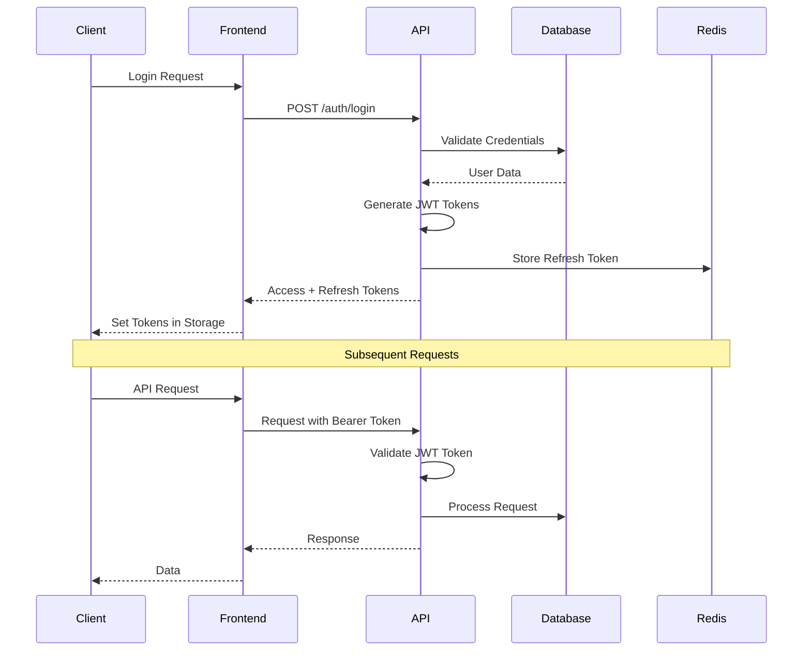

# System Architecture

## Overview

NCY_8 follows a modern, scalable architecture pattern with clear separation of concerns, microservices principles, and enterprise-grade security. The system is designed for high availability, performance, and maintainability.

## High-Level Architecture

```
┌─────────────────┐    ┌─────────────────┐    ┌─────────────────┐
│   Load Balancer │    │   CDN/Static    │    │   Monitoring    │
│     (Nginx)     │    │     Assets      │    │   (Grafana)     │
└─────────┬───────┘    └─────────────────┘    └─────────────────┘
          │
    ┌─────▼─────┐
    │  Frontend │
    │  (React)  │
    └─────┬─────┘
          │
    ┌─────▼─────┐
    │   API     │
    │ (Express) │
    └─────┬─────┘
          │
    ┌─────▼──────┐    ┌─────────────────┐    ┌─────────────────┐
    │ Database   │    │     Cache       │    │   Job Queue     │
    │(PostgreSQL)│    │    (Redis)      │    │   (BullMQ)      │
    └────────────┘    └─────────────────┘    └─────────────────┘
```

## Architecture Layers

### 1. Presentation Layer (Frontend)

**Technology**: React 19 + Vite, TypeScript

**Responsibilities**:
- User interface and user experience
- Client-side routing and navigation
- State management and data fetching
- Form handling and validation
- Real-time updates via WebSocket

**Key Components**:
- **Pages**: App Router-based page components
- **Components**: Reusable UI components with MUI
- **Hooks**: Custom React hooks for business logic
- **Services**: API client and data fetching logic
- **Store**: Zustand for global state management

**Design Patterns**:
- Server-Side Rendering (SSR) for SEO and performance
- Static Site Generation (SSG) for static content
- Incremental Static Regeneration (ISR) for dynamic content
- Client-side hydration for interactivity

### 2. API Layer (Backend)

**Technology**: Node.js, Express.js, TypeScript

**Responsibilities**:
- RESTful API endpoints
- Authentication and authorization
- Business logic orchestration
- Data validation and transformation
- Error handling and logging

**Key Components**:
- **Routes**: API endpoint definitions
- **Controllers**: Request/response handling
- **Services**: Business logic implementation
- **Middleware**: Cross-cutting concerns (auth, validation, logging)
- **Models**: Data access layer with TypeORM

**Design Patterns**:
- Layered architecture (Controller → Service → Repository)
- Dependency injection for testability
- Middleware pipeline for cross-cutting concerns
- Error handling with global error middleware

### 3. Data Layer

**Technology**: PostgreSQL 15+, TypeORM

**Responsibilities**:
- Data persistence and retrieval
- Data integrity and constraints
- Query optimization and indexing
- Migration management
- Audit trails and compliance

**Key Components**:
- **Schema**: Database schema definition with TypeORM
- **Migrations**: Version-controlled schema changes
- **Seeds**: Development and test data
- **Indexes**: Performance optimization
- **Views**: Complex query abstractions

### 4. Cache Layer

**Technology**: Redis 7+

**Responsibilities**:
- Session storage and management
- API response caching
- Rate limiting and throttling
- Job queue storage
- Real-time data caching

**Key Components**:
- **Session Store**: JWT refresh token storage
- **API Cache**: Response caching with TTL
- **Rate Limiter**: Request throttling per user/IP
- **Job Queue**: Background job storage
- **Real-time Cache**: WebSocket connection data

### 5. Infrastructure Layer

**Technology**: Docker, Nginx, Prometheus, Grafana

**Responsibilities**:
- Container orchestration
- Load balancing and reverse proxy
- SSL/TLS termination
- Monitoring and alerting
- Log aggregation

## Database Architecture

### Schema Design

The database schema is defined using **TypeORM Entities**, which provide an object-relational mapping (ORM) layer over PostgreSQL. This approach ensures type-safety, simplifies database interactions, and allows for version-controlled schema evolution through migrations.

Key principles guiding our schema design include:

*   **Normalized Design**: Primarily follows third normal form with strategic denormalization for performance.
*   **UUID Primary Keys**: All entities use UUIDs for better distribution and security.
*   **Soft Deletes**: Critical entities support soft deletion for audit trails and data recovery.
*   **Multi-tenancy**: Data is isolated per company, ensuring tenant data separation.
*   **Audit Logging**: Comprehensive audit trails are implemented for compliance requirements.

For detailed entity definitions and their relationships, refer to the [[DATABASE.md#Schema Design]] document.

### Key Design Decisions

1. **UUID Primary Keys**: All tables use UUID for better distribution and security
2. **Soft Deletes**: Critical tables support soft deletion for audit trails
3. **Audit Logging**: Comprehensive audit trail for compliance requirements
4. **RBAC System**: Flexible role-based access control with permissions
5. **Multi-tenancy**: Company-based data isolation
6. **Indexing Strategy**: Optimized indexes for common query patterns

## API Architecture

### RESTful Design

The API follows RESTful conventions with clear resource modeling:

```
GET    /api/v1/users              # List users
POST   /api/v1/users              # Create user
GET    /api/v1/users/:id          # Get user
PUT    /api/v1/users/:id          # Update user
DELETE /api/v1/users/:id          # Delete user

GET    /api/v1/companies      # List companies
POST   /api/v1/companies      # Create company
GET    /api/v1/companies/:id  # Get company
PUT    /api/v1/companies/:id  # Update company
DELETE /api/v1/companies/:id  # Delete company
```

### Authentication Flow



### Error Handling

Consistent error response format:

```json
{
  "error": {
    "code": "VALIDATION_ERROR",
    "message": "Invalid input data",
    "details": {
      "field": "email",
      "reason": "Invalid email format"
    },
    "timestamp": "2024-01-15T10:30:00Z",
    "requestId": "req_123456789"
  }
}
```

## Security Architecture

### Authentication & Authorization

- **JWT Tokens**: Stateless authentication with access/refresh token pattern
- **Session Management**: Redis-based session storage for refresh tokens
- **Role-Based Access**: Granular permissions with RBAC system
- **API Keys**: Machine-to-machine authentication for integrations

### Security Layers

1. **Network Security**: HTTPS/TLS encryption, firewall rules
2. **Application Security**: Input validation, SQL injection prevention
3. **Data Security**: Encryption at rest, secure password hashing
4. **Access Control**: Role-based permissions, API rate limiting
5. **Monitoring**: Security event logging, intrusion detection

## Scalability Considerations

### Horizontal Scaling

- **Stateless API**: No server-side session storage
- **Database Sharding**: Company-based data partitioning
- **Cache Distribution**: Redis cluster for high availability
- **Load Balancing**: Nginx with health checks

### Performance Optimization

- **Database Indexing**: Optimized indexes for query patterns
- **API Caching**: Redis-based response caching
- **CDN Integration**: Static asset delivery optimization
- **Connection Pooling**: Database connection management

### Monitoring & Observability

- **Metrics Collection**: Prometheus exporters for system metrics
- **Distributed Tracing**: Request tracing across services
- **Log Aggregation**: Centralized logging with ELK stack
- **Health Checks**: Liveness and readiness probes

## Deployment Architecture

### Container Strategy

```dockerfile
# Multi-stage build for optimization
FROM node:18-alpine AS builder
WORKDIR /app
COPY package*.json ./
RUN npm ci --only=production

FROM node:18-alpine AS runtime
WORKDIR /app
COPY --from=builder /app/node_modules ./node_modules
COPY . .
EXPOSE 3000
CMD ["npm", "start"]
```

### Environment Configuration

- **Development**: Docker Compose with hot reload
- **Staging**: Kubernetes with CI/CD pipeline
- **Production**: High-availability deployment with monitoring

### CI/CD Pipeline

1. **Code Commit**: Trigger automated pipeline
2. **Quality Gates**: Linting, testing, security scanning
3. **Build**: Container image creation and scanning
4. **Deploy**: Blue-green deployment strategy
5. **Monitor**: Health checks and rollback capability

## Technology Decisions

### Frontend Choices

- **React 19 + Vite**: Fast development and optimized builds
- **TypeScript**: Type safety and developer experience
- **MUI**: Consistent design system and accessibility
- **Zustand**: Lightweight state management

### Backend Choices

- **Node.js**: TypeScript ecosystem consistency
- **Express**: Mature and flexible web framework
- **TypeORM**: Type-safe database access and migrations
- **Redis**: High-performance caching and session storage

### Infrastructure Choices

- **Docker**: Containerization for consistency and scalability
- **PostgreSQL**: ACID compliance and advanced features
- **Nginx**: High-performance reverse proxy and load balancer
- **Prometheus**: Metrics collection and alerting

## Future Considerations

### Planned Enhancements

1. **Microservices**: Service decomposition for scalability
2. **Event Sourcing**: Audit trail and event-driven architecture
3. **GraphQL**: Flexible API querying for complex clients
4. **Real-time**: WebSocket integration for live updates
5. **Mobile**: React Native or PWA for mobile access

### Scalability Roadmap

1. **Database**: Read replicas and connection pooling
2. **Caching**: Multi-layer caching strategy
3. **CDN**: Global content delivery network
4. **Monitoring**: Advanced observability and alerting
5. **Security**: Enhanced threat detection and response

---

*This architecture document is maintained by the engineering team and updated with each major system change. For questions or contributions, please refer to the contributing guidelines.*
