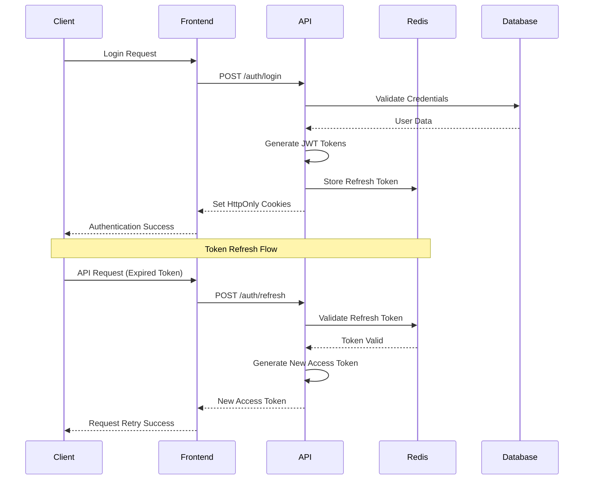

# Authentication & Security

## Overview

This document outlines the comprehensive security strategy for the NCY_8 platform, covering authentication, authorization, input validation, secrets management, and security monitoring.

## Authentication Architecture

### JWT-Based Authentication

**Technology Stack**:
- **Access Tokens**: JWT with 15-minute expiration
- **Refresh Tokens**: Long-lived tokens stored in Redis
- **Token Storage**: HttpOnly cookies for web, Bearer tokens for API
- **Session Management**: Redis-based session storage

### Authentication Flow



### JWT Implementation

Our JWT implementation leverages `jsonwebtoken` for token generation and `argon2` for secure password hashing. Refresh tokens are managed by the `ActiveSessionService` and stored in the database, not directly in Redis as shown in the previous example. This provides a robust and secure authentication mechanism.

```typescript
// App.API/Services/AuthenticationService/AuthenticationService.ts (Simplified)
import { Service } from "typedi";
import { add } from "date-fns";
import { sign } from "jsonwebtoken";
import * as argon2 from "argon2";
import * as crypto from "crypto";

import { AuthResponseDto, LoginDto } from "../../Dtos/Authentication/AuthenticationDto";
import User from "../../Entities/Users/User";
import { AuthenticationError, NotFoundError } from "../../Errors/HttpErrors";
import { UserStatusService } from "../../Services/Users/UserStatusService";
import { ActiveSessionService } from "../../Services/Users/ActiveSessionService";
import { AuthenticationRepository } from "../../Repositories/Authentication/AuthenticationRepository";

@Service()
export class AuthenticationService {
  constructor(
    private readonly authRepo: AuthenticationRepository,
    private readonly userStatusService: UserStatusService,
    private readonly activeSessionService: ActiveSessionService,
  ) {}

  public async login(
    loginDto: LoginDto,
    ipAddress?: string,
    userAgent?: string,
  ): Promise<AuthResponseDto> {
    const user = await this.authRepo.findUserByEmailWithAuthRelations(
      loginDto.email,
    );

    if (!user || !(await argon2.verify(user.passwordHash, loginDto.password))) {
      throw new AuthenticationError("Wrong credentials");
    }

    if (!user.status || !user.status.canLogin) {
      throw new AuthenticationError(
        "User account is not active or cannot log in",
      );
    }

    const jwtSecret = process.env.JWT_SECRET;
    if (!jwtSecret) {
      throw new AuthenticationError("JWT secret is not configured");
    }

    // Access token (JWT)
    const token = sign(
      { id: user.id, companyId: user.companyId, role: user.role?.name },
      jwtSecret,
      { expiresIn: "1d" },
    );

    // Refresh token: return raw token to caller; store only hash
    const {
      rawToken: _refreshTokenRaw,
      tokenHash,
      deviceId,
      expiresAt,
    } = await this.generateRefreshTokenMaterial();

    await this.activeSessionService.createActiveSession(
      user.companyId,
      user.id,
      tokenHash,
      ipAddress,
      userAgent,
      deviceId,
    );

    // Update last login
    user.lastLogin = new Date();
    await this.authRepo.saveUser(user);

    // ... (UserResponseDto mapping)

    return {
      token,
      refreshToken: _refreshTokenRaw,
      user: { /* ... user data */ },
    };
  }

  private async generateRefreshTokenMaterial(): Promise<{
    rawToken: string;
    tokenHash: string;
    deviceId: string;
    expiresAt: Date;
  }> {
    const rawToken = crypto.randomBytes(48).toString("base64url");
    const tokenHash = this.hashToken(rawToken);
    const deviceId = crypto.randomUUID();
    const expiresAt = add(new Date(), { days: 7 });
    return { rawToken, tokenHash, deviceId, expiresAt };
  }

  private hashToken(raw: string): string {
    return crypto.createHash("sha256").update(raw).digest("hex");
  }
}
```

### JWT Authentication Implementation

Authentication is handled by the `AuthenticationController` for login/logout flows, and the `expressAuthentication` function (configured in `App.API/Config/Passport.ts` and used by `tsoa`) for validating JWT tokens on protected routes.

```typescript
// App.API/Controllers/Authentication/AuthenticationController.ts (Login Simplified)
import { Request as ExpressRequest } from "express";
import { LoginDto, AuthResponseDto } from "../../Dtos/Authentication/AuthenticationDto";
import { AuthenticationService } from "../../Services/AuthenticationService/AuthenticationService";
import { Controller, Post, Route, SuccessResponse, Request, Body } from "tsoa";
import { validate } from "class-validator";
import { UnprocessableEntityError } from "../../Errors/HttpErrors";

@Route("auth")
export class AuthenticationController extends Controller {
  constructor(private authenticationService: AuthenticationService) {
    super();
  }

  /**
   * @summary Logs in a user and returns authentication tokens.
   */
  @Post("/login")
  @SuccessResponse("200", "User logged in successfully")
  public async login(
    @Body() requestBody: LoginDto,
    @Request() request: ExpressRequest,
  ): Promise<AuthResponseDto> {
    const errors = await validate(requestBody);
    if (errors.length > 0) {
      throw new UnprocessableEntityError(
        `Validation error: ${errors.map((e) => e.toString()).join(", ")}`,
      );
    }

    const authResponse = await this.authenticationService.login(
      requestBody,
      request.ip,
      request.headers["user-agent"],
    );

    // Set cookies (handled in controller for HTTP-only cookies)
    request.res?.cookie("jwt", authResponse.token, { /* ...options */ });
    request.res?.cookie("refreshToken", authResponse.refreshToken, { /* ...options */ });

    return {
      token: authResponse.token,
      refreshToken: authResponse.refreshToken,
      user: authResponse.user,
    };
  }
}
```

```typescript
// App.API/Config/Passport.ts (expressAuthentication function)
import * as express from "express";
import { AuthenticationService } from "../Services/AuthenticationService/AuthenticationService";
import { Container } from "typedi";
import { UserResponseDto } from "../Dtos/Users/UserResponseDto";
import { ForbiddenError } from "../Errors/HttpErrors";

export async function expressAuthentication(
  request: express.Request,
  securityName: string,
  scopes?: string[],
): Promise<any> {
  if (securityName === "jwt") {
    const token = request.cookies?.jwt || request.headers["authorization"]?.split(" ")[1];
    const refreshToken = request.cookies?.refreshToken || request.headers["x-refresh-token"] as string;

    if (!token && !refreshToken) {
      throw new ForbiddenError("No token provided");
    }

    const authenticationService = Container.get(AuthenticationService);

    try {
      // Attempt to get current user from refresh token if JWT is missing or expired
      if (refreshToken) {
        const user = await authenticationService.getCurrentUser(request.user?.companyId, refreshToken);
        request.user = user as UserResponseDto; // Attach user to request
        return Promise.resolve(user);
      }
    } catch (error) {
      // Handle refresh token errors, e.g., expired or invalid
      throw new ForbiddenError("Invalid or expired refresh token");
    }

    // Fallback if no refresh token or refresh failed, try JWT
    // (This part would typically involve JWT verification, but tsoa handles it via SecurityDefinition)
    // For simplicity, assuming if we reached here with a valid refresh token, user is authenticated.
    // Actual JWT verification is done by tsoa's underlying mechanism based on security definition.

    return Promise.resolve(request.user); // User should be populated by tsoa if JWT is valid
  }

  return Promise.reject({}); // Should not reach here for 'jwt' security
}
```

## Authorization System

### Role-Based Access Control (RBAC)

Our RBAC system is implemented using `Role` and `Permission` entities, with a many-to-many relationship managed by `RolePermission` entities. The `RolePermissionService` is responsible for checking if a user has a specific permission based on their assigned role.

```typescript
// App.API/Entities/Roles/Permission.ts
import { Entity, Column, OneToMany, Index, JoinColumn, ManyToOne } from "typeorm";
import { BaseEntity } from "../BaseEntity";
import { RolePermission } from "./RolePermission";
import { Company } from "../Companies/Company";

/**
 * @description Represents a specific permission that can be assigned to roles within a company.
 */
@Entity("permissions")
@Index(["companyId", "id"], { unique: true })
@Index(["companyId", "name"], { unique: true })
export class Permission extends BaseEntity {
  @Column({ type: "uuid" }) companyId!: string;
  @ManyToOne(() => Company, { onDelete: "RESTRICT" })
  @JoinColumn({ name: "companyId" })
  company!: Company;
  @Column({ type: "varchar", length: 100, nullable: false }) name!: string;
  @Column({ type: "text", nullable: true }) description?: string;
  @OneToMany(() => RolePermission, (rolePermission) => rolePermission.permission)
  rolePermissions!: RolePermission[];
}
```

```typescript
// App.API/Entities/Roles/Role.ts
import { Entity, Column, OneToMany, ManyToOne, JoinColumn, Index } from "typeorm";
import { BaseEntity } from "../BaseEntity";
import { RolePermission } from "./RolePermission";
import User from "../Users/User";
import { Company } from "../Companies/Company";

/**
 * @description Represents a user role within a company, defining a set of permissions.
 */
@Entity("roles")
@Index(["companyId", "id"], { unique: true })
@Index(["companyId", "name"], { unique: true })
export class Role extends BaseEntity {
  @Column({ type: "uuid" }) companyId!: string;
  @ManyToOne(() => Company, { onDelete: "RESTRICT" })
  @JoinColumn({ name: "companyId" })
  company!: Company;
  @Column({ type: "varchar", length: 50, nullable: false }) name!: string;
  @Column({ type: "text", nullable: true }) description?: string;
  @OneToMany(() => RolePermission, (rp) => rp.role)
  rolePermissions!: RolePermission[];
  @OneToMany(() => User, (user) => user.role) users!: User[];
}
```

```typescript
// App.API/Services/RoleService/RolePermissionService.ts (Simplified)
import { Service } from "typedi";
import { RolePermissionRepository } from "../../Repositories/Roles/RolePermissionRepository";
import User from "../../Entities/Users/User";

@Service()
export class RolePermissionService {
  constructor(
    private readonly rolePermissionRepository: RolePermissionRepository,
  ) {}

  /**
   * @description Checks if a given user has a specific permission.
   * @param user The user object to check permissions for.
   * @param permissionName The name of the permission to check for.
   * @returns {Promise<boolean>} A Promise that resolves to `true` if the user has the permission, `false` otherwise.
   */
  public async checkPermission(
    user: User,
    permissionName: string,
  ): Promise<boolean> {
    if (!user?.role?.rolePermissions?.length) return false;
    return user.role.rolePermissions.some(
      (rp) => rp.permission?.name === permissionName,
    );
  }
}
```

### Middleware Implementation

Authentication and authorization middleware are crucial for protecting API routes. Our implementation leverages `expressAuthentication` (configured for `tsoa`) and custom middleware for permission checks.

```typescript
// App.API/Config/Passport.ts (expressAuthentication function - simplified)
import * as express from "express";
import { AuthenticationService } from "../Services/AuthenticationService/AuthenticationService";
import { Container } from "typedi";
import { UserResponseDto } from "../Dtos/Users/UserResponseDto";
import { ForbiddenError } from "../Errors/HttpErrors";

export async function expressAuthentication(
  request: express.Request,
  securityName: string,
  scopes?: string[],
): Promise<any> {
  if (securityName === "jwt") {
    const token = request.cookies?.jwt || request.headers["authorization"]?.split(" ")[1];
    const refreshToken = request.cookies?.refreshToken || request.headers["x-refresh-token"] as string;

    if (!token && !refreshToken) {
      throw new ForbiddenError("No token provided");
    }

    const authenticationService = Container.get(AuthenticationService);

    try {
      // Attempt to get current user from refresh token if JWT is missing or expired
      if (refreshToken) {
        const user = await authenticationService.getCurrentUser(request.user?.companyId, refreshToken);
        request.user = user as UserResponseDto; // Attach user to request
        return Promise.resolve(user);
      }
    } catch (error) {
      throw new ForbiddenError("Invalid or expired refresh token");
    }

    return Promise.resolve(request.user); // User should be populated by tsoa if JWT is valid
  }

  return Promise.reject({});
}
```

```typescript
// App.API/Services/RoleService/RoleService.ts (ensurePermission helper - simplified)
import { Service } from "typedi";
import User from "../../Entities/Users/User";
import { ForbiddenError } from "../../Errors/HttpErrors";

@Service()
export class RoleService {
  // ... constructor and other methods

  /**
   * @description Checks if the current user has a specific permission.
   * @param currentUser The user whose permissions are to be checked.
   * @param permission The name of the permission to check for.
   * @returns A Promise that resolves if the user has the permission.
   * @throws {ForbiddenError} If the current user does not have the required permission.
   */
  private async ensurePermission(currentUser: User, permission: string) {
    const role = currentUser.role;
    const allowed =
      !!role &&
      Array.isArray(role.rolePermissions) &&
      role.rolePermissions.some((rp) => rp.permission?.name === permission);

    if (!allowed) {
      throw new ForbiddenError(`Missing permission: ${permission}`);
    }
  }
}
```

### Route Protection Examples

Route protection is primarily handled by `tsoa`'s `@Security` decorator, which leverages the `expressAuthentication` function. Permissions are checked within the service layer using `RoleService.ensurePermission`.

```typescript
// App.API/Controllers/Users/UserController.ts (Simplified)
import { Controller, Get, Post, Security, Request, Body, Path, Put, Delete, Query } from "tsoa";
import { Request as ExpressRequest } from "express";
import { UserService } from "../../Services/Users/UserService";
import User from "../../Entities/Users/User";
import { CreateUserDto, UpdateUserDto } from "../../Dtos/Users/UserDto";
import { UserResponseDto } from "../../Dtos/Users/UserResponseDto";

@Security("jwt") // Applies JWT security to all methods in this controller
export class UserController extends Controller {
  constructor(private readonly userService: UserService) {
    super();
  }

  /**
   * @summary Retrieves a paginated list of users within the authenticated user's company.
   */
  @Get("/")
  public async listUsers(
    @Request() request: ExpressRequest,
    @Query() page?: number,
    @Query() limit?: number,
  ): Promise<{ data: UserResponseDto[]; total: number; page: number; limit: number }> {
    const me = request.user as User;
    return this.userService.listUsers(me.companyId, me, { page, limit });
  }

  /**
   * @summary Creates a new user within the authenticated user's company.
   */
  @Post("/")
  public async createUser(
    @Body() createUserDto: CreateUserDto,
    @Request() request: ExpressRequest,
  ): Promise<UserResponseDto> {
    const me = request.user as User;
    return this.userService.createUser(me.companyId, me, createUserDto);
  }

  /**
   * @summary Updates an existing user's details within the authenticated user's company.
   */
  @Put("/{id}")
  public async updateUser(
    @Path() id: string,
    @Body() updateUserDto: UpdateUserDto,
    @Request() request: ExpressRequest,
  ): Promise<UserResponseDto> {
    const me = request.user as User;
    return this.userService.updateUser(me.companyId, id, me, updateUserDto);
  }

  /**
   * @summary Soft-deletes a user within the authenticated user's company.
   */
  @Delete("/{id}")
  public async deleteUser(
    @Path() id: string,
    @Request() request: ExpressRequest,
  ): Promise<void> {
    const me = request.user as User;
    await this.userService.softDeleteUser(me.companyId, id, me);
  }
}
```

## Input Validation & Sanitization

### Class-Validator DTO Validation

We use `class-validator` decorators on our DTOs (Data Transfer Objects) to define validation rules. This allows for clear, declarative validation directly within the data structures.

```typescript
// App.API/Dtos/Users/UserDto.ts (Simplified CreateUserDto)
import {
  IsEmail,
  IsString,
  IsNotEmpty,
  MinLength,
  IsUUID,
  IsOptional,
  Matches,
} from "class-validator";

/**
 * @description Data transfer object for creating a new user.
 */
export class CreateUserDto {
  /**
   * @description The user's email address. Must be unique within the company.
   * @example "john.doe@example.com"
   */
  @IsEmail()
  email!: string;

  /**
   * @description The first name of the user.
   * @example "John"
   */
  @IsString()
  @IsNotEmpty()
  firstName!: string;

  /**
   * @description The last name of the user.
   * @example "Doe"
   */
  @IsString()
  @IsNotEmpty()
  lastName!: string;

  /**
   * @description The plain text password for the new user. Must be at least 6 characters long.
   * @example "password123"
   */
  @IsString()
  @MinLength(6)
  password!: string;

  /**
   * @description The unique identifier of the role to assign to the new user.
   * @example "r1o2l3e4-i5d6-7890-1234-567890abcdef"
   */
  @IsUUID()
  roleId!: string;

  /**
   * @description Optional: The user's phone number in E.164 format.
   * @example "+15551234567"
   */
  @IsString()
  @IsOptional()
  @Matches(/^\+?[1-9]\d{1,14}$/, { message: "phoneNumber must be E.164" })
  phoneNumber?: string;
}
```

### Validation Middleware

Validation is typically performed within the controller or service layer by calling `validate` on the DTO. This ensures that incoming request bodies and query parameters adhere to the defined rules before processing.

```typescript
// Example: Validation in a Controller method
import { Body, Controller, Post, Route, SuccessResponse } from "tsoa";
import { validate } from "class-validator";
import { CreateUserDto } from "../../Dtos/Users/UserDto";
import { UnprocessableEntityError } from "../../Errors/HttpErrors";

@Route("users")
export class UserController extends Controller {
  @Post("/")
  @SuccessResponse("201", "User created successfully")
  public async createUser(
    @Body() createUserDto: CreateUserDto,
  ): Promise<any> {
    const errors = await validate(createUserDto);
    if (errors.length > 0) {
      throw new UnprocessableEntityError(
        `Validation error: ${errors.map((e) => e.toString()).join(", ")}`,
      );
    }
    // ... further processing
    return {};
  }
}
```
  };
};
```

### HTML Sanitization

```typescript
// HTML sanitization
import DOMPurify from 'dompurify';
import { JSDOM } from 'jsdom';

const window = new JSDOM('').window;
const purify = DOMPurify(window);

export class SanitizationService {
  static sanitizeHtml(html: string): string {
    return purify.sanitize(html, {
      ALLOWED_TAGS: ['p', 'br', 'strong', 'em', 'u', 'ol', 'ul', 'li'],
      ALLOWED_ATTR: [],
    });
  }

  static sanitizeText(text: string): string {
    return text
      .replace(/[<>]/g, '') // Remove HTML tags
      .replace(/javascript:/gi, '') // Remove javascript: URLs
      .replace(/on\w+=/gi, ''); // Remove event handlers
  }

  static sanitizeUrl(url: string): string {
    try {
      const parsed = new URL(url);
      // Only allow HTTP/HTTPS protocols
      if (!['http:', 'https:'].includes(parsed.protocol)) {
        throw new Error('Invalid protocol');
      }
      return parsed.toString();
    } catch {
      return '';
    }
  }
}
```

## Security Headers & Middleware

### Helmet Configuration

```typescript
// Security headers
import helmet from 'helmet';
import { Request, Response, NextFunction } from 'express';

export const securityMiddleware = helmet({
  contentSecurityPolicy: {
    directives: {
      defaultSrc: ["'self'"],
      styleSrc: ["'self'", "'unsafe-inline'", "https://fonts.googleapis.com"],
      fontSrc: ["'self'", "https://fonts.gstatic.com"],
      imgSrc: ["'self'", "data:", "https:"],
      scriptSrc: ["'self'"],
      connectSrc: ["'self'", "https://api.ncy-8.com"],
      frameSrc: ["'none'"],
      objectSrc: ["'none'"],
      upgradeInsecureRequests: [],
    },
  },
  hsts: {
    maxAge: 31536000,
    includeSubDomains: true,
    preload: true,
  },
  noSniff: true,
  xssFilter: true,
  referrerPolicy: { policy: 'strict-origin-when-cross-origin' },
});
```

### CORS Configuration

```typescript
// CORS configuration
import cors from 'cors';

const corsOptions = {
  origin: (origin: string | undefined, callback: Function) => {
    const allowedOrigins = [
      'https://app.ncy-8.com',
      'https://admin.ncy-8.com',
      ...(process.env.NODE_ENV === 'development' 
        ? ['http://localhost:3000', 'http://localhost:3001'] 
        : [])
    ];

    if (!origin || allowedOrigins.includes(origin)) {
      callback(null, true);
    } else {
      callback(new Error('Not allowed by CORS'));
    }
  },
  credentials: true,
  methods: ['GET', 'POST', 'PUT', 'DELETE', 'PATCH', 'OPTIONS'],
  allowedHeaders: ['Content-Type', 'Authorization', 'X-Requested-With'],
  exposedHeaders: ['X-Total-Count', 'X-Page-Count'],
};
```

### Rate Limiting

```typescript
// Rate limiting
import rateLimit from 'express-rate-limit';
import { Redis } from 'ioredis';

const redis = new Redis(process.env.REDIS_URL!);

// General API rate limiting
export const apiRateLimit = rateLimit({
  windowMs: 15 * 60 * 1000, // 15 minutes
  max: 100, // Limit each IP to 100 requests per windowMs
  message: 'Too many requests from this IP, please try again later.',
  standardHeaders: true,
  legacyHeaders: false,
  store: new RedisStore({
    client: redis,
    prefix: 'rl:api:',
  }),
});

// Authentication rate limiting
export const authRateLimit = rateLimit({
  windowMs: 15 * 60 * 1000, // 15 minutes
  max: 5, // Limit each IP to 5 login attempts per windowMs
  message: 'Too many login attempts, please try again later.',
  skipSuccessfulRequests: true,
  store: new RedisStore({
    client: redis,
    prefix: 'rl:auth:',
  }),
});

// User-specific rate limiting
export const userRateLimit = (maxRequests: number = 1000) => {
  return rateLimit({
    windowMs: 15 * 60 * 1000, // 15 minutes
    max: maxRequests,
    keyGenerator: (req: AuthenticatedRequest) => {
      return req.user?.id || req.ip;
    },
    store: new RedisStore({
      client: redis,
      prefix: 'rl:user:',
    }),
  });
};
```

## Secrets Management

### Environment Variable Validation

Environment variables are crucial for configuring our application across different environments. While direct `class-validator` usage on `process.env` is not typical, we ensure that all required environment variables are present and correctly typed at application startup. This is often done through a dedicated configuration module that validates `process.env` values.

```typescript
// Example: Simplified environment variable validation (conceptual)
import { IsEnum, IsNumber, IsString, IsUrl, validateSync } from "class-validator";
import { plainToInstance } from "class-transformer";

enum NodeEnv {
  Development = "development",
  Staging = "staging",
  Production = "production",
}

class EnvironmentVariables {
  @IsEnum(NodeEnv)
  NODE_ENV!: NodeEnv;

  @IsNumber()
  PORT!: number;

  @IsUrl({ require_tld: false })
  DATABASE_URL!: string;

  @IsUrl({ require_tld: false })
  REDIS_URL!: string;

  @IsString()
  JWT_SECRET!: string;

  @IsString()
  JWT_REFRESH_SECRET!: string;

  // ... other environment variables
}

export function validateEnvironmentVariables(config: Record<string, unknown>) {
  const validatedConfig = plainToInstance(
    EnvironmentVariables,
    config,
    { enableImplicitConversion: true },
  );
  const errors = validateSync(validatedConfig, { skipMissingProperties: false });

  if (errors.length > 0) {
    throw new Error(errors.toString());
  }
  return validatedConfig;
}

// Usage at application startup:
// const env = validateEnvironmentVariables(process.env);
```

### Encryption Service

```typescript
// Encryption service
import crypto from 'crypto';

export class EncryptionService {
  private static readonly ALGORITHM = 'aes-256-gcm';
  private static readonly KEY_LENGTH = 32;
  private static readonly IV_LENGTH = 16;
  private static readonly TAG_LENGTH = 16;

  static encrypt(text: string, key: string): string {
    const iv = crypto.randomBytes(this.IV_LENGTH);
    const cipher = crypto.createCipher(this.ALGORITHM, key);
    cipher.setAAD(Buffer.from('ncy-8', 'utf8'));

    let encrypted = cipher.update(text, 'utf8', 'hex');
    encrypted += cipher.final('hex');

    const tag = cipher.getAuthTag();

    return iv.toString('hex') + ':' + tag.toString('hex') + ':' + encrypted;
  }

  static decrypt(encryptedData: string, key: string): string {
    const parts = encryptedData.split(':');
    const iv = Buffer.from(parts[0], 'hex');
    const tag = Buffer.from(parts[1], 'hex');
    const encrypted = parts[2];

    const decipher = crypto.createDecipher(this.ALGORITHM, key);
    decipher.setAAD(Buffer.from('ncy-8', 'utf8'));
    decipher.setAuthTag(tag);

    let decrypted = decipher.update(encrypted, 'hex', 'utf8');
    decrypted += decipher.final('utf8');

    return decrypted;
  }

  static hashPassword(password: string): Promise<string> {
    return bcrypt.hash(password, 12);
  }

  static verifyPassword(password: string, hash: string): Promise<boolean> {
    return bcrypt.compare(password, hash);
  }
}
```

### Secrets Rotation

```typescript
// Secrets rotation
export class SecretsRotationService {
  private redis = new Redis(process.env.REDIS_URL!);

  async rotateJWTSecret(): Promise<void> {
    const newSecret = crypto.randomBytes(64).toString('hex');
    const oldSecret = process.env.JWT_SECRET;

    // Store new secret with timestamp
    await this.redis.setex(
      'jwt_secret_new',
      24 * 60 * 60, // 24 hours
      JSON.stringify({
        secret: newSecret,
        createdAt: new Date().toISOString(),
      })
    );

    // Update environment variable
    process.env.JWT_SECRET = newSecret;

    // After 24 hours, remove old secret
    setTimeout(async () => {
      await this.redis.del('jwt_secret_old');
    }, 24 * 60 * 60 * 1000);
  }

  async getCurrentJWTSecret(): Promise<string> {
    const newSecretData = await this.redis.get('jwt_secret_new');
    if (newSecretData) {
      const { secret } = JSON.parse(newSecretData);
      return secret;
    }
    return process.env.JWT_SECRET!;
  }
}
```

## Security Monitoring

### Security Event Logging

```typescript
// Security event logging
export class SecurityLogger {
  private logger = new Logger('Security');

  async logSecurityEvent(event: SecurityEvent): Promise<void> {
    await this.logger.info('Security event', {
      event: event.type,
      userId: event.userId,
      ipAddress: event.ipAddress,
      userAgent: event.userAgent,
      details: event.details,
      severity: event.severity,
      timestamp: new Date().toISOString(),
    });

    // Store in database for audit
    await AppDataSource.getRepository(SecurityLog).save({
      userId: event.userId,
      eventType: event.type,
      ipAddress: event.ipAddress,
      userAgent: event.userAgent,
      details: event.details,
      severity: event.severity,
    });
  }

  async logFailedLogin(email: string, ipAddress: string, userAgent: string): Promise<void> {
    await this.logSecurityEvent({
      type: 'FAILED_LOGIN',
      userId: null,
      ipAddress,
      userAgent,
      details: { email },
      severity: 'MEDIUM',
    });
  }

  async logSuspiciousActivity(userId: string, activity: string, details: any): Promise<void> {
    await this.logSecurityEvent({
      type: 'SUSPICIOUS_ACTIVITY',
      userId,
      ipAddress: null,
      userAgent: null,
      details: { activity, ...details },
      severity: 'HIGH',
    });
  }
}
```

### Intrusion Detection

```typescript
// Intrusion detection
export class IntrusionDetectionService {
  private redis = new Redis(process.env.REDIS_URL!);
  private securityLogger = new SecurityLogger();

  async detectBruteForce(ipAddress: string): Promise<boolean> {
    const key = `failed_logins:${ipAddress}`;
    const attempts = await this.redis.incr(key);
    
    if (attempts === 1) {
      await this.redis.expire(key, 15 * 60); // 15 minutes
    }

    if (attempts >= 5) {
      await this.securityLogger.logSecurityEvent({
        type: 'BRUTE_FORCE_DETECTED',
        userId: null,
        ipAddress,
        userAgent: null,
        details: { attempts },
        severity: 'HIGH',
      });
      return true;
    }

    return false;
  }

  async detectSuspiciousPatterns(userId: string, request: any): Promise<void> {
    // Detect unusual access patterns
    const userKey = `user_activity:${userId}`;
    const activities = await this.redis.lrange(userKey, 0, -1);
    
    // Check for rapid successive requests
    const recentActivities = activities.filter(activity => {
      const timestamp = JSON.parse(activity).timestamp;
      return Date.now() - timestamp < 60000; // Last minute
    });

    if (recentActivities.length > 100) {
      await this.securityLogger.logSuspiciousActivity(
        userId,
        'RAPID_REQUESTS',
        { count: recentActivities.length }
      );
    }

    // Store current activity
    await this.redis.lpush(userKey, JSON.stringify({
      endpoint: request.path,
      method: request.method,
      timestamp: Date.now(),
    }));
    await this.redis.ltrim(userKey, 0, 999); // Keep last 1000 activities
  }
}
```

## Security Testing

### Security Test Suite

```typescript
// Security tests
import request from 'supertest';
import { app } from '@/app';

describe('Security Tests', () => {
  describe('Authentication', () => {
    test('should reject requests without token', async () => {
      const response = await request(app)
        .get('/api/v1/users')
        .expect(401);
      
      expect(response.body.error).toBe('Access token required');
    });

    test('should reject invalid tokens', async () => {
      const response = await request(app)
        .get('/api/v1/users')
        .set('Authorization', 'Bearer invalid-token')
        .expect(401);
      
      expect(response.body.error).toBe('Invalid or expired token');
    });
  });

  describe('Authorization', () => {
    test('should reject unauthorized access', async () => {
      const employeeToken = await generateTestToken('EMPLOYEE');
      
      const response = await request(app)
        .delete('/api/v1/users/user-123')
        .set('Authorization', `Bearer ${employeeToken}`)
        .expect(403);
      
      expect(response.body.error).toBe('Insufficient permissions');
    });
  });

  describe('Input Validation', () => {
    test('should reject SQL injection attempts', async () => {
      const adminToken = await generateTestToken('ADMIN');
      
      const response = await request(app)
        .get('/api/v1/users')
        .set('Authorization', `Bearer ${adminToken}`)
        .query({ search: "'; DROP TABLE users; --" })
        .expect(400);
      
      expect(response.body.error).toBe('Query validation failed');
    });

    test('should reject XSS attempts', async () => {
      const response = await request(app)
        .post('/api/v1/users')
        .send({
          name: '<script>alert("xss")</script>',
          email: 'test@example.com',
          password: 'SecurePass123!',
        })
        .expect(400);
      
      expect(response.body.error).toBe('Validation failed');
    });
  });

  describe('Rate Limiting', () => {
    test('should enforce rate limits', async () => {
      const requests = Array(101).fill(null).map(() =>
        request(app).get('/api/v1/health')
      );
      
      const responses = await Promise.all(requests);
      const rateLimitedResponse = responses.find(res => res.status === 429);
      
      expect(rateLimitedResponse).toBeDefined();
      expect(rateLimitedResponse?.body.message).toContain('Too many requests');
    });
  });
});
```

---

*This security strategy provides comprehensive protection against common threats while maintaining usability and performance.*
