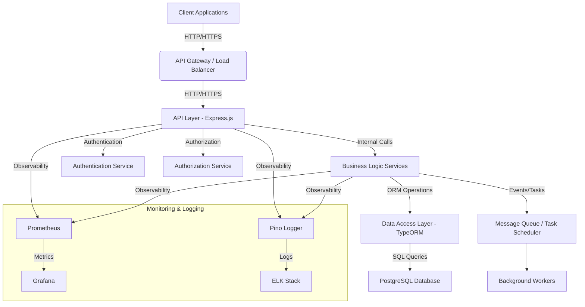

# 🏗️ GoGoTime API and Backend Architecture

Our API and backend are designed as a cohesive system, following modern architectural principles to ensure scalability, maintainability, and robust performance. This document outlines the key components, design patterns, and interactions within our server-side infrastructure.

## 🎯 Architectural Goals

- **Modularity**: Clear separation of concerns to facilitate independent development and deployment.
- **Scalability**: Ability to handle increasing load by scaling individual components.
- **Maintainability**: Clean code, consistent patterns, and comprehensive documentation.
- **Security**: Robust authentication, authorization, and data protection mechanisms.
- **Observability**: Integrated monitoring, logging, and alerting for operational insights.

## 🌐 High-Level Overview

The GoGoTime server-side architecture can be visualized as a layered structure, with the API acting as the exposed facade to client applications.

## 🧱 Key Architectural Components

### 1. API Layer (Express.js)

- **Role**: The entry point for all external requests. It handles routing, request parsing, validation, and response formatting.
- **Technology**: Built with Express.js, a fast, unopinionated, minimalist web framework for Node.js.
- **Key Features**:
  - **tsoa**: Used for defining API routes and generating OpenAPI specifications directly from TypeScript code, ensuring type safety and documentation accuracy.
  - **Middleware**: Custom middleware for authentication, authorization, logging, and error handling.
  - **Controllers**: Handle incoming requests, delegate to business logic services, and prepare responses.

### 2. Business Logic Services

- **Role**: Encapsulates the core business rules and operations of the GoGoTime application. Services orchestrate interactions between different parts of the system.
- **Design Principles**: Focus on single responsibility, domain-driven design, and testability.
- **Examples**: `UserService`, `CompanyService`, `TimesheetService`, `AuthenticationService`.

### 3. Data Access Layer (TypeORM)

- **Role**: Provides an abstraction layer for interacting with the PostgreSQL database. It maps TypeScript entities to database tables and handles CRUD operations.
- **Technology**: TypeORM, an Object-Relational Mapper (ORM) that supports TypeScript and various databases.
- **Key Features**:
  - **Entities**: Define the structure of our data models.
  - **Repositories**: Provide methods for querying and persisting data.
  - **Migrations**: Manage database schema changes in a version-controlled manner.

### 4. PostgreSQL Database

- **Role**: The primary persistent storage for all application data.
- **Technology**: PostgreSQL, a powerful, open-source object-relational database system known for its reliability, feature robustness, and performance.

### 5. Authentication & Authorization Services

- **Role**: Dedicated services responsible for user identity verification (authentication) and access control (authorization).
- **Authentication**: Utilizes JSON Web Tokens (JWT) for stateless authentication, allowing scalability.
- **Authorization**: Implements Role-Based Access Control (RBAC) to manage permissions based on user roles.

### 6. Message Queue / Task Scheduler (Future Enhancement)

- **Role**: For handling asynchronous tasks, background jobs, and inter-service communication.
- **Benefits**: Improves responsiveness of the API, enables long-running processes, and facilitates decoupling of services.

### 7. Monitoring & Logging

- **Role**: Provides visibility into the health, performance, and behavior of the API and backend.
- **Monitoring**: Prometheus for collecting metrics and Grafana for visualization.
- **Logging**: Structured logging with Pino, integrated with an ELK (Elasticsearch, Logstash, Kibana) stack for centralized log management.

## 🔗 Integration with Frontend

The API is consumed by our React frontend application. This integration is highly type-safe, thanks to our OpenAPI automation process, which generates a TypeScript client SDK directly from the API's OpenAPI specification. This ensures that frontend developers have up-to-date and accurate types for all API interactions.

## 🛡️ Security Considerations

Security is paramount in our API and backend design. Key security measures include:

- **JWT Authentication**: Secure, stateless authentication.
- **RBAC**: Fine-grained access control.
- **Input Validation**: Robust validation of all incoming request data.
- **HTTPS**: All communication is encrypted.
- **Rate Limiting**: Protection against abuse and DDoS attacks.
- **Secrets Management**: Secure handling of sensitive configuration data.

---

**SUMMARY**: The GoGoTime API and backend form a robust, modular, and scalable system, built on a foundation of modern technologies and best practices. The clear separation of concerns and automated documentation processes contribute to a highly maintainable and developer-friendly environment.
