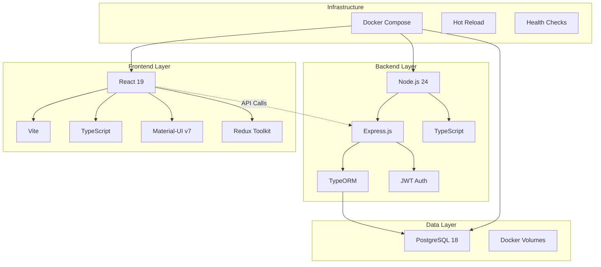
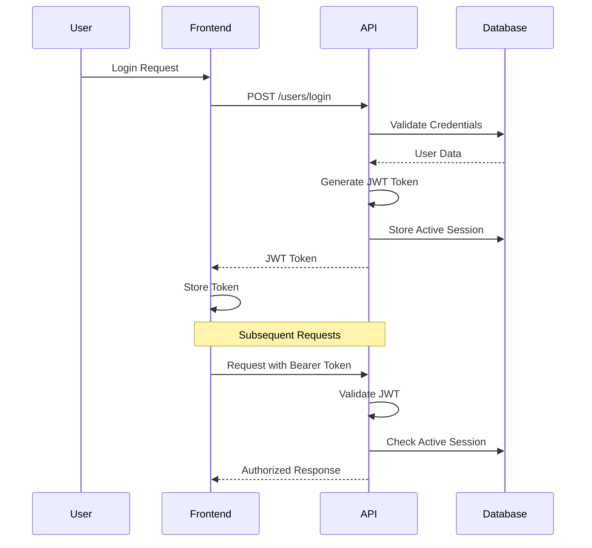

# GoGoTime - Modern Time Tracking Platform

[](https://www.typescriptlang.org/)
[](https://reactjs.org/)
[](https://nodejs.org/)
[](https://docker.com/)
[](LICENSE)

## 📊 Overview

> [!SUMMARY] **GoGoTime at a Glance**
> GoGoTime is a modern, full-stack time tracking and project management platform designed for teams and individuals. Built with React, Node.js, and PostgreSQL, it emphasizes developer experience, type safety, and scalable architecture.

**🎯 Core Purpose:** Streamline time tracking, project management, and team collaboration with an intuitive, powerful interface.

### ✨ Key Features

- **🎨 Modern Frontend**: React 19 + Vite + TypeScript + Material-UI for fast, responsive UIs
- **⚡ Type-Safe Backend**: Node.js + Express + TypeScript + TypeORM for robust API development  
- **🔐 Secure Authentication**: JWT-based auth with session management and password hashing
- **🗄️ Reliable Database**: PostgreSQL with TypeORM for type-safe data operations
- **📦 Containerized**: Docker Compose setup for consistent development and deployment
- **🎯 Developer Experience**: Hot reload, linting, testing, and modern tooling
- **♿ Accessible Design**: Material-UI components with WCAG compliance
- **🔧 Extensible**: Modular architecture for easy feature addition and customization

## 🛠️ Technology Stack



### 🎨 Frontend Stack
- **⚛️ Framework**: React 19 with modern hooks and concurrent features
- **🏗️ Build Tool**: Vite for lightning-fast development and optimized builds
- **📝 Language**: TypeScript 5+ for type safety and better DX
- **🎨 UI Framework**: Material-UI v7 with emotion-based styling
- **🗂️ State Management**: Redux Toolkit with RTK Query for API state
- **🧪 Testing**: Vitest + React Testing Library for component testing
- **📐 Linting**: ESLint + Prettier for consistent code quality

### ⚙️ Backend Stack  
- **🚀 Runtime**: Node.js 24+ with ES modules support
- **🌐 Framework**: Express.js with TypeScript for robust API development
- **🗃️ ORM**: TypeORM for type-safe database operations and migrations
- **🔐 Authentication**: JWT with bcrypt password hashing
- **✅ Validation**: Joi schemas for request validation
- **🧪 Testing**: Jest + Supertest for API endpoint testing
- **📊 Monitoring**: Built-in health check endpoints

### 🗄️ Database & Infrastructure
- **💾 Database**: PostgreSQL 18 with Alpine Linux for performance
- **📦 Containerization**: Docker Compose for development consistency  
- **🔄 Development**: Hot reload and file watching for both frontend and backend
- **💾 Data Persistence**: Named volumes for database and node_modules caching
- **🌐 Networking**: Bridge network for secure inter-service communication

## Quick Start

### Prerequisites

- Node.js 18+ and pnpm
- Docker and Docker Compose
- PostgreSQL 15+ (or use Docker)
- Redis 7+ (or use Docker)

### Development Setup

```bash
# 1. Clone the repository
git clone <your-repo-url>
cd T-DEV-700-project-NCY_8

# 2. Create environment file (optional - has sensible defaults)
cp .env.example .env

# 3. Start everything with Docker Compose
cd App.Infra
docker compose up --build

# 4. Access the application
# Frontend: http://localhost:3000
# Backend API: http://localhost:4000
# Database: localhost:5432
```

> [!TIP] **First Time Setup**
> The application will automatically:
> - Install all dependencies
> - Set up the PostgreSQL database
> - Run database migrations
> - Start development servers with hot reload

### 🏗️ Development Commands

```bash
# Start development environment
cd App.Infra
docker compose up

# Start specific services
docker compose up db api        # Database + API only
docker compose up db web        # Database + Frontend only

# View logs
docker compose logs -f api      # API logs
docker compose logs -f web      # Frontend logs

# Stop services
docker compose down             # Stop all
docker compose down -v          # Stop all + remove volumes
```

### 🧪 Testing & Quality

```bash
# Frontend tests
cd App.Web
yarn test                       # Run tests
yarn test:coverage              # Coverage report
yarn lint                       # Lint code

# Backend tests
cd App.API
yarn test                       # Run API tests
yarn lint                       # Lint code
```

## 📁 Project Structure

> [!NOTE] **Monorepo Architecture**
> GoGoTime uses a organized monorepo structure with clear separation of concerns between frontend, backend, infrastructure, and documentation.

```
T-DEV-700-project-NCY_8/
├── 📱 App.Web/                    # React Frontend Application
│   ├── src/
│   │   ├── components/           # Reusable React components
│   │   │   ├── layout/           # Layout components (Header, Sidebar, etc.)
│   │   │   ├── common/           # Shared UI components
│   │   │   └── guards/           # Route protection components
│   │   ├── features/             # Feature-based modules
│   │   │   ├── auth/             # Authentication pages
│   │   │   ├── dashboard/        # Dashboard components
│   │   │   └── utilities/        # Utility pages
│   │   ├── lib/                  # Core application logic
│   │   │   ├── store/            # Redux store configuration
│   │   │   ├── routes/           # React Router setup
│   │   │   └── menu-items/       # Navigation configuration
│   │   ├── hooks/                # Custom React hooks
│   │   ├── themes/               # Material-UI theme customization
│   │   └── types/                # TypeScript type definitions
│   ├── public/                   # Static assets
│   ├── package.json              # Frontend dependencies
│   └── vite.config.ts            # Vite build configuration
│
├── 🔧 App.API/                    # Node.js Backend API
│   ├── src/
│   │   ├── routes/               # Express route handlers
│   │   │   └── users.ts          # User management endpoints
│   │   ├── models/               # TypeORM entity definitions
│   │   │   ├── user.ts           # User entity
│   │   │   ├── activeSession.ts  # Session management
│   │   │   └── BaseEntity.ts     # Common entity fields
│   │   ├── config/               # Configuration files
│   │   │   └── safeRoutes.ts     # JWT middleware
│   │   ├── server/               # Server setup and database
│   │   └── migrations/           # Database migrations
│   ├── tests/                    # API tests
│   ├── package.json              # Backend dependencies
│   └── ecosystem.config.cjs      # PM2 configuration
│
├── 🏗️ App.Infra/                  # Infrastructure & DevOps
│   ├── docker-compose.yml        # Development environment
│   ├── init-scripts/             # Database initialization
│   └── README.md                 # Infrastructure documentation
│
├── 📚 App.Docs/                   # Comprehensive Documentation
│   ├── INDEX.md                  # Documentation hub (Obsidian-ready)
│   ├── ARCHITECTURE.md           # System architecture
│   ├── API_SPECIFICATION.md      # API documentation
│   ├── DATABASE_DESIGN.md        # Database schema
│   ├── QUICK_START.md            # Getting started guide
│   └── [Additional docs...]       # Feature and technical docs
│
└── 📄 Root Files
    ├── README.md                  # Project overview (this file)
    ├── OVERVIEW.md                # Technical requirements
    └── .env.example               # Environment template
```

### 🎯 Key Architectural Decisions

- **🔄 Separation of Concerns**: Clear boundaries between presentation, business logic, and data layers
- **📦 Feature-Based Organization**: Frontend organized by features rather than file types  
- **🏷️ TypeScript First**: Full type safety across the entire stack
- **🐳 Container-Ready**: Docker configuration for consistent development and deployment
- **📖 Documentation-Driven**: Comprehensive docs with Obsidian integration for better knowledge management

## 🔄 Development Workflow

### 📝 Code Quality Standards

- **🔍 Linting**: ESLint with TypeScript and React best practices
- **🎨 Formatting**: Prettier for consistent code formatting
- **📊 Type Checking**: Strict TypeScript configuration
- **🚨 Pre-commit Hooks**: Husky + lint-staged for automated quality checks

### 🧪 Testing Strategy

- **⚛️ Unit Tests**: Vitest for React components and utilities
- **🔗 Integration Tests**: Supertest for API endpoint validation
- **🎭 E2E Tests**: Playwright for complete user journey testing
- **🚀 Manual Testing**: Comprehensive test cases and scenarios

### 🌿 Git Workflow

- **🔀 Branching**: Feature branch workflow with main/develop
- **📝 Commits**: Conventional commits for clear history
- **🔄 PR Process**: Code review requirements and automated checks
- **📋 Issue Tracking**: GitHub Issues with templates and labels

## 🔌 API Documentation

> [!NOTE] **RESTful API Design**
> The API follows REST conventions with consistent response patterns and comprehensive error handling.

**Base URL**: `http://localhost:4000/api`

### 🔐 Authentication Endpoints

| Method | Endpoint | Description |
|--------|----------|-------------|
| `POST` | `/users/register` | User registration |
| `POST` | `/users/login` | User login (returns JWT) |
| `POST` | `/users/logout` | User logout |
| `POST` | `/users/checkSession` | Validate JWT token |

### 👥 User Management

| Method | Endpoint | Description | Auth Required |
|--------|----------|-------------|---------------|
| `POST` | `/users/all` | List all users | ✅ |
| `POST` | `/users/edit` | Update user profile | ✅ |
| `GET` | `/users/testme` | Health check | ❌ |

### 📋 API Response Format

```json
{
  "success": true,
  "data": { /* response data */ },
  "message": "Operation completed successfully"
}
```

**Error Response:**
```json
{
  "success": false,
  "msg": "Error description",
  "details": { /* error context */ }
}
```

## 🔐 Security & Authentication

### 🛡️ Security Measures

- **🔑 JWT Authentication**: Stateless authentication with secure token management
- **🔒 Password Security**: bcrypt hashing with salt rounds for password protection
- **⏱️ Session Management**: Active session tracking with database storage
- **✅ Input Validation**: Joi schema validation for all API endpoints
- **🔧 CORS**: Configured cross-origin resource sharing
- **🛡️ Headers**: Security headers for XSS and CSRF protection

### 🔍 Authentication Flow



## 🎯 Design Philosophy

### 🧠 Technical Choices Explained

> [!NOTE] **Why These Technologies?**
> Each technology choice was made to optimize developer experience, maintainability, and long-term scalability.

#### Frontend Architecture
- **⚛️ React 19**: Latest React with concurrent features for better UX
- **⚡ Vite**: Faster development builds compared to webpack-based solutions
- **🎨 Material-UI v7**: Comprehensive component library with accessibility built-in
- **📊 Redux Toolkit**: Predictable state management with excellent DevTools
- **🔍 TypeScript**: Catch errors at compile time, better refactoring support

#### Backend Architecture  
- **🚀 Express.js**: Mature, lightweight, and highly customizable
- **🏗️ TypeORM**: Decorator-based ORM with migration support
- **🔐 JWT Authentication**: Stateless auth suitable for API-first architecture
- **✅ Joi Validation**: Schema validation with detailed error messages

#### Infrastructure Decisions
- **🐳 Docker Compose**: Consistent development environment across all platforms
- **🐘 PostgreSQL**: ACID compliance, JSON support, and excellent TypeORM integration
- **📦 Yarn Workspaces**: Efficient dependency management for monorepo
- **🔄 Hot Reload**: Immediate feedback during development

## 🤝 Contributing

We welcome contributions! See our [Contributing Guide](App.Docs/CONTRIBUTING.md) for:
- Development setup instructions
- Code style guidelines  
- Pull request process
- Issue reporting templates

### 🚀 Quick Contribution Steps

1. **🍴 Fork & Clone**
   ```bash
   git clone <your-fork-url>
   cd T-DEV-700-project-NCY_8
   ```

2. **🌿 Create Feature Branch**
   ```bash
   git checkout -b feature/amazing-feature
   ```

3. **💻 Make Changes**
   - Follow TypeScript and React best practices
   - Add tests for new functionality
   - Update documentation as needed

4. **🧪 Test Your Changes**
   ```bash
   cd App.Web && yarn test
   cd App.API && yarn test
   ```

5. **📝 Commit & Push**
   ```bash
   git commit -m "feat: add amazing feature"
   git push origin feature/amazing-feature
   ```

6. **🔄 Open Pull Request**
   - Use the provided PR template
   - Include screenshots for UI changes
   - Reference related issues

## 📞 Support & Community

> [!TIP] **Getting Help**
> We're here to help! Choose the appropriate channel based on your needs.

- **📚 Documentation**: [Complete Documentation Hub](App.Docs/INDEX.md)
- **🐛 Bug Reports**: [GitHub Issues](https://github.com/your-org/gogotime/issues)
- **💬 Questions**: [GitHub Discussions](https://github.com/your-org/gogotime/discussions)
- **🔒 Security**: security@your-domain.com
- **📖 API Reference**: [API Documentation](App.Docs/API_SPECIFICATION.md)

## 📈 Changelog

See [CHANGELOG.md](App.API/CHANGELOG.md) for detailed release notes and version history.

## 📄 License

This project is licensed under the MIT License - see the [LICENSE](LICENSE) file for details.

---

> [!NOTE] **Project Team**
> **Built with ❤️ by:** Lazaro, Alexy, Massi, Lounis  
> **Project**: T-DEV-700 (Epitech)  
> **Version**: 1.0.0
